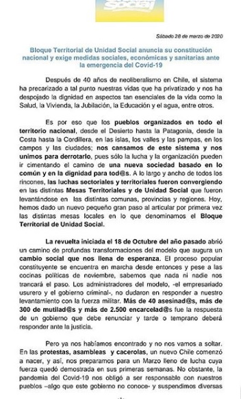

#### FOLIO: TAL4
# Asamblea Diversidad Territorial Maule

[instagram](https://www.instagram.com/asambleadiversidadterritorial/)
[facebook]()
[twitter]()
<unidadsocialtalca@gmail.com>
---

### Representantes
#### (Nombres o emails de voceros o representantes).

---
### Interacciones frecuentes
#### Coordinadora feminista 8M Maule, coordinadora sur poniente, Talca resiste. 

### Redes sociales
#### ¿Para qué se utiliza la red social?
| Instagram | Facebook | Twitter | Otra 
|---|---|---|---|
|Difusión de información y actividades. Mural de fotografías para registrar las actividades concretadas. |0|0| 0|

### **Instagram**
| seguidores | seguidos | publicaciones | hashtag 
|---|---|---|---|
|1020|114|241| #mesaunidadsocialtalca #procesoconstituyente #chiledesperto

---

* **Actividad:**   

* Primera Publicación IG: 05/12/2019

---
### Frecuencia de publicación.

Publicaciones: Las publicaciones son semanales (de 2 a 3 por semana) y me manera continua

Actividades:

---
### Ubicación
* Sector de la comununa/ciudad: Distintos territorio de la comuna de Talca

---
### Describir temas de interés y/o trabajo
#### Organización territorial y de apoyo mutuo interesada en la convergencia de organizaciones sociales. Entre sus intereses esta proceso constituyente, problemáticas sindicales y manejo de la crisis socio sanitaria. 

---
### Describir la imagen ideal por la cual se trabaja.
#### La organización se define como un "Conjunto de organizaciones, movimientos, ong's y gremios de distintas zonas del Maule que convergen en una lucha en común frente a la desigualdad y exigimos un vivir con dignidad.  Consignas: "Solo el pueblo cuida al pueblo" ¡A combatir la constitución y las leyes que les permiten cuidar sus intereses por sobre el bienestar del pueblo! ¡Solo el pueblo ayuda al pueblo! ¡Verdad justicia y relación para el pueblo! 

---
### ¿Que se hace?
#### (Manifestaciones, marchas, intervenciones, actividades culturales, conversatorios, intercambio de saberes, actividades solidarias o de apoyo mutuo, abastecimiento, contra información, emplazamiento a autoridades etc.)
- Cabildos de distintas temáticas de interés.
- Encuentros de cabildos  
- Conversatorios    
- Campañas solidarias.  
- Panfleteos 

---
### Describir y distinguir demandas más reivindicativas de espacios sin relación con lo contencioso o con lo político mas prefigurativo

#### (lo contencioso; demanda al Estado, a alguna autoridad, privados, etc), (prefigurativo, transformación desde lo cotidiano, etc.).

---
### Tipo de organización interna.
 
#### (Vocerías, asambleísmo, horizontalidad, etc.; *se entiende que esta dimensión es más difícil de captar vía análisis de redes sociales, pero quizás se puede vislumbrar a través de roles/cargos*)
#### Asambleísmo, actividades organizadas a través de comisiones. La organización comenzó con el nombre de Unidad social Talca coordinada a nivel nacional, pero a fines de agosto cambio su nombre a Asamblea de diversidad territorial Maule sin dar un comunicado del cambio. 
---
### Describir los temas / imágenes- iconos / conceptos mas habitualmente presentes en sus publicaciones. Describir cambios/ transformaciones en los contenidos desde Octubre.

**Iconos:** 

**Banderas:**

**Diseño estético:**

> EL logo de "unidad social" se mantiene durante el tiempo variando en tonalidades blanca, negra amarilla y azul. En septiembre del 2020 cambian su nombre a diversidad territorial presentando un luego logo tipo manteniendo el color amarillo. 

---
### Percepciones que se tiene del Estado
#### (Aparato burocrático)
> resumen de lo encontrado

| Declaraciones | infografía | 
|---|---| 

### Percepciones que se tiene de las Fuerzas de Orden
#### (Aparato represivo)
> resumen de lo encontrado

| Declaraciones | infografía | 
|---|---|
|Anotar los comunicados|| ¡[imagen](Imagenes/1)

### Incorporar aca notas, citas textuales, links, etc. extra a los ya incorporados, que sean de interés para comprender tanto la forma como los contenidos asociados a la organización.
