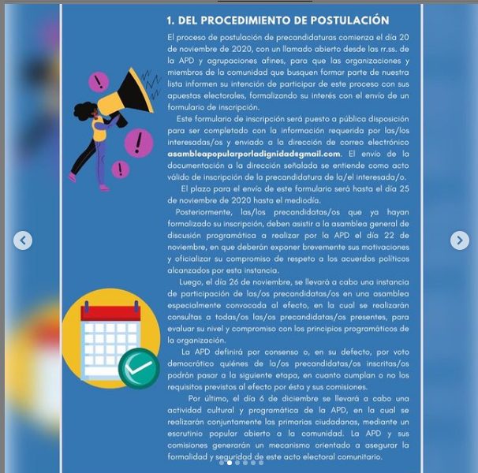

#### FOLIO: TAL28
# Asamblea popular por la diginidad 

[instagram](https://www.instagram.com/asambleapopularporladignidad/)
[facebook]()
[twitter]()
<correo@correo.cl>
---

### Representantes
#### (Nombres o emails de voceros o representantes).

---
### Interacciones frecuentes
#### Coordinadora sur poniente, Movimiento por el agua y los territorios, Talca lucha, Talca Resiste, Talkapucha, Coordfeminista 8M maule

### Redes sociales
#### ¿Para qué se utiliza la red social?
| Instagram | Facebook | Twitter | Otra 
|---|---|---|---|
|Difusión de información y actividades. Mural de fotografías para registrar las actividades concretadas|0|0| 0|

### **Instagram**
| seguidores | seguidos | publicaciones | hashtag 
|---|---|---|---|
|889|323|23| #nuevaconstitucion #soloenelpuebloconfiamos #hastaqueladignidadsehagacostumbre #chiledesperto #Chile #wallmapulibre
#feminismo
#ecologia
#artistas
#arteycultura
#disidencias
#nomasafp
#educacion
#colegiodeprofesores
#nomassename
#hastaqueladignidadsehagacostumbre #asambleaconstituyente

---

* **Actividad:**   

* Primera Publicación IG 10 de Noviembre del 2020

---
### Frecuencia de publicación.

Publicaciones: de 3 a 4 por semana

Actividades: Todos los domingos. 

---
### Ubicación
* Sector de la comununa/ciudad: Sector abate molina
Costanera y estacion

---
### Describir temas de interés y/o trabajo
Organización territorial, trabaja como asamblea sus intereses son el proceso constitucional constituyente en el distrito 17

### VIDEO Intagram: [Link](https://www.instagram.com/p/CH-c47MFN3G/)
---
### Describir la imagen ideal por la cual se trabaja.
#### ¡Que siga nuestra lucha! Amulepe taiñ weichan, Piñera los ojos del pueblo te condenan, 

---
### ¿Que se hace?
#### Asambleas ciudadanas, creación de material informativa para el proceso conformación de listas independientes. Protestas convocatoria a marchas 

---
### Describir y distinguir demandas más reivindicativas de espacios sin relación con lo contencioso o con lo político mas prefigurativo
#### Organizacion territorial dirigido a las organizaciones sociales y ciudadanos del distrito 17 Maule norte. Transformación cotidiana del vivir en comunidad.

---
### Tipo de organización interna.
#### Asambleísmo y horizontalidad. Se distingue un trabajo por comisiones las últimas actividades

---
### Describir los temas / imágenes- iconos / conceptos mas habitualmente presentes en sus publicaciones. Describir cambios/ transformaciones en los contenidos desde Octubre.

**Iconos:**

**Banderas:**

**Diseño estético:**

>El diseño de las publicaciones varia, no tienen una continuidad. Responsabiliza a Sebastián Piñera por crimines de la revuelta. No existen colores que caracterizan a la organización 

---
### Percepciones que se tiene del Estado
#### (Aparato burocrático)
> resumen de lo encontrado

| Declaraciones | infografía | 
|---|---|
|Anotar los comunicados |  |

---
### Percepciones que se tiene de las Fuerzas de Orden
#### (Aparato represivo)
> resumen de lo encontrado

| Declaraciones | infografía | 
|---|---|
|Anotar los comunicados |  |

---
### Incorporar aca notas, citas textuales, links, etc. extra a los ya incorporados, que sean de interés para comprender tanto la forma como los contenidos asociados a la organización.
