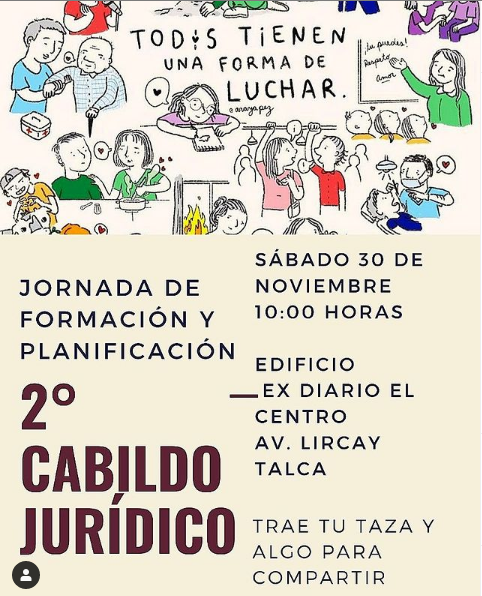
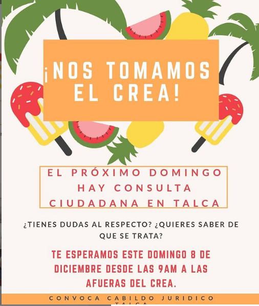
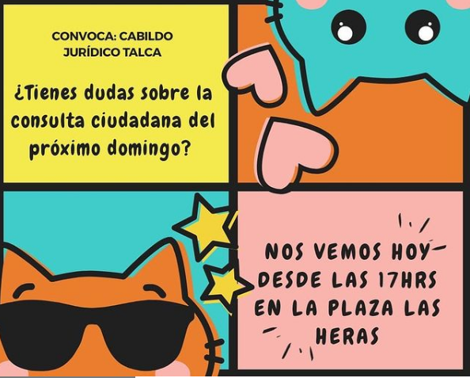
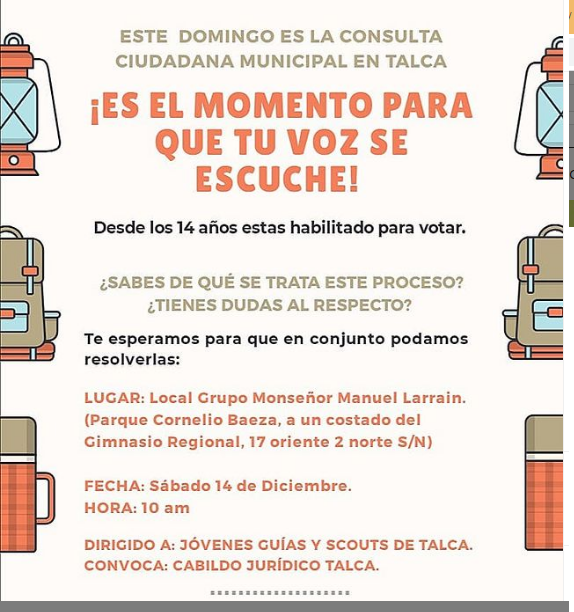

#### FOLIO: TAL 26
# Cabildo jurídico Talca

[instagram](https://www.instagram.com/cabildojuridicotalca/)
[facebook]()
[twitter]()
<correo@correo.cl>
---

### Representantes
#### (Nombres o emails de voceros o representantes).

---
### Interacciones frecuentes

#### Coordinadora sur poniente, Madriguera.

### Redes sociales
#### ¿Para qué se utiliza la red social?
| Instagram | Facebook | Twitter | Otra 
|---|---|---|---|
|Difusión de información y difusión de actividades|0|0| 0|

### **Instagram**
| seguidores | seguidos | publicaciones | hashtag 
|---|---|---|---|
|208|167|14| 

---

* **Actividad:**   Inactiva 

* Primera Publicación IG 28/11/2019

---
### Frecuencia de publicación.

Publicaciones: publicaciones semanales hasta diciembre 2019.  

Actividades: En su periodo activo cada dos semanas 

---
### Ubicación
* Sector de la comununa/ciudad: Plaza Las Heras/ U. Talca 

---
### Describir temas de interés y/o trabajo
#### Organización territorial conformados por estudiantes y profesionales de derecho interesado en el proceso de participación ciudadana.
---
### Describir la imagen ideal por la cual se trabaja.
#### Consignas: "A ganar una constituyente para todas y todos" ¡ES EL MOMENTO PARA QUE TU VOZ SE ESCUCHE!

---
### ¿Que se hace?
#### 
- Cabildos 
- Conversatorios. 
- Confección de material informativo.

---
### Describir y distinguir demandas más reivindicativas de espacios sin relación con lo contencioso o con lo político mas prefigurativo
#### (lo contencioso; demanda al Estado, a alguna autoridad, privados, etc), (prefigurativo, transformación desde lo cotidiano, etc.).

---
### Tipo de organización interna.
#### Asambleísmo y Horizontalidad.

---
### Describir los temas / imágenes- iconos / conceptos mas habitualmente presentes en sus publicaciones. Describir cambios/ transformaciones en los contenidos desde Octubre.

**Iconos:**

**Banderas:**

**Diseño estético:**

> Los diseños se realizaron por la plataforma Canvas. No existen colores o iconografía representativa  

---
### Percepciones que se tiene del Estado
#### (Aparato burocrático)
> resumen de lo encontrado

| Declaraciones | infografía | 
|---|---|
|Anotar los comunicados |  |

---
### Percepciones que se tiene de las Fuerzas de Orden
#### (Aparato represivo)
> resumen de lo encontrado

| Declaraciones | infografía | 
|---|---|
|Anotar los comunicados |  |

---
### Incorporar aca notas, citas textuales, links, etc. extra a los ya incorporados, que sean de interés para comprender tanto la forma como los contenidos asociados a la organización.
