#### FOLIO:TAL29
# Cabildos populares Talca

[instagram](https://www.instagram.com/cabildospopularestalca/)
[facebook]()
[twitter]()
<cabildospopularestalca@gmail.com>
---

### Representantes
#### 

---
### Interacciones frecuentes
#### Mesa unidad social, No mas AFP Talca, coordinadora sur poniente. 

### Redes sociales
#### ¿Para qué se utiliza la red social?
| Instagram | Facebook | Twitter | Otra 
|---|---|---|---|
|Difusión de información|Difusión de información|0| 0|

### **Instagram**
| seguidores | seguidos | publicaciones | hashtag 
|---|---|---|---|
|681|766|38| #ChileDesperto #TalcaDesperto #CabildoPopular #Talca #AsambleaTerritorial

---

* **Actividad:**   Incativa

* Primera Publicación IG 16/11/2019

---
### Frecuencia de publicación.

Publicaciones:Cada dos dias en los meses de noviembre y diciembre del 2019

Actividades: No se registraron actividades concretas. 

---
### Ubicación
* Sector de la comununa/ciudad: Talca en general

---
### Describir temas de interés y/o trabajo
#### Organización territorial interesado en la participación ciudadana y el proceso constituyente.
---
### Describir la imagen ideal por la cual se trabaja.
#### "Movilizados(as) por la necesidad de construir un Chile más justo"

---
### ¿Que se hace?
#### Difusión de información a través de afiches por redes sociales que contenían fecha lugar y temática de los cabildos. Sistematizaciones de informaciones recopilada en los cabildos, esta última no fue compartida en la red social. 
####  -creación de material educativo: pauta  organizativa
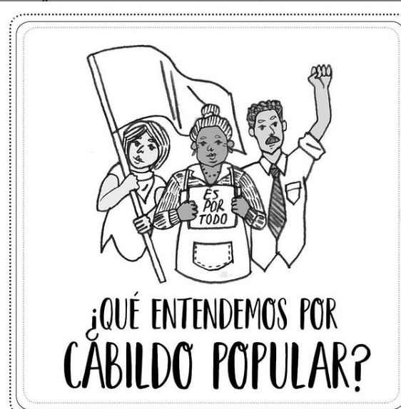
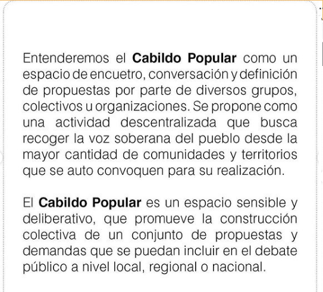
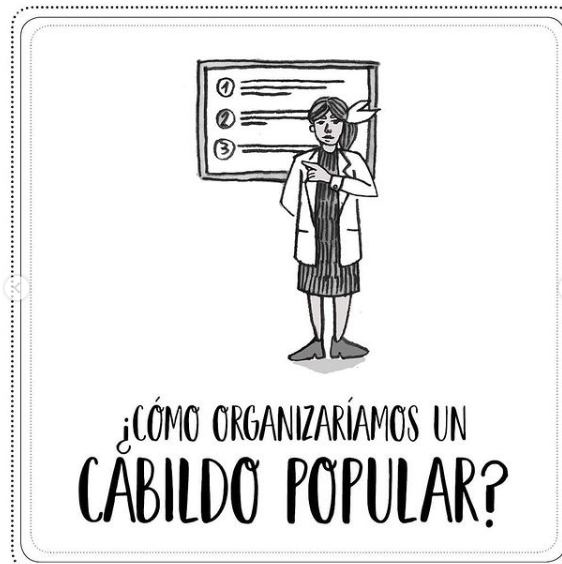
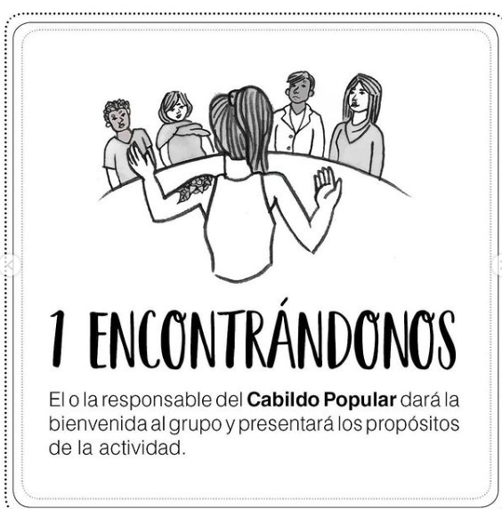
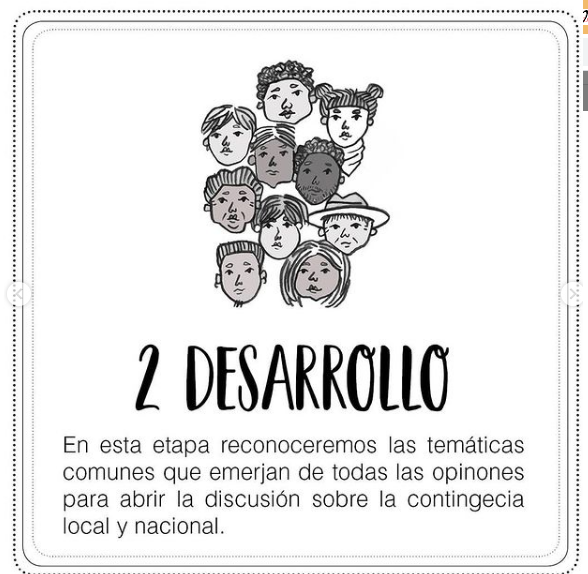
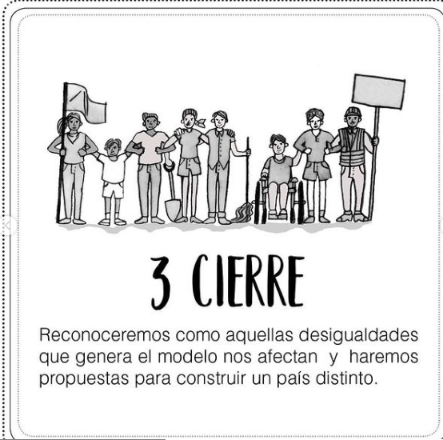
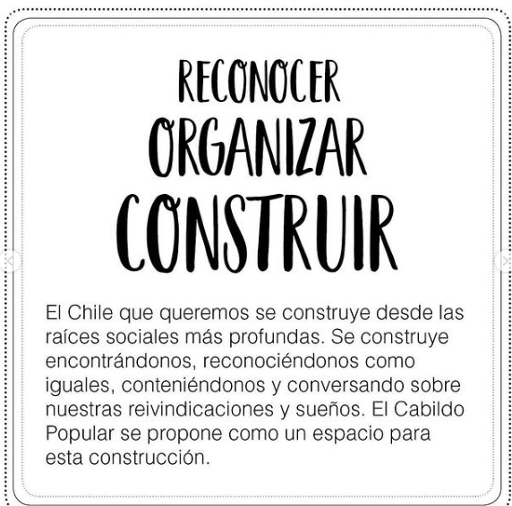
---
### Describir y distinguir demandas más reivindicativas de espacios sin relación con lo contencioso o con lo político mas prefigurativo
#### Transformación cotidiana del vivir en el barrio.

---
### Tipo de organización interna.
#### Asambleísmo y horizontalidad. Se distingue un trabajo por comisiones las últimas actividades

---
### Describir los temas / imágenes- iconos / conceptos mas habitualmente presentes en sus publicaciones. Describir cambios/ transformaciones en los contenidos desde Octubre.

**Iconos:**

**Banderas:**

**Diseño estético:**
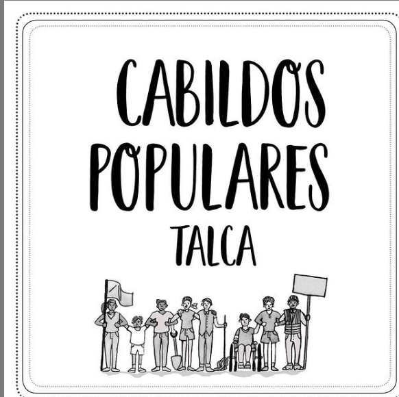
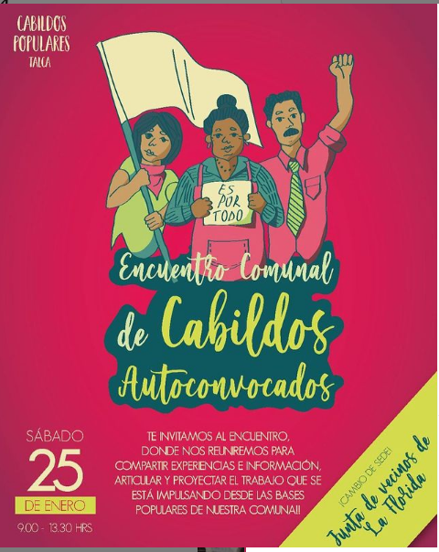
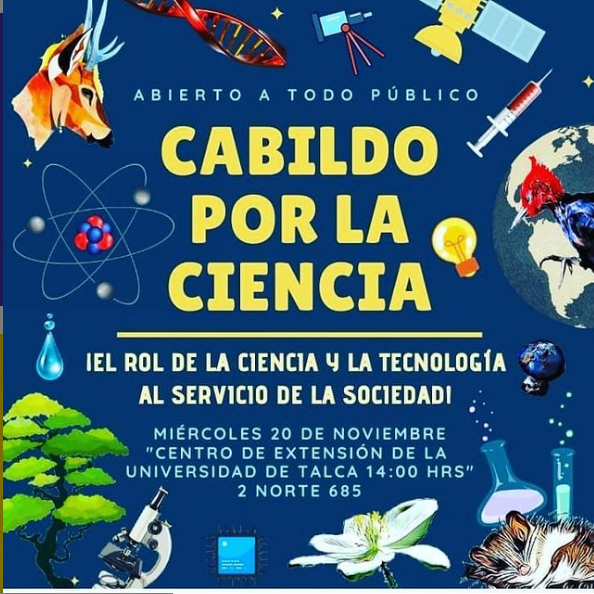
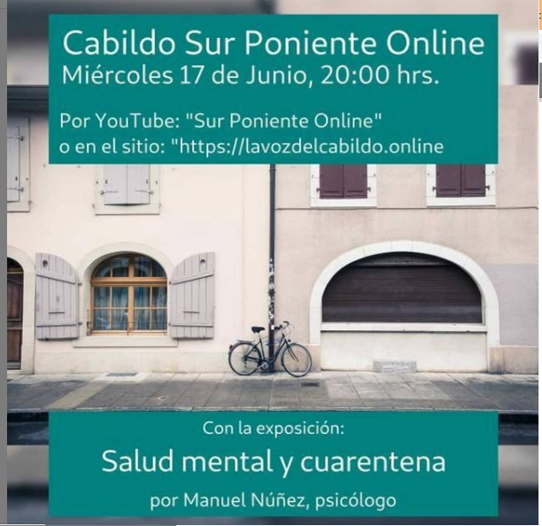

> Párrafo tipo cita 

---
### Percepciones que se tiene del Estado
#### (Aparato burocrático)
> El material compartido mantiene una línea de diseño. Resaltando la figura la pobladores organizados 

| Declaraciones | infografía | 
|---|---|
|Anotar los comunicados |  |

---
### Percepciones que se tiene de las Fuerzas de Orden
#### (Aparato represivo)
> resumen de lo encontrado

| Declaraciones | infografía | 
|---|---|
|Anotar los comunicados |  |

---
### Incorporar aca notas, citas textuales, links, etc. extra a los ya incorporados, que sean de interés para comprender tanto la forma como los contenidos asociados a la organización.
