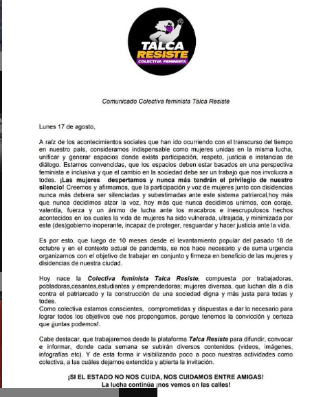
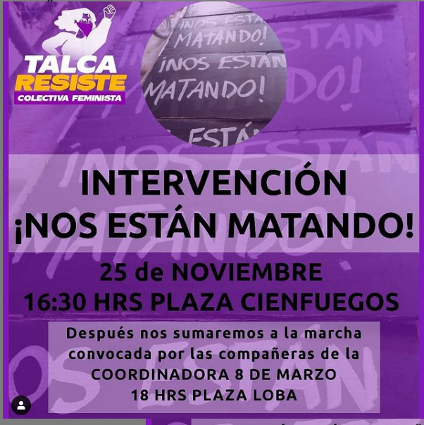
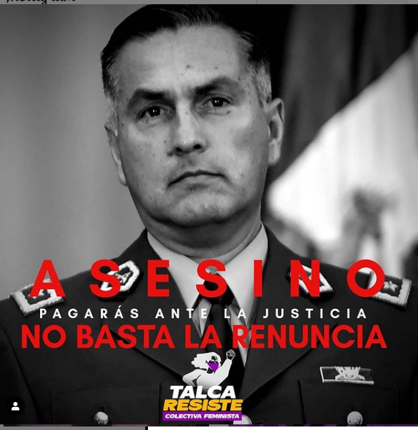

#### FOLIO: TAL 3
# Colectiva feminista Talca Resiste

[instagram](https://www.instagram.com/colectivofeministalam/)
[facebook]()
[twitter]()
<correo@correo.cl>
---

### Representantes
#### (Nombres o emails de voceros o representantes).

---
### Interacciones frecuentes
#### Colectiva arriba las que luchan, Talca resiste, revolución séptima. 

### Redes sociales
#### ¿Para qué se utiliza la red social?
| Instagram | Facebook | Twitter | Otra 
|---|---|---|---|
|Difusión de información y actividades|0|0| 0|

### **Instagram**
| seguidores | seguidos | publicaciones | hashtag 
|---|---|---|---|
|626|83|14| 

---

* **Actividad:**   Actividad continua. 

* Primera Publicación IG: 2 de Noviembre del 2020

---
### Frecuencia de publicación.

Publicaciones: Semanales (de 3 a 4 ) desde Noviembre de 2020

Actividades: Cada dos semanas aproximadamente

---
### Ubicación
* Sector de la comununa/ciudad: Centro de Talca. Plaza cien fuegos y Plaza de la loba

---
### Describir temas de interés y/o trabajo
#### La organización funciona como comisión feminista del la organización Talca Resiste iniciada en Octubre del 2019. Sus intereses son el feminismo y la apropiación del espacio publico.  
---
### Describir la imagen ideal por la cual se trabaja.
#### "Mujeres talquinas unidas contra el capitalismo y la violencia patriarcal." "Si el Estado no nos cuida nos cuidamos entre amigas" 

---
### ¿Que se hace?
#### Protestas, convocatorias a intervenciones publicas, contrainformacion: difusión de información respecto a casos de femicidios en pandemia. 

LINK Intervención: [instagram](https://www.instagram.com/p/CIB-9ipnp1h/)
---
### Describir y distinguir demandas más reivindicativas de espacios sin relación con lo contencioso o con lo político mas prefigurativo
#### (lo contencioso; demanda al Estado, a alguna autoridad, privados, etc), (prefigurativo, transformación desde lo cotidiano, etc.).

---
### Tipo de organización interna.
#### Asambleísmo y Horizontalidad. 

---
### Describir los temas / imágenes- iconos / conceptos mas habitualmente presentes en sus publicaciones. Describir cambios/ transformaciones en los contenidos desde Octubre.

**Iconos:**

**Banderas:**

**Diseño estético:**

> 
Mantiene el diseño del logo de la organización de la cual surgieron como (Talca resiste) adaptándolo con su nombre. Los colores usados son mayormente el purpura.  

---
### Percepciones que se tiene del Estado
#### (Aparato burocrático)
> Estado ausente lo anuncian en bajo la consigna "Si el Estado no nos cuida nos cuidamos entre amigas"

| Declaraciones | infografía | 
|---|---|
|Anotar los comunicados |  |

---
### Percepciones que se tiene de las Fuerzas de Orden
#### (Aparato represivo)
> resumen de lo encontrado

| Declaraciones | infografía | 
|---|---|
|EXIGIMOS JUICIO Y CASTIGO! POR LAS 36 PERSONAS QUE MATARON POR MANIFESTARSE POR TODES A QUIENES LES QUITARON SUS OJOS. POR LAS TARJETAS DE MEMORIA DESTRUIDAS (EVIDENCIA) POR EMPUJAR A PERSONAS DESDE PUENTES. POR DISPARARLE A NIÑOS |  |

---

