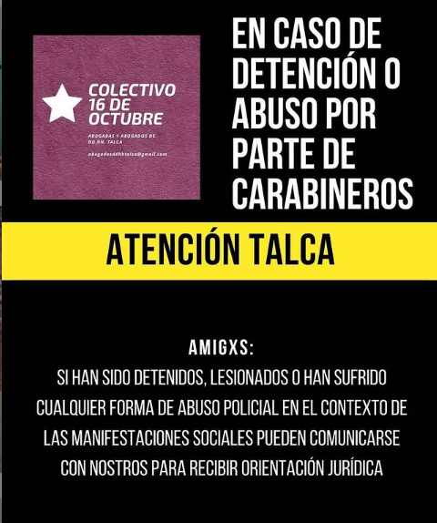
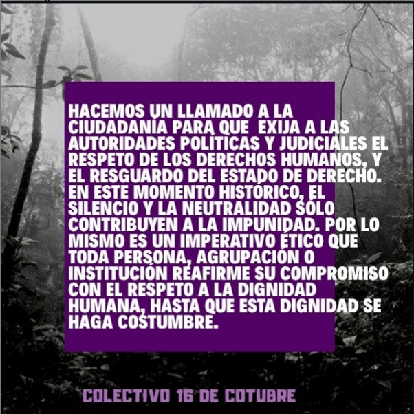
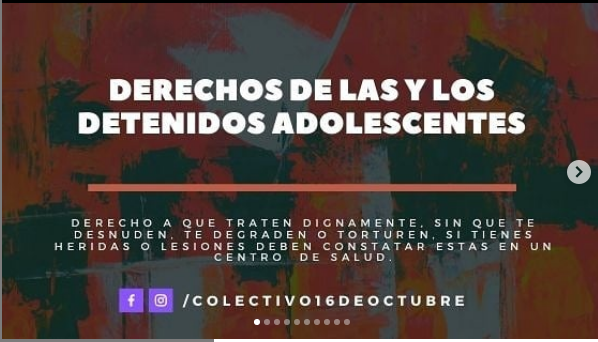
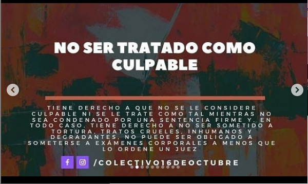
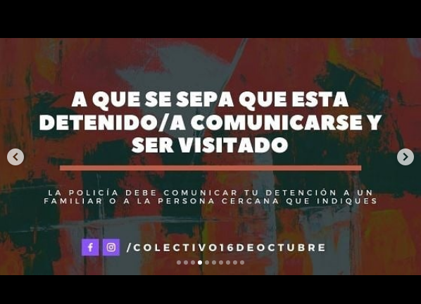
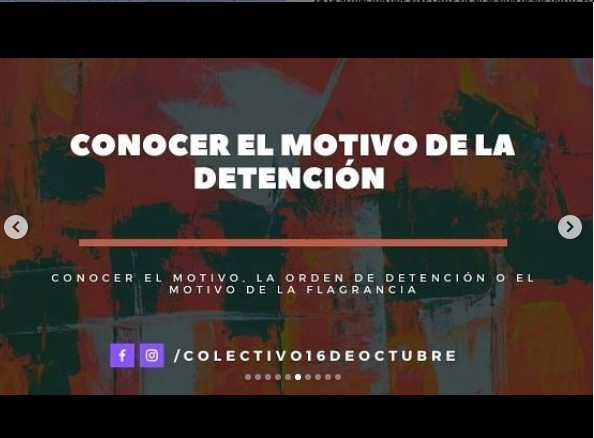
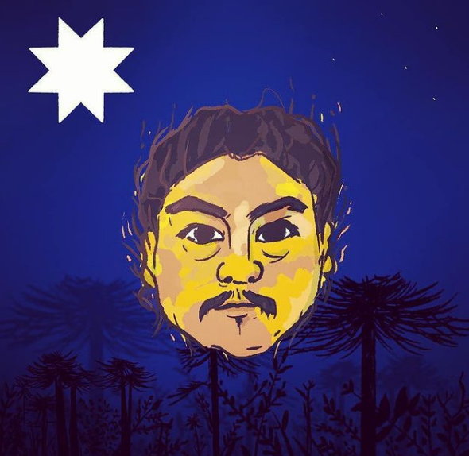
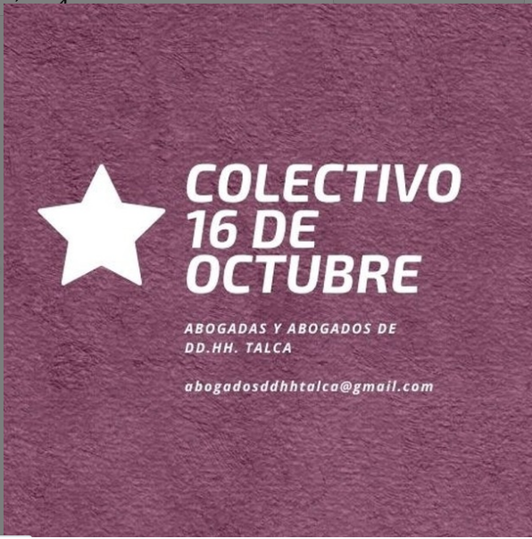
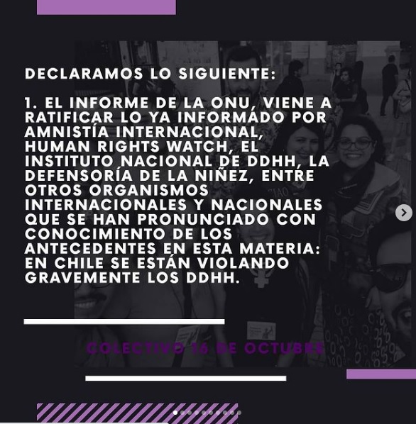
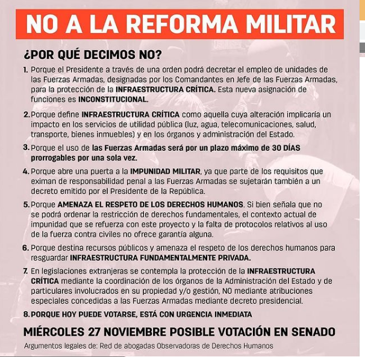

#### FOLIO: TAL11
# Colectivo 16 de octubre

[instagram](https://www.instagram.com/colectivo16deoctubre/)
[facebook]()
[twitter]()
<abogadosddhhtalca@gmail.com>
---

### Representantes
#### Numero de celular +569 50480255

---
### Interacciones frecuentes
#### Colectiva arriba las que luchan, coordinadora 8M Maule, Colectivo Hijas del trueno, mesa unidad social, Talca luchando en pedales, coordinadora sur poniente. 

### Redes sociales
#### ¿Para qué se utiliza la red social?
| Instagram | Facebook | Twitter | Otra 
|---|---|---|---|
|Difusión de información y actividades. Mural de fotografías para registrar las actividades concretadas |0|0| 0|

### **Instagram**
| seguidores | seguidos | publicaciones | hashtag 
|---|---|---|---|
|1158|24| 110

---

* **Actividad:**   Continua

* Primera Publicación IG 09/11/2019

---
### Frecuencia de publicación.

Publicaciones:  Publicaciones mensuales, da saltos mensuales sin publicaciones, manteniendo continuidad.

Actividades: Mensuales. semanales durante el periodo mas álgido de la revuelta popular.
 

---
### Ubicación
* Sector de la comununa/ciudad: Talca en general.

---
### Describir temas de interés y/o trabajo
#### Agrupación de abogadas y abogados que defienden los derechos humanos de los presos de la revuelta , sus intereses son los derechos humanos, contrainsofrmacion y el proceso constituyente. 
---
### Describir la imagen ideal por la cual se trabaja.
#### Se describen como una agrupación que busca "colaborar en la garantía, promoción y protección de los derechos esenciales que emanan de la dignidad humana"

---
### ¿Que se hace?
####
- Conversatorios sobre el proceso constituyente, 
- Defensas judicial a presos de la revueltas.
- Difusíon de contrainformacion judicial por redes sociales.  

---
### Describir y distinguir demandas más reivindicativas de espacios sin relación con lo contencioso o con lo político mas prefigurativo
#### (lo contencioso; demanda al Estado, a alguna autoridad, privados, etc), (prefigurativo, transformación desde lo cotidiano, etc.).

---
### Tipo de organización interna.
#### Asambleísmo. Se infiere un trabajo por comisiones. 

---
### Describir los temas / imágenes- iconos / conceptos mas habitualmente presentes en sus publicaciones. Describir cambios/ transformaciones en los contenidos desde Octubre.

**Iconos:**

[linkear imagen](https://www.instagram.com/p/B9ahR5-pT7V/) 

**Banderas:**

**Diseño estético:**

>  Existe un diseño predeterminado desde sus inicios. Destacan las figuras de Camilo Catrillanca y el padre Mariano Puga.

---
### Percepciones que se tiene del Estado
#### (Aparato burocrático)
> Nos quieren ciegos y sordos" !NO mas fascismo Estatal! 

| Declaraciones | infografía | 
|---|---|
|Anotar los comunicados |  |

---
### Percepciones que se tiene de las Fuerzas de Orden
#### (Aparato represivo)
> 

| Declaraciones | infografía | 
|---|---|
|Considerar que la utilizacion de los implementos disuasivos con los que ya cuentan las fuerzas de orden y seguridad en Chile se encuentra fuera de las restricciones que ordenan los protocolos vigentes del uso de la fuerza en manifestaciones, provocando lesiones en la población y otras afectaciones a sus derechos.

Sin garantías suficientes del uso responsable de este tipo de disuasivos auditivos, y ante la seria prevención contraria de las instituciones que suscriben, no podemos más que manifestar el rechazo más completo y definitivo a la adquisición e implementación de estos elementos. | 
 |

---
### Incorporar aca notas, citas textuales, links, etc. extra a los ya incorporados, que sean de interés para comprender tanto la forma como los contenidos asociados a la organización.
