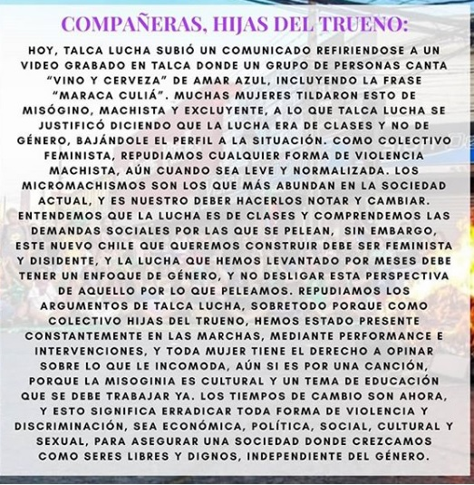
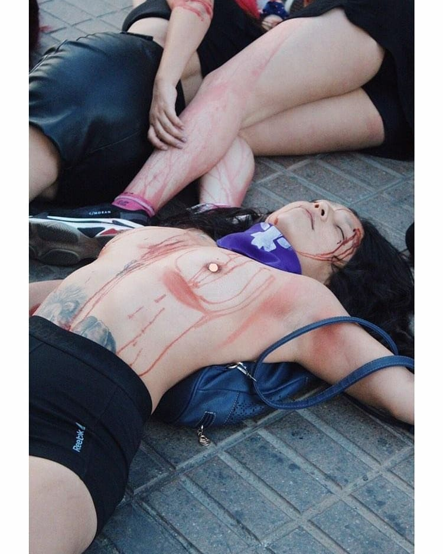
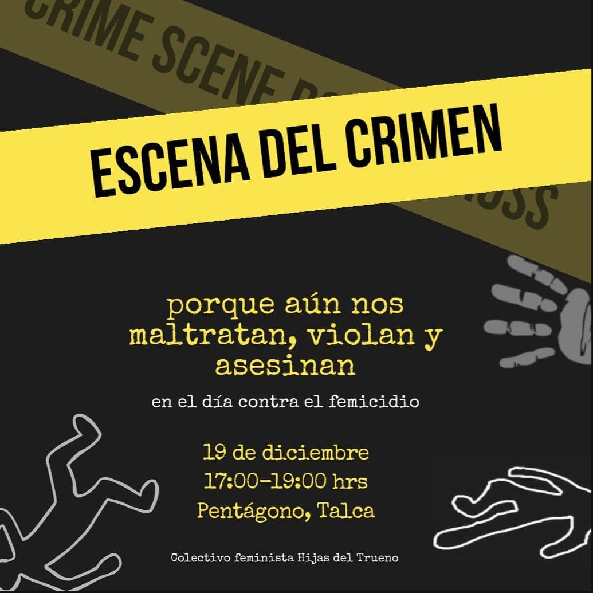
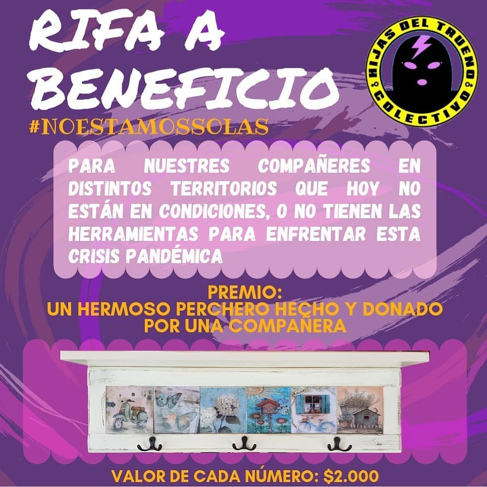
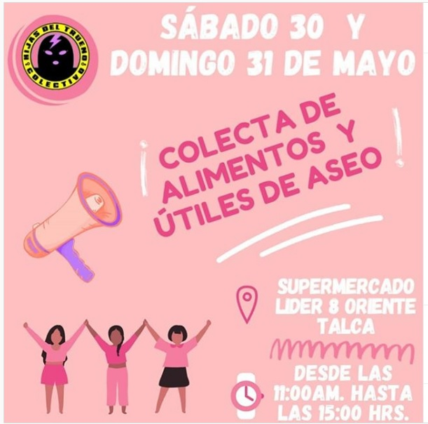
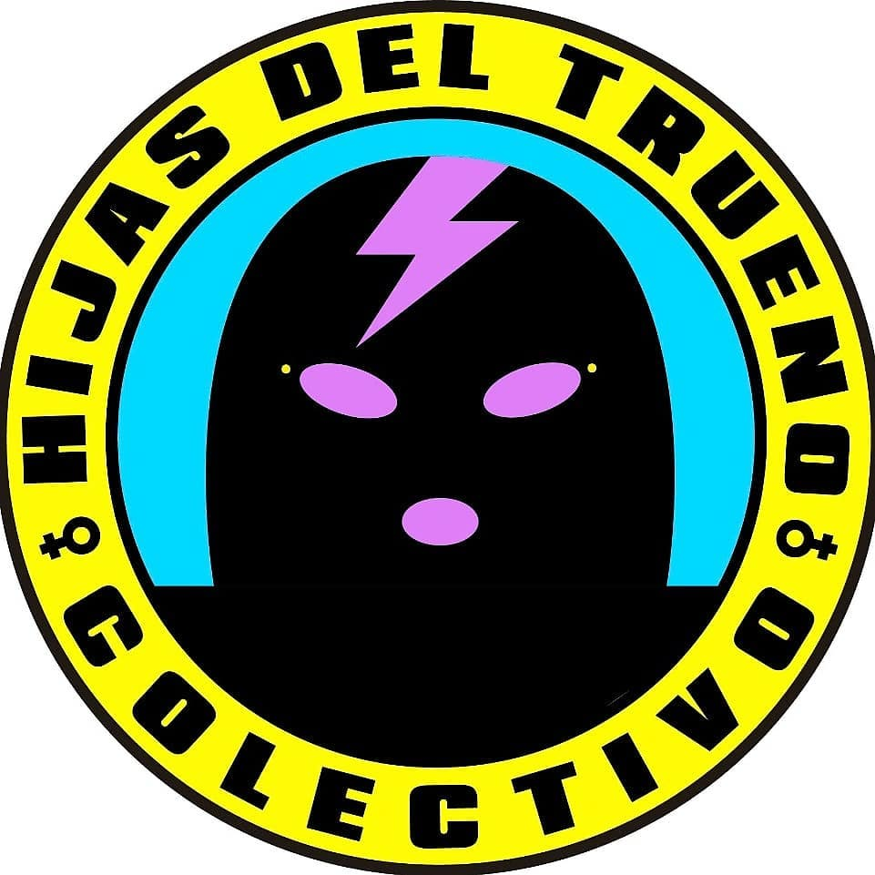
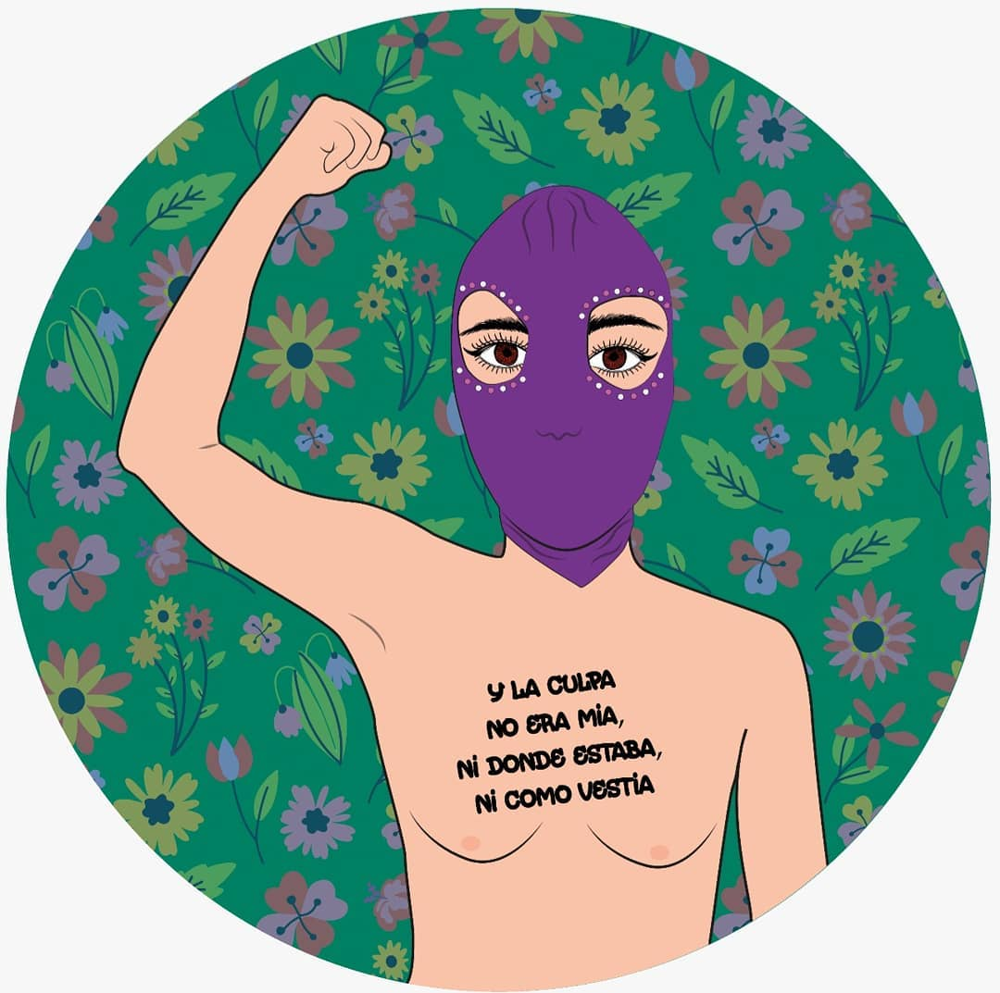

#### FOLIO: TAL1
# Colectivo Hijas del trueno

[instagram](https://www.instagram.com/las_hijasdeltrueno/)
[facebook](https://www.facebook.com/Hijas-del-trueno-107851347365462)
[twitter]()
<laschicasdeltrueno@gmail.com>
---

### Representantes
#### (No especifica).

---
### Interacciones frecuentes
#### Las tesis, coordinadora feminista 8M del Maule, Cletitas sororas Talca, Vivas nos queremos Talca, domodungun, resistecia musical, talca pedalea, Talca lucha, Talca resiste, Coordinadora sur poniente Talca, Red de Fiministas del Maule (femmaule), Asamblea de diversidad territorial Maule

### Redes sociales
#### ¿Para qué se utiliza la red social?
| Instagram | Facebook | Twitter | Otra 
|---|---|---|---|
|Difusión de actividades propias y de otras organizaciones, mural de fotografías.|0|0| 0|

### **Instagram**
| seguidores | seguidos | publicaciones | hashtag 
|---|---|---|---|
|5293|310|268| #justiciaparaaylin #notenemosministra #lasaludsexualnopuedeesperar #abortolegalderechoesencial #lamaternidadserádeseadaonoser#lamaternidadserádeseadaonoserá #noestamossolas #seguimossinministra #TodassomosAntonia #Martinunvioladorentucamino #Noestamossolas #martínpradenasviolador #JusticiaParaAntonia #justiciaparatodes #sitocanaunanostocanatodas #nomasafp #papitocorazon #pensiondealimentos #justiciaparaambar #justiciaparacatavasquez #niunamenos #todoslosdiasson8m #feminismo #Alertamachista #ConstitucionParitaria #AprueboNuevaConstitucion #ConvencionConstitucional #Chileparatodasytodos #Yoquierouncambio #Elestadoopresoresunmachoviolador #ParidadYa #UnClavelEnTuNombre #juntashacemoshistoria #juntasaprobamos #NosomoshistericasSomoshistoricas #50AñosUP #Sororidad #Nuncamassolas #Sororidad #Memoriafeminista #Violenciapoliticosexual #convencionconstitucional #plazadelaresistencia

---

* **Actividad:**   

* Primera Publicación IG:  29 de noviembre del 2019

---
### Frecuencia de publicación.

Publicaciones: La frecuancia de las publicaciones son semanales de forma continua. 

Actividades:

---
### Ubicación
* Comuna de Talca: sector costanera.

---
### Describir temas de interés y/o trabajo
  - Feminismo 
  - Proceso constituyente
  - Memoria
  - Aborto
  - Educacion sexual. 
---
### Describir la imagen ideal por la cual se trabaja.
#### El colectivo menciona que "busca participar en la creación de un nuevo Chile, que se constituya como un espacio que otorgue seguridad y libertad a las niñas y mujeres de nuetro pais" 
 |
---
### ¿Que se hace?
#### La organización genera:
- Intervenciones públicas, 
- Difusión de información, actividades, consignas y temas de interés feminista 
- Organización de actividades culturales feministas.  
- Conversatorios online
- Actividades solidarias como rifas y colecta de alimentos y utiles de aseo   
| |
| |
| |
| |

---
### Describir y distinguir demandas más reivindicativas de espacios sin relación con lo contencioso o con lo político mas prefigurativo
#### (lo contencioso; demanda al Estado, a alguna autoridad, privados, etc), (prefigurativo, transformación desde lo cotidiano, etc.).
- Aborto libre seguro y gratuito
---
### Tipo de organización interna.
#### Se percibe una coordinación a través de reuniones o asambleas internas coordinada  por las gestoras o iniciadoras del colectivo.  

---
### Describir los temas / imágenes- iconos / conceptos mas habitualmente presentes en sus publicaciones. Describir cambios/ transformaciones en los contenidos desde Octubre.

**Iconos:** 
| |
| |

**Banderas:**

**Diseño estético**

> Uso del color violeta. Existe un logo y una estética diseñada desde sus inicios 

---
### Percepciones que se tiene del Estado
#### (Aparato burocrático)
> resumen de lo encontrado

| Declaraciones | infografía | 
|---|---|
|Anotar los comunicados |  |

---
### Percepciones que se tiene de las Fuerzas de Orden
#### (Aparato represivo)
> resumen de lo encontrado

| Declaraciones | infografía | 
|---|---|
 |  
) |

---
### Incorporar aca notas, citas textuales, links, etc. extra a los ya incorporados, que sean de interés para comprender tanto la forma como los contenidos asociados a la organización.
