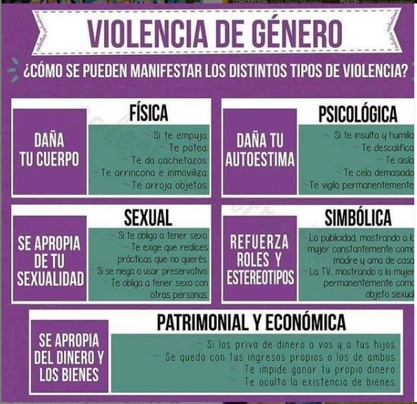
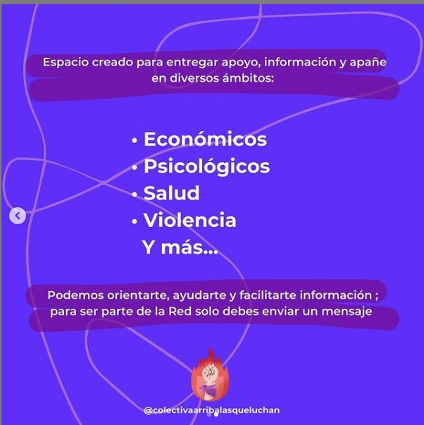
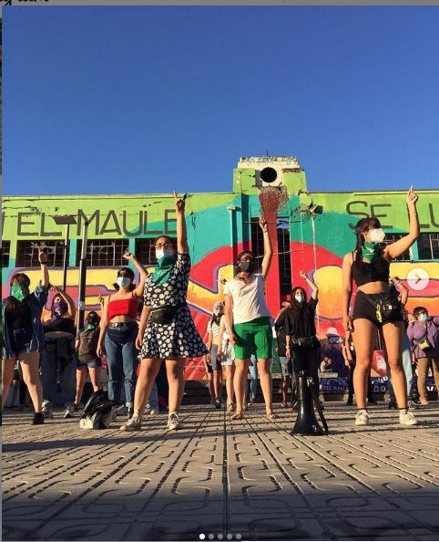
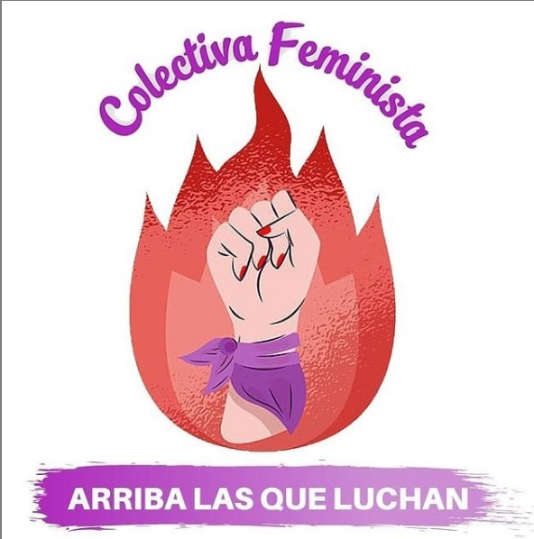
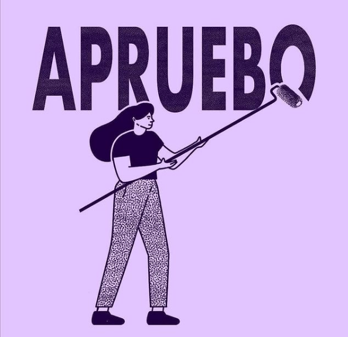
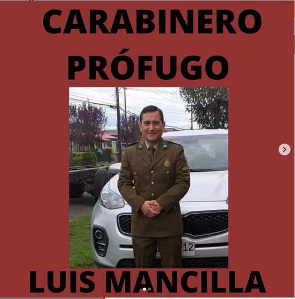

#### FOLIO: TAL25
# Colectivo feminista arriba las que luchan

[instagram](https://www.instagram.com/colectivaarribalasqueluchan/)
[facebook](https://www.facebook.com/colectiva.feminista.73)

---

### Representantes
#### (Nombres o emails de voceros o representantes).

---
### Interacciones frecuentes
#### Talca resiste, coordinadora feminista 8M Maule.
### Redes sociales
#### ¿Para qué se utiliza la red social?
| Instagram | Facebook | Twitter | Otra 
|---|---|---|---|
|Difusión de información y actividades. Mural de fotogrfías |0|0| 0|

### **Instagram**
| seguidores | seguidos | publicaciones | hashtag 
|---|---|---|---|
|735|334|65| #MesContraLaViolenciaALaMujer #apruebo #paridad #JUSTICIAPARACAROLINA #NOSQUEREMOSVIVAS #NIUNAMUERTAMÁS 

---

* **Actividad:** Actividad continua.   

* Primera Publicación IG 14/09/2020

---
### Frecuencia de publicación.

Publicaciones: Semanales, en promedio 3 por semana de manera continua.

Actividades: dos actividades mensuales. 

---
* Sector de la comununa/ciudad: Plaza de armas, plaza cienfuegos, Talca en general. 

---
### Describir temas de interés y/o trabajo
#### Organización territorial y apoyo mutuo, sus temas de interés son el feminismo, el proceso constituyente, la apropiación del espacio publico y la memoria
---
### Describir la imagen ideal por la cual se trabaja.
#### La organización menciona en sus redes que : "Nuestra misión es generar e impulsar un cambio en las estructuras sociales, económicas y culturales, para así conseguir igualdad y equidad de género, mediante el empoderamiento, la lucha, libertad, participación activa y sororidad. Consigna: Ya nunca más solas, cuando grita una, gritamos todas. 

---
### ¿Que se hace?
#### 
- Intervenciones publicas como actos conmemorativos, 
- velatones y lienzos. Videos por el apruebo y convención constitucional.
- Actividades solidarias, como redes de apoyo entre mujeres. (apoyo económico, psicológico o informativo)
Creación de materialinformativo 

---
### Describir y distinguir demandas más reivindicativas de espacios sin relación con lo contencioso o con lo político mas prefigurativo
#### (lo contencioso; demanda al Estado, a alguna autoridad, privados, etc), (prefigurativo, transformación desde lo cotidiano, etc.).

---
### Tipo de organización interna.
#### Asambleísmo, horizontalidad.

---
### Describir los temas / imágenes- iconos / conceptos mas habitualmente presentes en sus publicaciones. Describir cambios/ transformaciones en los contenidos desde Octubre.

**Iconos:**

**Banderas:**

**Diseño estético:**

> La organización mantiene un diseño estético. El color que más se repite es el violeta. 

---
### Percepciones que se tiene del Estado
#### (Aparato burocrático)
> resumen de lo encontrado

| Declaraciones | infografía | 
|---|---|
|Anotar los comunicados |  |

---
### Percepciones que se tiene de las Fuerzas de Orden
#### (Aparato represivo)
> resumen de lo encontrado

| Declaraciones | infografía | 
|---|---|
|Anotar los comunicados |  |

---
### 
