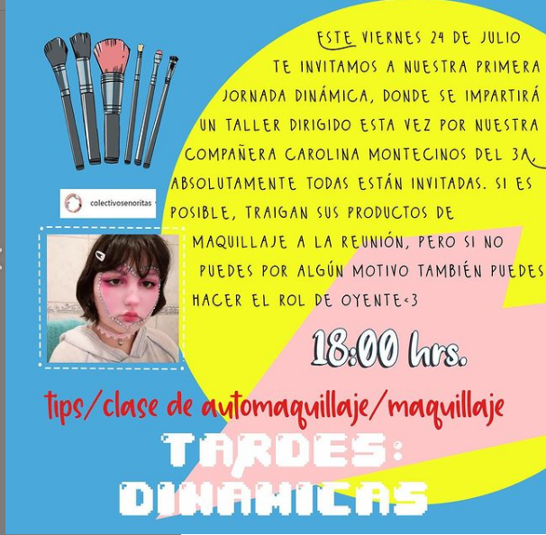

#### FOLIO: TAL8
# Colectiva Señoritas

[instagram](https://www.instagram.com/colectivasenoritas/ )
[facebook]()
[twitter]()
<correo@correo.cl>
---

### Representantes
#### (Nombres o emails de voceros o representantes).

---
### Interacciones frecuentes
#### Vivas nos queremos Talca.

### Redes sociales
#### ¿Para qué se utiliza la red social?
| Instagram | Facebook | Twitter | Otra 
|---|---|---|---|
|Difusión de información y actividades 
|0|0| 0|

### **Instagram**
| seguidores | seguidos | publicaciones | hashtag 
|---|---|---|---|
|125|12|12| #martinpradenasviolador 

---

* **Actividad:** Inactiva desde agosto

* Primera Publicación IG 

---
### Frecuencia de publicación.

Publicaciones: inció en marzo del 2020, estuvo activa semanalmente en junio y julio. Ultima publicación a fines de agosto. 

Actividades: Cada una semana en el periodo de actividad. 

---
### Ubicación
* Sector de la comununa/ciudad: Ciudad de Talca en general. 

---
### Describir temas de interés y/o trabajo
#### Organización virtual, sus interese son el feminismo y el apoyo mutuo.
---
### Describir la imagen ideal por la cual se trabaja.
#### (El horizonte hacia el cual se quiere avanzar.)

---
### ¿Que se hace?
#### 
- Redes de apoyo mutuo a través de reuniones/conversatorios virtuales.
-  Talleres de maquillaje.

---
### Describir y distinguir demandas más reivindicativas de espacios sin relación con lo contencioso o con lo político mas prefigurativo
#### (lo contencioso; demanda al Estado, a alguna autoridad, privados, etc), (prefigurativo, transformación desde lo cotidiano, etc.).

---
### Tipo de organización interna.
#### (Vocerías, asambleísmo, horizontalidad, etc.; *se entiende que esta dimensión es más difícil de captar vía análisis de redes sociales, pero quizás se puede vislumbrar a través de roles/cargos*)

---
### Describir los temas / imágenes- iconos / conceptos mas habitualmente presentes en sus publicaciones. Describir cambios/ transformaciones en los contenidos desde Octubre.

**Iconos:**

**Banderas:**

**Diseño estético:**
 

> No destacan notoriamente los colores del movimiento feminista en sus afiches.  

---
### Percepciones que se tiene del Estado
#### (Aparato burocrático)
> resumen de lo encontrado

| Declaraciones | infografía | 
|---|---|
|Anotar los comunicados |  |

---
### Percepciones que se tiene de las Fuerzas de Orden
#### (Aparato represivo)
> resumen de lo encontrado

| Declaraciones | infografía | 
|---|---|
|Anotar los comunicados |  |

---
### Incorporar aca notas, citas textuales, links, etc. extra a los ya incorporados, que sean de interés para comprender tanto la forma como los contenidos asociados a la organización.
