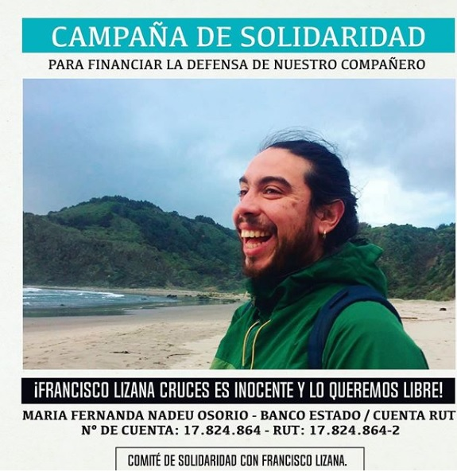
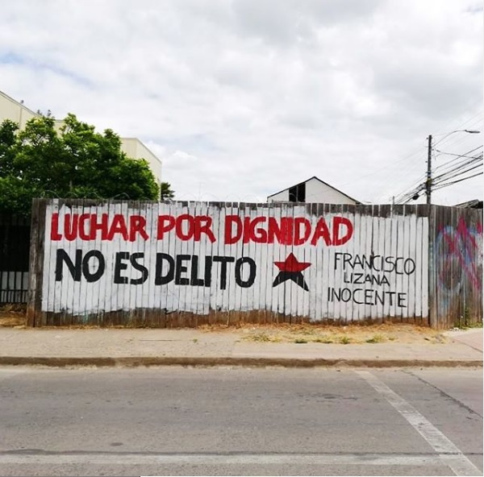
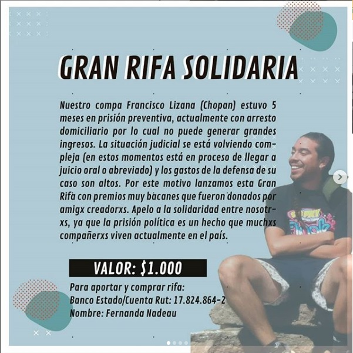

#### FOLIO: TAL27
# Comité soldaridad 

[instagram](https://www.instagram.com/comitedesolidaridadconfco/)
[facebook]()
[twitter]()
<correo@correo.cl>
---

### Representantes
#### (Nombres o emails de voceros o representantes).

---
### Interacciones frecuentes
#### Brigada acción popular, Escuela critica permanente, Contra información Curicó, Asamblea diversidad territorial.

### Redes sociales
#### ¿Para qué se utiliza la red social?
| Instagram | Facebook | Twitter | Otra 
|---|---|---|---|
|Difusión de información y actividades. Mural de fotografías para registrar las actividades concretadas|0|0| 0|

### **Instagram**
| seguidores | seguidos | publicaciones | hashtag 
|---|---|---|---|
|973|794|33| #ElChopanEsInocente #LucharemosHastaQueSeHagaJusticia

---

* **Actividad:**   Discontinua.

* Primera Publicación IG: 19 DE NOVIEMBRE DE 2019

---
### Frecuencia de publicación.

Publicaciones: Semanales

Actividades: Actividades en diciembre del 2019 y septiembre del 2020

---
### Ubicación
* Sector de la comununa/ciudad: No se logra identificar. 

---
### Describir temas de interés y/o trabajo
Comité enfocado en apoyo al preso político Francisco lizana. Sus intereses son los derechos humanos y apoyo mutuo.m

---
### Describir la imagen ideal por la cual se trabaja.
#### NUNCA MÁS SOLXS, LIBERTAD A LXS PRESXS DE LA REVUELTA AHORA "Por que somos parte del cambio. "Luchar por dignidad no es delito"

---
### ¿Que se hace?
####  Actividades solidarias como campañas de recolección de dinero y rifas. Declaraciones publicas a través de redes sociales. 

---
### Describir y distinguir demandas más reivindicativas de espacios sin relación con lo contencioso o con lo político mas prefigurativo
#### 

---
### Tipo de organización interna.
#### Vocería, no entrega mayor información

---
### Describir los temas / imágenes- iconos / conceptos mas habitualmente presentes en sus publicaciones. Describir cambios/ transformaciones en los contenidos desde Octubre.

**Iconos:**

**Banderas:**

**Diseño estético:**

> Párrafo tipo cita 

---
### Percepciones que se tiene del Estado
#### (Aparato burocrático)
> Estado represivo

| Declaraciones | infografía | 
|---|---|
|Declaración Publica por la libertad de los PP Mapuche y de la Revuelta Comunicado publico| [Link video en instagram](https://www.instagram.com/p/CEaa2Xvp_-e/) |

---
### Percepciones que se tiene de las Fuerzas de Orden
#### (Aparato represivo)
> resumen de lo encontrado

| Declaraciones | infografía | 
|---|---|
|
[instagram](https://www.instagram.com/p/B-vCU3tJmDi/)| 

---
### Incorporar aca notas, citas textuales, links, etc. extra a los ya incorporados, que sean de interés para comprender tanto la forma como los contenidos asociados a la organización.
