#### FOLIO: TAL22
# Coordinadora feminista 8M Maule

[instagram](https://www.instagram.com/coordfeminista8marzomaule/)
[facebook](https://www.facebook.com/coordinadorafeminista8MdelMaule)
[twitter]()
<coordinadora8marzomaule@gmail.com>
---

### Representantes
#### (Nombres o emails de voceros o representantes).

---
### Interacciones frecuentes
#### Talca resiste, colectiva viva nos queremos Talca, EPC nuestras Américas, Colectivo 16 de octubre, cletitas sororas, Comité solidaridad, colectivo las hijas del trueno, Asamblea de la diversidad territoral, Asamblea popular dignidad.  

### Redes sociales
#### ¿Para qué se utiliza la red social?
| Instagram | Facebook | Twitter | Otra 
|---|---|---|---|
|Difusión de información y actividades. Mural de fotografías para registrar las actividades concretadas|Difusión de información y actividades. |0|0|

### **Instagram**
| seguidores | seguidos | publicaciones | hashtag 
|---|---|---|---|
|6553|218|691| #notenemosministra #justiciaparaantonia

---

* **Actividad:**   Continua 
* Primera Publicación IG 05/07/2019

---
### Frecuencia de publicación.

Publicaciones:Semanales de 3 a 4 publicaciones de manera contiinua

Actividades: Los meses de mayor actividad fueron noviembre y diciembre del 2019 y febrero y marzo 2020. En el periodo de pandemia solo se visualizan de 3 a 4 publicaciones durante todo el perido. 

---
### Ubicación
* Sector de la comununa/ciudad: Región del Maule, en su mayoría centro Talca. 

---
### Describir temas de interés y/o trabajo
#### Organización territorial regional y de apoyo mutuo, interesada en el feminismo, apropiación del espacio publico.
---
### Describir la imagen ideal por la cual se trabaja.
#### 
Consignas:  "Queremos vivir, no sobrevivir"/ "abajo la justicia patriarcal"/ "Por el fin de la prisión política y la libertad de luchar por dignidad" "Basta de la (in)cultura de la violación, nos queremos libres y VIVAS."
 ¡NO MÁS PRESXS POR LUCHAR!!

---
### ¿Que se hace?
#### 
- Coordinadora de protestas en la vía publica.
 - Intervenciones artísticas en la via publica, 
 - Llamados a huelgas,  
 - Seminarios web, 
 - Difusión de información de diversas organizaciones sociales. 

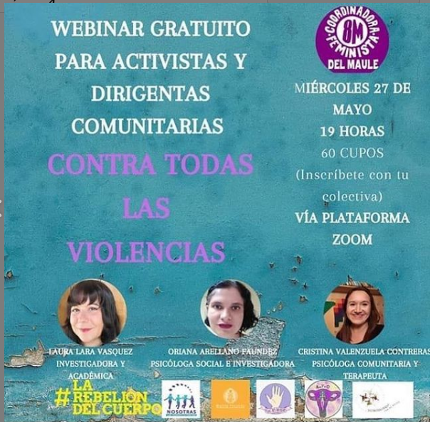
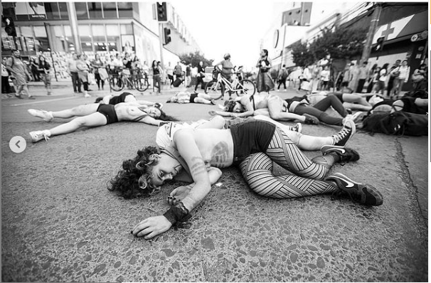
---
### Describir y distinguir demandas más reivindicativas de espacios sin relación con lo contencioso o con lo político mas prefigurativo
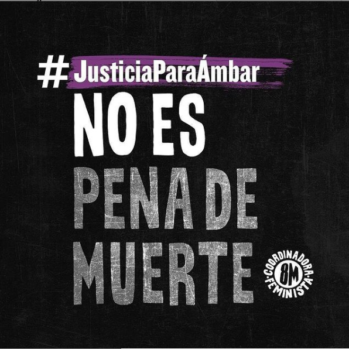
#### (lo contencioso; demanda al Estado, a alguna autoridad, privados, etc), (prefigurativo, transformación desde lo cotidiano, etc.).

---
### Tipo de organización interna.
#### Asamblearismo. Trabajo por comisiones.

---
### Describir los temas / imágenes- iconos / conceptos mas habitualmente presentes en sus publicaciones. Describir cambios/ transformaciones en los contenidos desde Octubre.

**Iconos:**

**Banderas:**
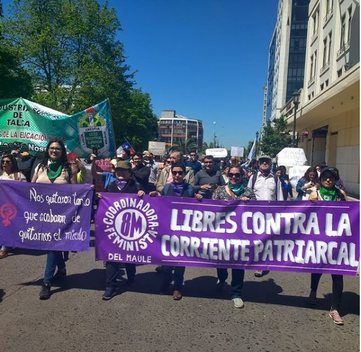

**Diseño estético:**
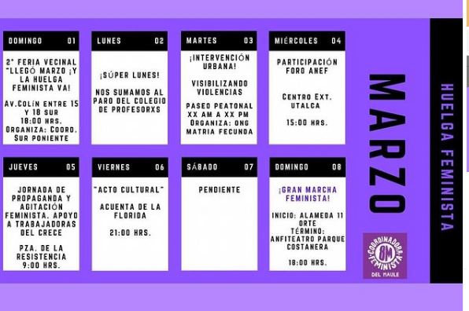
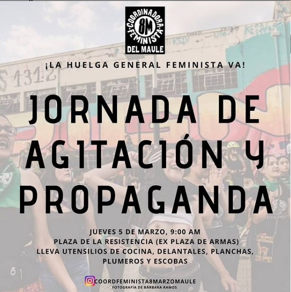

> Párrafo tipo cita 

---
### Percepciones que se tiene del Estado
#### (Aparato burocrático)
> resumen de lo encontrado

| Declaraciones | infografía | 
|---|---|
|Anotar los comunicados | 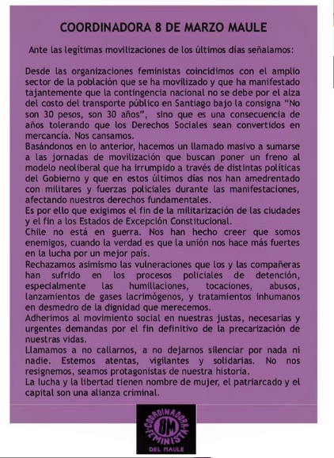 |

---
### Percepciones que se tiene de las Fuerzas de Orden
#### (Aparato represivo)
> resumen de lo encontrado

| Declaraciones | infografía | 
|---|---|
|Anotar los comunicados | 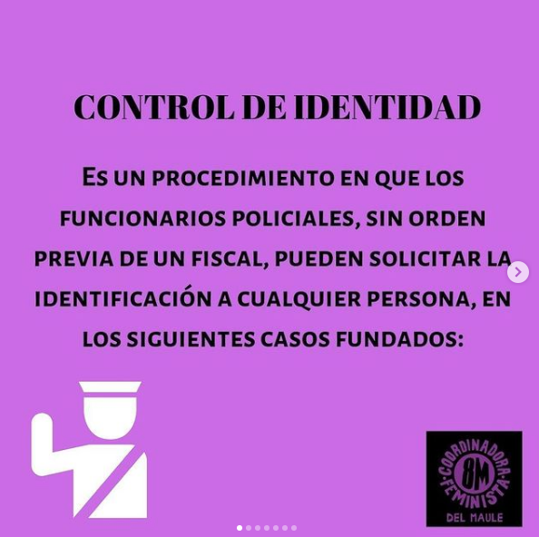
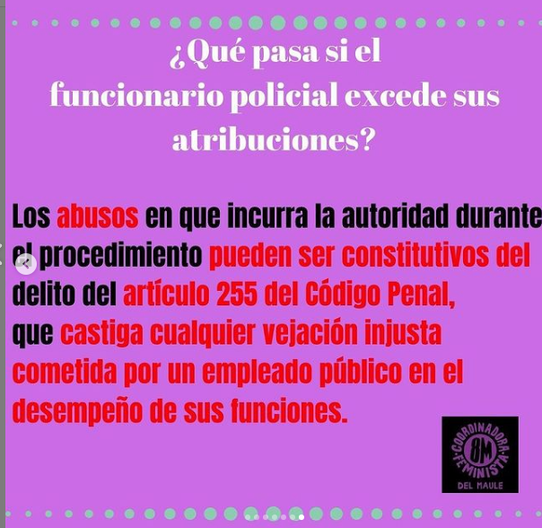 
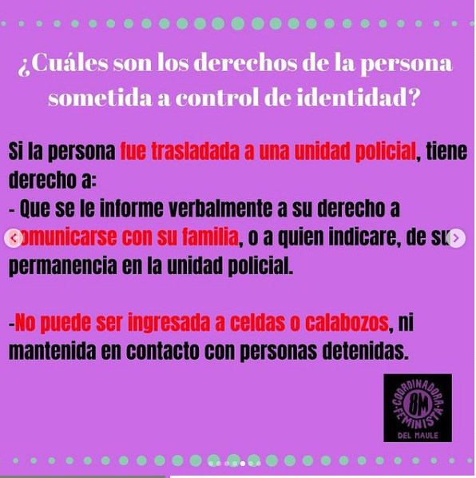|

---
### Incorporar aca notas, citas textuales, links, etc. extra a los ya incorporados, que sean de interés para comprender tanto la forma como los contenidos asociados a la organización.
Link video [Instagram](https://www.instagram.com/p/B9CMtXspiVP/)
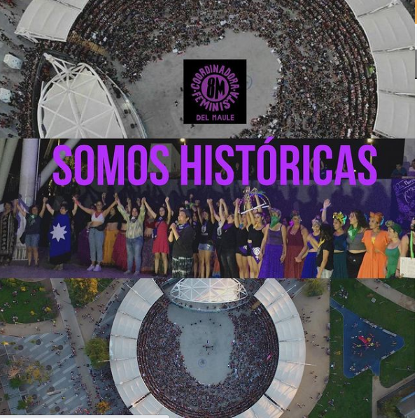