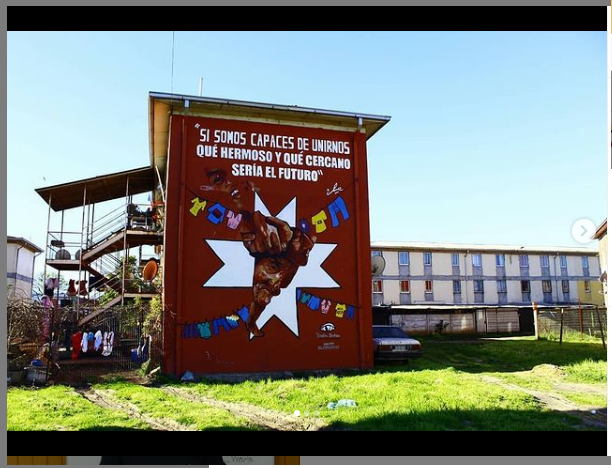
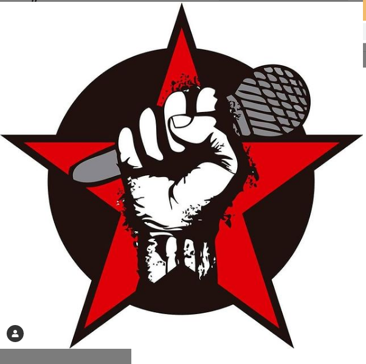
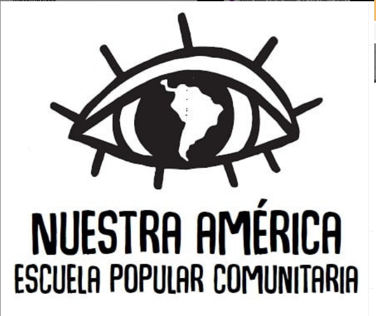
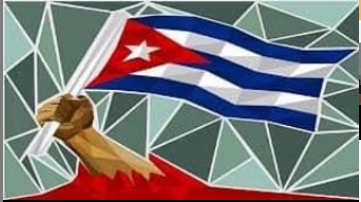
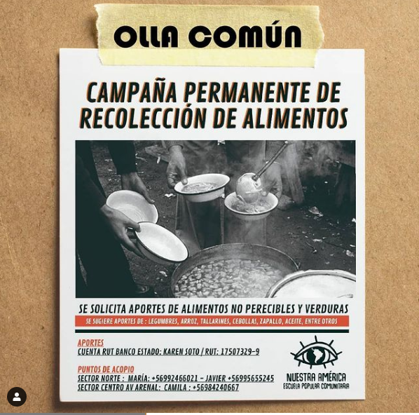
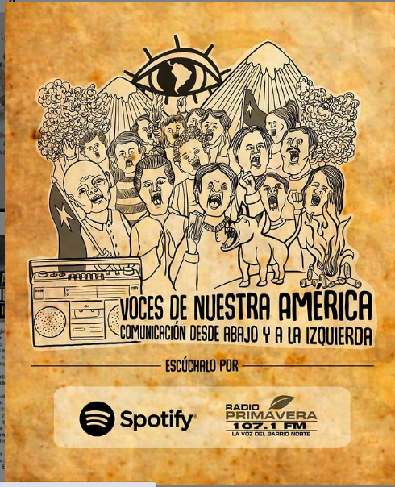
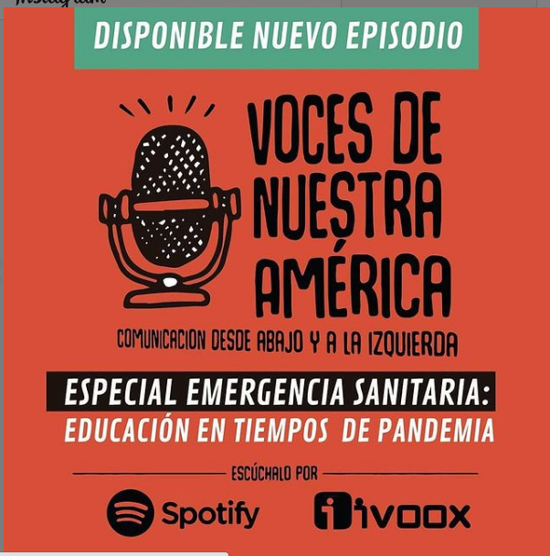
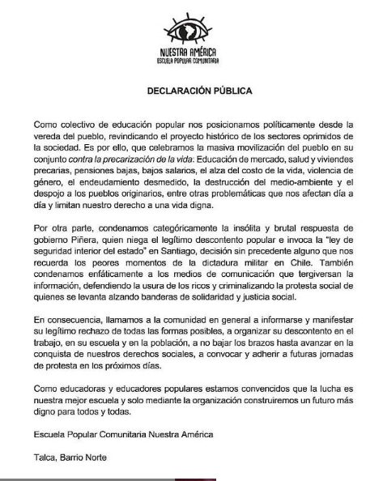
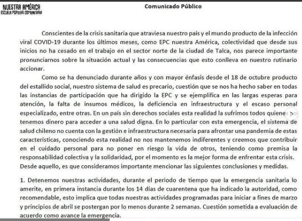
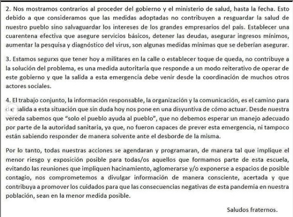

#### FOLIO: TAL12
# EPC nuetras Americas

[instagram](https://www.instagram.com/epc_nuestraamerica/)
[facebook](https://www.facebook.com/nuestraamericaepc)
[twitter]()
<epc.nuestraamerica@gmail.com>
---

### Representantes
#### Gabriel Peñaloza Telefono: 96655245

---
### Interacciones frecuentes
#### Vivas nos queremos Talca, Talca resiste, Coordinadora feminista 8M, revolución séptima, olla común Padre Hurtado. 

### Redes sociales
#### ¿Para qué se utiliza la red social?
| Instagram | Facebook | Twitter | Otra 
|---|---|---|---|
|Difusión de información y actividades. Mural de fotografías para registrar las actividades concretadas|Difusión de información y actividades. Mural de fotografías para registrar las actividades concretadas|0| 0|

### **Instagram**
| seguidores | seguidos | publicaciones | hashtag 
|---|---|---|---|
|1169|804|148| 0

---

* **Actividad:** Continua. En el periodo de pandemia trabajo con la olla común padre hurtado gestionando la olla junto a la junta de vecinos   
* Primera Publicación IG 14/09/2019

---
### Frecuencia de publicación.

Publicaciones: Semanales

Actividades: Semanales como EPC y diarias en la  olla común.

---
### Ubicación
* Sector de la comununa/ciudad: Sector Las Americas. 

---
### Describir temas de interés y/o trabajo
Organización territorial interesada en la auto educación popular, actividades solidarias y comunicación. Abordan temáticas de contingencia nacional como conflicto mapuche, violencia policial, crisis socio sanitaria entre otros.
---
### Describir la imagen ideal por la cual se trabaja.
#### "Por una educación que nos enseñe a pensar y no obedecer" "Existirá espacio para cuidado de niñas/os para que no existan excusas ¡Por un feminismo popular!" "Solo el pueblo ayuda al pueblo" 

---
### ¿Que se hace?
#### 
- Impulsores de una escuela popular para la obtención de 4to medio laboral.
- Activadas solidarias como acopio de ropa para niños y rifas a beneficios (junto a otras organizaciones como revolucion septima o Junta de vecinos padre hurtado). 
- Medio de comunicación: podcast subidos a Spotify. 
- Conversatorios de educación popular y encuentros de mujeres.
- Colaboración en olla común Padre Hurtado.  

---
### Describir y distinguir demandas más reivindicativas de espacios sin relación con lo contencioso o con lo político mas prefigurativo
#### Transformacion cotidiana de vivir en la poblacion y comunidad. 

---
### Tipo de organización interna.
#### Trabajos por comisiones

---
### Describir los temas / imágenes- iconos / conceptos mas habitualmente presentes en sus publicaciones. Describir cambios/ transformaciones en los contenidos desde Octubre.

**Iconos:** 

**Banderas:**

**Diseño estético:**

>  Resaltan la geografia de Latinoamitica. Utilian de fondo ojos y la flor del canelo. Colores a destacar son rojo y negro

---
### Percepciones que se tiene del Estado
#### (Aparato burocrático)
> resumen de lo encontrado

| Declaraciones | infografía | 
|---|---|
|Anotar los comunicados | 

 
|

---
### Percepciones que se tiene de las Fuerzas de Orden
#### (Aparato represivo)
> resumen de lo encontrado

| Declaraciones | infografía | 
|---|---|
|Anotar los comunicados |  |

---
### Incorporar aca notas, citas textuales, links, etc. extra a los ya incorporados, que sean de interés para comprender tanto la forma como los contenidos asociados a la organización.
