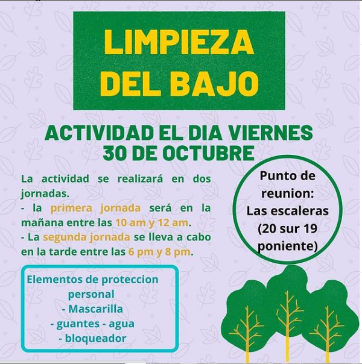
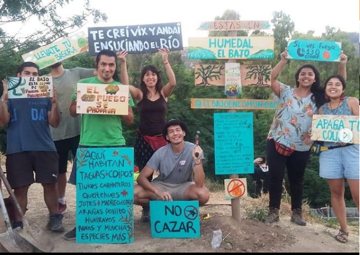
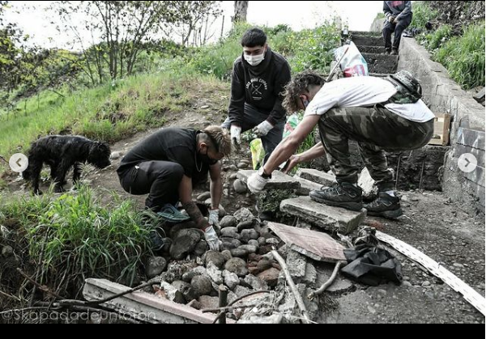
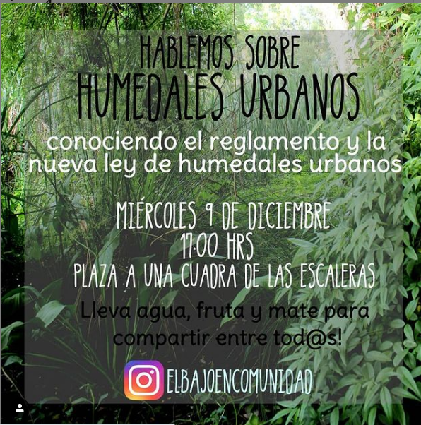
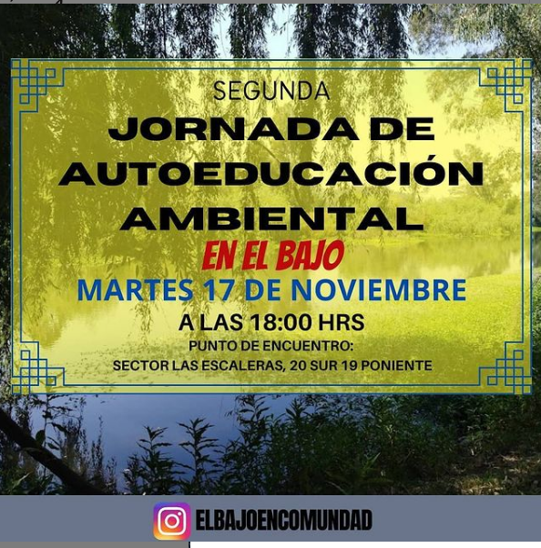

#### FOLIO: TAL18
# El bajo comunidad

[instagram](https://www.instagram.com/elbajoencomunidad/)
[facebook]()
[twitter]()
<https://elbajoencomunidad.foroactivo.com/>
---

### Representantes
#### (Nombres o emails de voceros o representantes).

---
### Interacciones frecuentes
#### No se visualizan vinculaciones con otras organizaciones

### Redes sociales
#### ¿Para qué se utiliza la red social?
| Instagram | Facebook | Twitter | Otra 
|---|---|---|---|
|Difusión de información y actividades. Mural de fotografías para registrar las actividades concretadas|0|0| 0|

### **Instagram**
| seguidores | seguidos | publicaciones | hashtag 
|---|---|---|---|
|2528|1272|17| #reglamentodehumedalesahora
#humedaleschile

---

* **Actividad:**   Continua 

* Primera Publicación IG 23 DE SEPTIEMBRE 2020

---
### Frecuencia de publicación.

Publicaciones: Semanales

Actividades: de 3 a 4 mensuales. 

---
### Ubicación
* Sector de la comununa/ciudad: Sector sur poniente.

---
### Describir temas de interés y/o trabajo
Organización territorial interesada en la educación y la apropiación del espacio publico.

---
### Describir la imagen ideal por la cual se trabaja.
#### La organización vela por un medio ambiente libre de contaminación.

---
### ¿Que se hace?
Actividades socio ambientales educativas como:
- limpieza de humedal y
- jornadas de autoeducación ambiental sobre humedales, biodiversidad y emergencia climática
#### 

---
### Describir y distinguir demandas más reivindicativas de espacios sin relación con lo contencioso o con lo político mas prefigurativo
#### (lo contencioso; demanda al Estado, a alguna autoridad, privados, etc), (prefigurativo, transformación desde lo cotidiano, etc.).

---
### Tipo de organización interna.
####Horizontalidad, no entrega mayor información

---
### Describir los temas / imágenes- iconos / conceptos mas habitualmente presentes en sus publicaciones. Describir cambios/ transformaciones en los contenidos desde Octubre.

**Iconos:**

**Banderas:**

**Diseño estético:**

> 
El diseño de las publicaciones varia, no tienen una continuidad. Los arboles son su principale imgen central en sus publicaciones. 

---
### Percepciones que se tiene del Estado
#### (Aparato burocrático)
>No se presenta

| Declaraciones | infografía | 
|---|---|
|Anotar los comunicados |  |

---
### Percepciones que se tiene de las Fuerzas de Orden
#### (Aparato represivo)
> No se presenta. 

| Declaraciones | infografía | 
|---|---|
|Anotar los comunicados |  |

---
### Noticia TVN Link [Instagram](https://www.instagram.com/p/CFyOYL7jK2k/)
