#### FOLIO: TAL14 
# Red de Feministas del Maule.

[instagram](https://www.instagram.com/femmaule_/)
[facebook](https://www.facebook.com/FemMaule-104604064393691)
[twitter]()
<feministasdelmaule@gmail.com>
---

### Representantes
#### (Nombres o emails de voceros o representantes).

---
### Interacciones frecuentes
#### Colectivo Hijas del trueno, Colectivo feminista Talca resiste, Asamblea diversidad territorial

### Redes sociales
#### ¿Para qué se utiliza la red social?
| Instagram | Facebook | Twitter | Otra 
|---|---|---|---|
|Difusión de información y actividades. Mural de fotografías para registrar las actividades concretadas|Difusión de información y actividades|0| 0|

### **Instagram**
| seguidores | seguidos | publicaciones | hashtag 
|---|---|---|---|
|482|343|83| #FeministasdelMauleporelapruebo #apruebo #cc #educacionsexualintegral 

---

* **Actividad:**   Continua

* Primera Publicación IG 28/09/2020

---
### Frecuencia de publicación.

Publicaciones: Diarias

Actividades: actividades 1 vez por semana aproximadamente 

---
### Ubicación
* Sector de la comununa/ciudad: Talca en general.

---
### Describir temas de interés y/o trabajo
#### Organización territorial, realizas reuniones a nivel regional, interesada en el feminismo, proceso constituyente, educación sexual entre otros. Genera contra información
---
### Describir la imagen ideal por la cual se trabaja.
#### Destacan la "abolición de una estructura patriarcal y capitalista que produce y reproduce relaciones de poder desiguales entre hombres" Consignas: "Nunca más sin Nosotras” y “Por una Constitución Feminista”

---
### ¿Que se hace?
#### 
- Conversatorios online, 
- reuniones online, 
- pega de volantes informativos en paredes publicas.
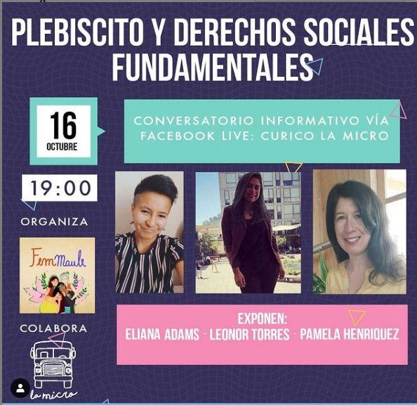

---
### Describir y distinguir demandas más reivindicativas de espacios sin relación con lo contencioso o con lo político mas prefigurativo
#### Dirigida a mujeres, disidencias y colectivos de la región del Maule. Emplaza a la institución de carabineros y autoridades de gobierno/ Red y union feminista y disidentes 
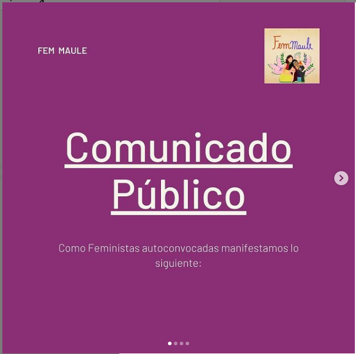
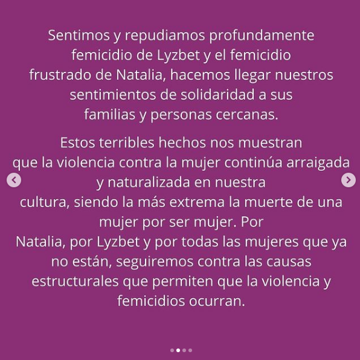
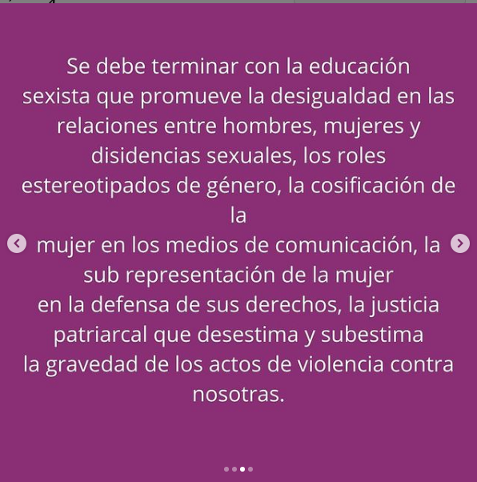
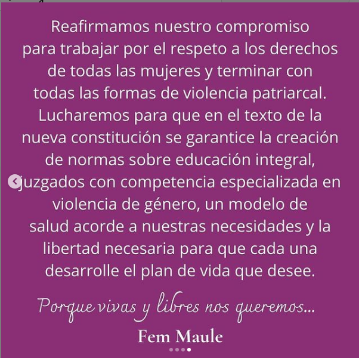

---
### Tipo de organización interna.
#### Asambleísmo, trabajo por comisiones

---
### Describir los temas / imágenes- iconos / conceptos mas habitualmente presentes en sus publicaciones. Describir cambios/ transformaciones en los contenidos desde Octubre.

**Iconos:**
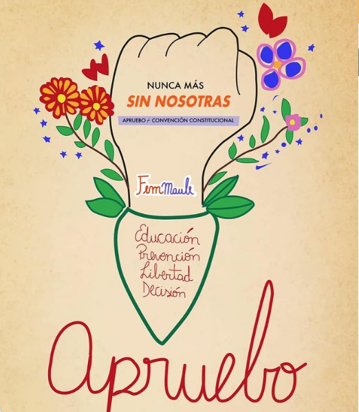

**Banderas:**

**Diseño estético:**
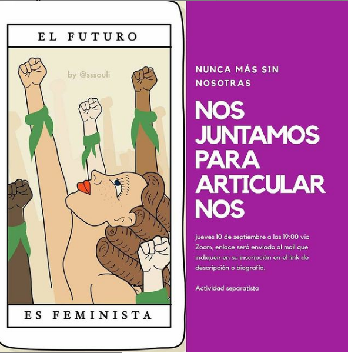
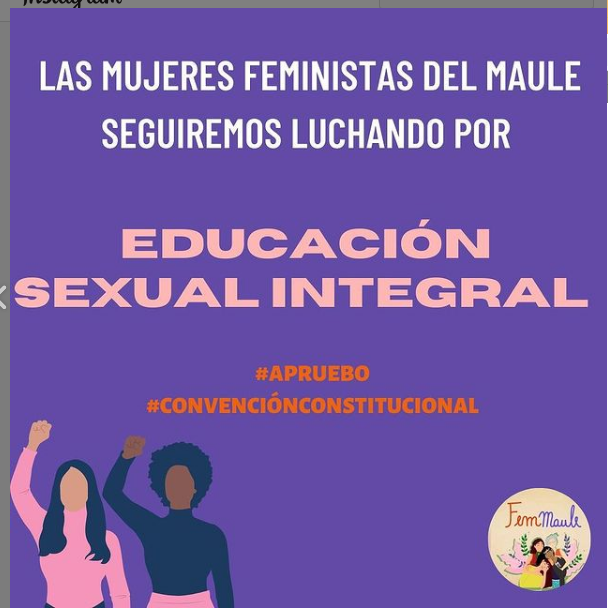

> Párrafo tipo cita 

---
### Percepciones que se tiene del Estado
#### (Aparato burocrático)
> Estado idolente. 

| Declaraciones | infografía | 
|---|---|
|Anotar los comunicados |  |

---
### Percepciones que se tiene de las Fuerzas de Orden
#### (Aparato represivo)
> repudio al actuar de carabineros de chile

| Declaraciones | infografía | 
|---|---|
|Anotar los comunicados |  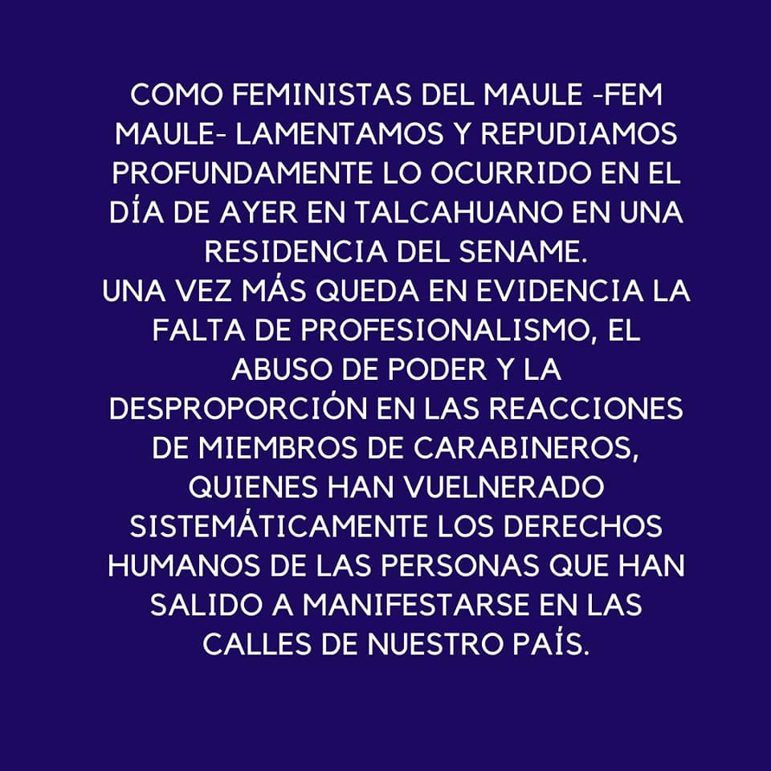 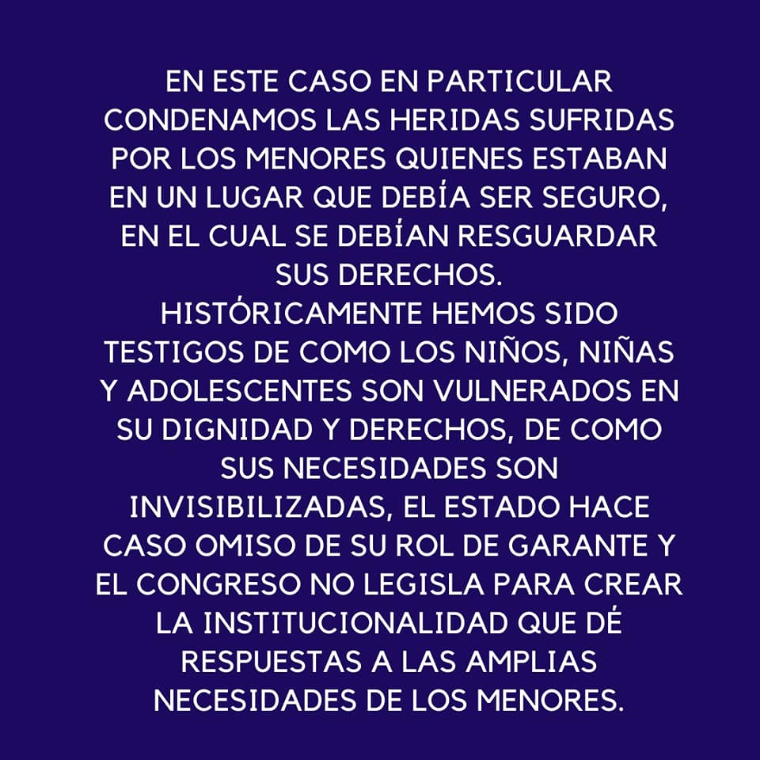 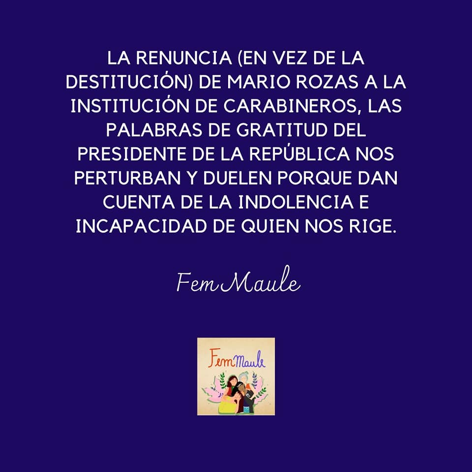|

---
### Incorporar aca notas, citas textuales, links, etc. extra a los ya incorporados, que sean de interés para comprender tanto la forma como los contenidos asociados a la organización.
