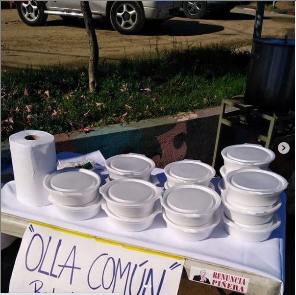
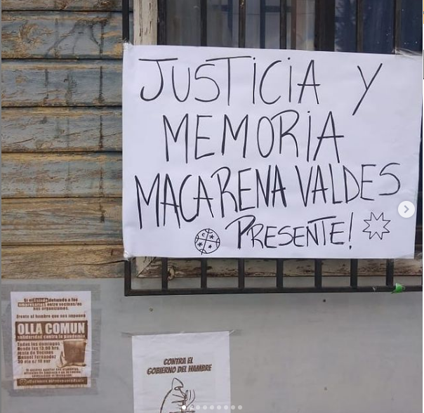
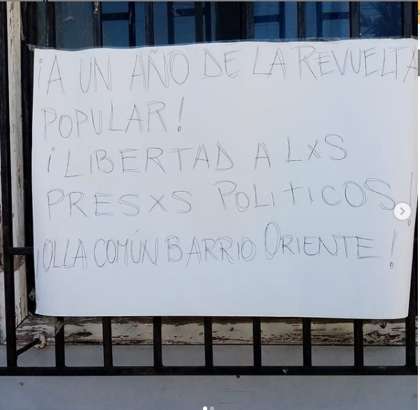

#### TAL13
# Olla común barrio oriente 

[instagram](https://www.instagram.com/ollacomun.barrio.oriente/)
[facebook]()
[twitter]()
<correo@correo.cl>
---

### Representantes
#### No se identifican. 

---
### Interacciones frecuentes
#### Olla común Padre Hurtado, Colectivo arriba las que luchan, Olla itinerante, Talca resiste

### Redes sociales
#### ¿Para qué se utiliza la red social?
| Instagram | Facebook | Twitter | Otra 
|---|---|---|---|
|Difusión de información y actividades. Mural de fotografías para registrar las actividades concretadas|0|0| 0|

### **Instagram**
| seguidores | seguidos | publicaciones | hashtag 
|---|---|---|---|
|347|98|21| #justiciaparamacarenavaldes #wallmapulibre #hastaquerenunciepiñera #soloelpuebloayudaalpueblo #ollacomun #renunciapiñera #ollacomun #organizate #apoyomutuo #solidaridad

---

* **Actividad:**   Continua desde Junio 2020

* Primera Publicación IG 24/06/2020

---
### Frecuencia de publicación.

Publicaciones: Semanales, de 2 a 3 de junio a agosto. 1 semanal desde septiembre

Actividades: Todos los domingos. 

---
### Ubicación
* Sector de la comununa/ciudad:Barrio Oriente

---
### Describir temas de interés y/o trabajo
#### Se enfoca en la ayuda alimentaria para vecinos afectados por la crisis socio-sanitaria y educación popular.

---
### Describir la imagen ideal por la cual se trabaja.
#### "El pueblo ayuda al pueblo" "Organización y autogestión" "Entre todos nos educamos entre todos nos cuidamos" Nueva constitución / Justicia para Macarena Valdes 

---
### ¿Que se hace?
#### Entrega de alimentos y boletines informativos.

---
### Describir y distinguir demandas más reivindicativas de espacios sin relación con lo contencioso o con lo político mas prefigurativo

#### (lo contencioso; demanda al Estado, a alguna autoridad, privados, etc), (prefigurativo, transformación desde lo cotidiano, etc.).

---
### Tipo de organización interna.
#### Horizontal, no entrega mas información.

---
### Describir los temas / imágenes- iconos / conceptos mas habitualmente presentes en sus publicaciones. Describir cambios/ transformaciones en los contenidos desde Octubre.

**Iconos:**

**Banderas:**

**Diseño estético:**

> No muestra una estica e iconografia propia. 

---
### Percepciones que se tiene del Estado
#### (Aparato burocrático)
> resumen de lo encontrado

| Declaraciones | infografía | 
|---|---|
|Anotar los comunicados |  |

---
### Percepciones que se tiene de las Fuerzas de Orden
#### (Aparato represivo)
> resumen de lo encontrado

| Declaraciones | infografía | 
|---|---|
|Anotar los comunicados |  |

---
### Incorporar aca notas, citas textuales, links, etc. extra a los ya incorporados, que sean de interés para comprender tanto la forma como los contenidos asociados a la organización.
