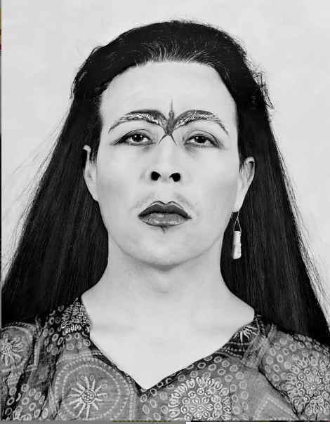

#### FOLIO: Tal15
# Olla itinirante colectiva COVID

[instagram](https://www.instagram.com/ollaitinerantecolectiva.covid/)
[facebook](https://www.facebook.com/laollaitinerante.colectiva.9)

<laollaitinerante@gmail.coml>
---

### Representantes
#### (Nombres o emails de voceros o representantes).

---
### Interacciones frecuentes
#### EPC nuestras Americas, Colectiva arriba las que luchan, Talca Resiste, 

### Redes sociales
#### ¿Para qué se utiliza la red social?
| Instagram | Facebook | Twitter | Otra 
|---|---|---|---|
|Difusión de  información solidaria, central de coordinación, difusión de consignas, difusión material educativo |Difusión de  información solidaria, central de coordinación, difusión de consignas, difusión material educativo|0| 0|

### **Instagram**
| seguidores | seguidos | publicaciones | hashtag 
|---|---|---|---|
|726|156|30| #elmercuriomiente #noestássola .

---

* **Actividad:** Discontinua. 

* Primera Publicación IG: 7 de noviembre 

---
### Frecuencia de publicación.

Publicaciones: fecuancias mensual, semana

Actividades:

---
### Ubicación
* Sector de la comununa/ciudad: Sector sur poniente 

---
### Describir temas de interés y/o trabajo
#### Organización territorial, interesada en la apropiación del espacio publico, comunicación vecinal, autoeducación y feminismo.
---
### Describir la imagen ideal por la cual se trabaja.
#### "Somos mujeres feministas.
Nuestra convicción es transformar a través de la organización comunitaria" "HASTA QUE LA DIGNIDAD SE HAGA COSTUMBRE"/ "PORQUE SOLO EL PUEBLO AYUDA AL PUEBLO"/ "La cultura de la violación debe ser erradicada"

---
### ¿Que se hace?
#### 
- Gestiona reuniones territoriales como onces vecinales. 
- Genera catastro y mapas de organizaciones a través de mapeos participativos vecinales. 
- Genera contenido educativo feminista.

---
### Describir y distinguir demandas más reivindicativas de espacios sin relación con lo contencioso o con lo político mas prefigurativo
#### Se dirige hacia los vecinos. transformación cotidiana de vivir en el barrio. El perdido de pandemia se dirige a los vecinos y organizaciones solidarias para fomentar redes. 

---
### Tipo de organización interna.
#### Asambleísmo y Horizontalidad.

---
### Describir los temas / imágenes- iconos / conceptos mas habitualmente presentes en sus publicaciones. Describir cambios/ transformaciones en los contenidos desde Octubre.

**Iconos:** 

**Banderas:**

**Diseño estético:**

>  La organización tiene un logo definido que representa el cacerolazo, utilizan el violeta con frecuencia. 

---
### Percepciones que se tiene del Estado
#### (Aparato burocrático)
> No queda claro 

| Declaraciones | infografía | 
|---|---|
|Anotar los comunicados |  |

---
### Percepciones que se tiene de las Fuerzas de Orden
#### (Aparato represivo)
> resumen de lo encontrado

| Declaraciones | infografía | 
|---|---|
|Anotar los comunicados |  |

---
### Incorporar aca notas, citas textuales, links, etc. extra a los ya incorporados, que sean de interés para comprender tanto la forma como los contenidos asociados a la organización.
