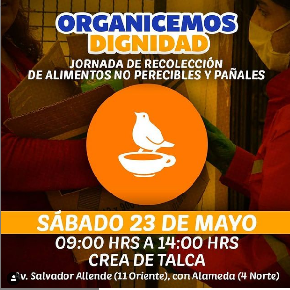
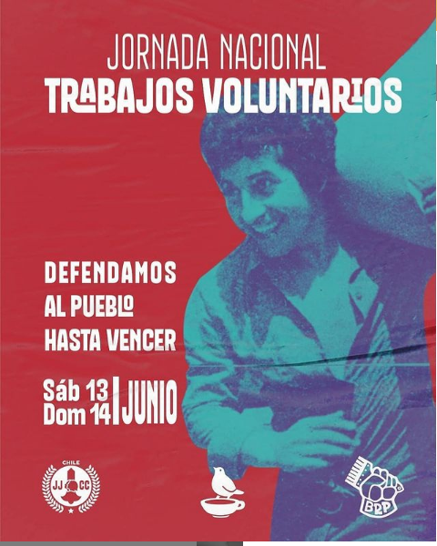

#### FOLIO: TAL23
# Organicemos Dignidad Talca. 

[instagram](https://www.instagram.com/organicemosdignidad.talca/)
[facebook](https://www.facebook.com/organicemosdignidad.talca)

<talca.orgdignidad@gmail.com>
---

### Representantes
#### FRANCISCA ROJAS BRAVO
---
### Interacciones frecuentes
#### Talca resiste.

### Redes sociales
#### ¿Para qué se utiliza la red social?
| Instagram | Facebook | Twitter | Otra 
|---|---|---|---|
|Difusión de información y actividades. Mural de fotografías para registrar las actividades concretadas||| 0|

### **Instagram**
| seguidores | seguidos | publicaciones | hashtag 
|---|---|---|---|
|272|227|18| #SoloElPuebloAyudaAlPueblo #nuevaconstitucion
#organicemosdignidad

---

* **Actividad:**  Inactiva 

* Primera Publicación IG: 22/05/2020

---
### Frecuencia de publicación.

Publicaciones: Publicaciones semanales hasta el mes de julio

Actividades: semanales hasta Julio de 2020 

---
### Ubicación
* Sector de la comununa/ciudad: Lider 9 oriente/ CREA 

---
### Describir temas de interés y/o trabajo
#### Red de voluntarios de nivel nacional que se enfoca en la ayuda alimentaria para vecinos afectados por la crisis socio-sanitaria y educación popular.
---
### Describir la imagen ideal por la cual se trabaja.
#### ¡DEFENDER EL PUEBLO HASTA VENCER ! "Solo el pueblo ayuda al pueblo" 

---
### ¿Que se hace?
#### 
- Campañas solidarias de alimentos y útiles de aseo.

---
### Describir y distinguir demandas más reivindicativas de espacios sin relación con lo contencioso o con lo político mas prefigurativo
#### (lo contencioso; demanda al Estado, a alguna autoridad, privados, etc), (prefigurativo, transformación desde lo cotidiano, etc.).

---
### Tipo de organización interna.
#### Asambleísmo. No de distingue su estructura organizativa.

---
### Describir los temas / imágenes- iconos / conceptos mas habitualmente presentes en sus publicaciones. Describir cambios/ transformaciones en los contenidos desde Octubre.

**Iconos:**

**Banderas:**

**Diseño estético:**

 

> El diseño estético proviene de las bases centrales ya que es una organización que se gestiono en distintas ciudades del país. 

---
### Percepciones que se tiene del Estado
#### (Aparato burocrático)
>  No se identifica

| Declaraciones | infografía | 
|---|---|
|Anotar los comunicados |  |

---
### Percepciones que se tiene de las Fuerzas de Orden
#### (Aparato represivo)
> No se identifica

| Declaraciones | infografía | 
|---|---|
|Anotar los comunicados |  |

---
### Link Video [Instagram](https://www.instagram.com/p/CCJiXVIpX4L/)