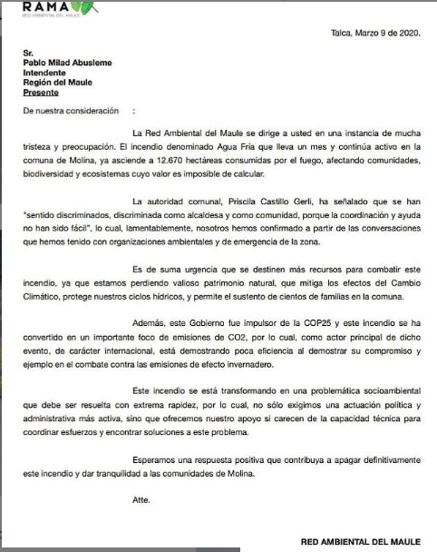

#### FOLIO: TAL24
# Red ambiental del Maule (RAMA)

[instagram](https://www.instagram.com/redambientaldelmaule/)
[facebook](https://www.facebook.com/redambientaldelmaule)
[twitter](https://twitter.com/Redadelmaule)
[Blog]((https://redambientalmaule.home.blog/))
<redambientalmaule@gmail.com>
---

### Representantes
#### No se identifican

---
### Interacciones frecuentes
#### Defensa y Desarrollo Zona Sur, Viernes por El Futuro Talca, Madriguera, Talca resiste, revolución séptima, Talca lucha, Sustentable Talca, MAT Maule.
### Redes sociales
#### ¿Para qué se utiliza la red social?
| Instagram | Facebook | Twitter | Blog 
|---|---|---|---|
|Difusión de información y actividades. Mural de fotografías para registrar las actividades concretadas|Difusión de información y actividades. Mural de fotografías para registrar las actividades concretadas|0| Subir y/o compartir información producida por la organización. (Noticias y libros)  |

### **Instagram**
| seguidores | seguidos | publicaciones | hashtag 
|---|---|---|---|
|1597|359|90| #molinasinavicola #noavicolaenmolina #adioscoexca #medioambiente
#naturaleza
#maule
#wallmapu
#rama
#talcagram
#chiledesperto
#chilito #ElAguaNoSeVende #ElAguaSeDefiende #NoEsSeguíaEsSaqueo #NosRobanElAgua 

---

* **Actividad:** Temporalmente inactiva.  

* Primera Publicación IG: 11 DE NOVIEMBRE DE 2019

---
### Frecuencia de publicación.

Publicaciones: De 2 a 3 por semana hasta Marzo. Solo 4 en periodo de pandemia

Actividades: cada una o dos semanas aprox. 

---
### Ubicación
* Sector de la comununa/ciudad: Plaza de Armas, Plaza las Heras/ Talca y región del Maule en general. 

---
### Describir temas de interés y/o trabajo
#### Organización territorial enfocada en articular organizaciones medio ambientales. Sus intereses recaen en temáticas de medio ambiente, soberania alimentaria, auto educación, apropiación del espacio publico y economía local. 

---
### Describir la imagen ideal por la cual se trabaja.
#### "En RAMA, todos juntos trabajamos para salvar el planeta y para crear una sociedad que viva en armonía con la naturaleza."

---
### ¿Que se hace?
#### 
- Coordina reuniones regionales de organizaciones medioambientales, 
- genera contenido de auto educación a través de sus rrss. 
- Actividades de economía local como feria de truques. 
- Convoca a marchas.

---
### Describir y distinguir demandas más reivindicativas de espacios sin relación con lo contencioso o con lo político mas prefigurativo
#### 
- No mas TPP
 - No a las mineras en la region del Meule. 

---
### Tipo de organización interna.
#### Asambleísmo y horizontalidad. Trabajo por comisiones

---
### Describir los temas / imágenes- iconos / conceptos mas habitualmente presentes en sus publicaciones. Describir cambios/ transformaciones en los contenidos desde Octubre.

**Iconos:**

**Banderas:**

**Diseño estético:**

>  La organización mantiene un diseño estético

---
### Percepciones que se tiene del Estado
#### (Aparato burocrático)
> Desprotección medioambiental legada desde la dictadura. 

| Declaraciones | infografía | 
|---|---|
|    |  |

---
### Percepciones que se tiene de las Fuerzas de Orden
#### (Aparato represivo)
>No se identifica.

| Declaraciones | infografía | 
|---|---|
|Anotar los comunicados |  |

---
###
  
 
 

