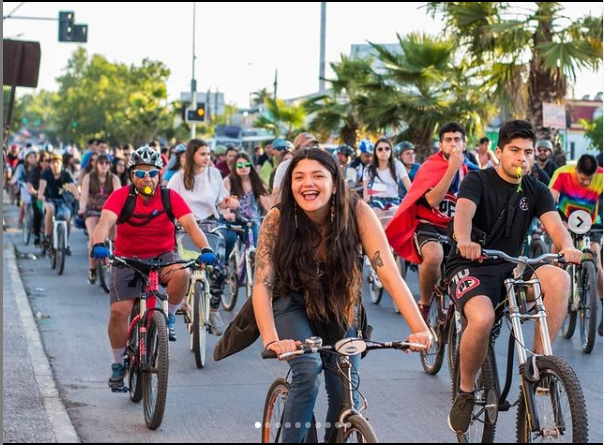
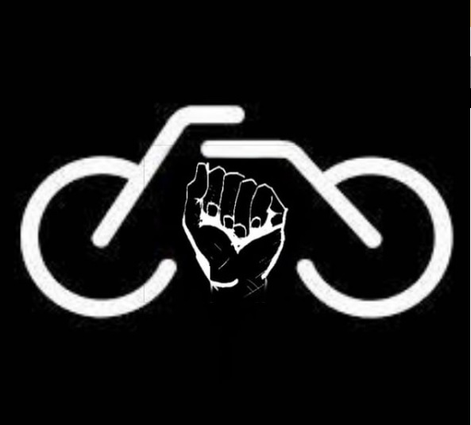
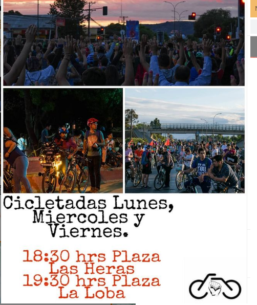
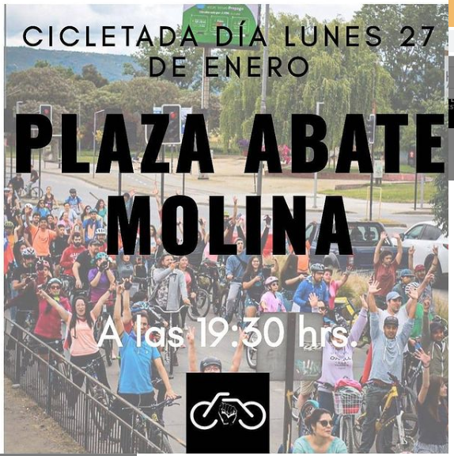
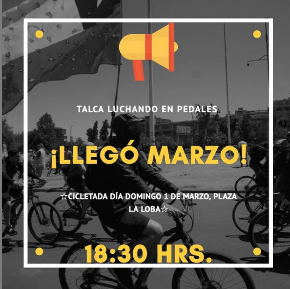

#### FOLIO: TAL21
# Revolucion ciclista Talca

[instagram](https://www.instagram.com/talcaluchandoenpedales/)
[facebook](https://www.facebook.com/Talcaluchandoenpedales)

<talcaluchandoenpedales@gmail.com>
---

### Representantes
#### Grupo de Whatsapp:  chat.whatsapp.com/EezZYl9ykur5VMxhYukCoB

---
### Interacciones frecuentes
#### Talca resiste, revolución séptima, coordinadora sur poniente, Talca pedalea

### Redes sociales
#### ¿Para qué se utiliza la red social?
| Instagram | Facebook | Twitter | Otra 
|---|---|---|---|
|Difusión de información y actividades. Mural de fotografías para registrar las actividades concretadas|Difusión de información y actividades. Mural de fotografías para registrar las actividades concretadas|0| 0|

### **Instagram**
| seguidores | seguidos | publicaciones | hashtag 
|---|---|---|---|
|1224|1090|58| #talcaluchandoenpedales✊🇨🇱✊ #talcalucha #talcaresiste #elpueblounidojamasseravencido #yoapruebonuevaconstitución #talcabike

---

* **Actividad:**   Discontinua. 

* Primera Publicación IG 24/11/2019

---
### Frecuencia de publicación.

Publicaciones: Semanales de 2 a 3 hasta marzo. Inactiva hasta noviembre del 2020

Actividades: Todos los miercoles y domingos hasta marzo. Se retoma en octubre de forma intermitente. 

---
### Ubicación
* Sector de la comununa/ciudad: Plaa Las Heras, Plaza la loba, Plaza abate Molina/ Talca en general. 

---
### Describir temas de interés y/o trabajo
#### Colectivo de ciclistas interesados en la apropiación del espacio publico, proceso constituyente y la auto educación.
---
### Describir la imagen ideal por la cual se trabaja.
#### "El pueblo unido jamás será vencido, por eso, más unidos que antes" "Pedalear, aprobar, otra forma de luchar"

---
### ¿Que se hace?
#### 
- Cicletadas masivas en distintos sectores de la ciudad de Talca. 
- Actividades solidarias como colecta de dinero para insumos de reparación de bicicletas, 
- capacitaciones de primeros auxilios.

---
### Describir y distinguir demandas más reivindicativas de espacios sin relación con lo contencioso o con lo político mas prefigurativo
#### Se dirige a lo aficionados del ciclismo de la ciudad. Exigen respeto a los ciclistas en la vía publica.  Transformación cotidiana en el uso del espacio publico 

---
### Tipo de organización interna.
#### Asambleísmo. No se identifica estructura organizativa 

---
### Describir los temas / imágenes- iconos / conceptos mas habitualmente presentes en sus publicaciones. Describir cambios/ transformaciones en los contenidos desde Octubre.

**Iconos:**

**Banderas:**

**Diseño estético:**

> Párrafo tipo cita 

---
### Percepciones que se tiene del Estado
#### (Aparato burocrático)
> No se identifica. 

| Declaraciones | infografía | 
|---|---|
|Anotar los comunicados |  |

---
### Percepciones que se tiene de las Fuerzas de Orden
#### (Aparato represivo)
> No se identifica

| Declaraciones | infografía | 
|---|---|
|Anotar los comunicados |  |

---
### Incorporar aca notas, citas textuales, links, etc. extra a los ya incorporados, que sean de interés para comprender tanto la forma como los contenidos asociados a la organización.
