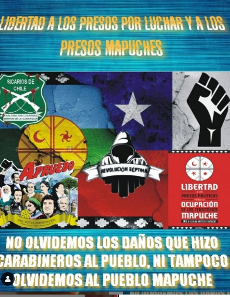
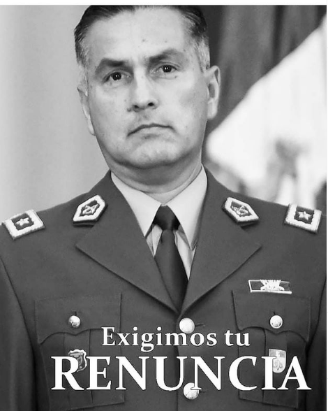

#### FOLIO: TAL5
# Revolucion septima

[instagram](https://www.instagram.com/_revolucion_septima/)
[facebook](https://www.facebook.com/Rseptima/)

---

### Representantes
#### No se identifican 
---
### Interacciones frecuentes
#### Comunidad maulina para liberar el agua, EPC nuestras Américas, Talca lucha, Talca resiste, Resistencia musical, colectivo Hijas del Trueno

### Redes sociales
#### ¿Para qué se utiliza la red social?
| Instagram | Facebook | Twitter | Otra 
|---|---|---|---|
|Difusión de información y actividades. Mural de fotografías para registrar las actividades concretadas|Difusión de información y actividades.|0| 0|

### **Instagram**
| seguidores | seguidos | publicaciones | hashtag 
|---|---|---|---|
|4077|388|640| #apruebo #renunciapiñera #mañalichrenuncia #cuarentenatotal #talca #plazadeladignidad #primeralinea #estallidosocial #nomasdictadura #volveremos #instachile #chile #pacoasesinos #acab #fotografia #paco #protestaschile  #pacosculiaos #antiyuta #terrorismodeestado #latvmiente #ESTONOHATERMINADO #matapacos #chiledesperto #sipoapruebo #enchileseviolanlosddhh #talcagram #instalca #chiledesperto #1312#ambar #justiciaparaambar #chile #chilegram #talca #acab #love #follow #primeralinea #santiago #chilenas #instagram #photooftheday #nature #renunciapiñera #instatalca #talcagram #talcacity

---

* **Actividad:**   Continua

* Primera Publicación IG 26/10/2019

---
### Frecuencia de publicación.

Publicaciones: Diarias en Difusión de fotos y contenido audiovisual. Mensual (a partir de mayo): gestión de actividades

Actividades:Semanales (de 3 4) en periodo de pandemia mensuales

---
### Ubicación
* Sector de la comununa/ciudad: Plaza pentagono / Talca en general

---
### Describir temas de interés y/o trabajo
#### Colectivo talquino que busca la apropiación del espacio publico y el apoyo mutuo. Trabaja con otras organizaciones. Entre sus intereses esta el procesos constituyente, conflicto mapuche, represión de carabineros y la libertad a los presos de la revuelta.
---
### Describir la imagen ideal por la cual se trabaja.
#### "Los que hacen la revolución pacifica imposible, harán inevitable la revolución violenta" "Solo el pueblo ayuda al pueblo" "la desigualdad social es mas violenta que cualquier protesta"

---
### ¿Que se hace?
#### 
- Contra información como difusión de fotos y video de la revuelta popular,
 - Intervenciones: pega de afiches en la vía publica, 
 - Marchas
 - cacerolazos. 
 - Actividades solidarias: acopio de insumos básicos, rifas a beneficios y formateos de computadores a cambio de colaboración de alimentos y útiles de aseos.

---
### Describir y distinguir demandas más reivindicativas de espacios sin relación con lo contencioso o con lo político mas prefigurativo
#### Se dirige a la ciudadanía en general. Emplaza a autoridades por la criminalización de la protesta social. No mas AFP. Si al 10%

---
### Tipo de organización interna.
#### Horizontalidad. No se visualizan con claridad sus estructura organizacional

---
### Describir los temas / imágenes- iconos / conceptos mas habitualmente presentes en sus publicaciones. Describir cambios/ transformaciones en los contenidos desde Octubre.

**Iconos:**

**Banderas:**

**Diseño estético:**

> El material compartido mantiene una línea de diseño. Resaltando la figura del anonimato y la bandera mapuche.

---
### Percepciones que se tiene del Estado
#### (Aparato burocrático)
> No se distigue con claridad. 

| Declaraciones | infografía | 
|---|---|
|Anotar los comunicados |  |

---
### Percepciones que se tiene de las Fuerzas de Orden
#### (Aparato represivo)
> Total repudio contra la institucion de carabineros 

| n el día de ayer en talca, calle 8 ote con 1 norte afuera de falabella, carabineros llegaron al lugar en forma violenta y amenazante donde estaba la marcha, tomando detenidas a 2 personas sin motivos, las personas detenidas fueron liberadas 1 hora más tarde pero la molestia es el hecho, la molestia es por que detienen personas por manifestarse? Por deporte? Por miedo a perder beneficios futuros y que nunca pensaron perderlos? | infografía | 
|---|---|
|Anotar los comunicados | 

 |

---
### Incorporar aca notas, citas textuales, links, etc. extra a los ya incorporados, que sean de interés para comprender tanto la forma como los contenidos asociados a la organización.
