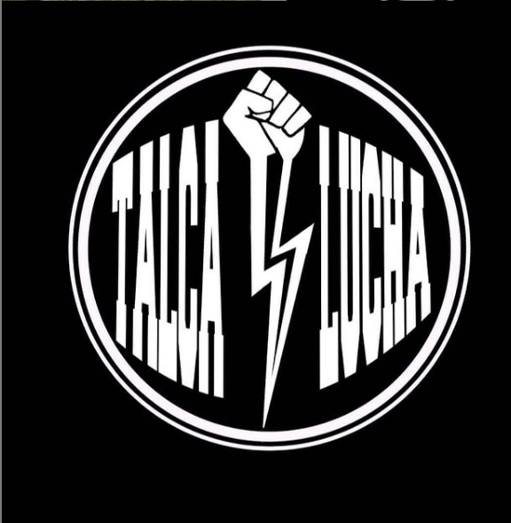
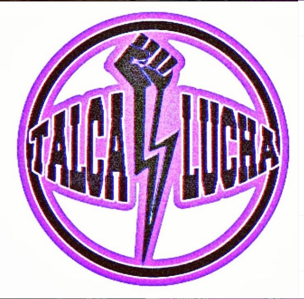
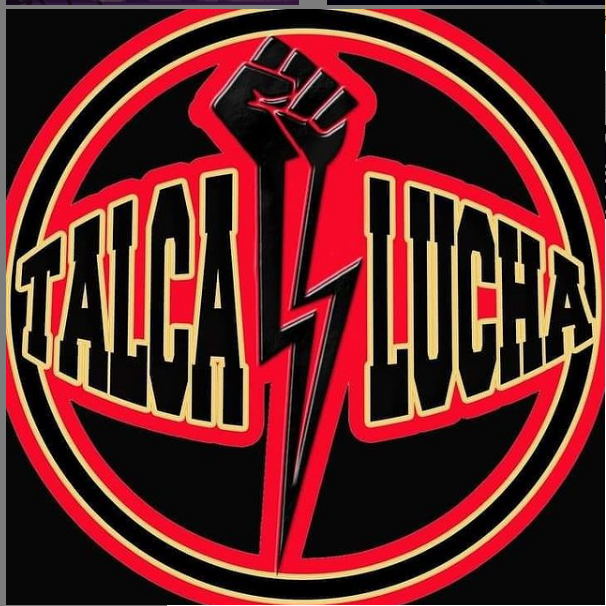
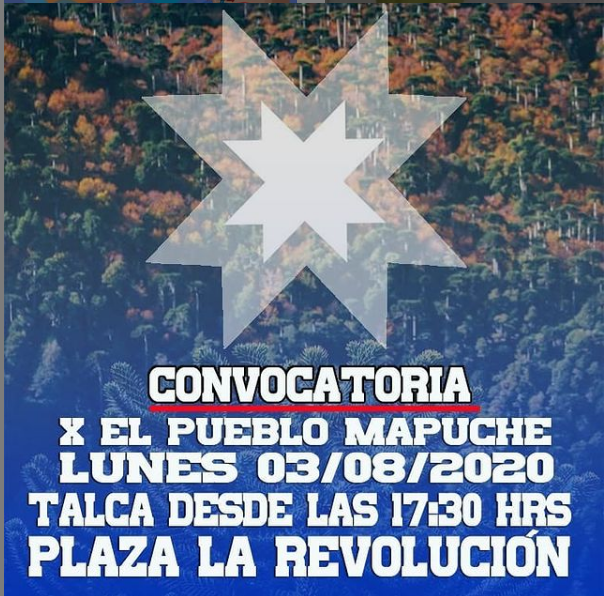
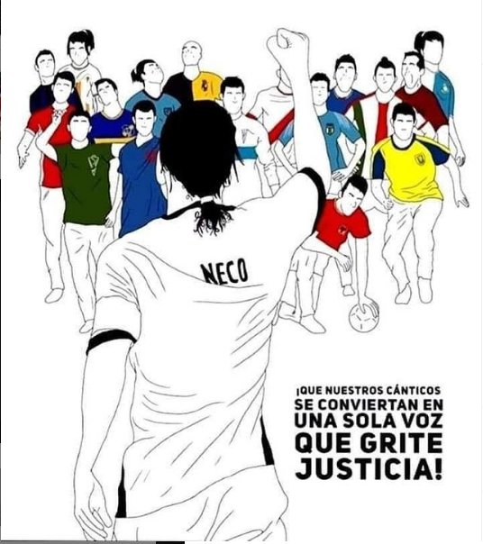
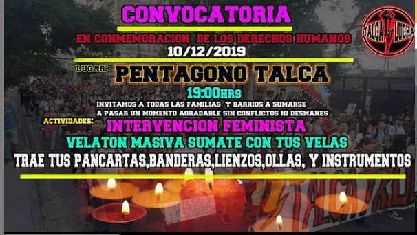
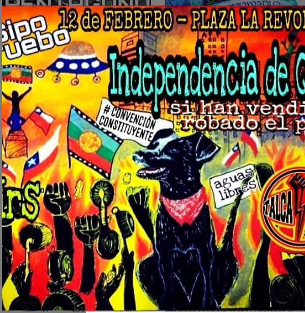
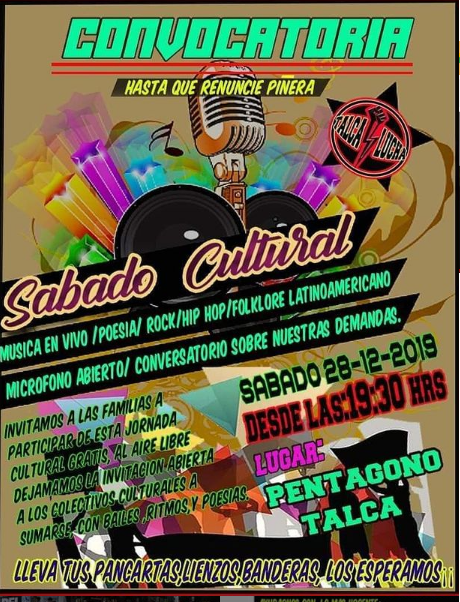
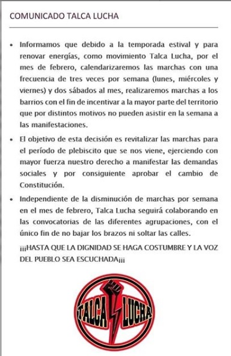

#### FOLIO: Tres letras iniciales de la comuna y nº de organizacion (ejemplo: comuna santiago n6 = SAT6)
# Talca lucha

[instagram](https://www.instagram.com/talca_lucha/)
[facebook]()
[twitter]()
<correo@correo.cl>
---

### Representantes
#### (Nombres o emails de voceros o representantes).

---
### Interacciones frecuentes
#### (listar otras organizaciones que habitualmente)

### Redes sociales
#### ¿Para qué se utiliza la red social?
| Instagram | Facebook | Twitter | Otra 
|---|---|---|---|
|0|0|0| 0|

### **Instagram**
| seguidores | seguidos | publicaciones | hashtag 
|---|---|---|---|
|0|0|0| #sipoapruebo #chiledesperto #chile #hastaqueladignidadsehagacostumbre #talca #instatalca #convencionconstituyente #26abrilYoApruebo+CC #AguanteVALPO
#TalcaLucha #SINJUSTICIANOHAYFUTBOL 
#nomassename #soschile
#chiledesperto #quedateencasa #covid19chile

---

* **Actividad:**   

* Primera Publicación IG

---
### Frecuencia de publicación.

Publicaciones:

Actividades:

---
### Ubicación
* Sector de la comununa/ciudad:

---
### Describir temas de interés y/o trabajo

---
### Describir la imagen ideal por la cual se trabaja.
#### (El horizonte hacia el cual se quiere avanzar.)

---
### ¿Que se hace?
#### (Manifestaciones, marchas, intervenciones, actividades culturales, conversatorios, intercambio de saberes, actividades solidarias o de apoyo mutuo, abastecimiento, contra información, emplazamiento a autoridades etc.)

---
### Describir y distinguir demandas más reivindicativas de espacios sin relación con lo contencioso o con lo político mas prefigurativo
#### (lo contencioso; demanda al Estado, a alguna autoridad, privados, etc), (prefigurativo, transformación desde lo cotidiano, etc.).

---
### Tipo de organización interna.
#### (Vocerías, asambleísmo, horizontalidad, etc.; *se entiende que esta dimensión es más difícil de captar vía análisis de redes sociales, pero quizás se puede vislumbrar a través de roles/cargos*)

---
### Describir los temas / imágenes- iconos / conceptos mas habitualmente presentes en sus publicaciones. Describir cambios/ transformaciones en los contenidos desde Octubre.

**Iconos:**
 

**Banderas:**

**Diseño estético:**

> El logo cambia y adapta sus colores en conmemoración a días especiales 
> 
> 

---
### Percepciones que se tiene del Estado
#### (Aparato burocrático)
> resumen de lo encontrado

| Declaraciones | infografía | 
|---|---|
|Anotar los comunicados |  |

---
### Percepciones que se tiene de las Fuerzas de Orden
#### (Aparato represivo)
> resumen de lo encontrado

| Declaraciones | infografía | 
|---|---|
|Anotar los comunicados | 
[Video Instagram](https://www.instagram.com/p/B74Gq4FJe4F/) |

---
### Saludos Roberto Marquéz: Link video [instagram](8https://www.instagram.com/p/CHPAwYbgJtR/)

