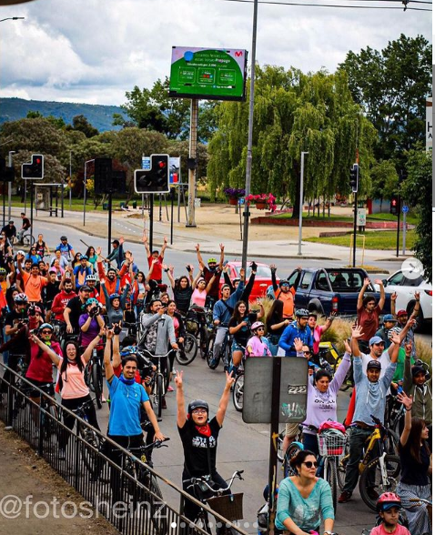
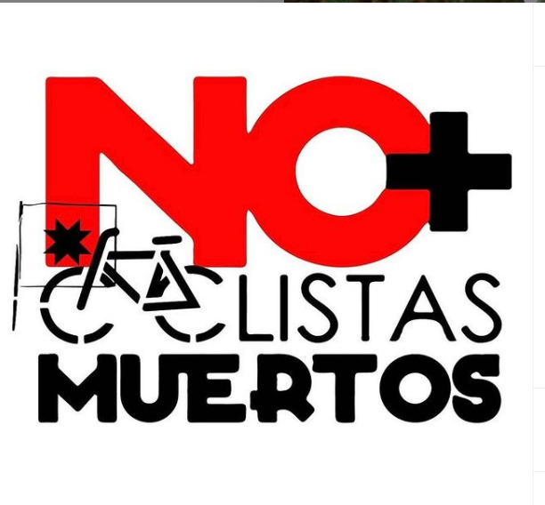
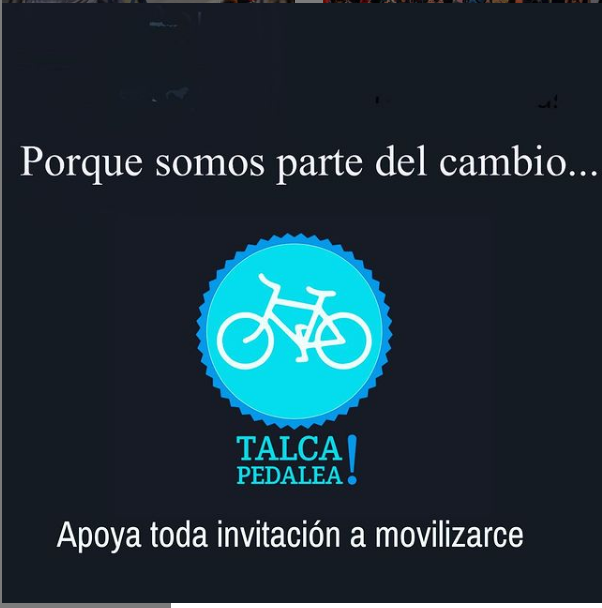
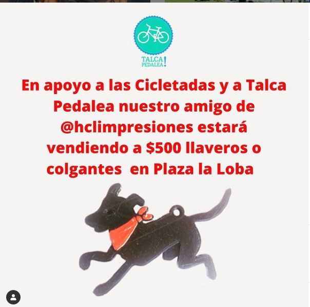
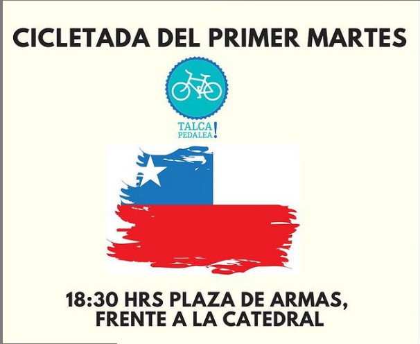
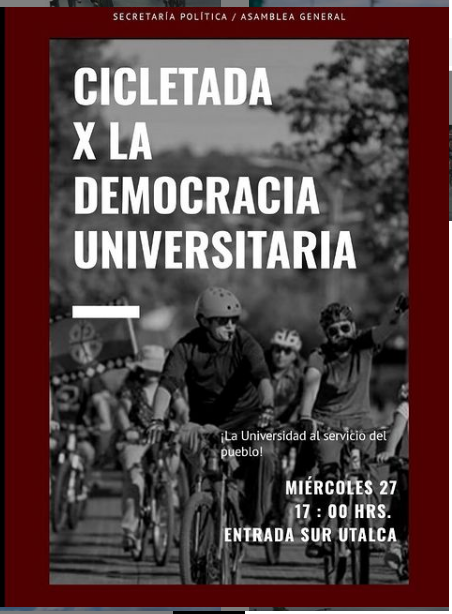

#### FOLIO: TAL19
# Talca pedalea

[instagram](https://www.instagram.com/talcapedalea/)
[facebook](https://www.facebook.com/talca.pedalea)

---

### Representantes
#### (Nombres o emails de voceros o representantes).

---
### Interacciones frecuentes
#### Cletitas sororas, Talca resista, 

### Redes sociales
#### ¿Para qué se utiliza la red social?
| Instagram | Facebook | Twitter | Otra 
|---|---|---|---|
|
Difusión de información y actividades. Mural de fotografías para registrar las actividades concretadas
|
Difusión de información y actividades. Mural de fotografías para registrar las actividades concretadas
|
Difusión de información y actividades. Mural de fotografías para registrar las actividades concretadas
| 0|

### **Instagram**
| seguidores | seguidos | publicaciones | hashtag 
|---|---|---|---|
|5810|781|246| #chiledesperto #chilequierecambios #talcapedalea

---

* **Actividad:**   discontinua

* Primera Publicación IG 23/03/2014

---
### Frecuencia de publicación.

Publicaciones: Semanales de 2 a 3 publicaciones.

Actividades:

---
### Ubicación
* Sector de la comununa/ciudad: Plza de la loba. plaza las heras /Talca en general.

---
### Describir temas de interés y/o trabajo
#### Movimiento pro ciclismo interesado en la apropiación del espacio publico.
---
### Describir la imagen ideal por la cual se trabaja.
#### "No mas ciclistas muertos" "Por que somos parte del cambio.

---
### ¿Que se hace?
#### Realizan cicltadas (protestas)

---
### Describir y distinguir demandas más reivindicativas de espacios sin relación con lo contencioso o con lo político mas prefigurativo
#### Se dirige a lo aficionados del ciclismo de la ciudad. Exigen respeto a los ciclistas en la vía publica.  Transformación cotidiana en el uso del espacio publico 

---
### Tipo de organización interna.
#### Horizontalidad.

---
### Describir los temas / imágenes- iconos / conceptos mas habitualmente presentes en sus publicaciones. Describir cambios/ transformaciones en los contenidos desde Octubre.

**Iconos:**

**Banderas:**

**Diseño estético:**

> La iconografia se diseño en el año 2014. Se ha mantenido durante los años  

---
### Percepciones que se tiene del Estado
#### (Aparato burocrático)
> No se distingue

| Declaraciones | infografía | 
|---|---|
|Anotar los comunicados |  |

---
### Percepciones que se tiene de las Fuerzas de Orden
#### (Aparato represivo)
> No se distingue 

| Declaraciones | infografía | 
|---|---|
|Anotar los comunicados |  |

---
### Incorporar aca notas, citas textuales, links, etc. extra a los ya incorporados, que sean de interés para comprender tanto la forma como los contenidos asociados a la organización.
