#### FOLIO: TAL6
# Talca resiste

[instagram](https://www.instagram.com/talcaresiste/)
[facebook](https://www.facebook.com/talcaresiste.oficial)

<https://talcaresiste.cl/>
---

### Representantes
#### 
---
### Interacciones frecuentes
#### Asamblea de diversidad territorial ex Mesa unidad social, Talca pedalea, centro cultural la candelaria.

### Redes sociales
#### ¿Para qué se utiliza la red social?
| Instagram | Facebook | Twitter | Otra 
|---|---|---|---|
|Difusión de información, fotografías y actividades|Difusión de información, fotografías y actividades|0| 0|

### **Instagram**
| seguidores | seguidos | publicaciones | hashtag 
|---|---|---|---|
|30778|412|688| #RenunciaPiñera #ChileDesperto #TalcaAprueba #AsambleaConstituyente #TalcaResiste #HastaQueLaDignidadSeHagaCostumbre #YoMeQuedoEnCasa #quedateencasa #live #cuarentenatotal #renunciamañalich

---

* **Actividad:** Continua  

* Primera Publicación IG 21/10/2019

---
### Frecuencia de publicación.

Publicaciones: Todos los dias 

Actividades: Semanales (de 3 a 4) antes de la pandemia. Durante la pendemia en su mayoria publicaiones no se distinguen fechas y actividades solidarias. 

---
### Ubicación
* Sector de la comununa/ciudad: Centro de Talca en general

---
### Describir temas de interés y/o trabajo
#### Se declara como un Movimiento Popular que comenzó convocando marchas masivas en la ciudad de Talca haciendo alusión a diversas demandas sociales, entre sus intereses están, apropiación del espacio publico , conflicto mapuche, proceso constituyente entre otros.
---
### Describir la imagen ideal por la cual se trabaja.
#### "Solo el pueblo ayuda al pueblo"/ "Hasta que la dignidad se haga costumbre" "Detener el sistema capitalista" 

---
### ¿Que se hace?
#### 
- Protesta como convocatorias a marchas masivas. 
- Manifestación cultural como micrófono abierto y ciclos de danzas. 
- Emplazamiento a autoridades locales /FUNAS por redes sociales.  
- Ayuda solidaria de productos en centros de abastecimiento. 

---
### Describir y distinguir demandas más reivindicativas de espacios sin relación con lo contencioso o con lo político mas prefigurativo
#### Emplaza autoridades locales y medios de comunicación 

---
### Tipo de organización interna.
#### Vocería y trabajo por comisiones , no se distingue tipo de estructura organizativa. 

---
### Describir los temas / imágenes- iconos / conceptos mas habitualmente presentes en sus publicaciones. Describir cambios/ transformaciones en los contenidos desde Octubre.

**Iconos:** 
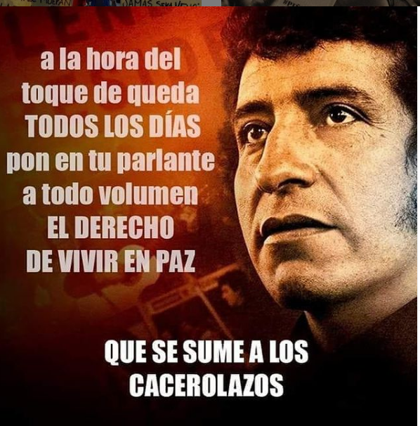
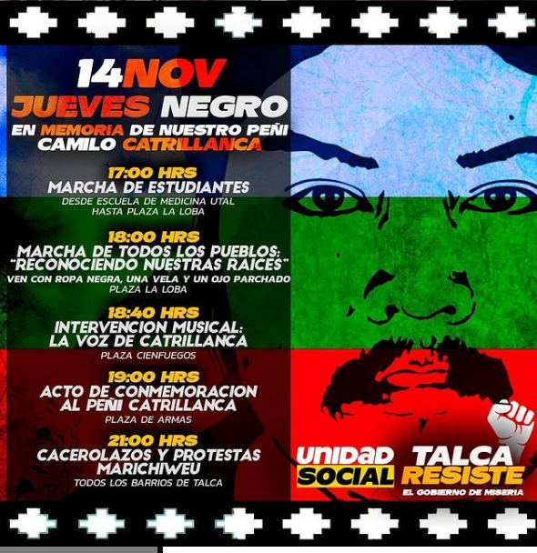
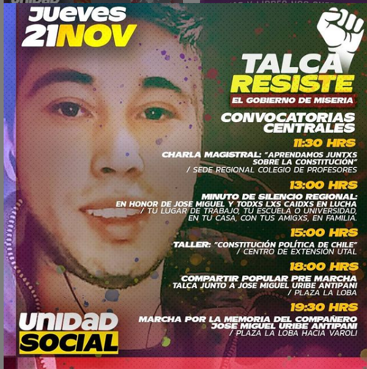
**Banderas:**

**Diseño estético:**
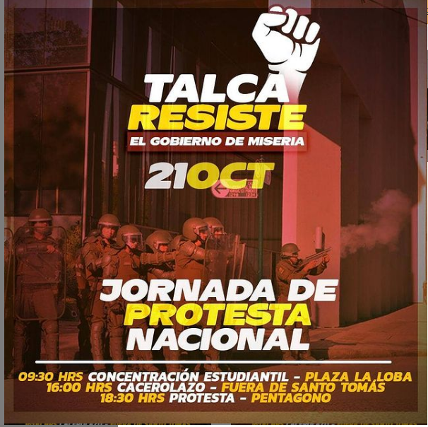
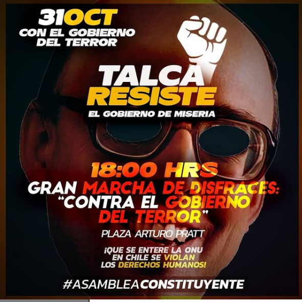
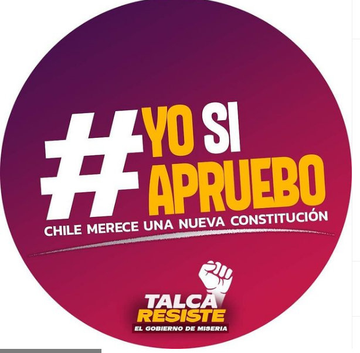
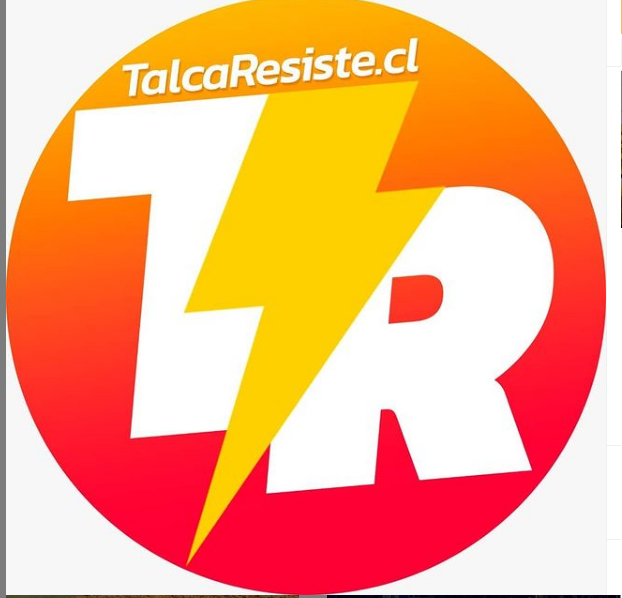

>   se mantiene un diseño estetido desde sus inicios. Recurre a fijuras de la izquierda y banderas y simbolos mapuches. 

---
### Percepciones que se tiene del Estado
#### (Aparato burocrático)
> Estado terrorista

| Declaraciones | infografía | 
|---|---|
|¿Por qué a los grupos económicos les interesa reducir el Estado? 🔥

Durante la Dictadura de Augusto Pinochet comienza el desmantelamiento del Estado, se privatizan empresas, se eliminan ministerios y la industrialización del país llega a la cota 0.
.
La instauración del "Ladrillo" y por consiguiente el sistema Neoliberal viene a reafirmar esta lógica de abandono de responsabilidad Estatal, llevando nuestros derechos al comercio privado y pasando a ser servicios que se transan como bienes de consumo en el mercado bursátil. | 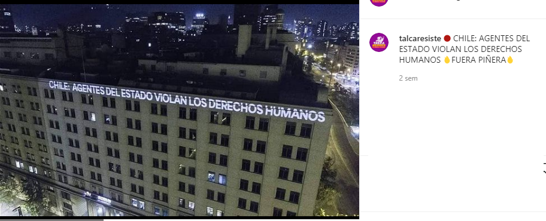 |

---
### Percepciones que se tiene de las Fuerzas de Orden
#### (Aparato represivo)
> Repudio a la institución de carabineros.  

| Declaraciones | infografía | 
|---|---|
|Anotar los comunicados | 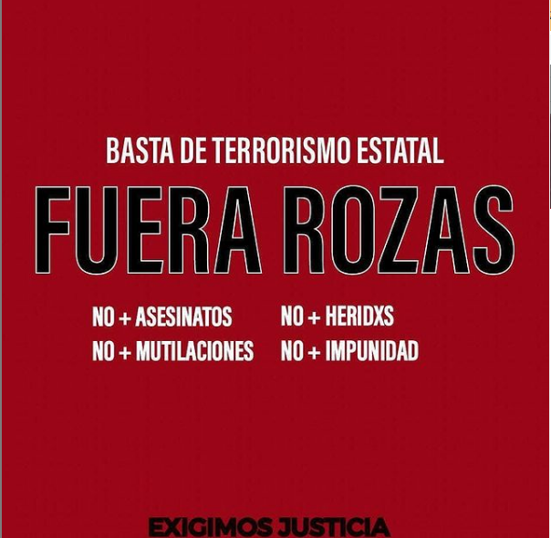 |

---
### ### Video ¿Quién es Talca resiste? [link Instagram](https://www.instagram.com/p/B59IREvpiK-/)
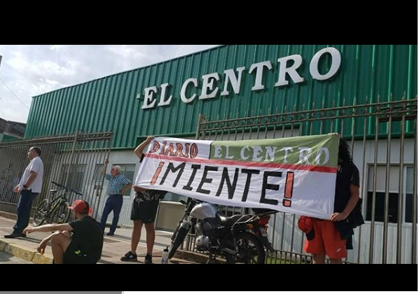
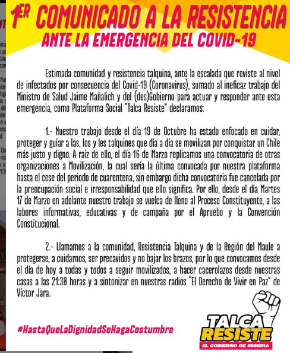

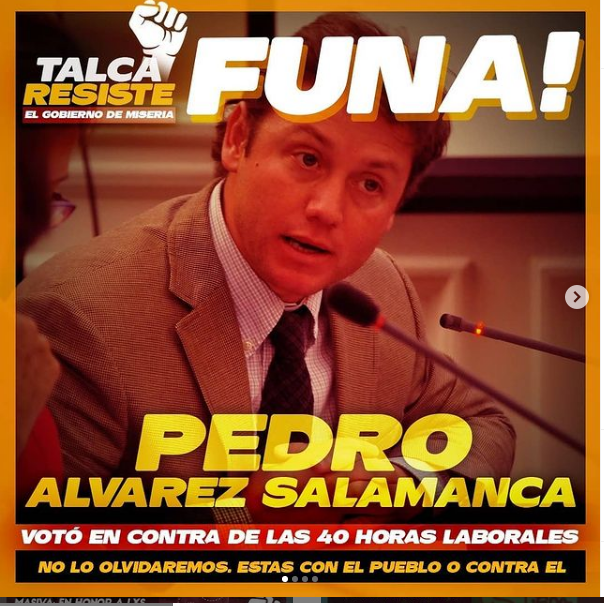
