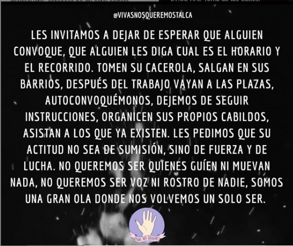

#### FOLIO: TAL9 
# Viva nos queremos Talca

[instagram]( https://www.instagram.com/vivasnosqueremostalca/ )
[facebook](https://www.facebook.com/vivasnosqueremostalca)

<vivasnosqueremostalca@gmail.com>
---

### Representantes
#### Patricia Olviares ps.olivares.tapiagmail.com

---
### Interacciones frecuentes
#### Coordinadora feminista 8M Maule, Talca resiste, matria fecunda ONG, rebeldes Maule, Talca infórmate, Unidad social Talca, Hijas del trueno. 

### Redes sociales
#### ¿Para qué se utiliza la red social?
| Instagram | Facebook | Twitter | Otra 
|---|---|---|---|
|
Difusión de información y actividades. Mural de fotografías para registrar las actividades concretadas
|
Difusión de información y actividades. Mural de fotografías para registrar las actividades concretadas
|0| 0|

### **Instagram**
| seguidores | seguidos | publicaciones | hashtag 
|---|---|---|---|
|57496|768|5000| #NegroMataPacos #hartas#hartasmujeres#hartashoyymañana #estadocriminal#elvioladorerestu#notenemosministra

---

* **Actividad:**  Continua

* Primera Publicación IG 20 de octubre del 2016

---
### Frecuencia de publicación.

Publicaciones: Todos los dias

Actividades: Actividades mensuales, inactividad durante el periodo de pandemia para luego retomar en septiembre del 2019

---
### Ubicación
* Sector de la comununa/ciudad: Centro de Talca en general. 

---
### Describir temas de interés y/o trabajo
#### Organización feminista no excluyente sus intereses son la apropiación del espacio publico y el apoyo mutuo.
---
### Describir la imagen ideal por la cual se trabaja.
#### "Abortar también es un acto de amor" "La paca no es sorora pero nosotras si" 
---
### ¿Que se hace?
#### 
- Apropiación del espacio publico a través de protestas y actos conmemorativos. 
- Actividades solidarias como recolección de ropa y alimentos. 
- Conversatorios,creación de contenido educativo 

---
### Describir y distinguir demandas más reivindicativas de espacios sin relación con lo contencioso o con lo político mas prefigurativo
#### Dirigida hacia mujer y hombre de la ciudad de Talca. Emplaza a carabineros de Chile por corrupción, abuso y violencia. Pro aborto, antirracista. Transformación cotidiana en el uso del espacio publico 

---
### Tipo de organización interna.
#### Asambleísmo y Horizontalidad.

---
### Describir los temas / imágenes- iconos / conceptos mas habitualmente presentes en sus publicaciones. Describir cambios/ transformaciones en los contenidos desde Octubre.

**Iconos:**

**Banderas:**

**Diseño estético:**

 

> Mantienen un diseño estetico desde el 2016

---
### Percepciones que se tiene del Estado
#### (Aparato burocrático)
> resumen de lo encontrado

| Declaraciones | infografía | 
|---|---| 

|Estamos ad portas del primer aniversario del asesinato de Aylin Fuentes. Aylin vivió un contexto difícil, aunque tenía una familia que la amaba y velaba por cuidarla, estuvo inserta en un espacio que facilitó su acceso a malas juntas y drogas en la Villa Las Américas, Talca. Su asesinato conmocionó a toda la región y fue tema a nivel nacional. Hoy, a casi un año, son pocas las medidas del Estado para acabar con el narcotráfico y prevenir la drogadicción en la población. La familia de Aylin busca que exista mayor justicia social y preocupación, en una población compleja de Talca que muchas veces parece haber sido olvidada por los y las gobernantes |  |

---
### Percepciones que se tiene de las Fuerzas de Orden
#### (Aparato represivo)
> 

| Declaraciones | infografía | 
|---|---|
|Anotar los comunicados |  |

---
### 

