#### FOLIO: LPR6

# Asamblea Comunal Lo Prado

[instagram](https://www.instagram.com/asambleacomunaloprado/
)
[facebook](https://www.facebook.com/Asamblea-Comunal-Lo-Prado-100285151604387)
[twitter]()
<asambleaterritorialloprado@gmail.com
>
---

### Representantes
---
### Interacciones frecuentes
#### Olla común T1 Lo prado, Desorden Público Lo Prado, Asamblea Popular Lo Besa, Asamblea Mujeres y Disidencias Lo Prado,

### Redes sociales
#### ¿Para qué se utiliza la red social?
| Instagram | Facebook | Twitter | Otra 
|---|---|---|---|
|Difusión de información y actividades. Mural de fotografías de acciones concretadas.|Difusión de información y actividades. Mural de fotografías de acciones concretadas.
|0| 0|

### **Instagram**
| seguidores | seguidos | publicaciones | hashtag 
|---|---|---|---|
|2042|	521	|277
| 0

---

* **Actividad:**   Continua

* Primera Publicación IG 10 DE DICIEMBRE DE 2019

---
### Frecuencia de publicación.

Publicaciones: Semanales

Actividades:

---
### Ubicación
* Sector de la comununa/ciudad: Parque Neptuno.

---
### Describir temas de interés y/o trabajo
Organización territorial sus intereses son el proceso constituyente y la participación ciudadana.

---
### Describir la imagen ideal por la cual se trabaja.
#### De define como un grupo de vecinos y vecinas auto convocados de la comuna. Nos reunimos con el fin de generar un espacio para el debate político, en pos de la nueva Constitución. "Ni perdón ni olvido, justicia y castigo"

---
### ¿Que se hace?
#### Conversatorios y charlas referente al proceso constituyente. Realizan Actividades culturales y de participación ciudadana como Jornadas de conversatorios seguido de micrófonos abiertos (musical) actos conmemorativos hacia los presos políticos y por la muerte de Camilo Cariblanca. Realizan completadas para reunir fondos para la asamblea.

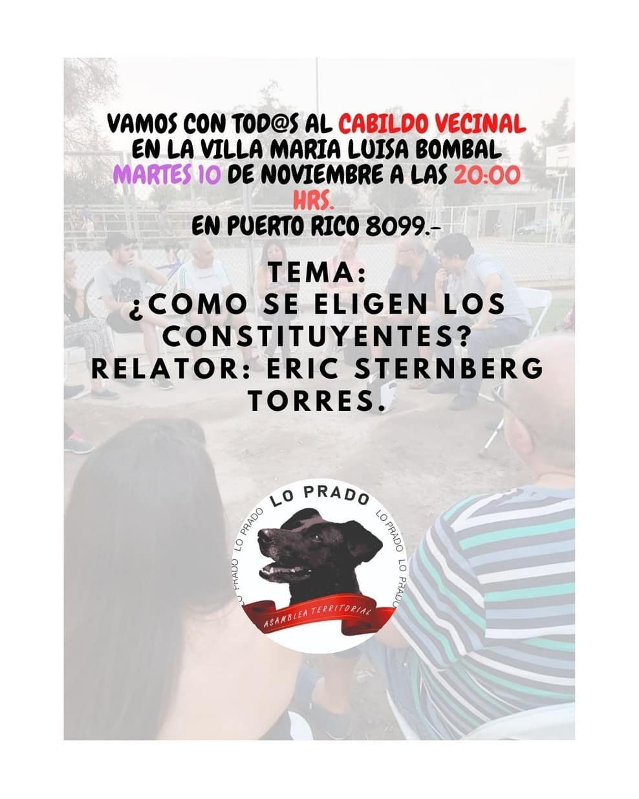
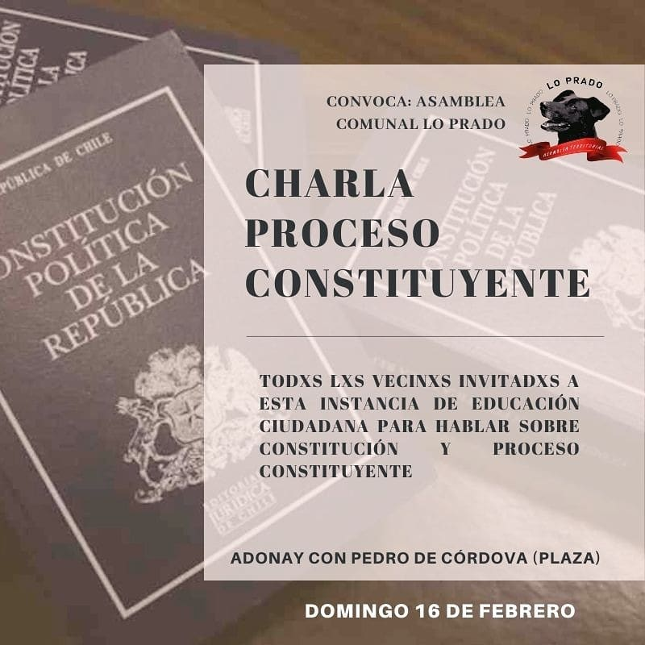
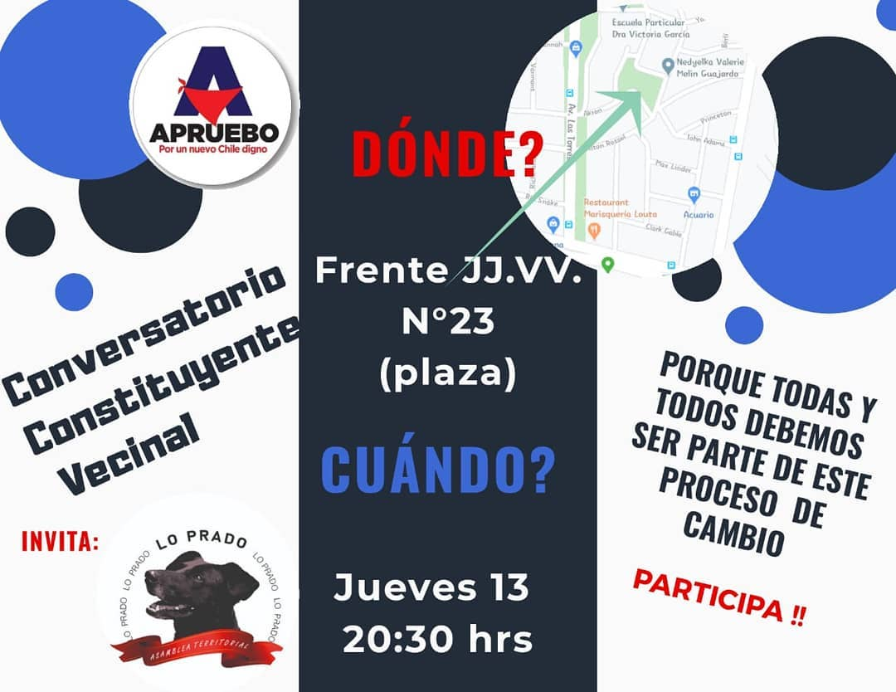
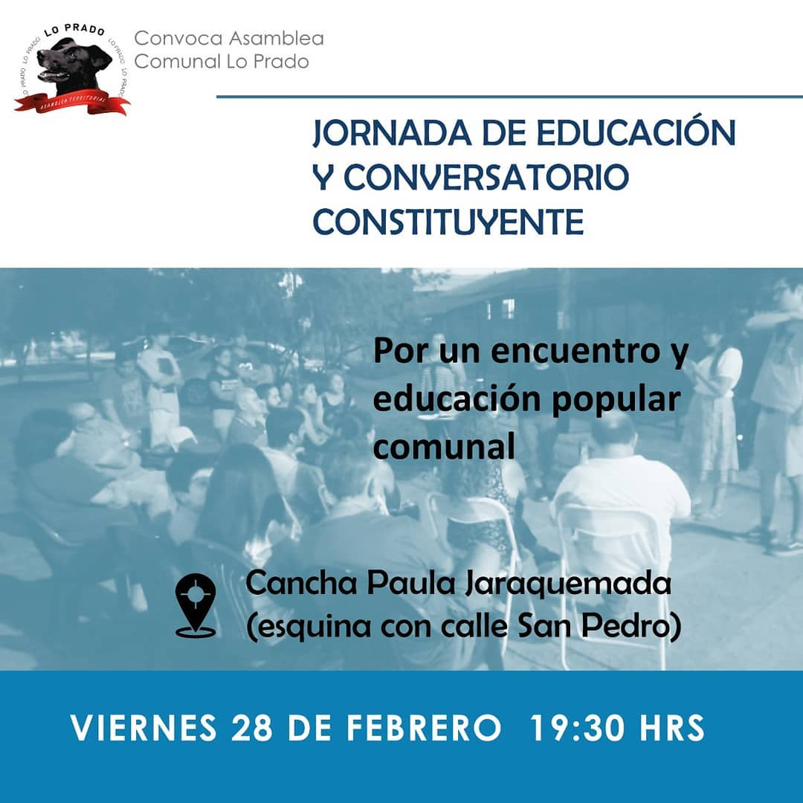
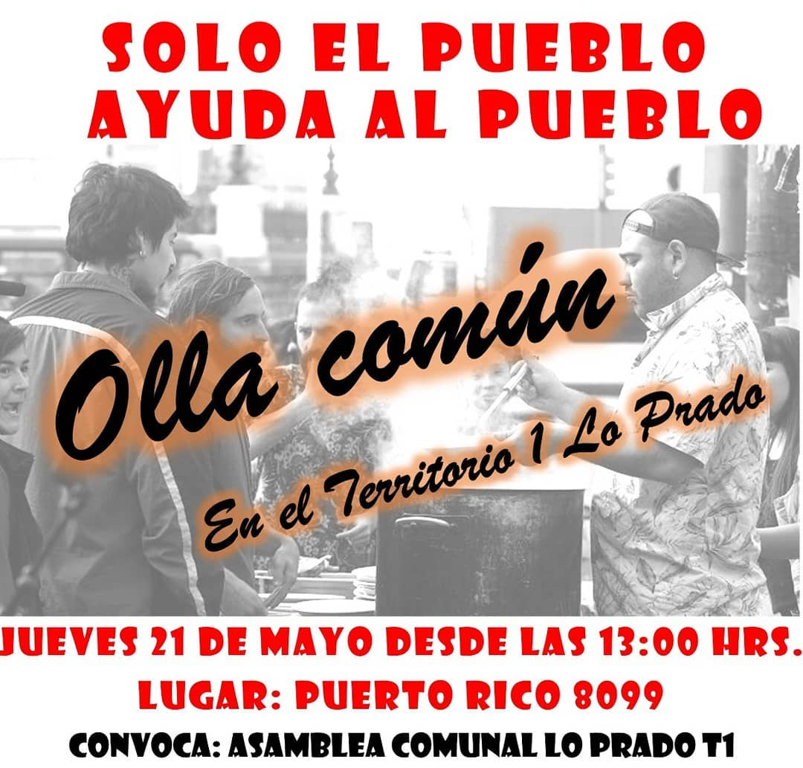
---
### Describir y distinguir demandas más reivindicativas de espacios sin relación con lo contencioso o con lo político mas prefigurativo
#### Vecinos y vecinas interesados en el procesos constituyente. Bajar la información a las bases.

---
### Tipo de organización interna.
#### Asambleísmo y horizontalidad.

---
### Describir los temas / imágenes- iconos / conceptos mas habitualmente presentes en sus publicaciones. Describir cambios/ transformaciones en los contenidos desde Octubre.

**Iconos:** 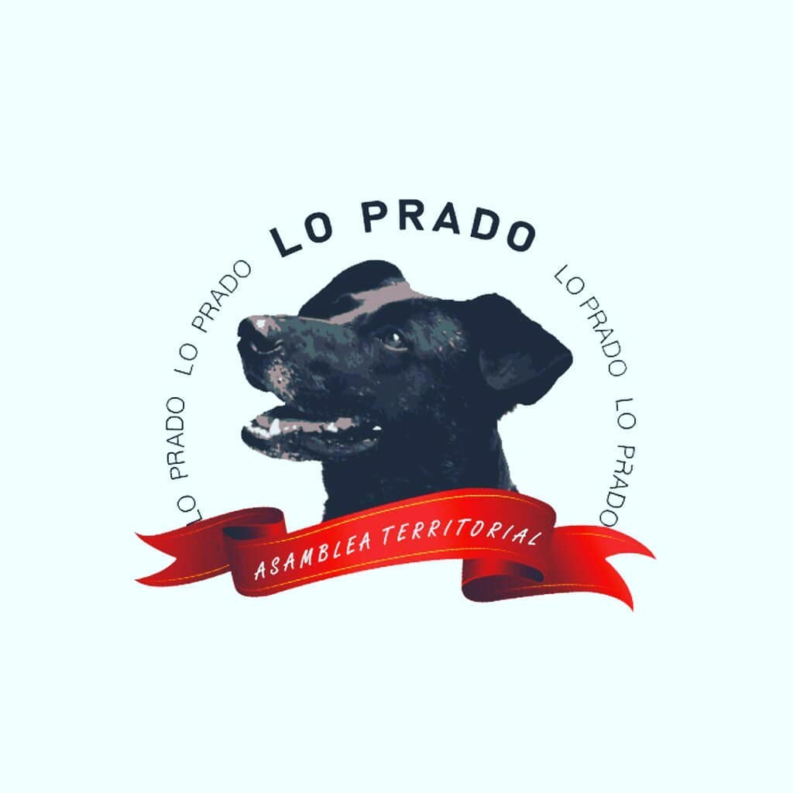 
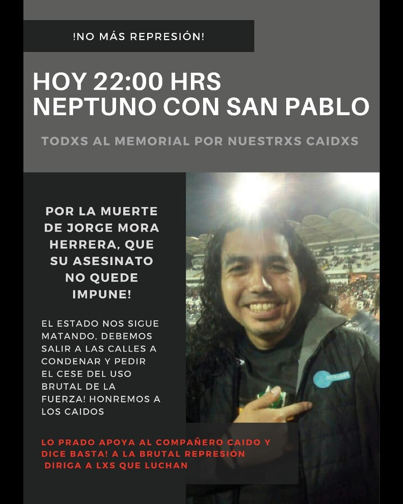
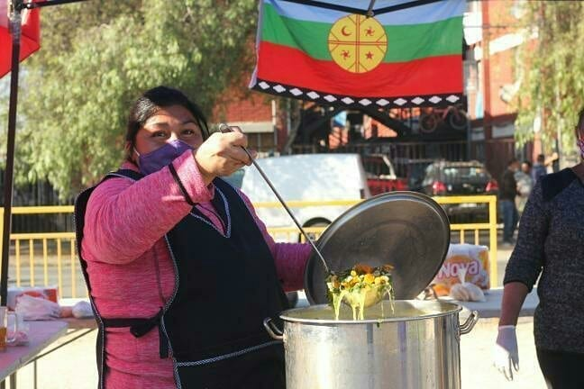

**Banderas:** 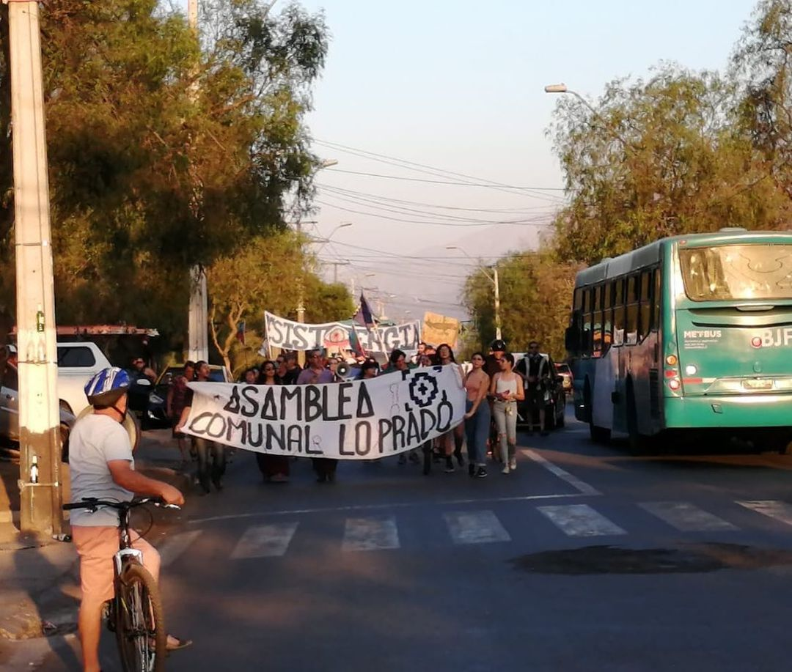
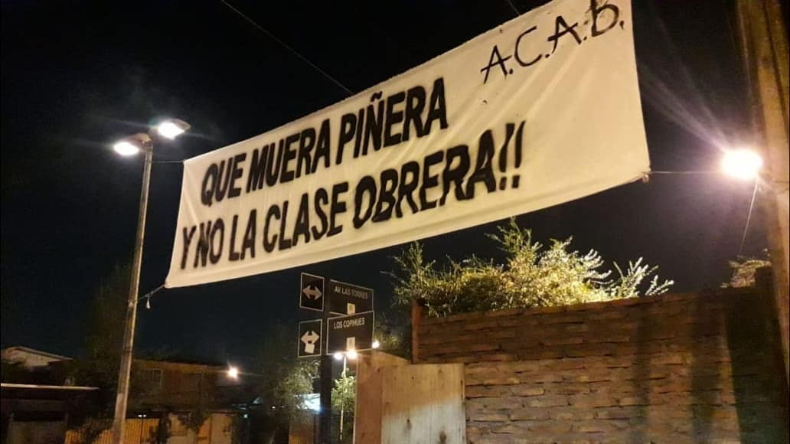
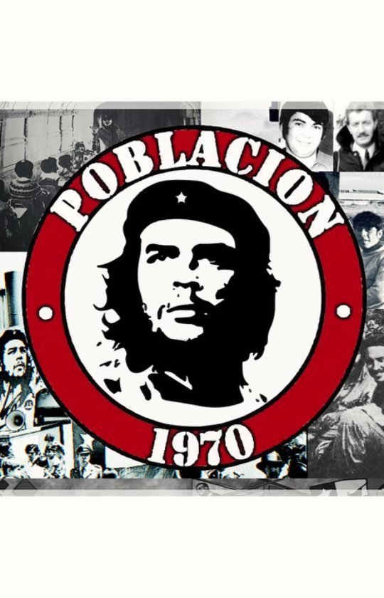

**Diseño estético:**

> Párrafo tipo cita 

---
### Percepciones que se tiene del Estado
#### (Aparato burocrático)
> resumen de lo encontrado

| Declaraciones | infografía | 
|---|---|
|Anotar los comunicados |  |

---
### Percepciones que se tiene de las Fuerzas de Orden
#### (Aparato represivo)
> resumen de lo encontrado

| Declaraciones | infografía | 
|---|---|
|Anotar los comunicados |  |

---
### 
Manuel Stingo
(https://www.instagram.com/p/B6_yTw9pAtN/)
Tocata
(https://www.instagram.com/p/B7zC_19pUDz/)