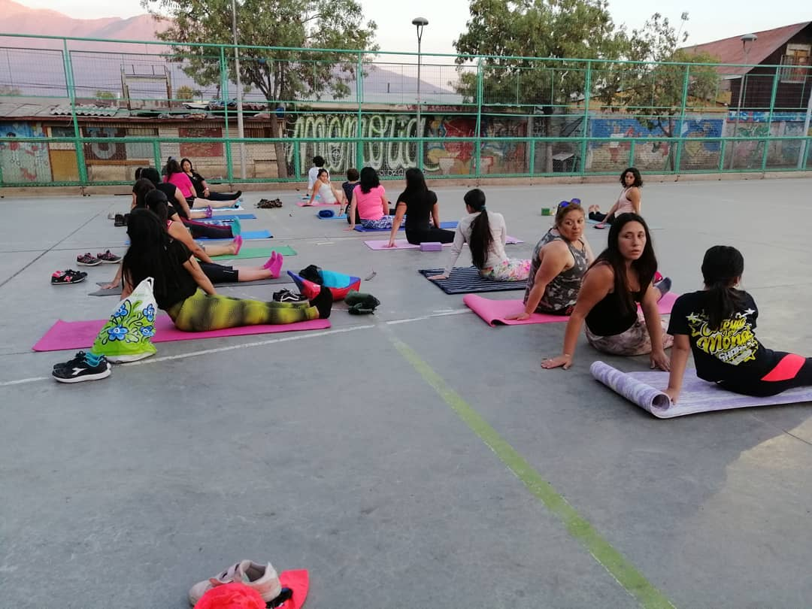

#### LPR1

# Asamblea Villa O'higgins de Lo Prado

[instagram](https://www.instagram.com/p/CHOIb-ypFVx/
)
[facebook](https://www.facebook.com/asambleavillaohigginsloprado)
[twitter]()
<correo@correo.cl>
---

### Representantes
#### (Nombres o emails de voceros o representantes).

---
### Interacciones frecuentes
#### Cordón poniente, colectivo Llama, Pudahuel, cordón Grecia.

### Redes sociales
#### ¿Para qué se utiliza la red social?
| Instagram | Facebook | Twitter | Otra 
|---|---|---|---|
|Difusión de información y actividades.|Difusión de información y actividades.
|0| 0|

### **Instagram**
| seguidores | seguidos | publicaciones | hashtag 
|---|---|---|---|
|540|	342|	55|
| 0

---

* **Actividad:**   Continuas

* Primera Publicación IG 6 DE DICIEMBRE DE 2019

---
### Frecuencia de publicación.

Publicaciones:Semanales de 1 a 2. Se intensificaron a partir del inicio de la crisis hasta el mes de octubre.

Actividades:

---
### Ubicación
* Sector de la comununa/ciudad: Villa O´Higgins
Lo Prado

---
### Describir temas de interés y/o trabajo
Organizaciones territorial y de apoyo mutuo. Trabaja en el fortalecimiento de redes comunitarias, soberanía alimentaria, actividades solidarias y político culturales.

---
### Describir la imagen ideal por la cual se trabaja.
#### Que todos los sectores de la comuna se organicen en sus territorios! ¡Todo el poder a las asambleas o nada! No mas sename, "Solo el pueblo ayuda al pueblo"

---
### ¿Que se hace?
#### Gestor de asambleas abiertas. Protestas como cacerolazos, actos conmemorativos. Acciones solidarias como Ollas comunes, acopio de alimento y útiles de aseo.

---
### Describir y distinguir demandas más reivindicativas de espacios sin relación con lo contencioso o con lo político mas prefigurativo
#### Dirigida a vecinos y vecinas del territorio. Organizaciones del territorio norponiente. Emplaza a diputados del distrito por no cumplir deberes.

---
### Tipo de organización interna.
#### Asambleísmo y horizontalidad.

---
### Describir los temas / imágenes- iconos / conceptos mas habitualmente presentes en sus publicaciones. Describir cambios/ transformaciones en los contenidos desde Octubre.

**Iconos:**

**Banderas:** 

**Diseño estético:**

> Párrafo tipo cita 

---
### Percepciones que se tiene del Estado
#### (Aparato burocrático)
> resumen de lo encontrado

| Declaraciones | infografía | 
|---|---|
| |  |

---
### Percepciones que se tiene de las Fuerzas de Orden
#### (Aparato represivo)
> resumen de lo encontrado

| Declaraciones | infografía | 
|---|---|
| |  |

# Memoria 

