#### FOLIO: LPR9

# Ciclistas Lo Prado LP2

[instagram](https://www.instagram.com/cicletada_loprado/tagged/
)
[facebook](https://www.facebook.com/ciclistas.loprado)
[twitter]()
<correo@correo.cl>
---

### Representantes
#### No se identifican. 

---
### Interacciones frecuentes
#### Olla común T1 Lo prado, antifacletas, pedaleros estación, Pedal Lo Prado,

### Redes sociales
#### ¿Para qué se utiliza la red social?
| Instagram | Facebook | Twitter | Otra 
|---|---|---|---|
|Difusión de información y actividades. Mural de fotografías de acciones concretadas.|Difusión de información y actividades. Mural de fotografías de acciones concretadas.
|0| 0|

### **Instagram**
| seguidores | seguidos | publicaciones | hashtag 
|---|---|---|---|
|1233|	101|	147|
| 0

---

* **Actividad:**   Continua

* Primera Publicación IG 14 DE MARZO DE 2020

---
### Frecuencia de publicación.

Publicaciones: Mensuales (de 3 a 4 publicaciones) a partir de noviembre del 2020 todos los días.

Actividades:

---
### Ubicación
* Sector de la comununa/ciudad: Parque Neptuno.

---
### Describir temas de interés y/o trabajo
Organización territorial interesada en el activismo social comunal. Apropiación del espacio publico.

---
### Describir la imagen ideal por la cual se trabaja.
#### No mas ciclista muertos, "Evadir pedalear otra forma de luchar" "El pueblo ayuda al pueblo" "La bicicleta es revolución"

# Declaracion: 

**¿Por qué Anti-Facistas?**
**La respuesta la encontramos explicando lo que es el fascismo.**
**Se entiende por fascismo la idea donde un pequeño grupo de personas dirigen a un país inculcando el nacionalismo exacerbado, con ello generando odio a los demás pueblos de una determinada región.
Ejemplo claro es el caso chileno, donde existe una persecución al pueblo-nación Mapuche por defender sus tierras, aguas y bosques. El fascismo hace creer y fomenta la idea de que en este país sólo existe una nación, cuando claramente somos un país multicultural y plurinacional.**
**Por otro lado, lxs fascistas tienen una idea conservadora de la familia, donde esta se compone de un padre y una madre como formadores dejando con ellos roles claros y cerrados en lo que es ser hombre (proveedor, dominante) y lo que es ser una mujer (sumisa, obediente, solo puesta para entender a lxs hijxs y al hombre). El fascismo no concibe la posibilidad de una familia homoparental o que la familia también puede ser madre o padre solterx más su hijx o una infinidad de lazos afectivos que también compondrian una familia. El fascismo prefiere que lxs niñxs queden en centros precarios como SENAME antes de que una de estas familias pudiera adoptarlx.**

**Fascismo también es un sistema económico, donde la población general produce, pero quienes acaparan lo producido es una minoría. Quienes producen no sacan mayor provecho a los productos creados por sus manos.**

**El fascismo se presenta de muchas formas y este texto podría ser mucho más extenso, pero te hacemos una invitación a que leas, te informes por medios no oficiales sobre este tema y con ello puedas no pensar como nosotrxs sino que tengas una opinión y visión crítica a la norma establecida por el fascista que hoy gobierna nuestro país.**
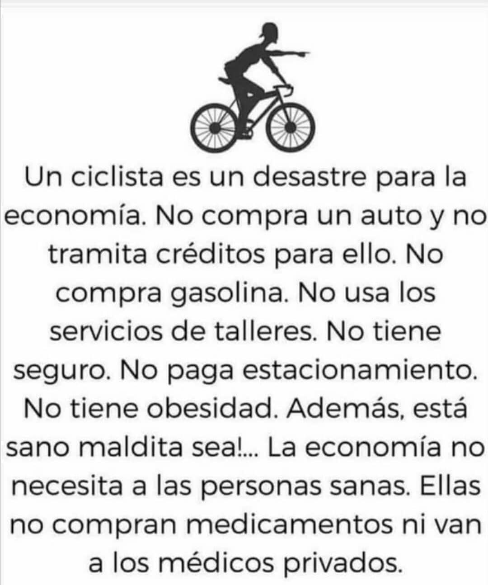

---
### ¿Que se hace?
#### La organización además de convocar cicletadas, realiza talleres básicos de bicicleta y caravanas por el apruebo.

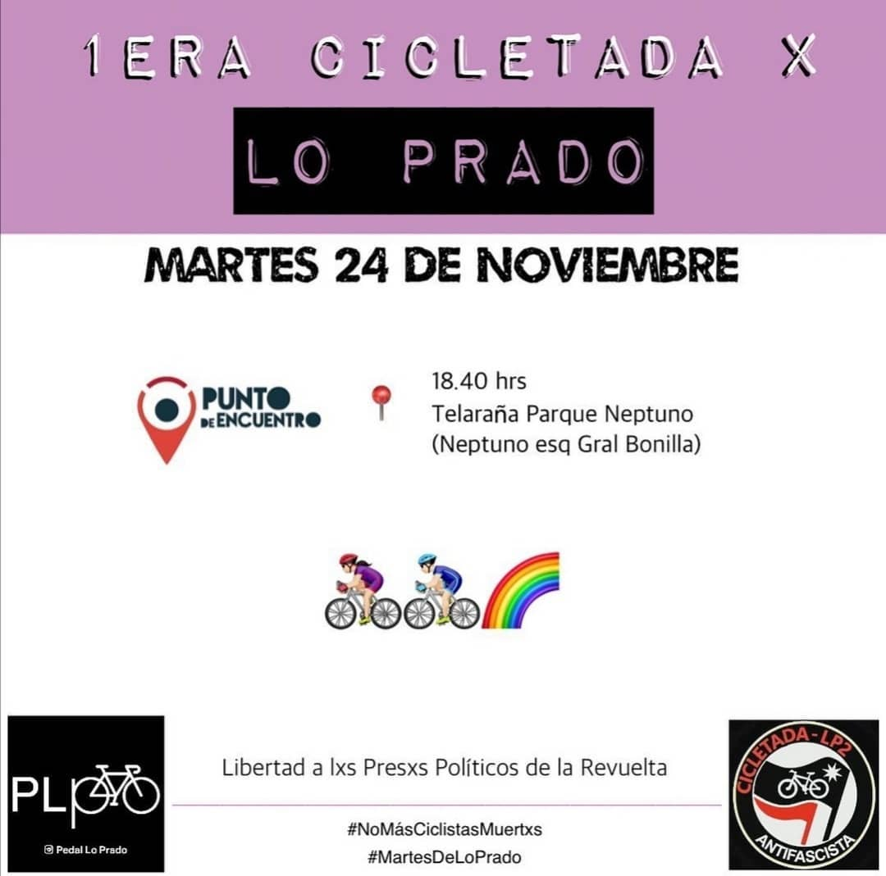
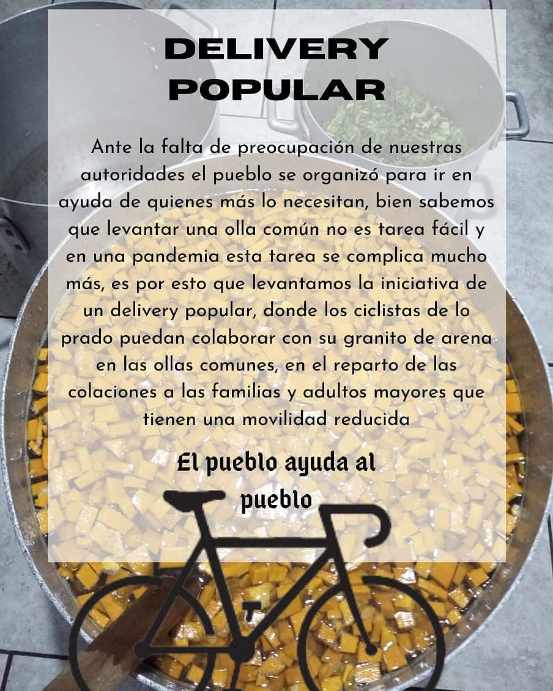
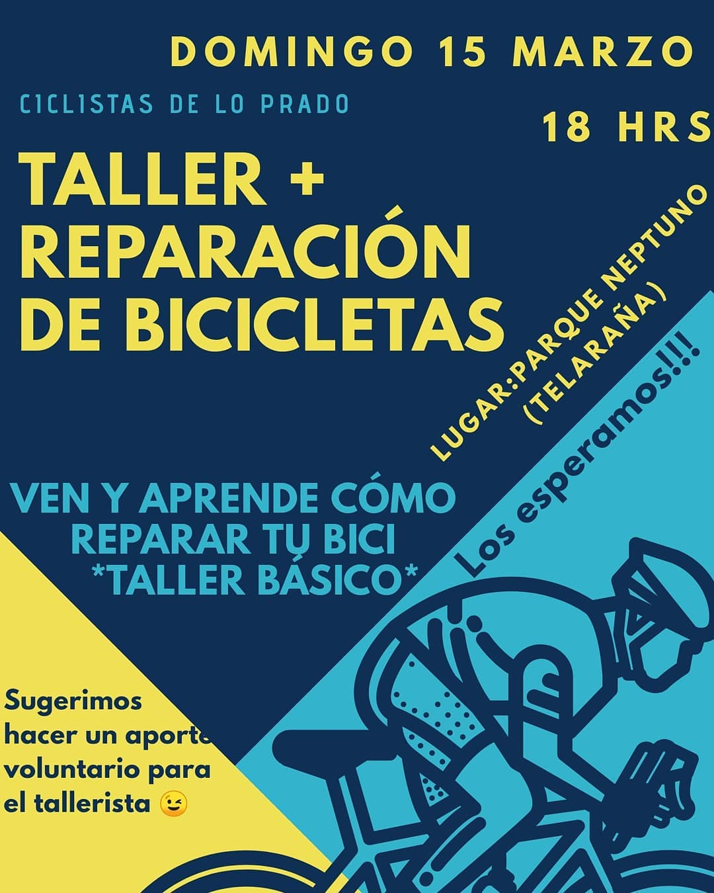

---
### Describir y distinguir demandas más reivindicativas de espacios sin relación con lo contencioso o con lo político mas prefigurativo
#### Se dirige a los ciclistas de la comuna de Lo Prado. Emplazan a la ministra de transporte./ Transformación cotidiana en el uso del espacio publico

---
### Tipo de organización interna.
#### No se logra distinguir una estructura organizativa. Pero se distinguen reuniones donde la estructura podría ser el asambleísmo.

---
### Describir los temas / imágenes- iconos / conceptos mas habitualmente presentes en sus publicaciones. Describir cambios/ transformaciones en los contenidos desde Octubre.

**Iconos:**  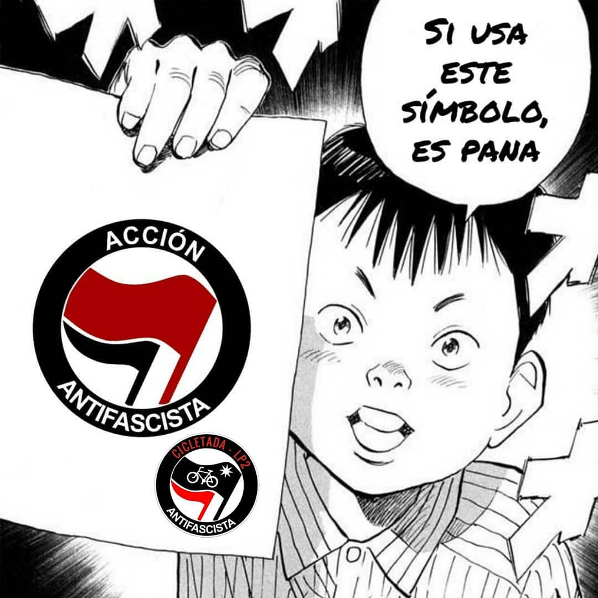 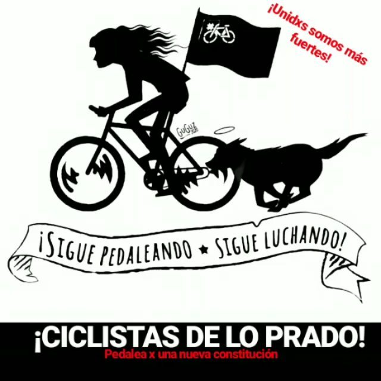 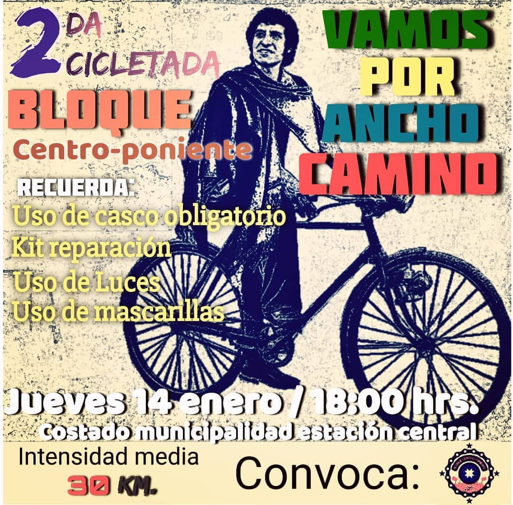 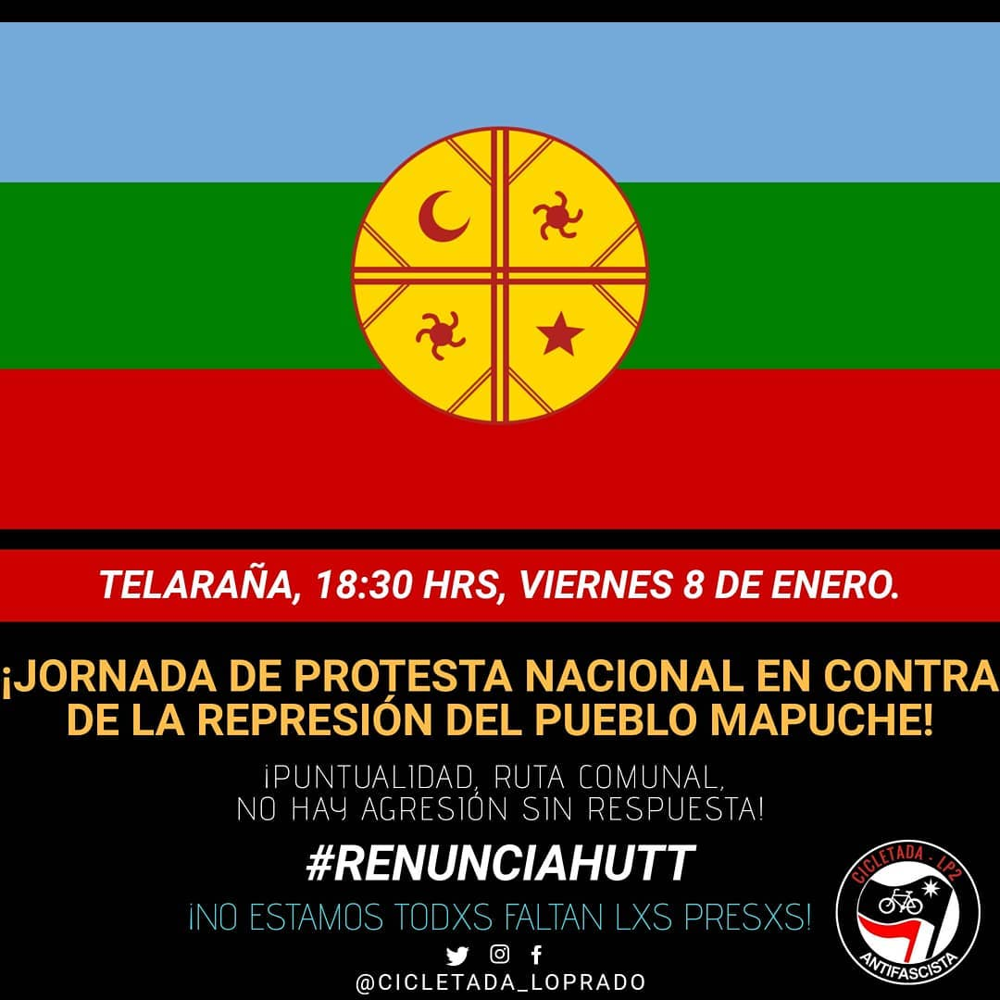

**Banderas:** 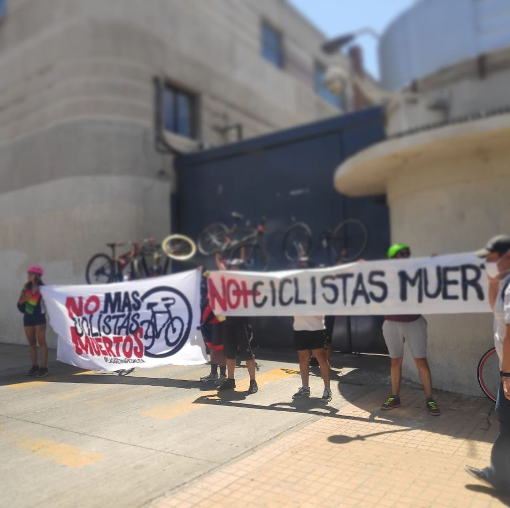

**Diseño estético:** 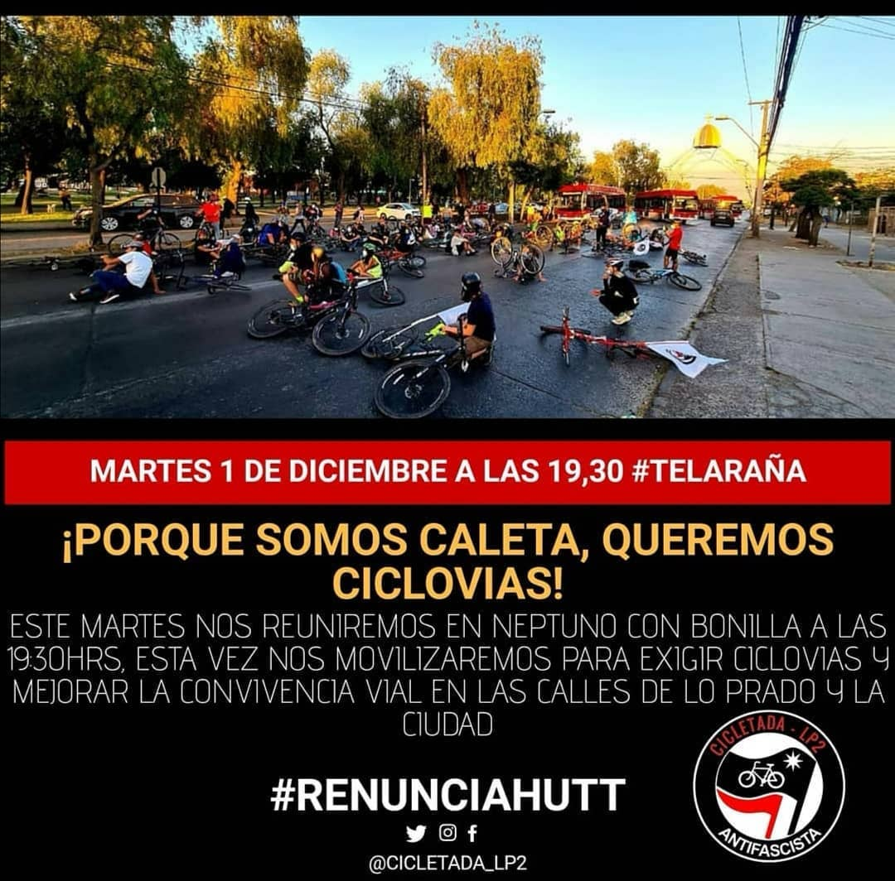

> Destacan los colores rojo y negro.  

---
### Percepciones que se tiene del Estado
#### (Aparato burocrático)
> resumen de lo encontrado

| Declaraciones | infografía | 
|---|---|
|Ante la falta de preocupación de nuestras autoridades el pueblo se organizó para ir en ayuda de quienes más lo necesitan, biena sabemos que levantar una olla común no estarea facil y en una pandemia esta tarea se complica mucho más, es por esto que levantamos la iniciativa de un delivery popular, donde los ciclistas de lo prado puedan colaborar con su granito de arena en las ollas comunes, en el reparto de las colaciones a las familias y adultos mayores que tienen una movilidad reducida. Bien sabemos que debieramos quedarnos en nuestras casas realizando la cuarentena, pero es un egoismo extremo quedarnos en nuestras casas cuando nuestros cercanos no tienen un plato de comida y el estado no los ayuda en nada, es por esto que apelamos a su humanidad para colaborar en esta noble acción. 

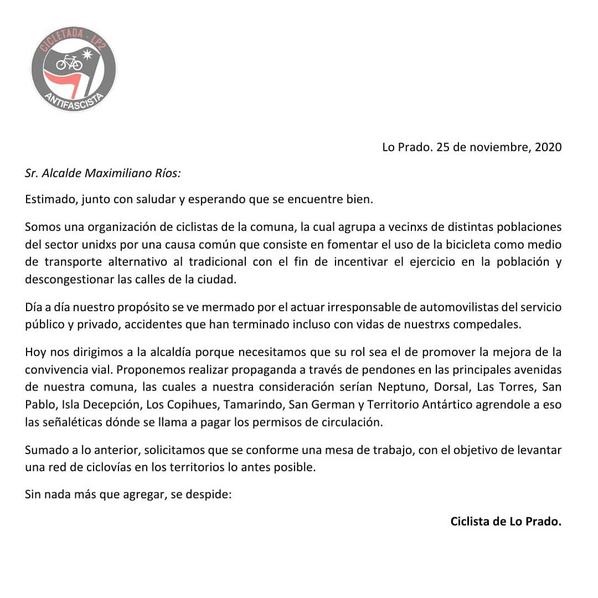|  |

---
### Madre hermanos Vergara Toledo

[Link instagram](https://www.instagram.com/p/CIL3w4VJ8Do/)
