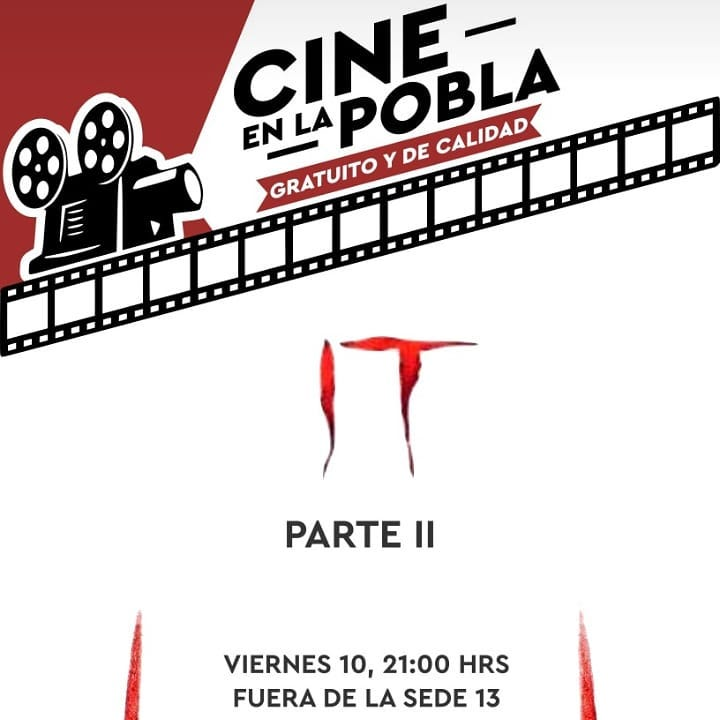
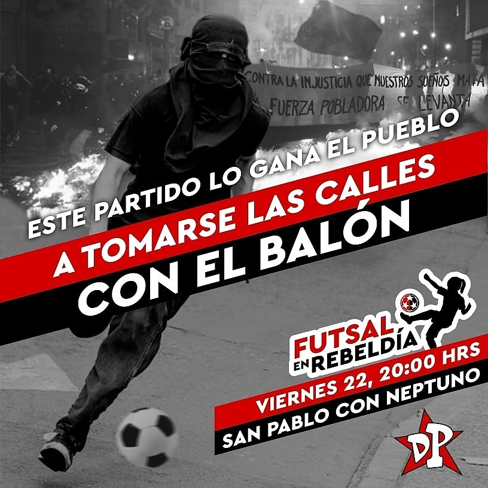
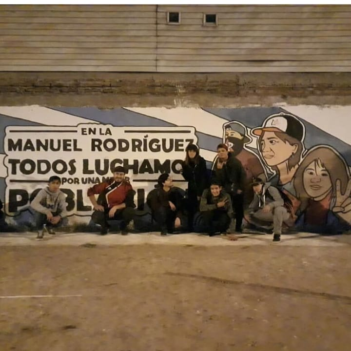
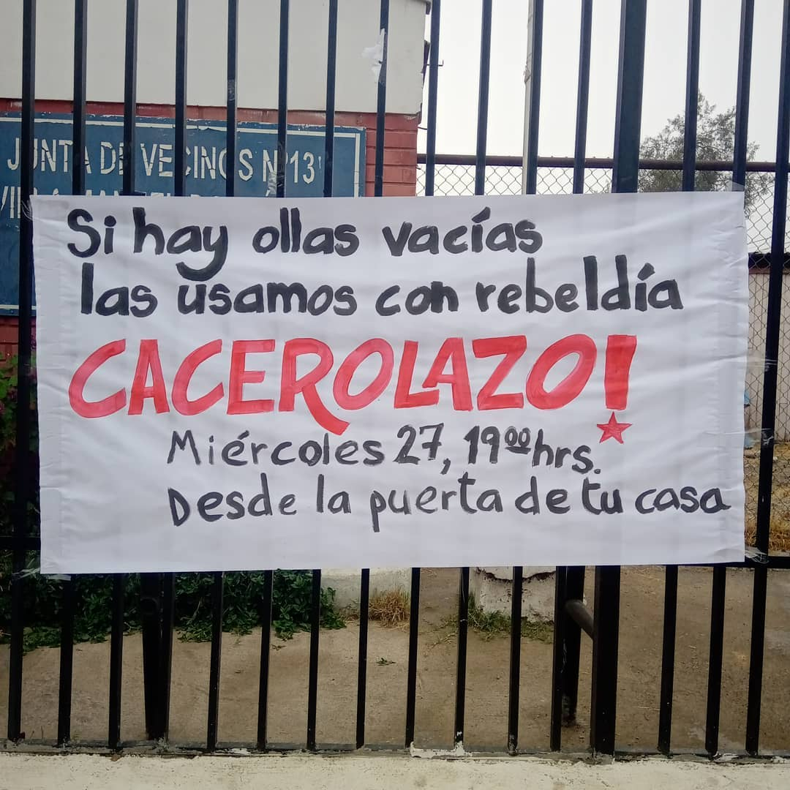
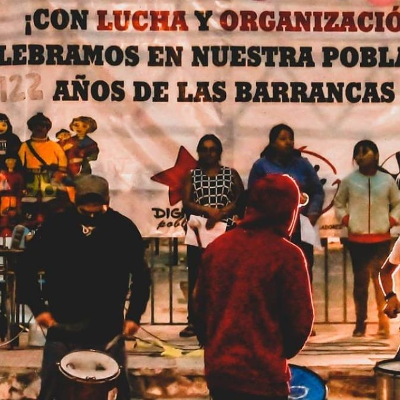
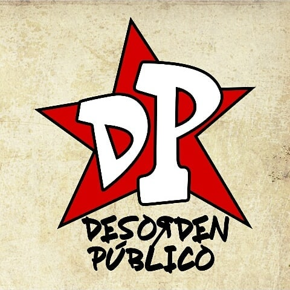
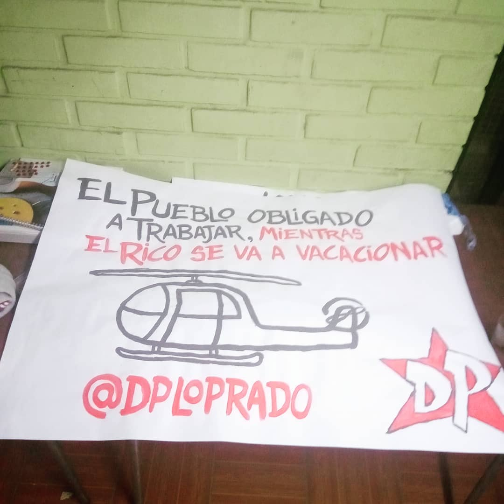
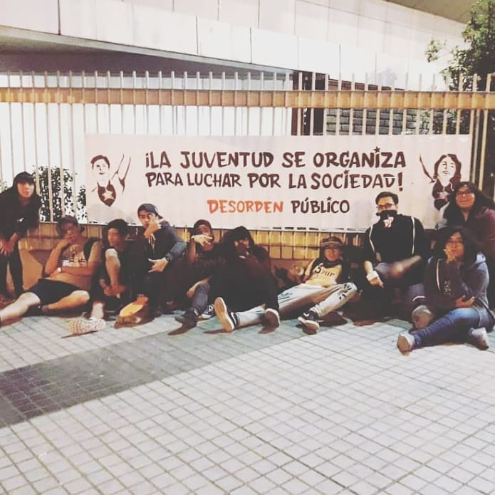
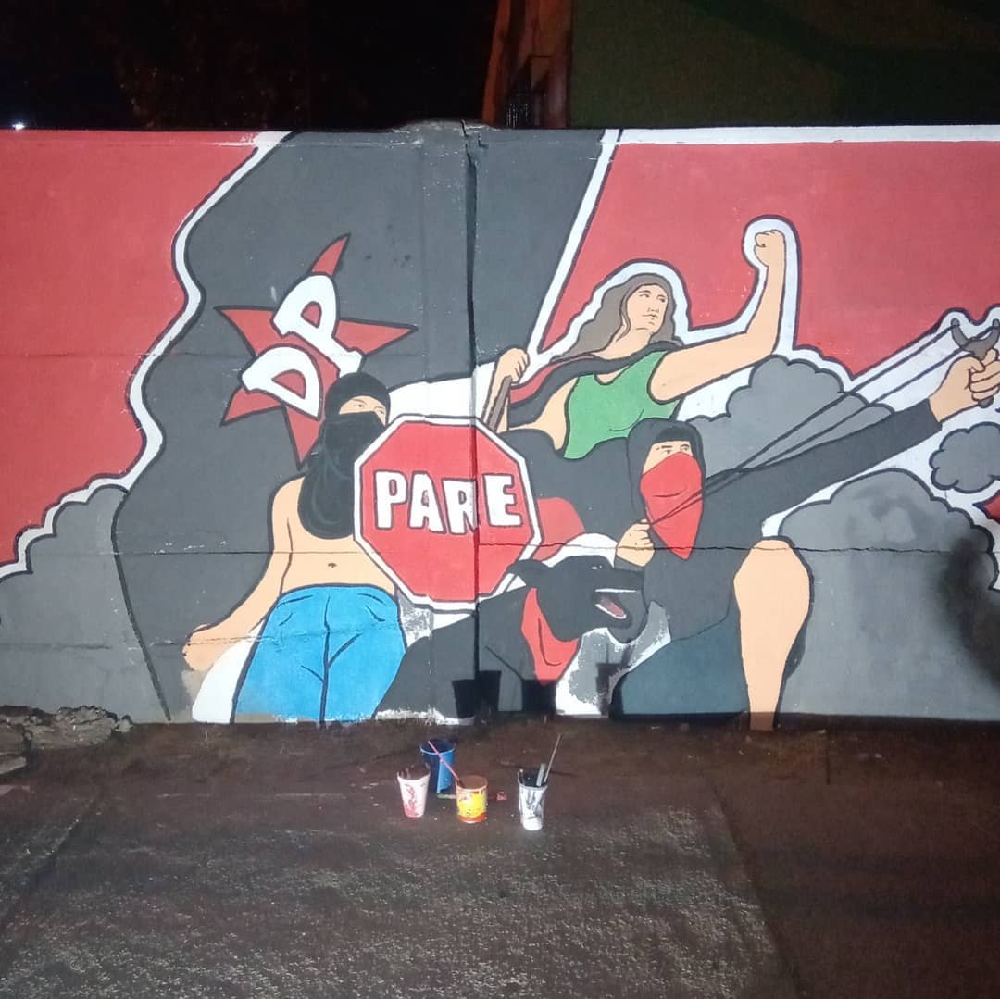

#### LPR3

# Desorden Público Lo Prado

[instagram](https://www.instagram.com/dploprado/
)
[facebook]()
[twitter]()
<correo@correo.cl>
---

### Representantes
#### (Nombres o emails de voceros o representantes).

---
### Interacciones frecuentes
#### Asamblea comunal Lo Prado y Fuerza pobladora Chile

### Redes sociales
#### ¿Para qué se utiliza la red social?
| Instagram | Facebook | Twitter | Otra 
|---|---|---|---|
|Difusión de información y actividades. Mural de fotografías de acciones concretadas.|.
|0| 0|

### **Instagram**
| seguidores | seguidos | publicaciones | hashtag 
|---|---|---|---|
|800|	683|	41
| 0

---

* **Actividad:**   inactiva

* Primera Publicación IG 3 DE AGOSTO DE 2019

---
### Frecuencia de publicación.

Publicaciones: Semanales

Actividades:

---
### Ubicación
* Sector de la comununa/ciudad: población Manuel Rodríguez y San Pablo con Neptuno

---
### Describir temas de interés y/o trabajo
Organización territorial, apropiación del espacio publico y promueve la unión y participación vecinal.

---
### Describir la imagen ideal por la cual se trabaja.
#### "La juventud se organiza para luchar por la sociedad" Por una sociedad mas equitativa económicamente.

---
### ¿Que se hace?
#### Realizas protestas ciudadanas como cacerolazos. Pintan murales en la vía publica. Actividades comunitarias como futsal en la calle y ciclos de cine al aire libre.

### Describir y distinguir demandas más reivindicativas de espacios sin relación con lo contencioso o con lo político mas prefigurativo
#### Se dirige a jóvenes de población Manuel Rodríguez de lo Prado. Emplaza a autoridades centrales. Equidad económica. Transformación cotidiana de vivir en el barrio.

---
### Tipo de organización interna.
#### Horizontalidad. No se distinguen representantes.

---
### Describir los temas / imágenes- iconos / conceptos mas habitualmente presentes en sus publicaciones. Describir cambios/ transformaciones en los contenidos desde Octubre.

**Iconos:** 

**Banderas:** 

**Diseño estético:** 

> Párrafo tipo cita 

---
### Percepciones que se tiene del Estado
#### (Aparato burocrático)
> resumen de lo encontrado

| Declaraciones | infografía | 
|---|---|
|Anotar los comunicados |  |

---
### Percepciones que se tiene de las Fuerzas de Orden
#### (Aparato represivo)
> resumen de lo encontrado

| Declaraciones | infografía | 
|---|---|
|Anotar los comunicados |  |

---
### Incorporar aca notas, citas textuales, links, etc. extra a los ya incorporados, que sean de interés para comprender tanto la forma como los contenidos asociados a la organización.
