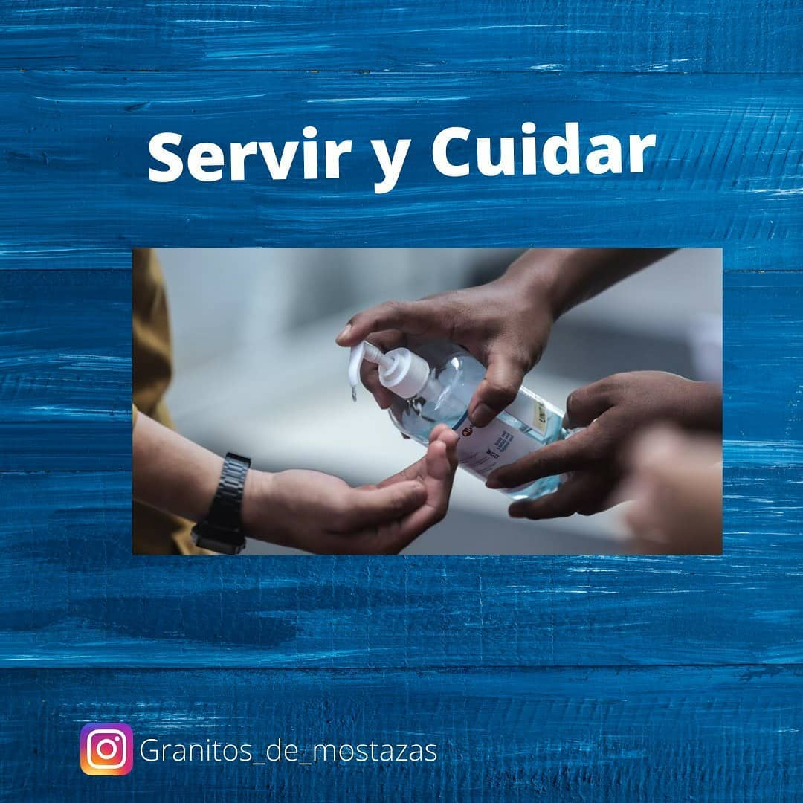
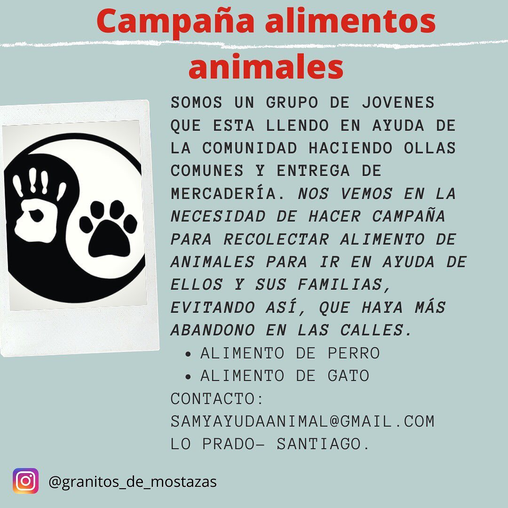
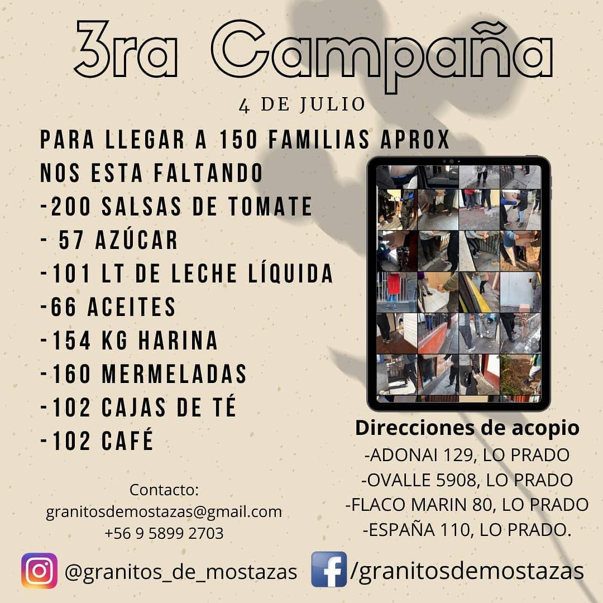
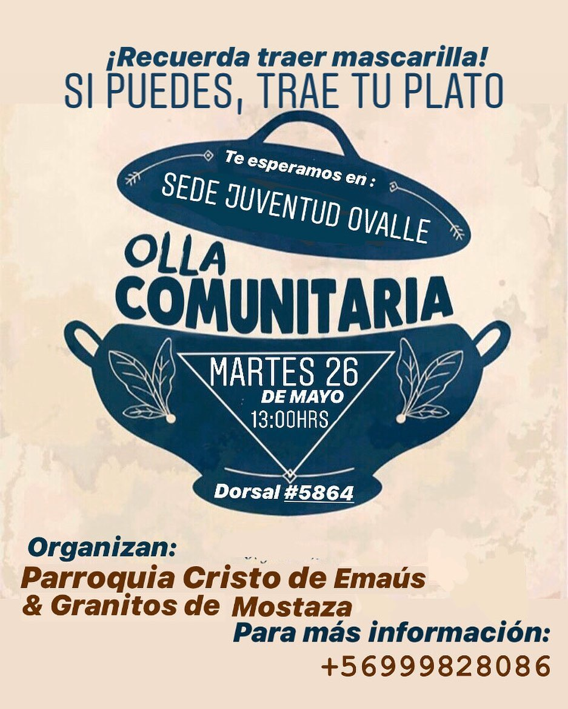
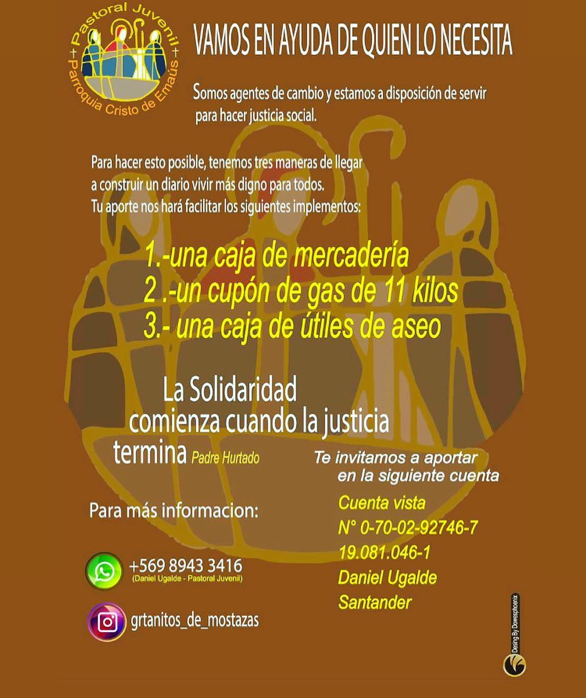

#### FOLIO: LPR10
 
# Granito de Mostaza

[instagram](https://www.instagram.com/granitos_de_mostazas/
)
[facebook](https://www.facebook.com/Granitosdemostazas/)
[twitter]()
<granitosdemostaza@gmail.com>
---

### Representantes
#### teléfono: 569 58992703
>

---
### Interacciones frecuentes
#### Pastoral juvenil Parroquia Cristo de Emaús

### Redes sociales
#### ¿Para qué se utiliza la red social?
| Instagram | Facebook | Twitter | Otra 
|---|---|---|---|
|Difusión de información y actividades. Mural de fotografías de acciones concretadas|Difusión de información y actividades. Mural de fotografías de acciones concretadas.
|0| 0|

### **Instagram**
| seguidores | seguidos | publicaciones | hashtag 
|---|---|---|---|
|1137|	1485|	88
| 0

---

* **Actividad:**   Continua

* Primera Publicación IG 20 DE MAYO DE 2020

---
### Frecuencia de publicación.

Publicaciones: Semanales (de 3 a 4) a partir de agosto 6 publicaciones mensuales

Actividades:

---
### Ubicación
* Sector de la comununa/ciudad: Sede juventud Ovalle, Dorsal 5864

---
### Describir temas de interés y/o trabajo
Organizaciones solidaria interesada en el apoyo mutuo.

---
### Describir la imagen ideal por la cual se trabaja.
#### "Queremos ser agentes de cambio con fin de hacer justicia social TODOS JUNTXS PODEMOS CREAR UNA NUEVA VERSIÓN DE LA SOCIEDAD QUE QUEREMOS ""
MOTIVATE A SENTIR Y A SERVIR"" "EN TIEMPOS DIFÍCILES,EL APOYO ALIVIABA NUESTRA CARGA"

---
### ¿Que se hace?
#### La organización realiza ollas comunes y constantes campañas de recolección de alimentos y útiles de aseos para entregar a familias de la comuna.

---
### Describir y distinguir demandas más reivindicativas de espacios sin relación con lo contencioso o con lo político mas prefigurativo
#### No se distinguen por redes sociales. 

---
### Tipo de organización interna.
#### Horizontalidad. Se distingue un trabajo por comisiones.

---
### Describir los temas / imágenes- iconos / conceptos mas habitualmente presentes en sus publicaciones. Describir cambios/ transformaciones en los contenidos desde Octubre.

**Iconos:**

**Banderas:**

**Diseño estético:**

> Párrafo tipo cita 

---
### Percepciones que se tiene del Estado
#### (Aparato burocrático)
> resumen de lo encontrado

| Declaraciones | infografía | 
|---|---|
|El gobierno no entregará cajas pero @granitos_de_mostazas si apoya nuestra cuarta campaña para seguir apoyando a nuestros vecinxs , porque no queremos más humillaciones, porque no queremos que sigan jugando con la gente, sabemos la situación de nuestra comuna y del país.
No vamos a parar , vamos a seguir dando todo , vamos a seguir luchando , que las cacerolas sigan sonando fuertes , no nos rendiremos.
Granitos de mostazas esta dia a dia con el dolor de las personas, dia a día con casos donde la dignidad es pisoteada .
Estamos para brindar y dar la mano a quien lo necesite .
SOLO EL PUEBLO AYUDA AL PUEBLO🤲
Seguiremos con la olla común 3 veces a la semana y la once comunitaria, seguiremos con las entregas de cajas , buscaremos y buscaremos la manera de seguir.
Prohibido rendirse porque esto lo hacemos todos!!! |  |

---
### Percepciones que se tiene de las Fuerzas de Orden
#### (Aparato represivo)
> resumen de lo encontrado

| Declaraciones | infografía | 
|---|---|
|Anotar los comunicados |  |

---
### Incorporar aca notas, citas textuales, links, etc. extra a los ya incorporados, que sean de interés para comprender tanto la forma como los contenidos asociados a la organización.
