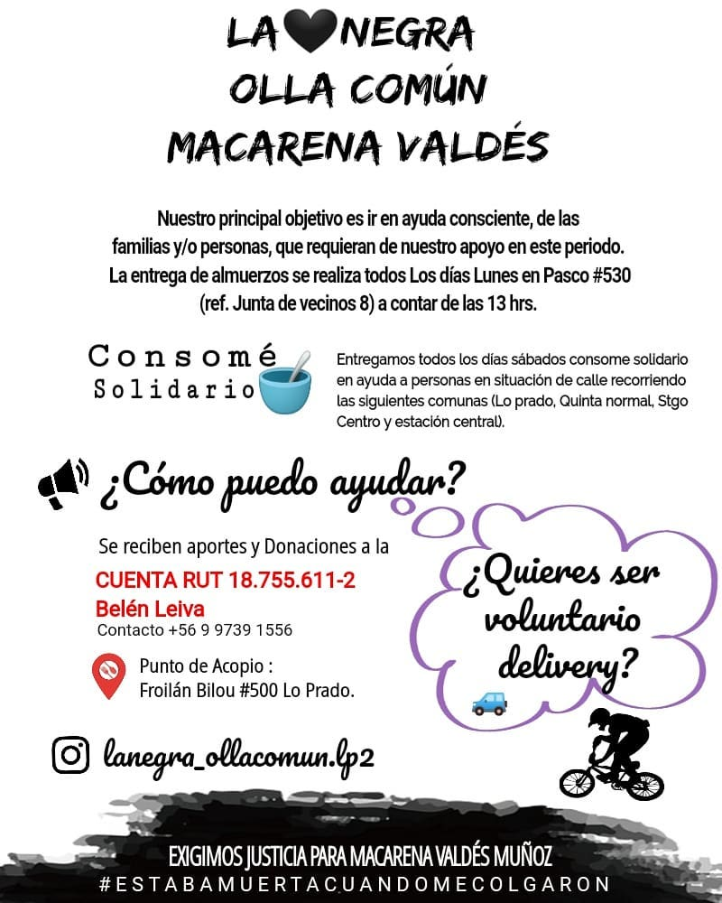
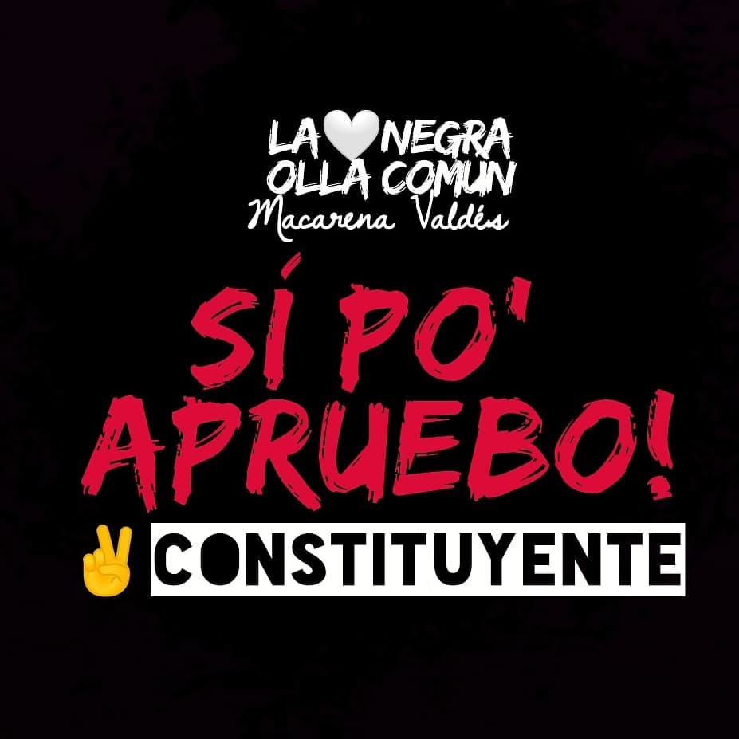
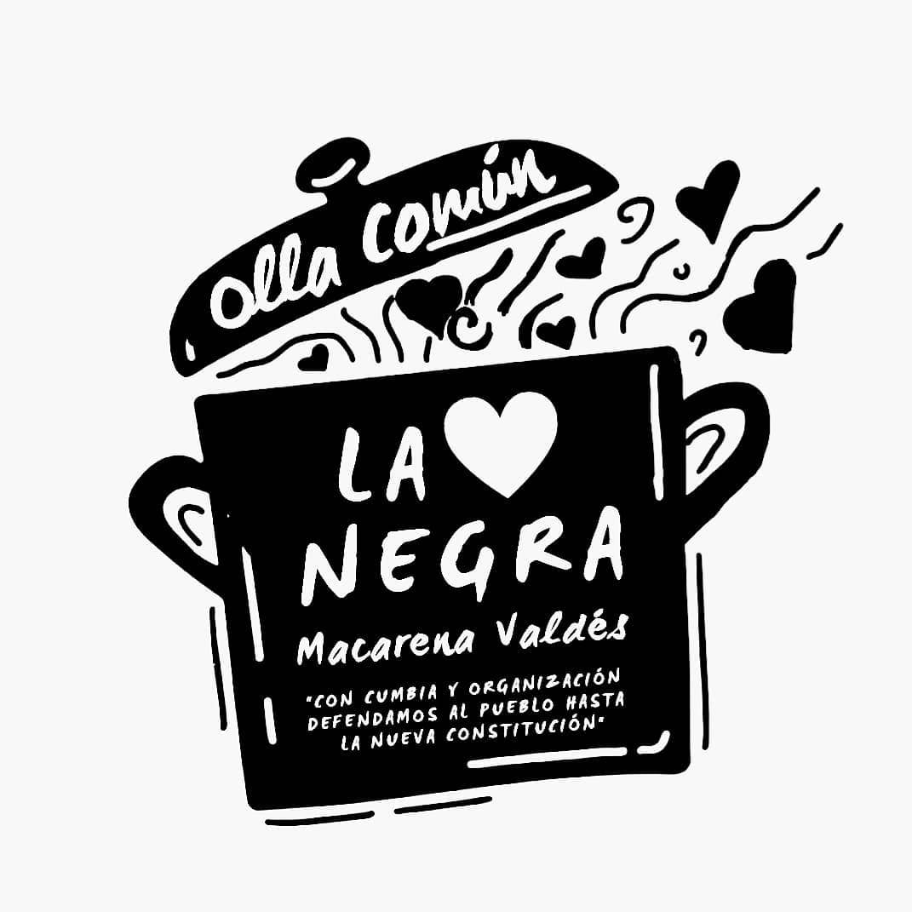
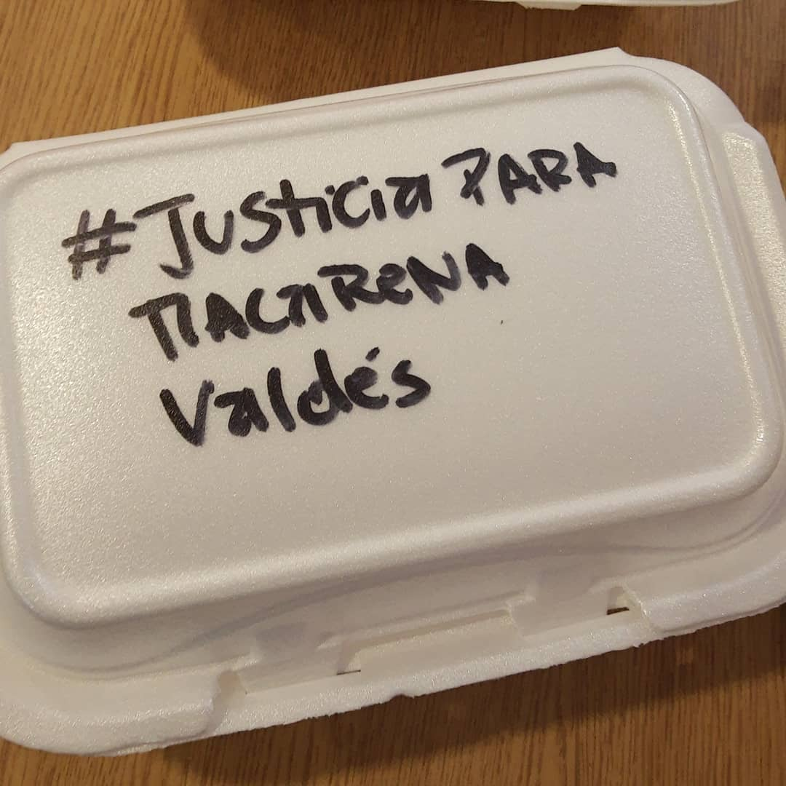
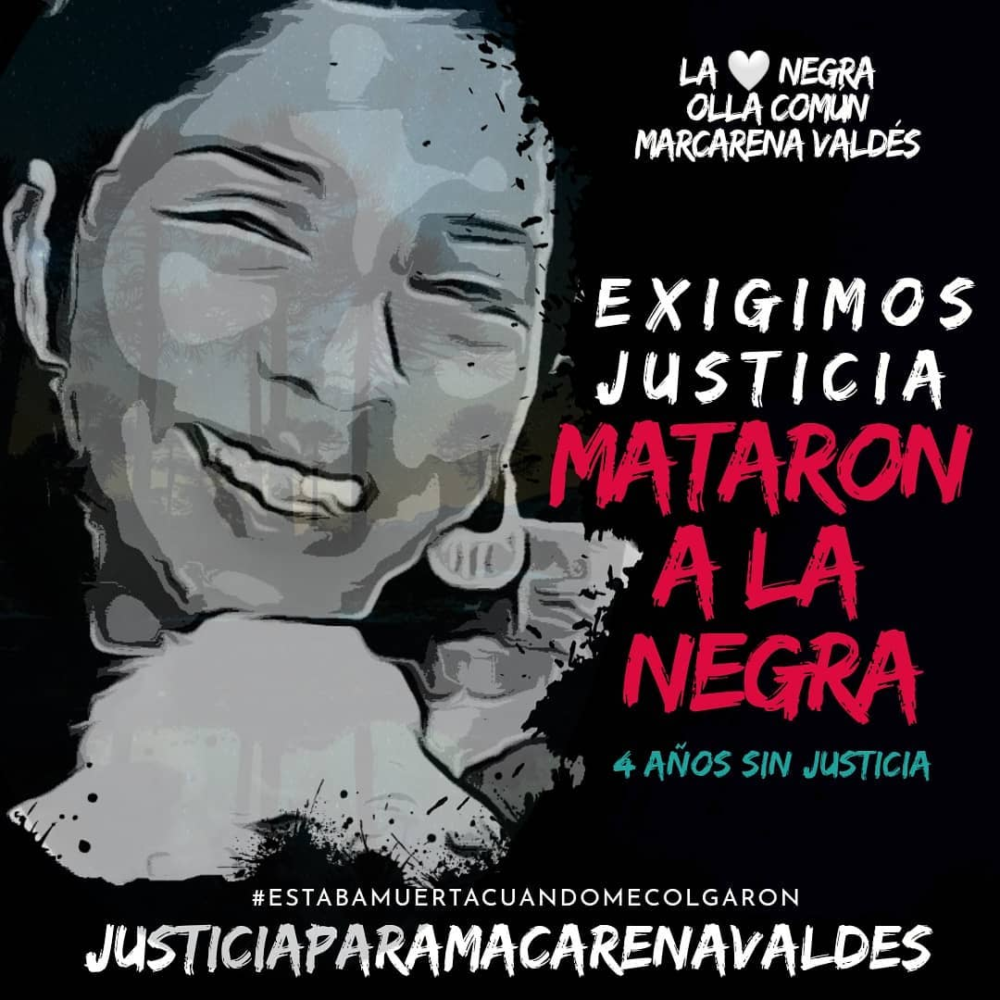
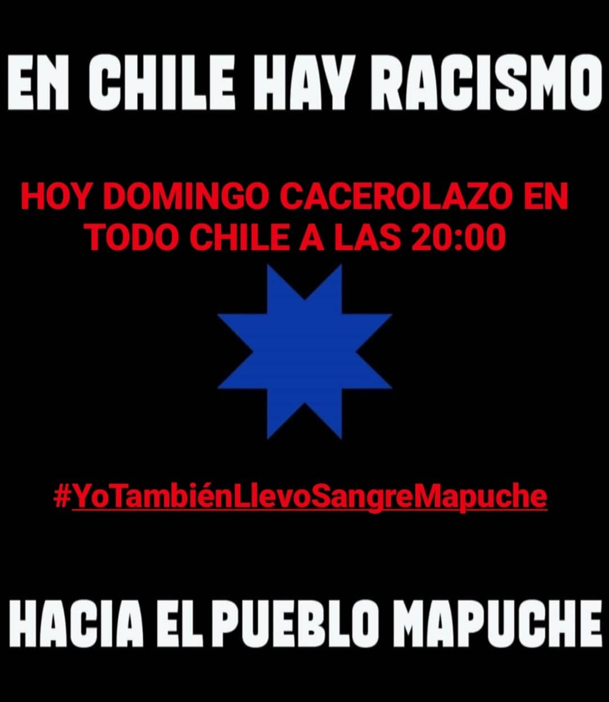

#### FOLIO: LPR8

# La Negra Olla común Macarena Valdés

[instagram](https://www.instagram.com/lanegra_ollacomun.lp2/
)
[facebook](https://www.facebook.com/lanegraollacomunLp2)
[twitter]()
<correo@correo.cl>
---

### Representantes
#### Belén Leiva 569 97391556

---
### Interacciones frecuentes
#### Olla común T1 Lo prado, Asamblea Terr Las Mercedes, Banda Barra cumbia.

### Redes sociales
#### ¿Para qué se utiliza la red social?
| Instagram | Facebook | Twitter | Otra 
|---|---|---|---|
|380|	602	|37
| 0|

### **Instagram**
| seguidores | seguidos | publicaciones | hashtag 
|---|---|---|---|
|Difusión de información y actividades. Mural de fotografías y videos de acciones concretadas.|Difusión de información y actividades. Mural de fotografías y videos de acciones concretadas.
|0| 0

---

* **Actividad:**  Continua.

* Primera Publicación IG 8 DE JULIO DE 2020

---
### Frecuencia de publicación.

Publicaciones: Semanales (de 3 a 4)

Actividades:

---
### Ubicación
* Sector de la comununa/ciudad: Pasco #530

---
### Describir temas de interés y/o trabajo
Organización territorial solidaria. Enfocada en la alimentación ,el apoyo mutuo y el proceso constituyente.

---
### Describir la imagen ideal por la cual se trabaja.
#### Con cumbia y organización defendamos al pueblo hasta la Nueva Constitución. SÓLO EL PUEBLO AYUDA AL PUEBLO

---
### ¿Que se hace?
#### Realizan una olla común como también ayudan a realizar el Registro social Hogares, IFE y apoyo para retiro 10%.

---
### Describir y distinguir demandas más reivindicativas de espacios sin relación con lo contencioso o con lo político mas prefigurativo
#### dirigida a vecinos y vecinas de lo prado. En especial adulto mayores.

---
### Tipo de organización interna.
#### Horizontalidad. Se distingue un trabajo por comisiones.

---
### Describir los temas / imágenes- iconos / conceptos mas habitualmente presentes en sus publicaciones. Describir cambios/ transformaciones en los contenidos desde Octubre.

**Iconos:** 

**Banderas:**

**Diseño estético:**

> Párrafo tipo cita 

---
### Percepciones que se tiene del Estado
#### (Aparato burocrático)
> resumen de lo encontrado

| Declaraciones | infografía | 
|---|---|
|Anotar los comunicados |  |

---
### Percepciones que se tiene de las Fuerzas de Orden
#### (Aparato represivo)
> resumen de lo encontrado

| Declaraciones | infografía | 
|---|---|
|Anotar los comunicados |  |

---
### 
Presentación olla común [Link instagram](https://www.instagram.com/p/CCYXIHaJW5L/)

Ayuda a adultos mayores [Link instagram](https://www.instagram.com/p/CDbxbEyphwn/)

