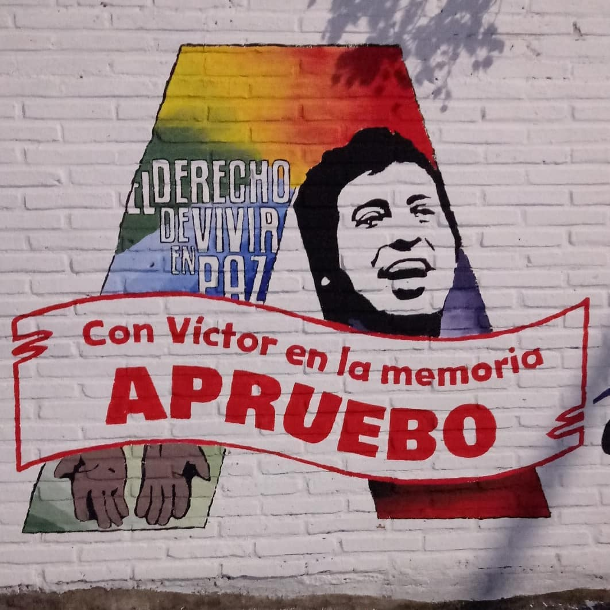
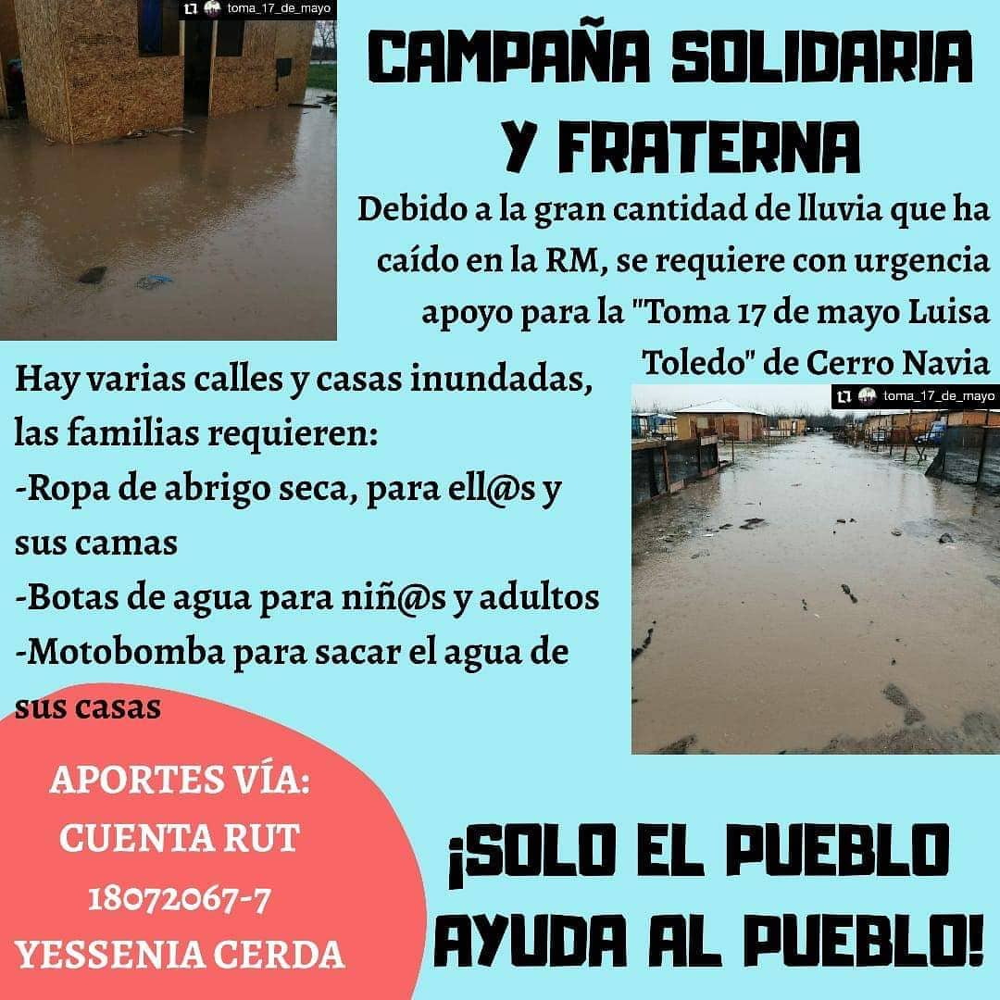
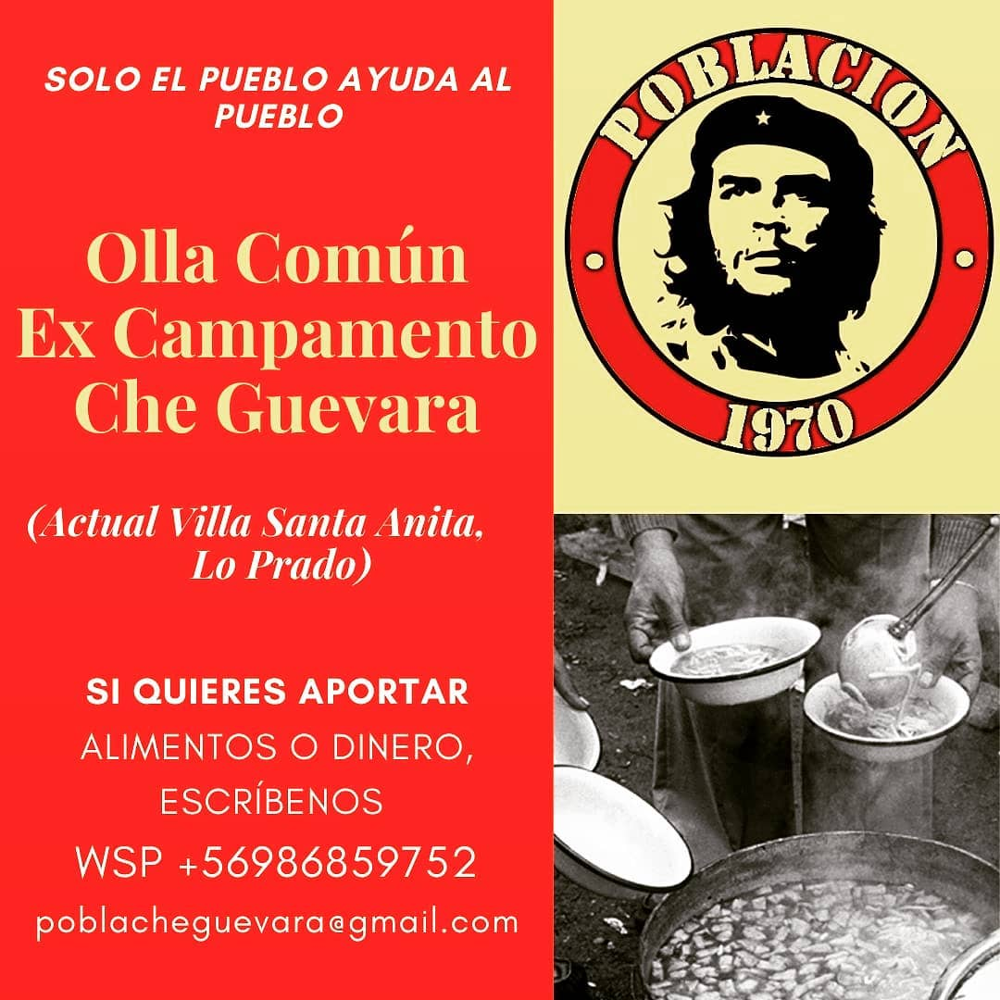
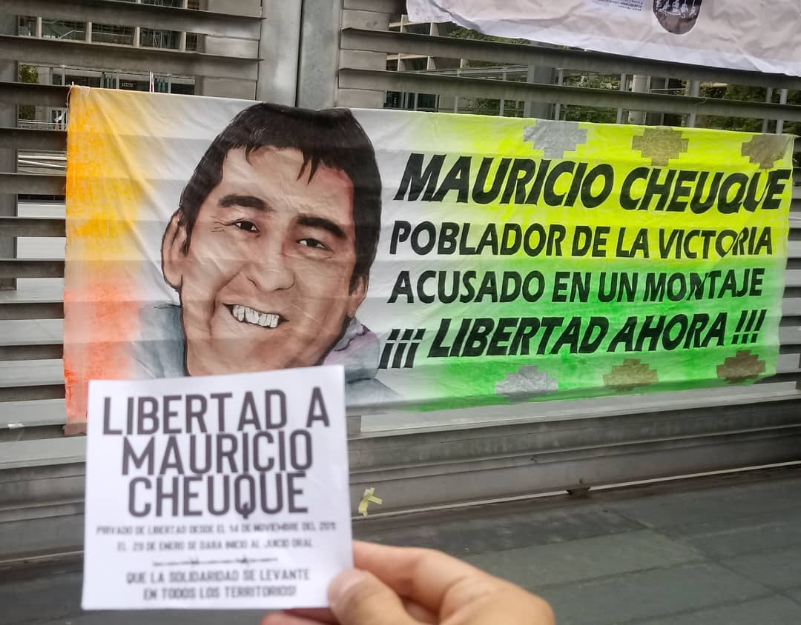
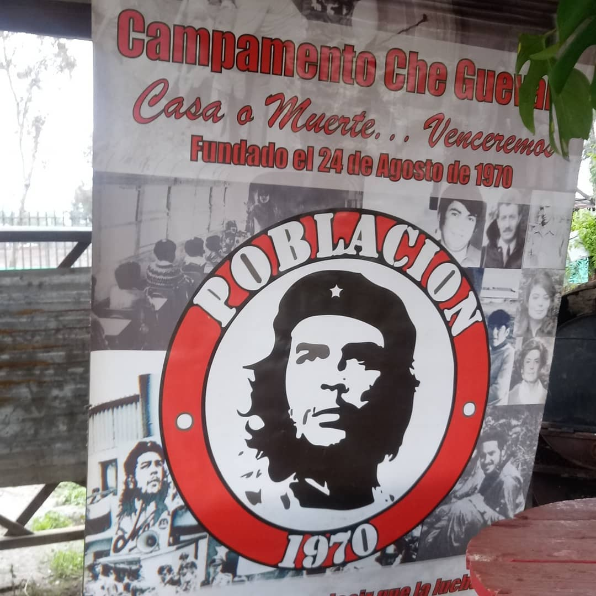
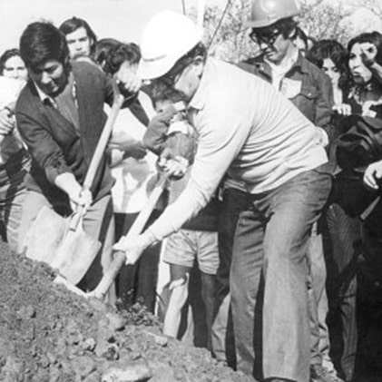
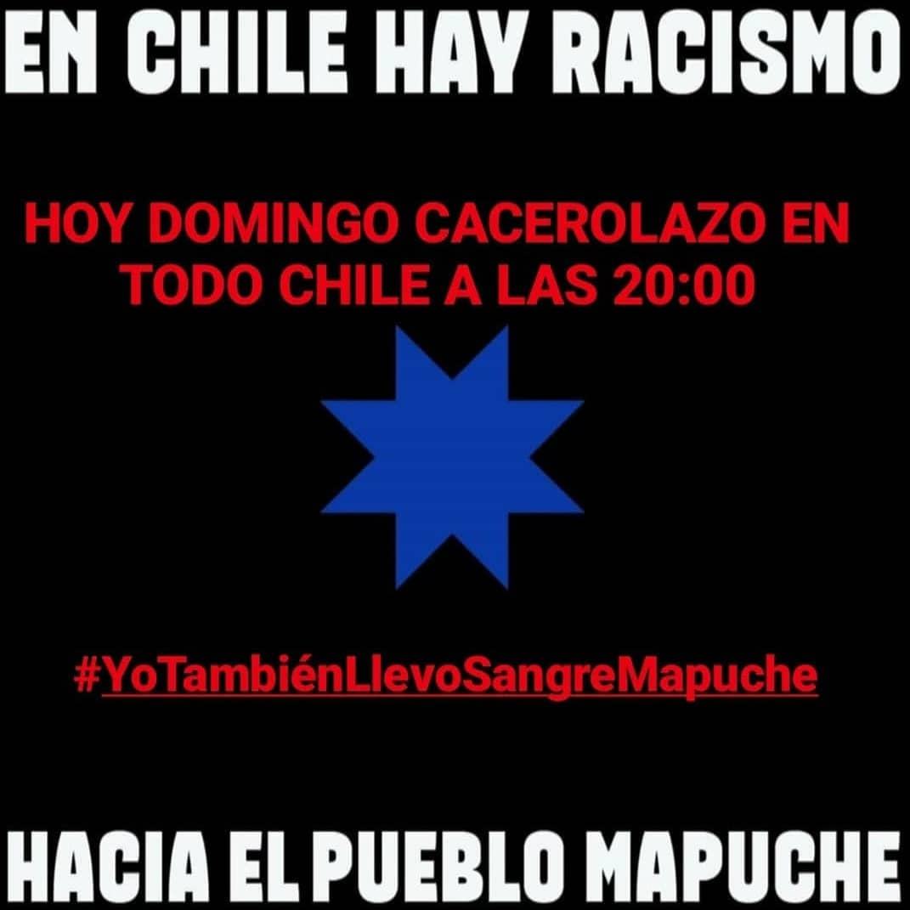
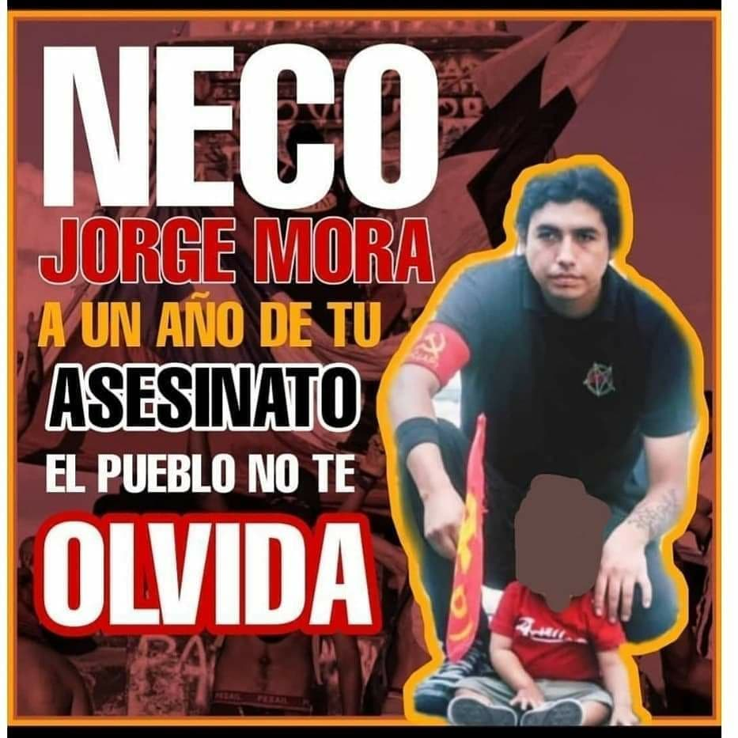
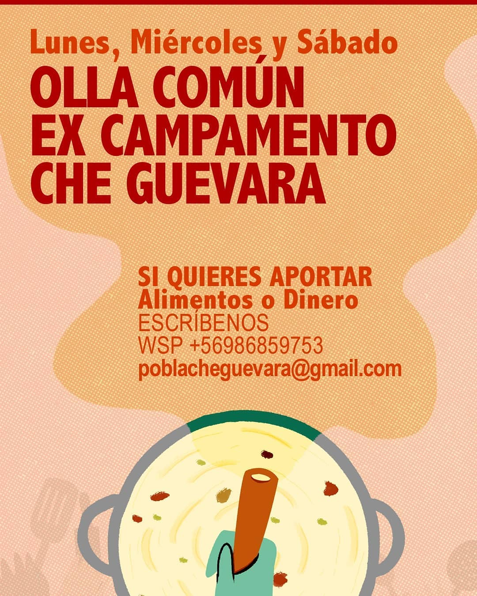
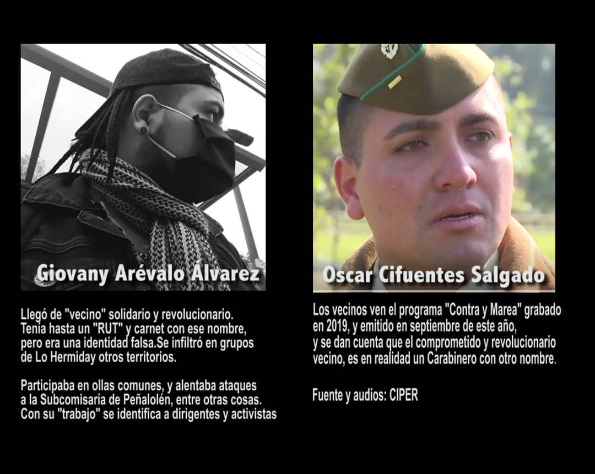

#### FOLIO: LPR7

# Olla común Che Guevara

[instagram](https://www.instagram.com/olla_comun_che/
)
[facebook]()
[twitter]()
<poblacheguevara@gmail.com
>
---

### Representantes
#### 

---
### Interacciones frecuentes
#### Olla común T1 Lo prado,

### Redes sociales
#### ¿Para qué se utiliza la red social?
| Instagram | Facebook | Twitter | Otra 
|---|---|---|---|
|Difusión de información y actividades. Mural de fotografías de acciones concretadas.
|0|0| 0|

### **Instagram**
| seguidores | seguidos | publicaciones | hashtag 
|---|---|---|---|
|563|74|	117| 0

---

* **Actividad:**   Continuas

* Primera Publicación IG 14 DE JUNIO DE 2020

---
### Frecuencia de publicación.

Publicaciones: Día por medio

Actividades: Día por medio

---
### Ubicación
* Sector de la comununa/ciudad: ex Campamento Che Guevara, actual Villa Santa Anita

---
### Describir temas de interés y/o trabajo
Organización territorio solidaria que nace para cubrir necesidad alimenticias. Apoyo mutuo , colaboración entre vecinos y organizaciones.

---
### Describir la imagen ideal por la cual se trabaja.
#### "Solo el pueblo ayuda al pueblo" En Chile hay racismo #Yotambienllevosangremapuche.

---
### ¿Que se hace?
#### Ollas comunes y actos conmemorativos como por ejemplo los 50 años del campamento Che Guevara

---
### Describir y distinguir demandas más reivindicativas de espacios sin relación con lo contedirigidoncioso o con lo político mas prefigurativo
#### Difigido a vecinos y vecinas de la población Che Guevara

---
### Tipo de organización interna.
#### No se logra distinguir una estructura organizativa. Pero se distingue un trabajo con comisiones para el funcionamiento de la olla.

---
### Describir los temas / imágenes- iconos / conceptos mas habitualmente presentes en sus publicaciones. Describir cambios/ transformaciones en los contenidos desde Octubre.

**Iconos:**    

**Banderas:** 

**Diseño estético:** 

> Párrafo tipo cita 

---
### Percepciones que se tiene del Estado
#### (Aparato burocrático)
> resumen de lo encontrado

| Declaraciones | infografía | 
|---|---|
|No podemos permanecer indiferentes ante los #pacosinfiltrados en ollas, no solo entorpecen nuestro funcionamiento, además sapean y buscan al #enemigopoderosoeimplacable en un espacio donde nos organizamos como población ante el nulo apoyo del gobierno y el municipio.|  |

---
### Percepciones que se tiene de las Fuerzas de Orden
#### (Aparato represivo)
> resumen de lo encontrado

| Declaraciones | infografía | 
|---|---|
||  |

---
### Caron Cariola (https://www.instagram.com/p/CESgHAAJCsr)
### Ana Tijoux  (https://www.instagram.com/p/CHGCuRtJgLX/)
