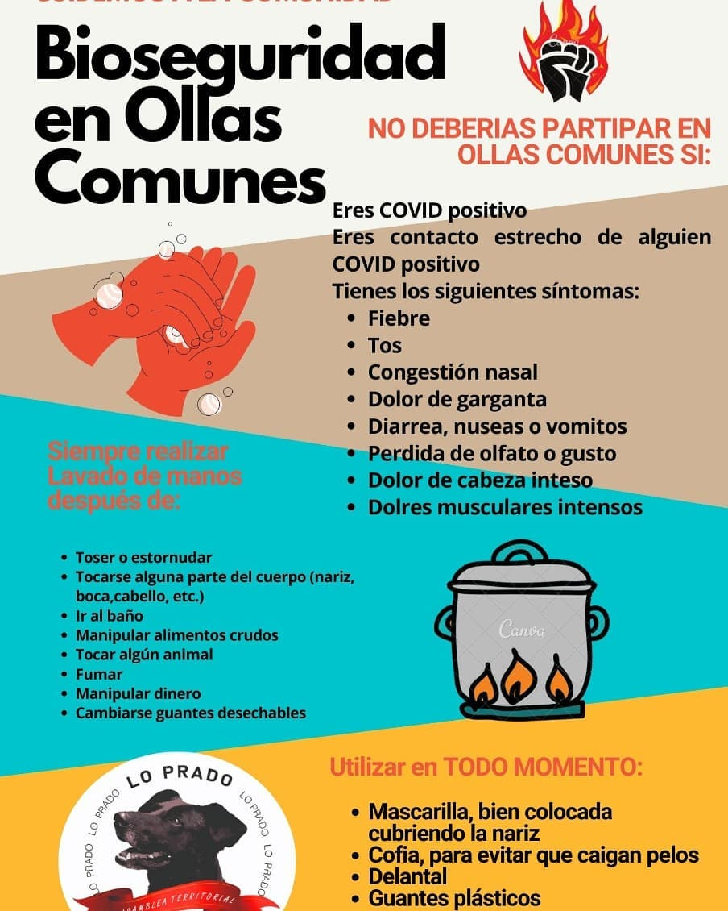
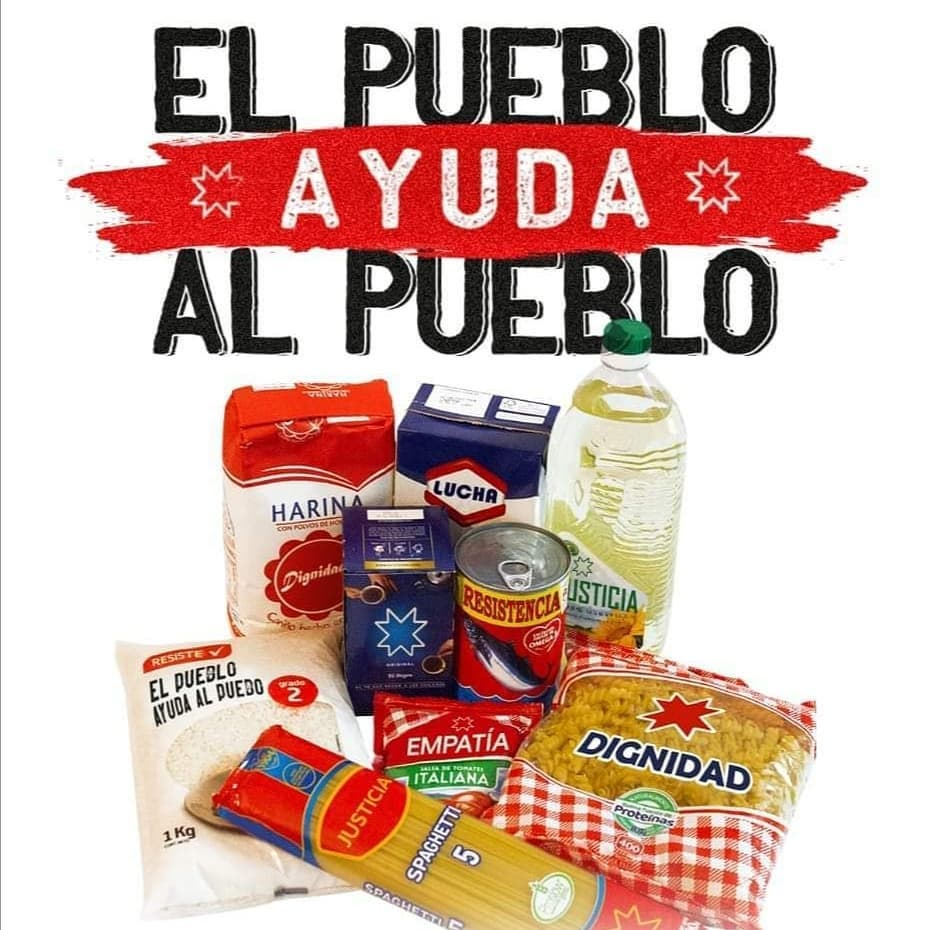
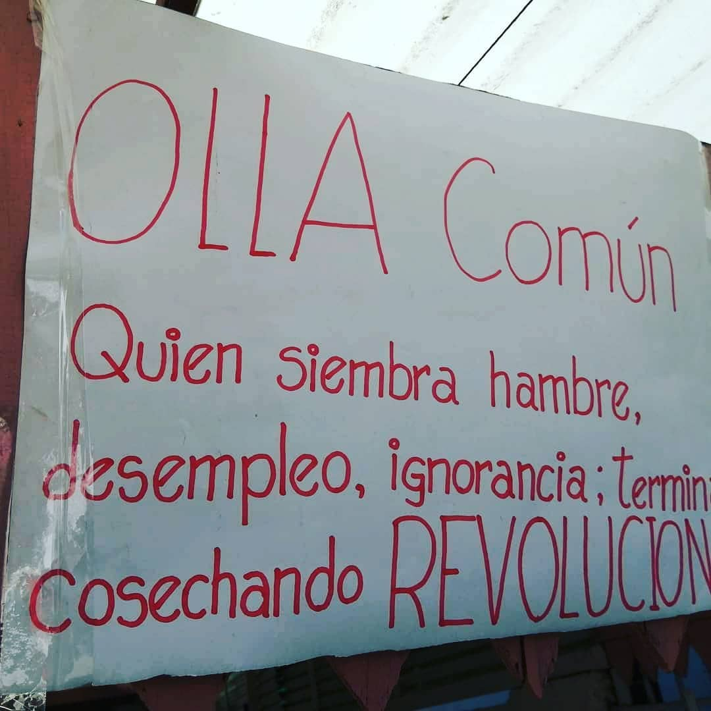
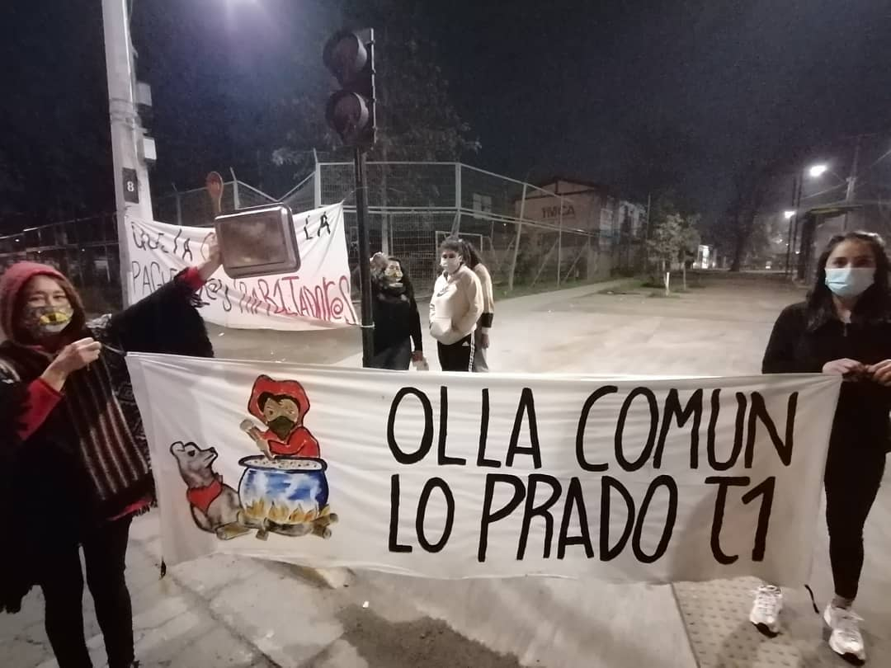
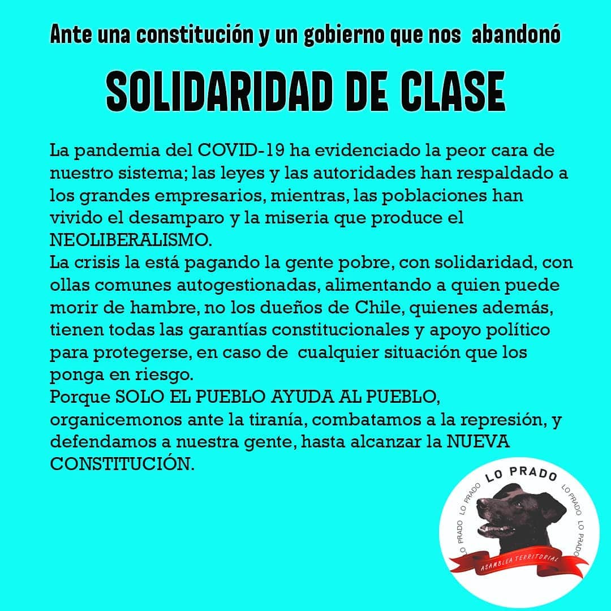

#### FOLIO: LPR2

# Olla común T1 Lo Prado

[instagram](https://www.instagram.com/ollacomunt1.lp2/
)
[facebook]()
[twitter]()
<ollacomunt1.lp2@gmail.com>
>
---

### Representantes
####  / Teléfono 97210144

---
### Interacciones frecuentes
#### Cicletada lo Prado, Asamblea comunal Lo Prado, Granitos de mostazas, Olla común Che Guevara.

### Redes sociales
#### ¿Para qué se utiliza la red social?
| Instagram | Facebook | Twitter | Otra 
|---|---|---|---|
|Difusión de información y actividades. Mural de fotografías de acciones concretadas.
|0|0| 0|

### **Instagram**
| seguidores | seguidos | publicaciones | hashtag 
|---|---|---|---|
|412|	373|	135
0| 0

---

* **Actividad:**   Continua desde el inicio de la crisis socio sanitaria.

* Primera Publicación IG 23 DE MAYO DE 2020

---
### Frecuencia de publicación.

Publicaciones:

Actividades:

---
### Ubicación
* Sector de la comununa/ciudad: Puerto Rico 8099, Lo Prado

---
### Describir temas de interés y/o trabajo
####  Organización solidaria y de apoyo mutuo. Trabaja para cubrir necesidades durante la crisis socio sanitaria.
---
### Describir la imagen ideal por la cual se trabaja.
#### 

---
### ¿Que se hace?
#### Olla común y campañas de acopio de alimentos para la olla

---
### Describir y distinguir demandas más reivindicativas de espacios sin relación con lo contencioso o con lo político mas prefigurativo
####

---
### Tipo de organización interna.
####  Horizontalidad. Se distingue un trabajo por comisiones

---
### Describir los temas / imágenes- iconos / conceptos mas habitualmente presentes en sus publicaciones. Describir cambios/ transformaciones en los contenidos desde Octubre.

**Iconos:** 

**Banderas:** 

**Diseño estético:**

> Párrafo tipo cita 

---
### Percepciones que se tiene del Estado
#### (Aparato burocrático)
> resumen de lo encontrado

| Declaraciones | infografía | 
|---|---|
| |  |

---
### Percepciones que se tiene de las Fuerzas de Orden
#### (Aparato represivo)
> resumen de lo encontrado

| Declaraciones | infografía | 
|---|---|
|Anotar los comunicados |  |

---
### Video 
[Link video instagram](https://www.instagram.com/p/CBOE8VjlPIO/)

[Link video instagram](https://www.instagram.com/p/CBqd2jrJXdW/)