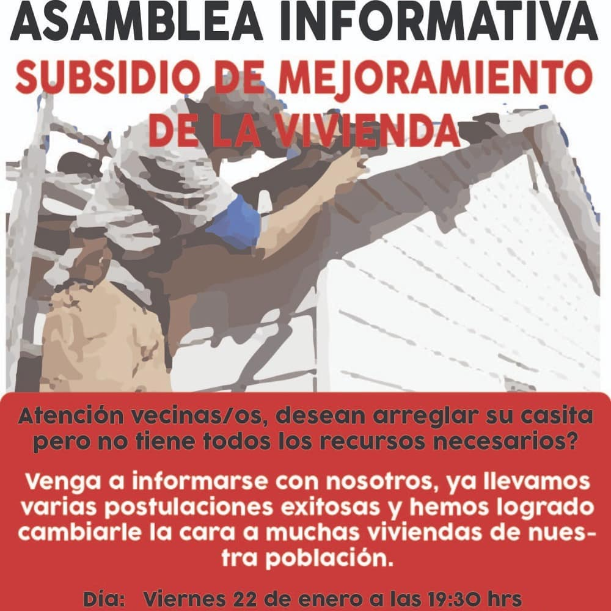
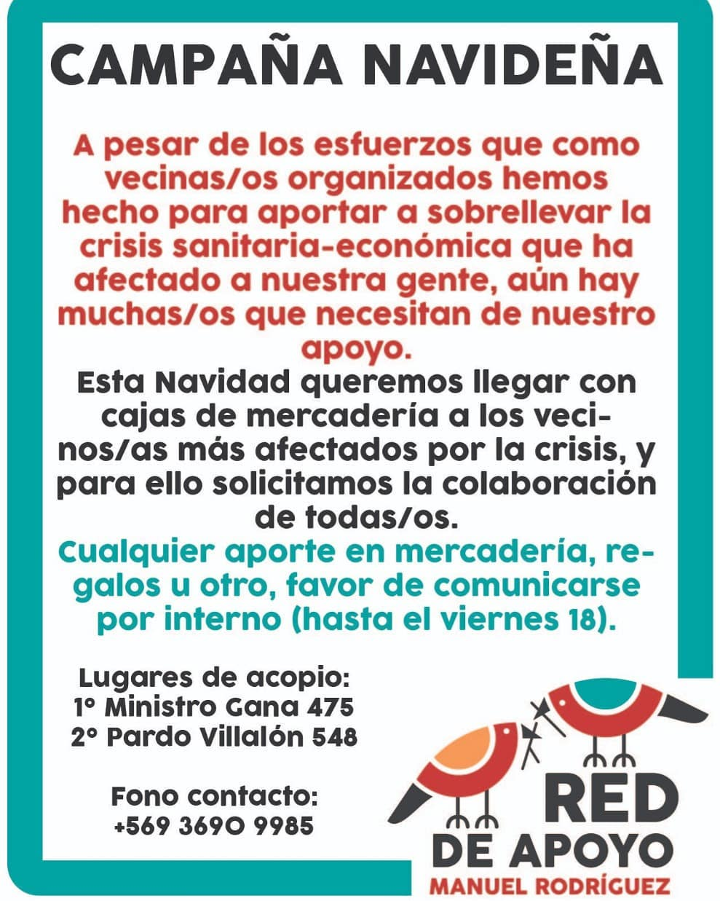
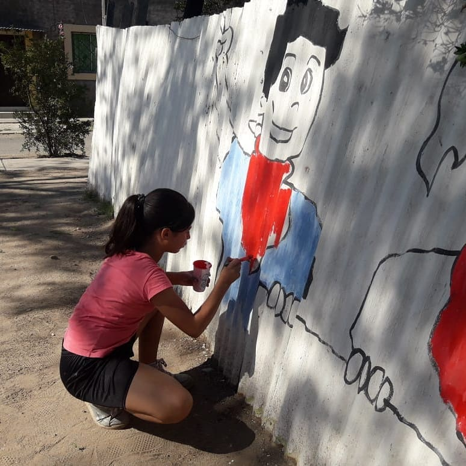
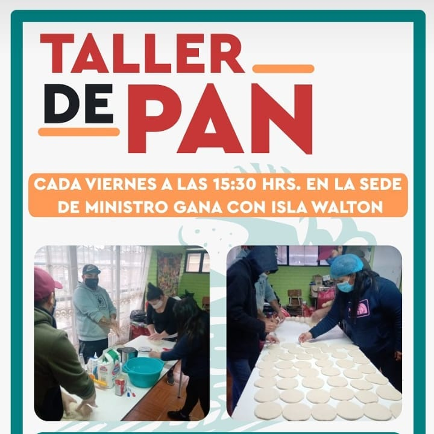
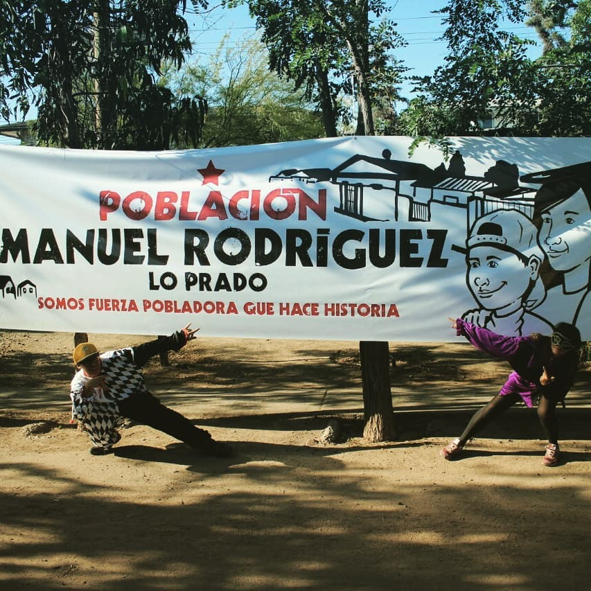
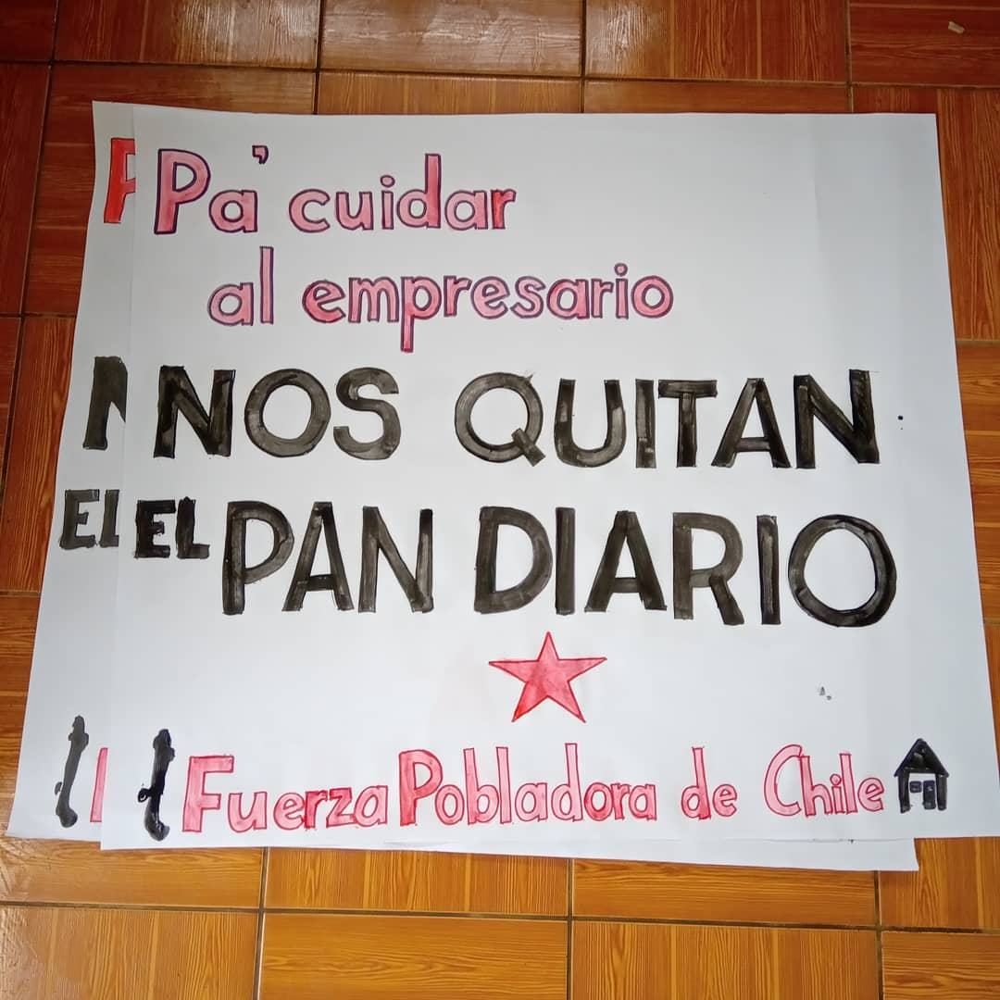
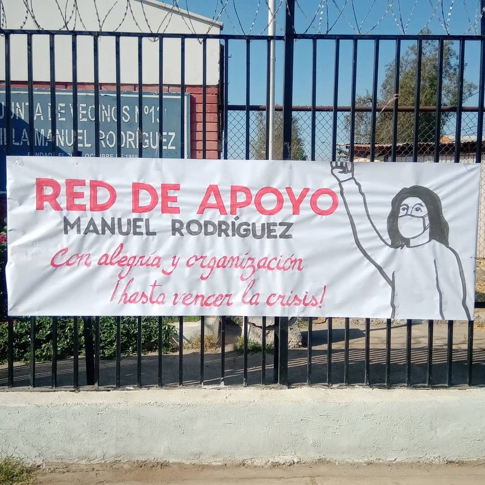
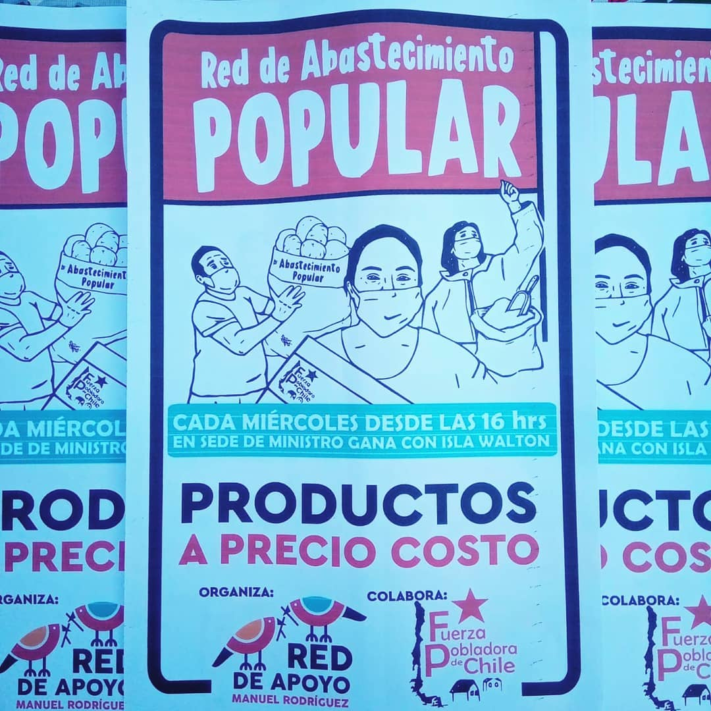
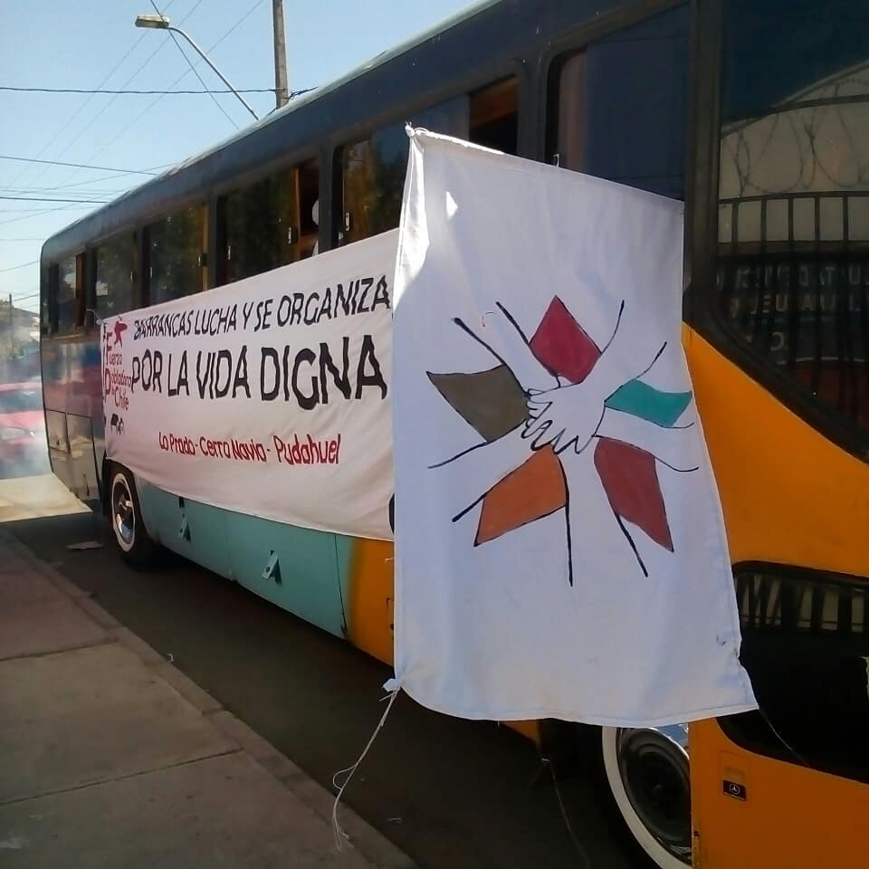
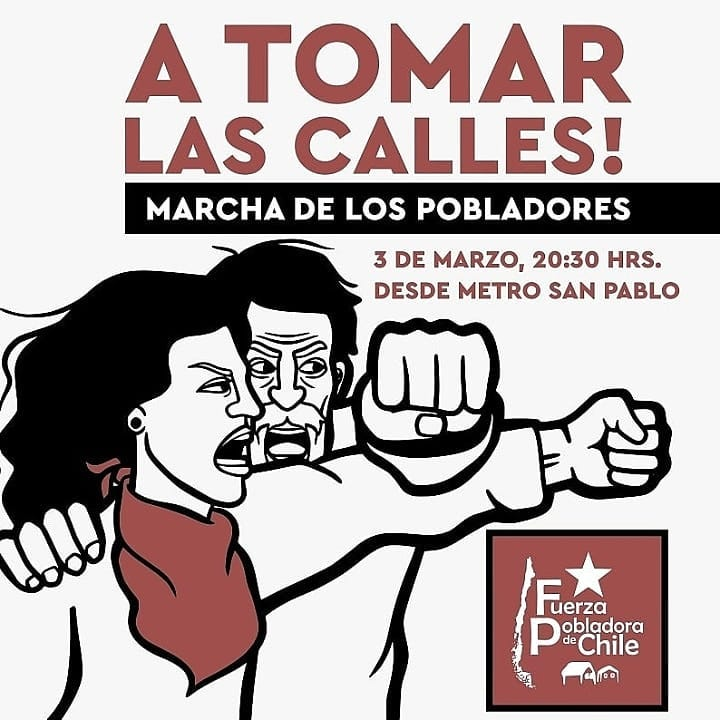

#### FOLIO: LPR5

# Red de Apoyo Manuel Rodríguez

[instagram](https://www.instagram.com/p/B4_K281FFTr/
)

---

### Representantes
#### Teléfono: 569 36909985

---
### Interacciones frecuentes
#### Conjunto parronal de peralillo, juventud comunista Lo Prado, desorden publico y fuerza popular Chile.

### Redes sociales
#### ¿Para qué se utiliza la red social?
| Instagram | Facebook | Twitter | Otra 
|---|---|---|---|
|Difusión de información y actividades. Mural de fotografías de acciones concretadas.
|0|0| 0|

### **Instagram**
| seguidores | seguidos | publicaciones | hashtag 
|---|---|---|---|
|364|	280|	92
| 0

---

* **Actividad:**   Discontinua.

* Primera Publicación IG 18 DE OCTUBRE DE 2018

---
### Frecuencia de publicación.

Publicaciones: Mensuales

Actividades:

---
### Ubicación
* Sector de la comununa/ciudad: Población Manuel Rodríguez

---
### Describir temas de interés y/o trabajo
Organización territorial solidaria que trabaja en ayuda alimentaria para hacer frente a la crisis sanitaria. Su principal interés es la unión y convivencia vecinal

---
### Describir la imagen ideal por la cual se trabaja.
#### Con alegría y organización, hasta vencer la crisis" "Pa´cuidar al empresario nos quitan el pan a diario"

---
### ¿Que se hace?
#### Asambleas populares abiertas. Llamados a marchas/ Acciones solidarias como Ollas comunes

---
### Describir y distinguir demandas más reivindicativas de espacios sin relación con lo contencioso o con lo político mas prefigurativo
#### se dirige a vecinos y vecinas de población Manuel Rodríguez. Transformación de cotidiana de vivir en el barrio.

---
### Tipo de organización interna.
#### Post estallido se distingue el asambleísmo. En periodo de pandemia predomina el trabajo por comisiones.

---
### Describir los temas / imágenes- iconos / conceptos mas habitualmente presentes en sus publicaciones. Describir cambios/ transformaciones en los contenidos desde Octubre.

**Iconos:** 

**Banderas:**   

**Diseño estético:**   

> Párrafo tipo cita 

---
### Percepciones que se tiene del Estado
#### (Aparato burocrático)
> resumen de lo encontrado

| Declaraciones | infografía | 
|---|---|
|Anotar los comunicados |  |

---
### Percepciones que se tiene de las Fuerzas de Orden
#### (Aparato represivo)
> resumen de lo encontrado

| Declaraciones | infografía | 
|---|---|
|Anotar los comunicados |  |

---
### Incorporar aca notas, citas textuales, links, etc. extra a los ya incorporados, que sean de interés para comprender tanto la forma como los contenidos asociados a la organización.
