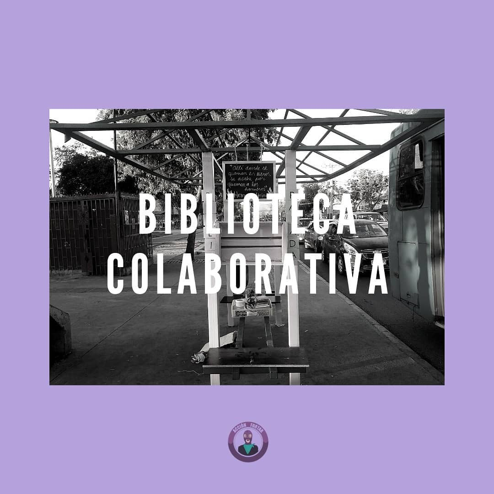
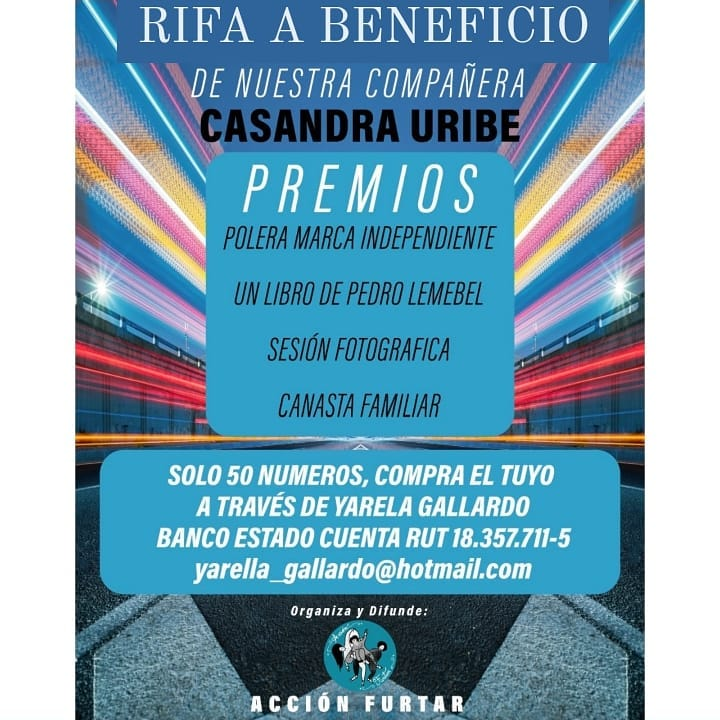
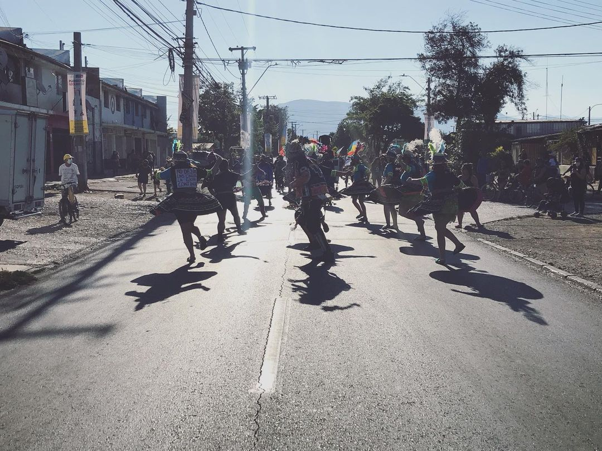
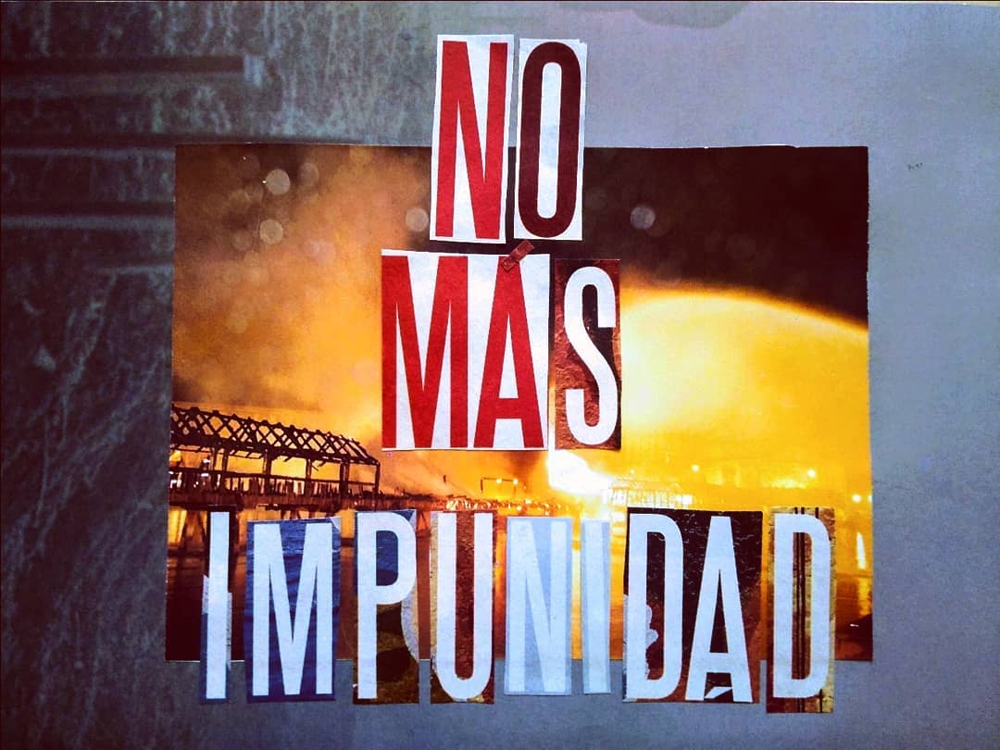
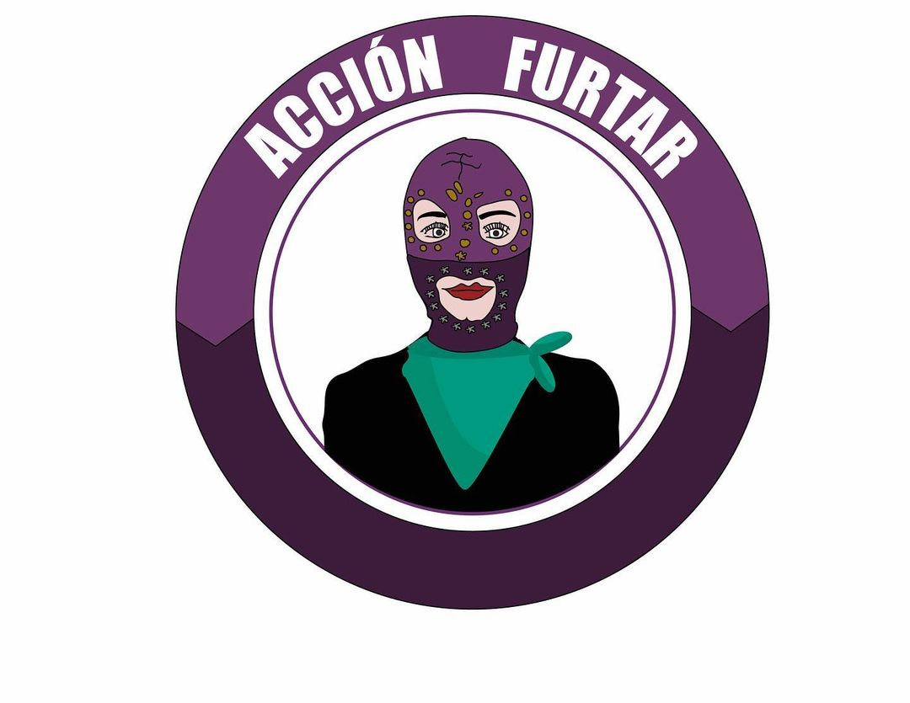
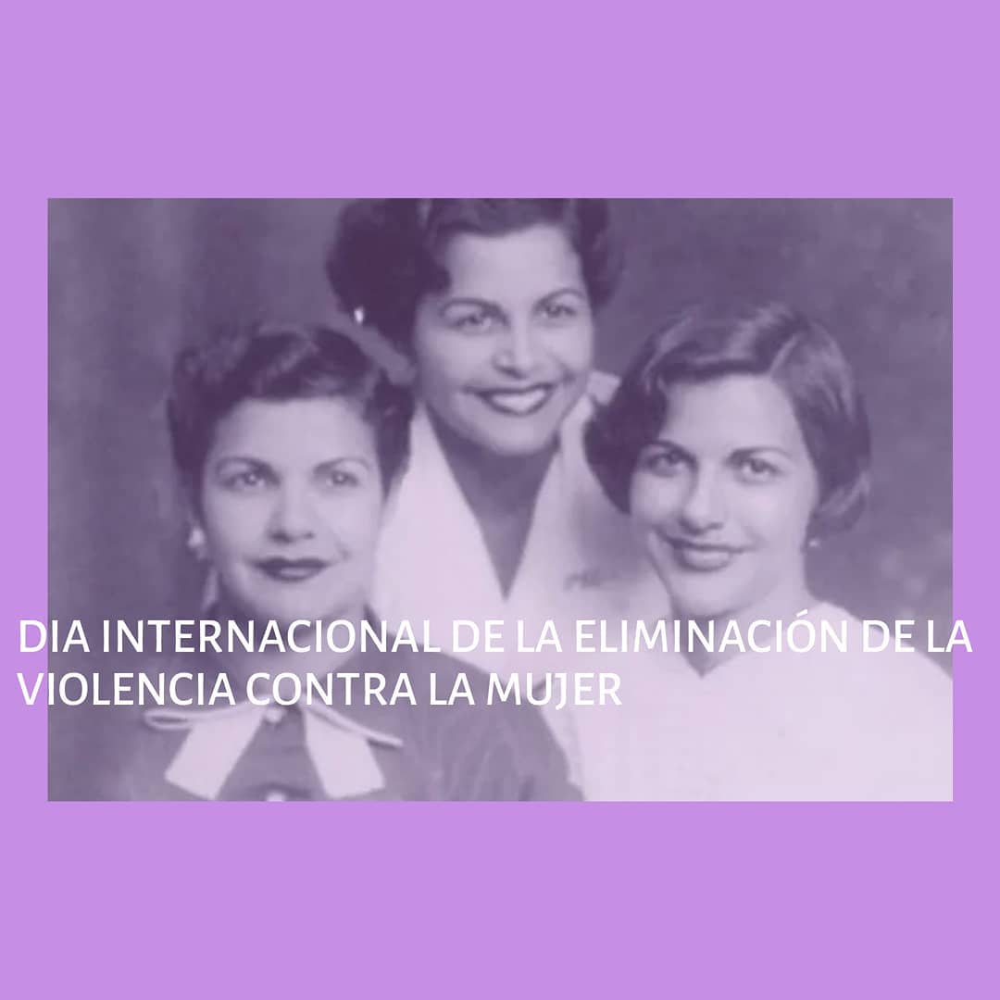

#### FOLIO: PUD4
# Acción Furtar

[instagram](https://www.instagram.com/p/CFfvC56gyfh/
)
[facebook]()
[twitter]()
<Accionfurtar@gmail.com
>
---

### Representantes
#### (Nombres o emails de voceros o representantes).

---
### Interacciones frecuentes
#### Colectiva perra filtra, Colectivo La yuyo, Pudahuel Fem, Colectiva periféricas.

### Redes sociales
#### ¿Para qué se utiliza la red social?
| Instagram | Facebook | Twitter | Otra 
|---|---|---|---|
|Difusión de información y actividades. Mural de fotografías de acciones concretadas.
|0|0| 0|

### **Instagram**
| seguidores | seguidos | publicaciones | hashtag 
|---|---|---|---|
|401|	615	|19
| 0

---

* **Actividad:**   Continua

* Primera Publicación IG

---
### Frecuencia de publicación.

Publicaciones: Semanales (de 3 a 4) desde septiembre del 2020

Actividades:

---
### Ubicación
* Sector de la comununa/ciudad: Pudahuel en general.

---
### Describir temas de interés y/o trabajo
Feminismo, apoyo mutuo y apropiación del espacio publico.

---
### Describir la imagen ideal por la cual se trabaja.
#### La organización menciona que: " queremos reivindicar la organización comunitaria como una relación socio-afectiva que crea vínculos de reciprocidad, pero que además hace confluir distintas luchas de compañeras y compañeros".

---
### ¿Que se hace?
#### La organización realiza intervenciones artísticas y actos conmemorativos en la vía publica. Acciones solidarias como rifas solidarias, difusión de centrales de acopio.

---
### Describir y distinguir demandas más reivindicativas de espacios sin relación con lo contencioso o con lo político mas prefigurativo
#### "Libertad a todos los presos por luchar" "No mas impunidad"

---
### Tipo de organización interna.
#### No se distingue con claridad la estructura organizativa. Se visualiza horizontalidad.

---
### Describir los temas / imágenes- iconos / conceptos mas habitualmente presentes en sus publicaciones. Describir cambios/ transformaciones en los contenidos desde Octubre.

**Iconos:**

**Banderas:**

**Diseño estético:**

> Párrafo tipo cita 

---
### Percepciones que se tiene del Estado
#### (Aparato burocrático)
> resumen de lo encontrado

| Declaraciones | infografía | 
|---|---|
|Anotar los comunicados |  |

---
### Percepciones que se tiene de las Fuerzas de Orden
#### (Aparato represivo)
> resumen de lo encontrado

| Declaraciones | infografía | 
|---|---|
|Anotar los comunicados |  |

---
### Video intervención: [Instagram](https://www.instagram.com/p/CIjv65ipHZx/)
