#### FOLIO: PDU7

# Asamblea Mar de Drake

[instagram](https://www.instagram.com/vec.mardedrake/
)
[facebook](https://www.facebook.com/Mardedrake)

---

### Representantes
#### Teléfono: 09 3731 8866
.

---
### Interacciones frecuentes
#### Asamblea Popular de Pudahuel, Asamblea Territorial Pudahuel Sur, Pudahuel, Movimiento Comuna Popular, cordón Grecia, cordón poniente, Plaza Pitágoras, Pedal Lo Prado, Pudahuel fem, Colectiva perra filtra, Luchin de barrancas.

### Redes sociales
#### ¿Para qué se utiliza la red social?
| Instagram | Facebook | Twitter | Otra 
|---|---|---|---|
|Difusión de información y actividades. Mural de fotografías de acciones concretadas.
|0|0| 0|

### **Instagram**
| seguidores | seguidos | publicaciones | hashtag 
|---|---|---|---|
|2544|	2983|	253
| 0

---

* **Actividad:**   Continua. 

* Primera Publicación IG 12 DE DICIEMBRE DE 2019

---
### Frecuencia de publicación.

Publicaciones: Mensuales (de 4 a 5) A partir del periodo de crisis Semanales (de 3 a 4)

Actividades:

---
### Ubicación
* Sector de la comununa/ciudad: Plaza Mar de Drake

---
### Describir temas de interés y/o trabajo
#### Organización territorial de apoyo mutuo, sus intereses están el proceso constituyente, soberanía alimentaria y la crisis sanitaria.
---
### Describir la imagen ideal por la cual se trabaja.
#### El pueblo ayuda al pueblo

---
### ¿Que se hace?
#### Múltiples acciones colectivas como Asambleas abiertas, jornadas de actividades barriales como pasacalles, tocatas, huertos comunitarios. Llamados a protestas, banderazos. Por otro lado acciones solidarias como ollas comunes, sanitación de pasajes, rifas, entre otros.

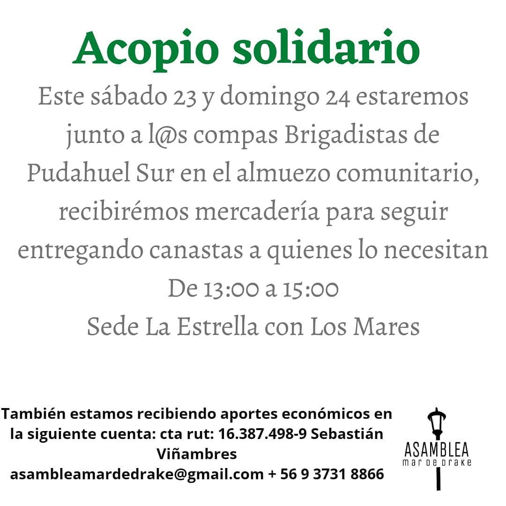
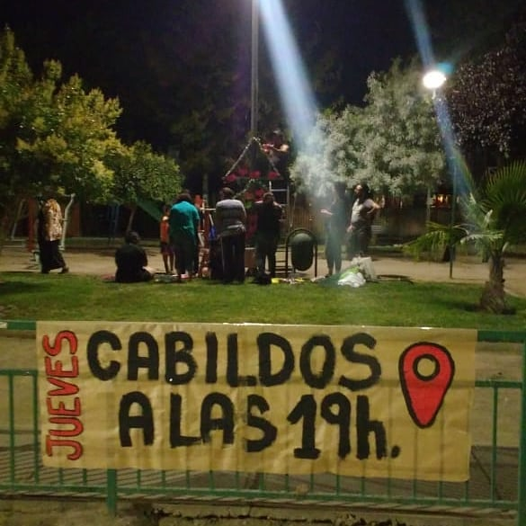
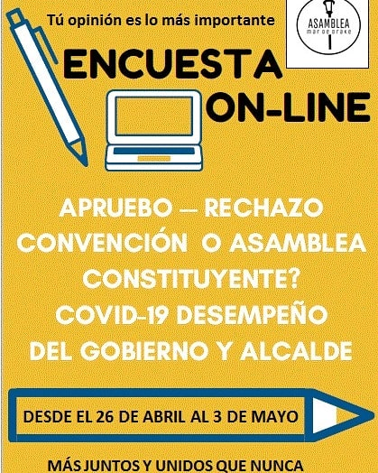
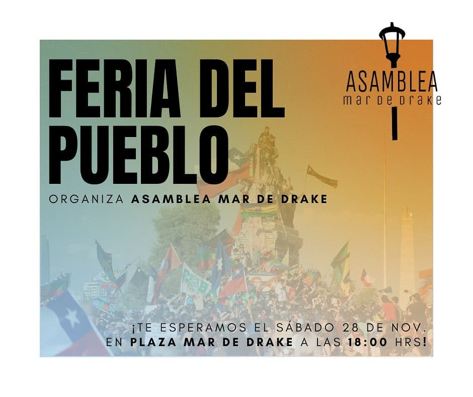
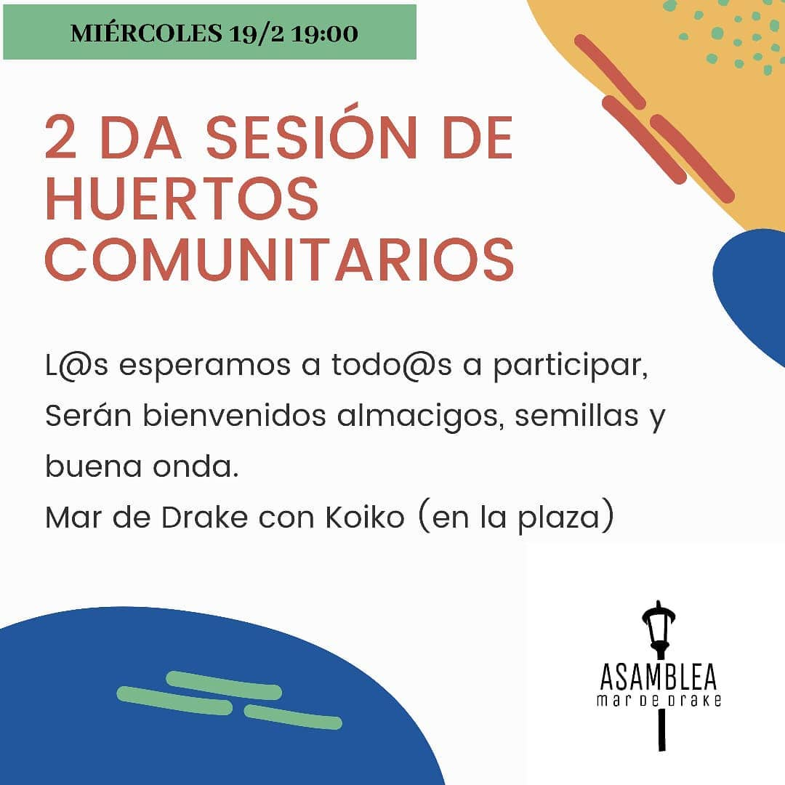
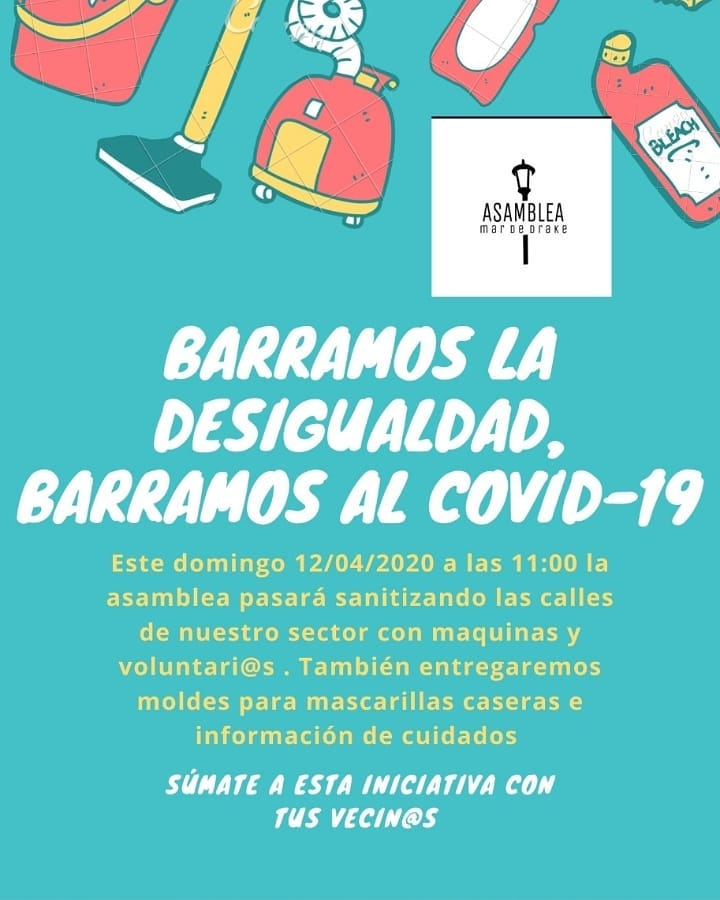
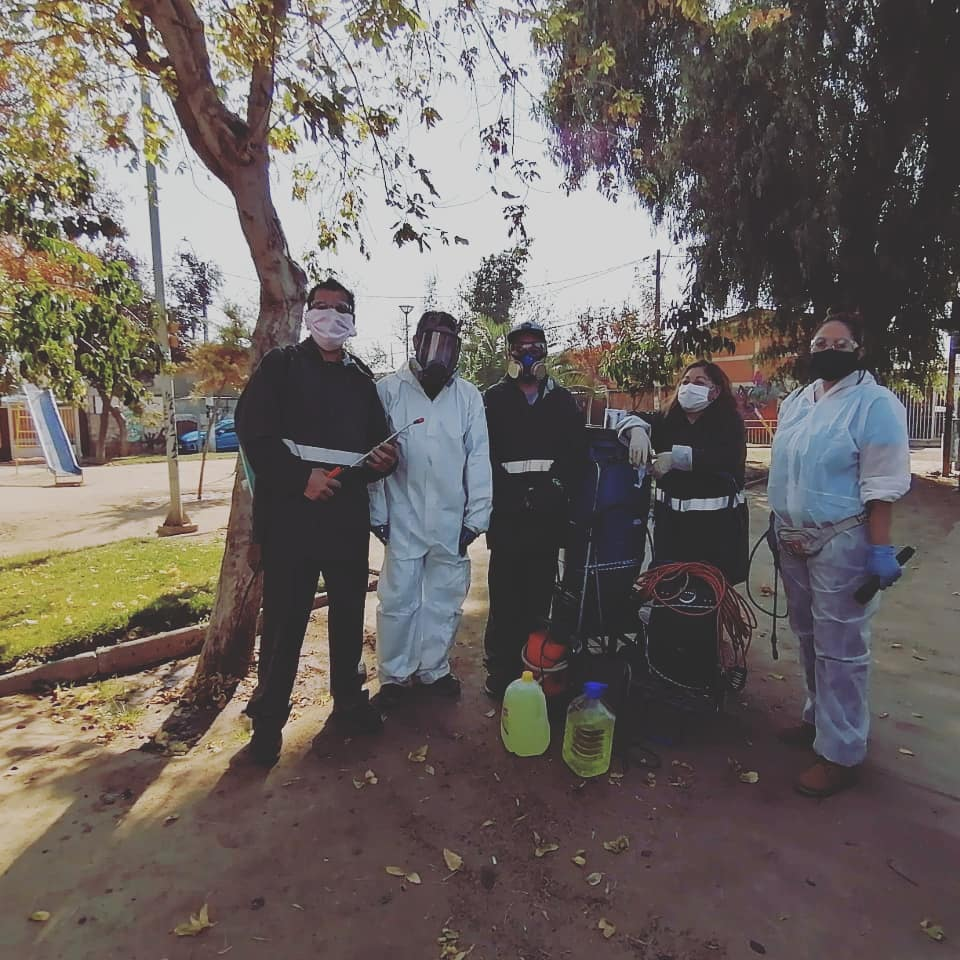
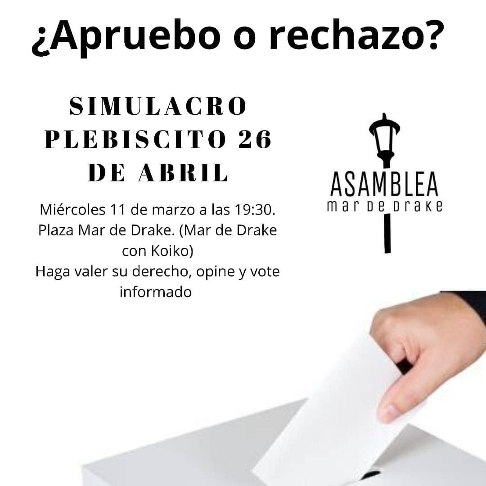
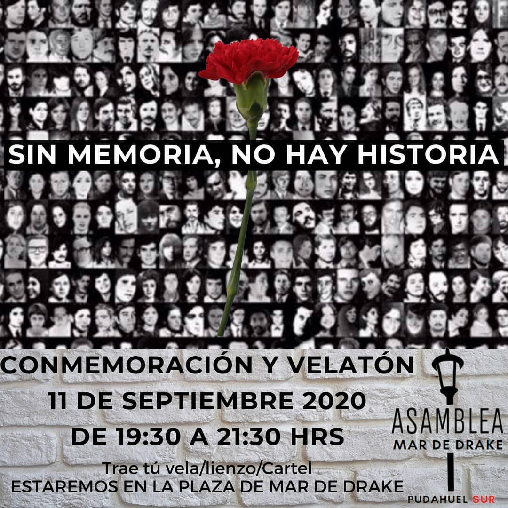

---
### Describir y distinguir demandas más reivindicativas de espacios sin relación con lo contencioso o con lo político mas prefigurativo
#### Dirigido a vecinos y vecinas de Pudahuel sur. Transformación cotidiana del vivir en el barrio. Emplaza a autoridades centrales. No mas AFP
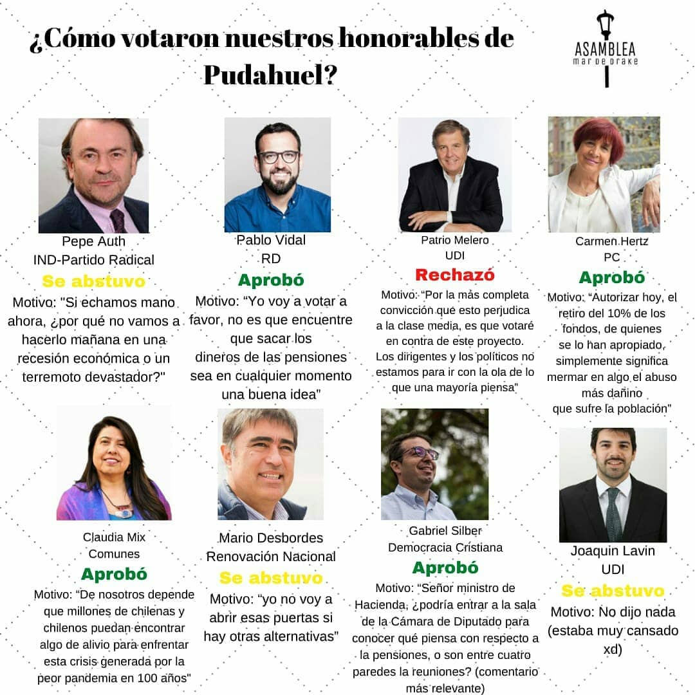

---
### Tipo de organización interna.
#### Asambleísmo y Horizontalidad.

---
### Describir los temas / imágenes- iconos / conceptos mas habitualmente presentes en sus publicaciones. Describir cambios/ transformaciones en los contenidos desde Octubre.

**Iconos:** 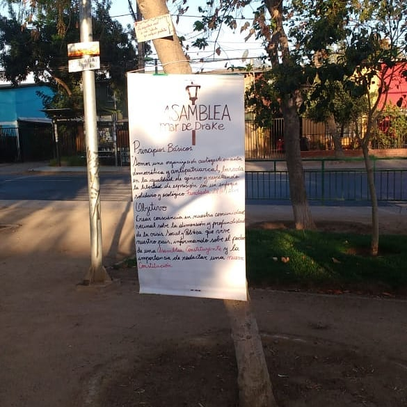
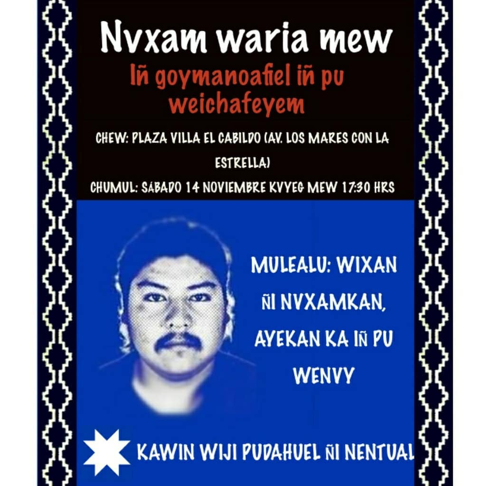

**Banderas:**

**Diseño estético:**

> Párrafo tipo cita 

---
### Percepciones que se tiene del Estado
#### (Aparato burocrático)
> resumen de lo encontrado

| Declaraciones | infografía | 
|---|---|
|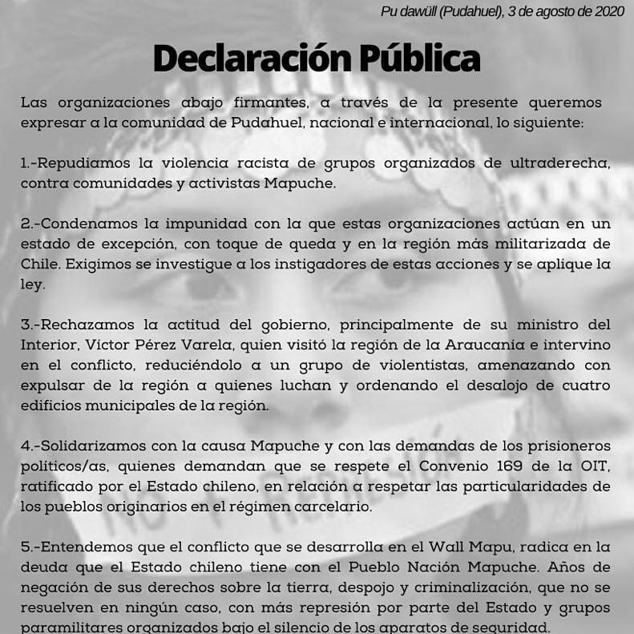 |  |

---
### Percepciones que se tiene de las Fuerzas de Orden
#### (Aparato represivo)
> resumen de lo encontrado

| Declaraciones | infografía | 
|---|---|
|Anotar los comunicados |  |

---
### Incorporar aca notas, citas textuales, links, etc. extra a los ya incorporados, que sean de interés para comprender tanto la forma como los contenidos asociados a la organización.
