#### FOLIO: PUD1

# Asamblea Popular de Pudahuel

[instagram](https://www.instagram.com/asambleapudahuel/
)
[facebook](https://www.facebook.com/Asamblea-Popular-Pudahuel-102955984481066/?ref=page_internal)

---

### Representantes
####  No se identifican. 

---
### Interacciones frecuentes
#### Cordón poniente, cordón Grecia, Asamblea barrio Brasil, Pudahuel, Asamblea Mar de Drake, cabildo alimentario Chile, Pudahuel fem, Maipú rebelde, Plaza Pitágoras, Colectivo Llama, Asamblea El claustro,

### Redes sociales
#### ¿Para qué se utiliza la red social?
| Instagram | Facebook | Twitter | Otra 
|---|---|---|---|
|Difusión de información y actividades. Mural de fotografías de acciones concretadas.
|Difusión de información y actividades. Mural de fotografías de acciones concretadas.
|0| 0|

### **Instagram**
| seguidores | seguidos | publicaciones | hashtag 
|---|---|---|---|
|3611|	496	|168
| 0

---

* **Actividad:**   Continuas

* Primera Publicación IG

---
### Frecuencia de publicación.

Publicaciones: Semanales (de 3 a 4)

Actividades:

---
### Ubicación
* Sector de la comununa/ciudad: Plaza de Armas de Pudahuel/ Sede vecinal 13/ Diagonal norte con diagonal sur

---
### Describir temas de interés y/o trabajo
Organización territorial. Entre sus interese esta la organización vecinal y el apoyo mutuo. En sus inicios promovían los conversatorio ciudadanos tratando temáticas como la educación parvulario o las políticas publicas en torno a la infancia.

---
### Describir la imagen ideal por la cual se trabaja.
#### Considerando su horizonte de lucha la organización se define como: "organización popular al margen de los intereses políticos e institucionales, de carácter autónomo con el único objetivo de hacer valer la organización vecinal". "construyendo autonomía y libertad en resistencia".
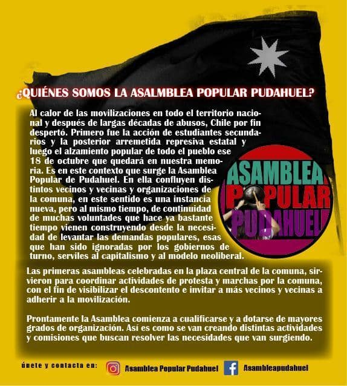
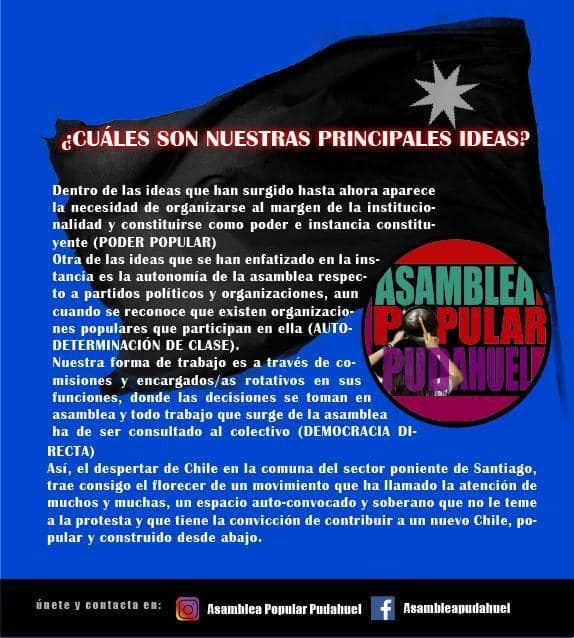

---
### ¿Que se hace?
#### La organizaciones a realizado múltiples actividades como asambleas, conversatorios, onces comunitarias, actividades para niños. Talleres entre estos de eco productos o primeros auxilios. Protestas, cacerolazos, velatones y acciones solidarias como ollas comunes, ayuda a cesantes a causa de la crisis.
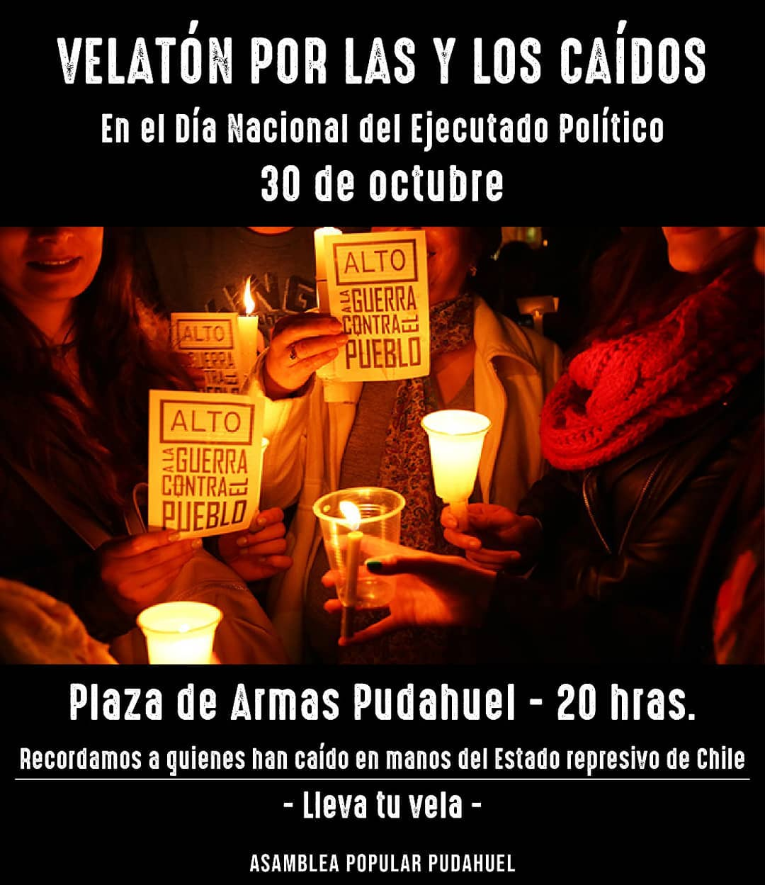
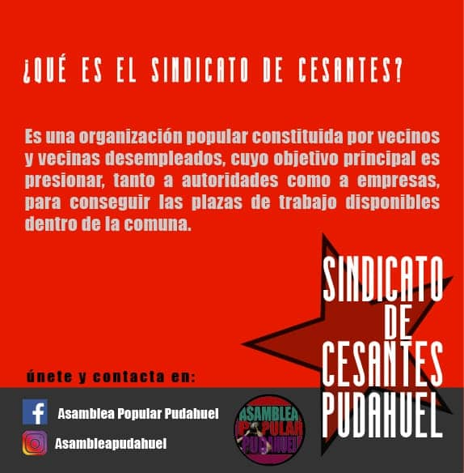
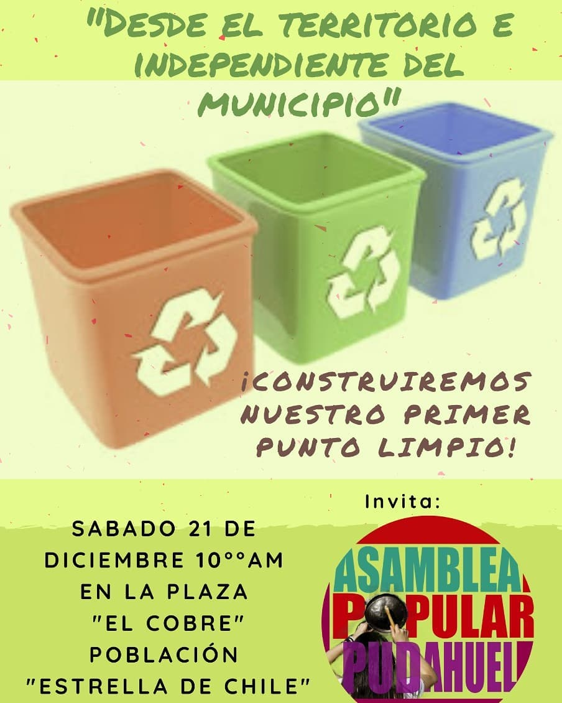
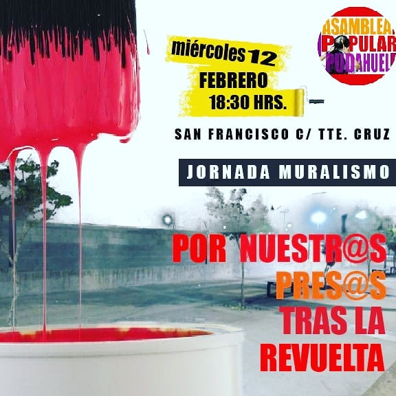
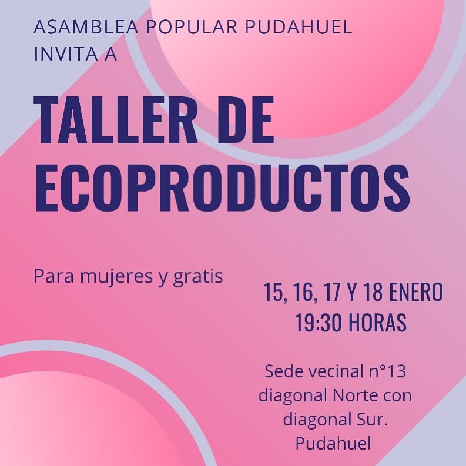

---
### Describir y distinguir demandas más reivindicativas de espacios sin relación con lo contencioso o con lo político mas prefigurativo
#### Dirigido a vecinos y vecinas de Pudahuel. Transformación cotidiana del vivir en el barrio y en comunidad.
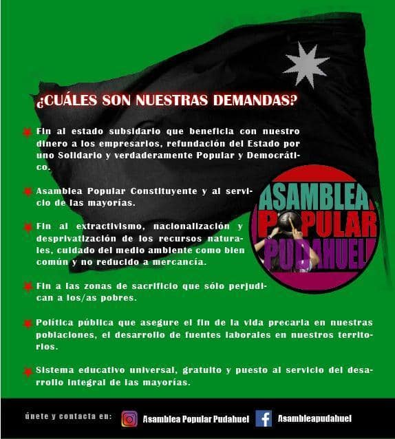
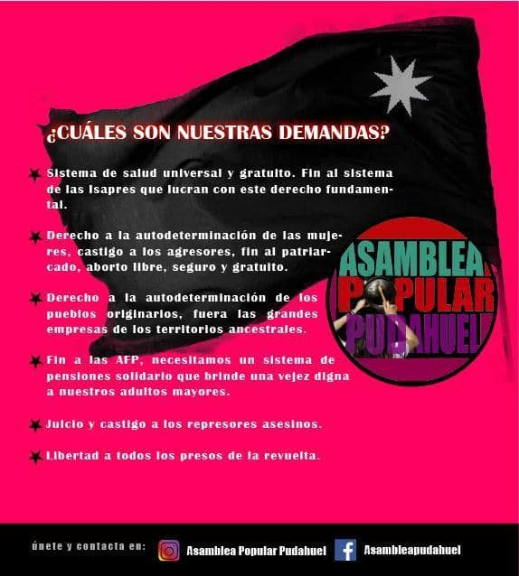

---
### Tipo de organización interna.
#### Asambleísmo. La organización detalla trabajar por comisiones desde sus inicios. Ejemplo de ello es su comisión de mujer e infancia y comisión de primeros auxilios.

---
### Describir los temas / imágenes- iconos / conceptos mas habitualmente presentes en sus publicaciones. Describir cambios/ transformaciones en los contenidos desde Octubre.

**Iconos:**
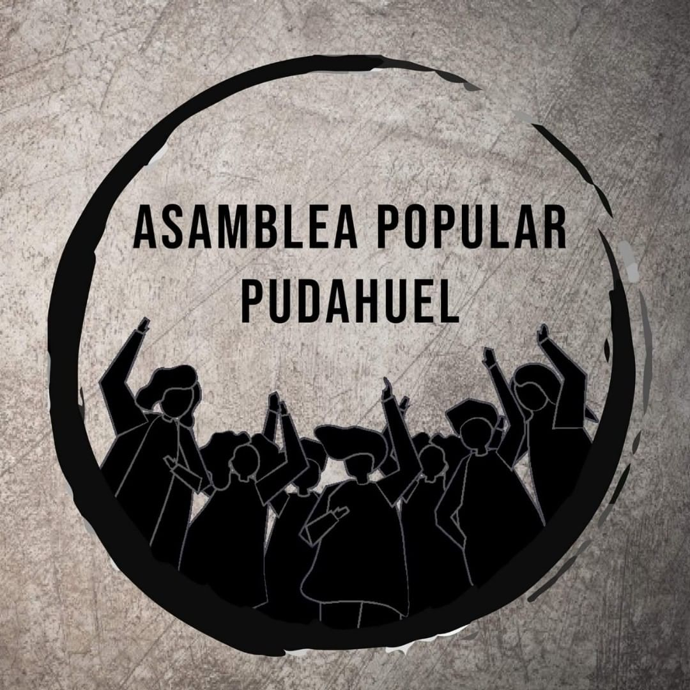
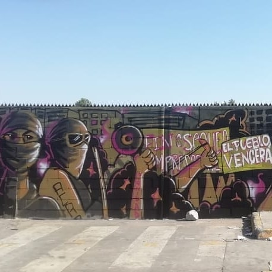
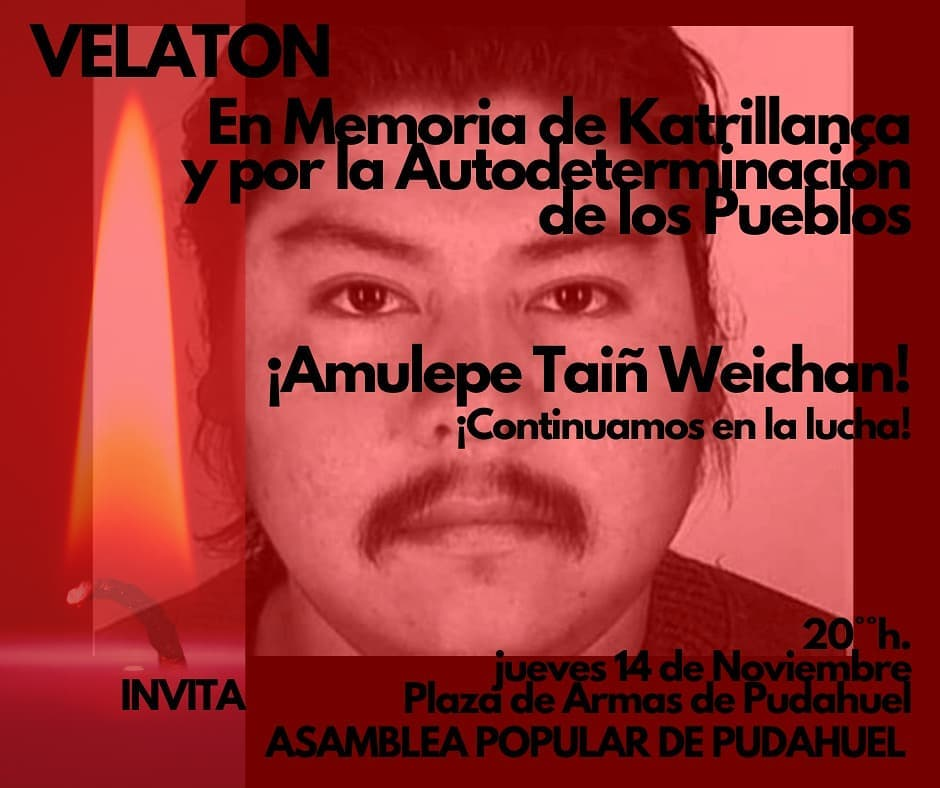

**Banderas:**

**Diseño estético:**

> Párrafo tipo cita 

---
### Percepciones que se tiene del Estado
#### (Aparato burocrático)
> resumen de lo encontrado

| Declaraciones | infografía | 
|---|---|
|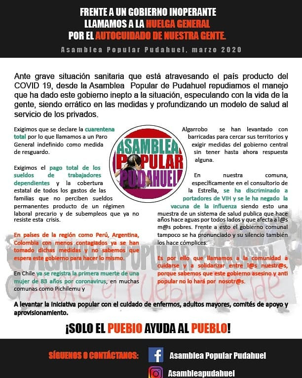
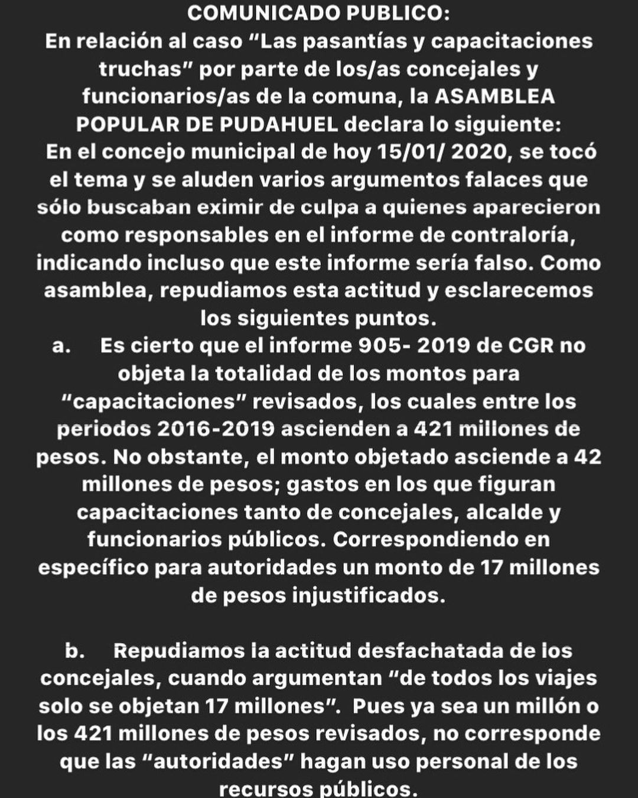
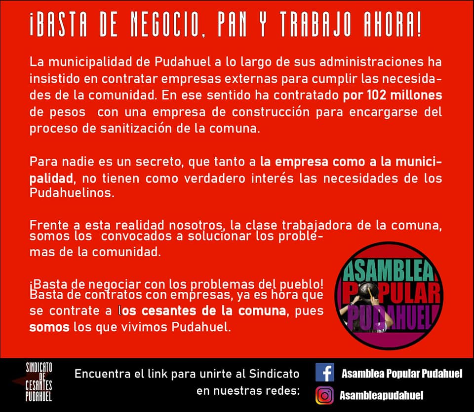 
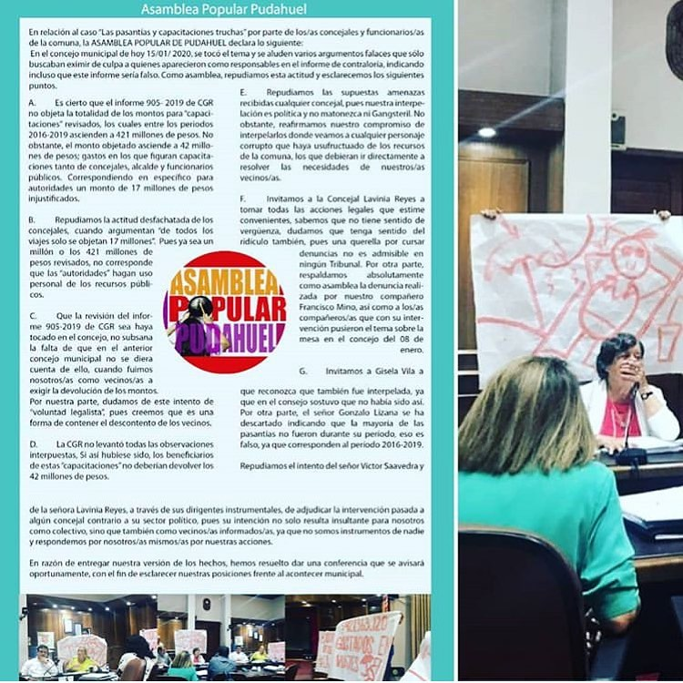|  |

---
### Percepciones que se tiene de las Fuerzas de Orden
#### (Aparato represivo)
> resumen de lo encontrado

| Declaraciones | infografía | 
|---|---|
|Anotar los comunicados |  |

---
### Incorporar aca notas, citas textuales, links, etc. extra a los ya incorporados, que sean de interés para comprender tanto la forma como los contenidos asociados a la organización.
