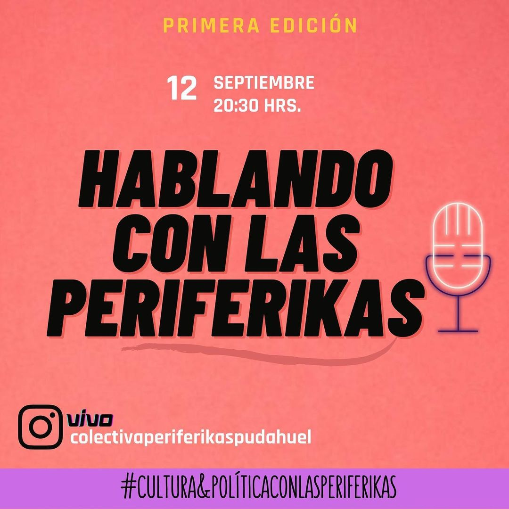
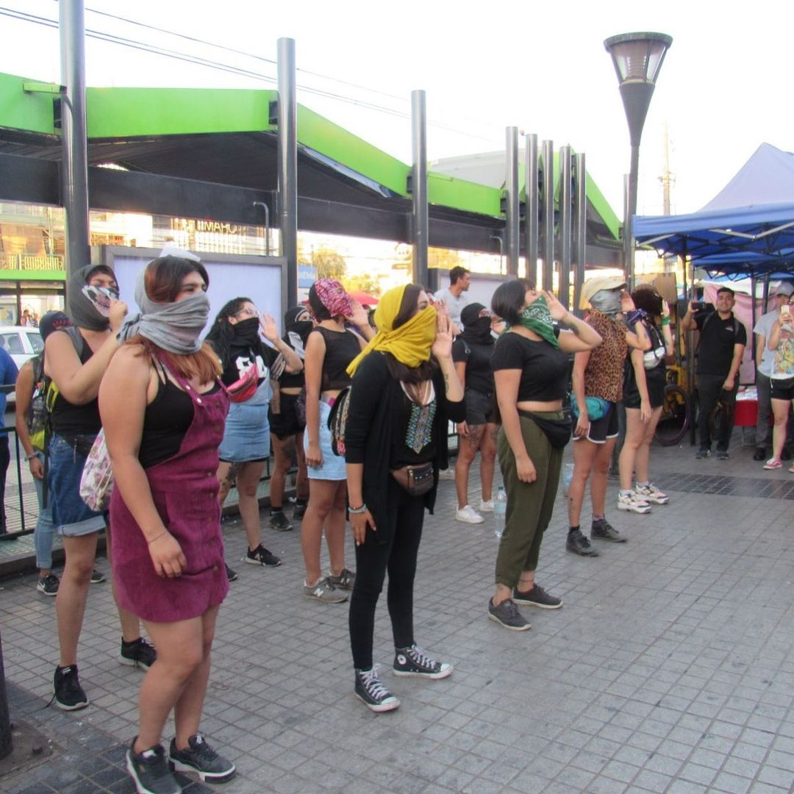
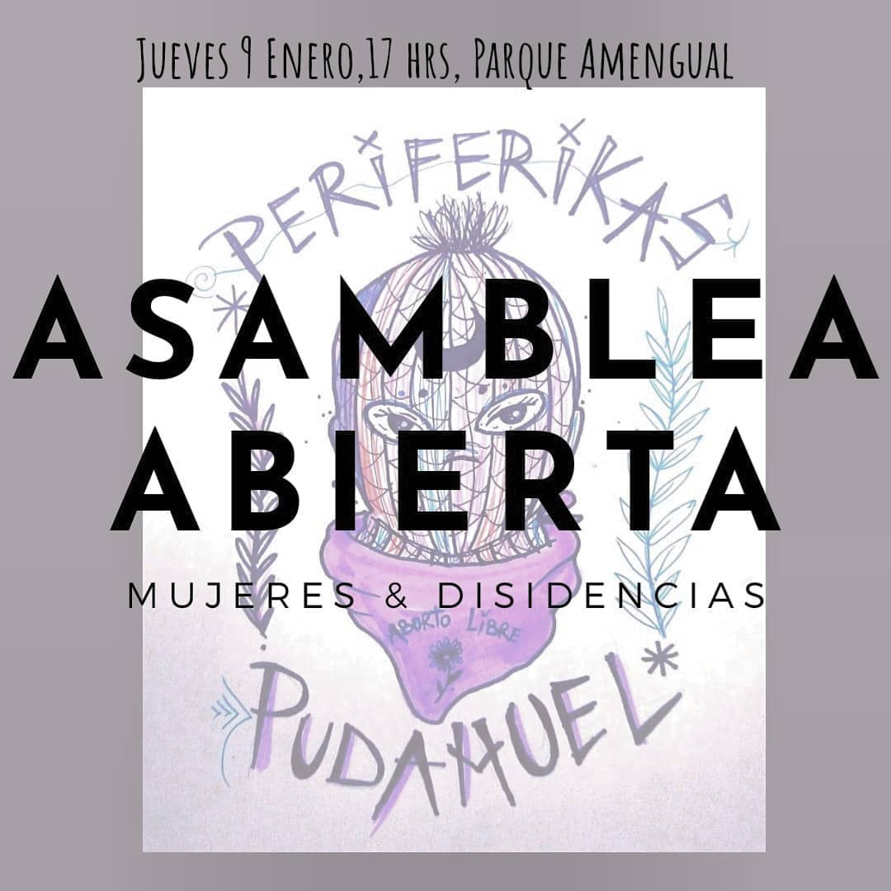
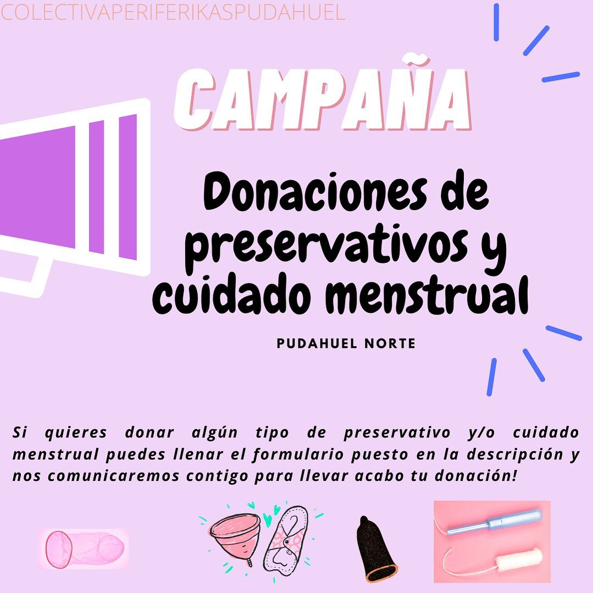
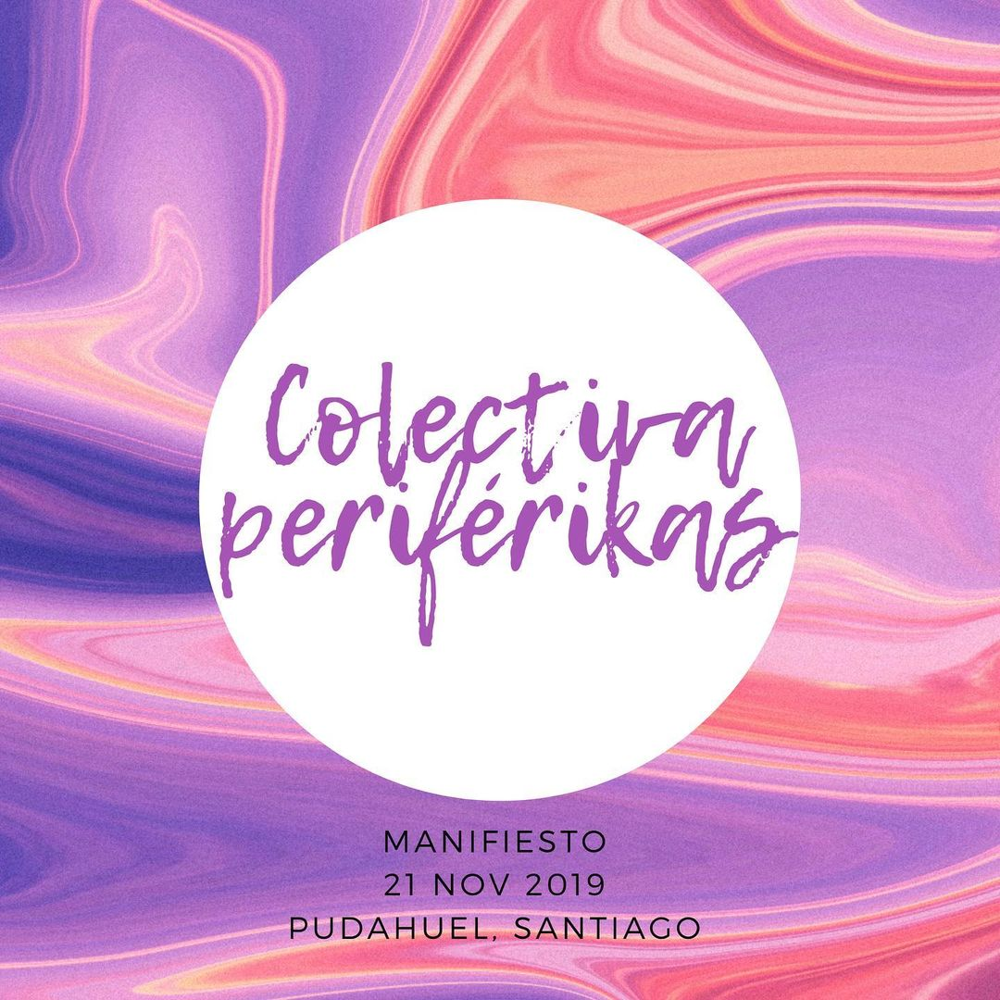
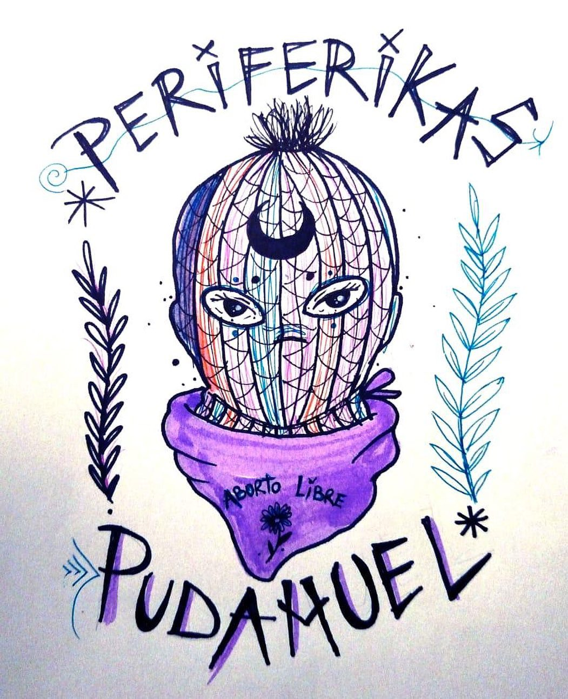
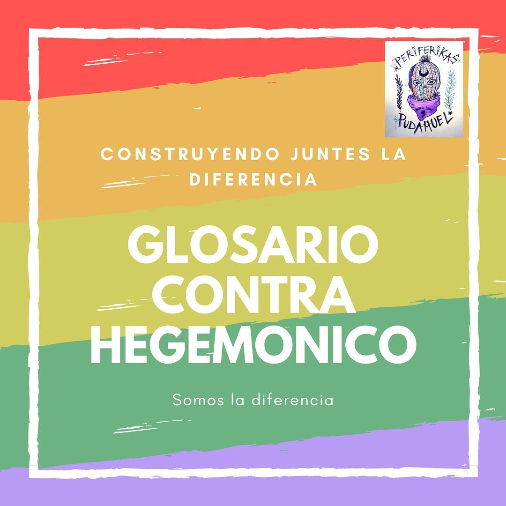
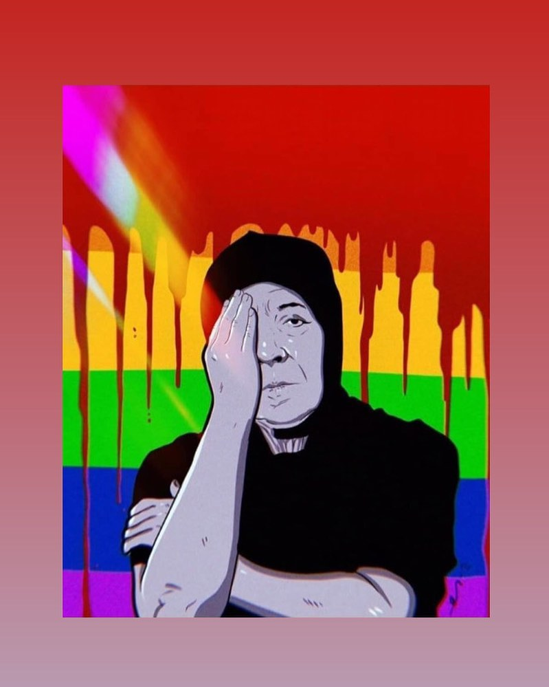
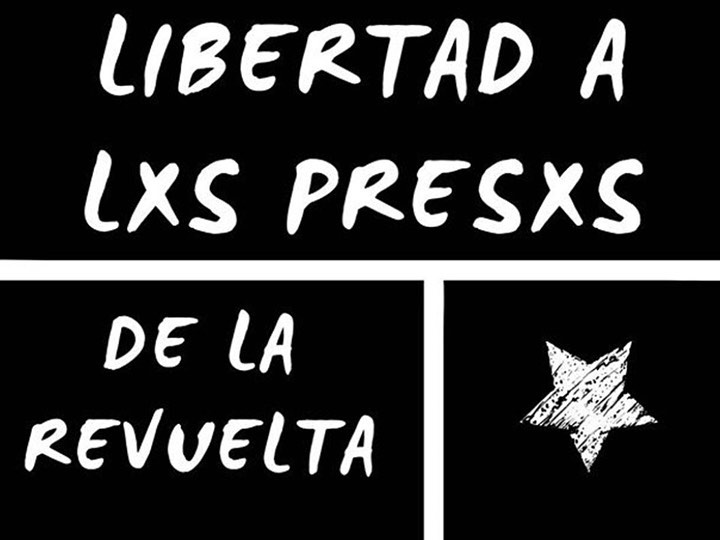
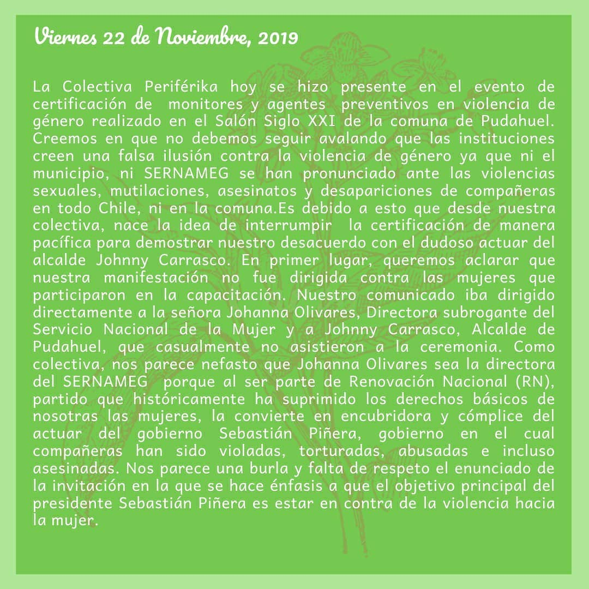

#### FOLIO: PUD5
 
# Colectiva Periferika

[instagram](https://www.instagram.com/colectivaperiferikaspudahuel/
)
[facebook](https://www.facebook.com/Perif%C3%A9rikas-101252558264407/?ref=page_internal)

---

### Representantes
#### No se identifican. 
---
### Interacciones frecuentes
#### Asamblea Territorial Pudahuel, Colectiva perra Filtra, Pudahuel Fem, Asamblea Mar de Drake, Colectiva feminista Lo espejo, Cerro Navia feminista, Asamblea mujeres y disidencias, Movimiento comuna popular,

### Redes sociales
#### ¿Para qué se utiliza la red social?
| Instagram | Facebook | Twitter | Otra 
|---|---|---|---|
|Difusión de información y actividades. Mural de fotografías de acciones concretadas.|Difusión de información y actividades. Mural de fotografías de acciones concretadas.
|0| 0|

### **Instagram**
| seguidores | seguidos | publicaciones | hashtag 
|---|---|---|---|
|1498|	383	|121
| 0

---

* **Actividad:**   Activo

* Primera Publicación IG

---
### Frecuencia de publicación.

Publicaciones: Semanales (de 2 a 3).

Actividades:

---
### Ubicación
* Sector de la comununa/ciudad: Pudahuel Norte. Plaza de Armas de Pudahuel.

---
### Describir temas de interés y/o trabajo
Organización territorial, feminismo, apoyo mutuo, apropiación del espacio publico y sistemas de auto educación.

---
### Describir la imagen ideal por la cual se trabaja.
#### Fin al patriarcado. ¡Desde la trinchera de la población caerá el sistema opresor!

---
### ¿Que se hace?
#### Múltiples acciones colectivas como: Asambleas abiertas, encuentros y conversatorios (físicos y online). Llamados a manifestaciones. Creación de contenido educativo como videos y fichas explicativas en temáticas feministas, sobre políticas publicas, entre otras.

---
### Describir y distinguir demandas más reivindicativas de espacios sin relación con lo contencioso o con lo político mas prefigurativo
#### Se dirige a mujeres y disidencias de sector norte de Pudahuel. Transformación cotidiana del vivir en comunidad, enfatizan en los rencuentros comunitarios.

---
### Tipo de organización interna.
#### Asambleísmo y Horizontalidad.

---
### Describir los temas / imágenes- iconos / conceptos mas habitualmente presentes en sus publicaciones. Describir cambios/ transformaciones en los contenidos desde Octubre.

**Iconos:** 

**Banderas:**

**Diseño estético:**

> Párrafo tipo cita 

---
### Percepciones que se tiene del Estado
#### (Aparato burocrático)
> resumen de lo encontrado

| Declaraciones | infografía | 
|---|---|
||  |

---
### Percepciones que se tiene de las Fuerzas de Orden
#### (Aparato represivo)
> resumen de lo encontrado

| Declaraciones | infografía | 
|---|---|
|Anotar los comunicados |  |

---
### Incorporar aca notas, citas textuales, links, etc. extra a los ya incorporados, que sean de interés para comprender tanto la forma como los contenidos asociados a la organización.
