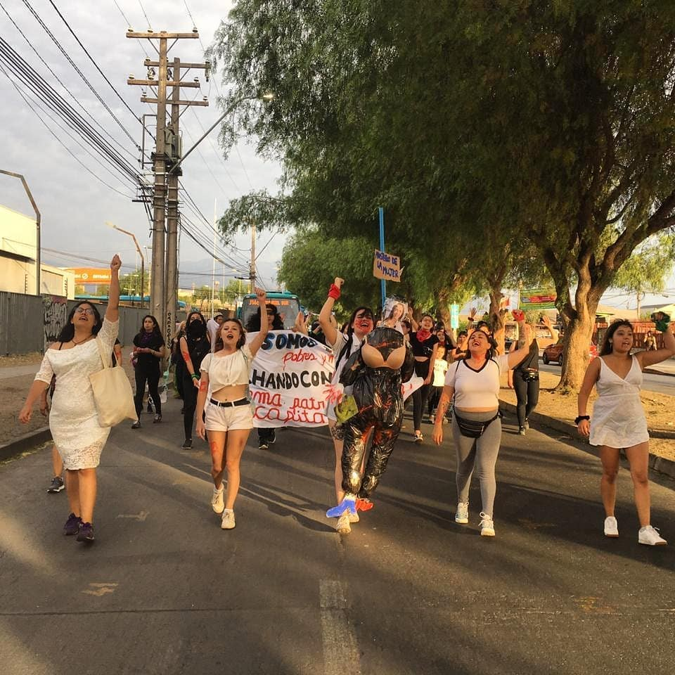
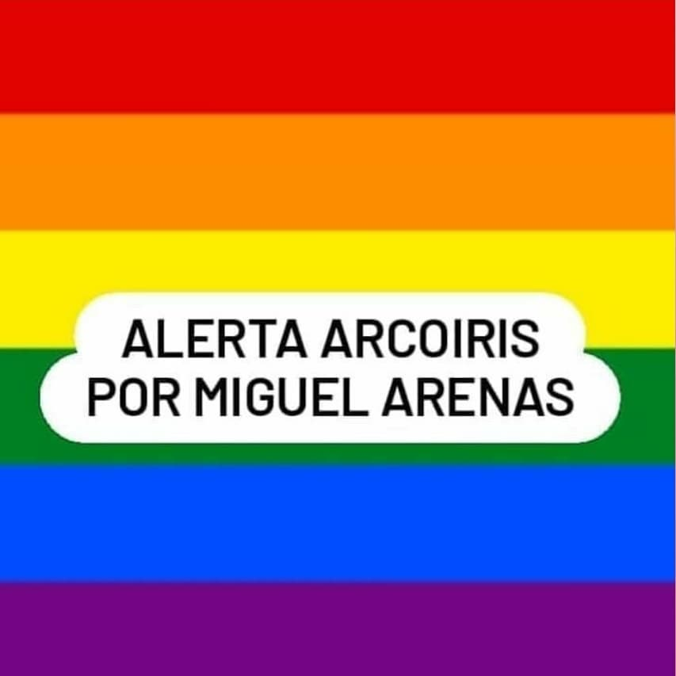

#### FOLIO: Tres letras iniciales de la comuna y nº de organizacion (ejemplo: comuna santiago n6 = SAT6)
# NOMBRE ASAMBLEA

[instagram](https://www.instagram.com/colectivaperrakiltra/
)
[facebook]()
[twitter]()
<correo@correo.cl>
---

### Representantes
#### (Nombres o emails de voceros o representantes).

---
### Interacciones frecuentes
#### Asamblea Mar de Drake, Asamblea Territorial Pudahuel Sur, Amor subversivo, Plaza Pitágoras,

### Redes sociales
#### ¿Para qué se utiliza la red social?
| Instagram | Facebook | Twitter | Otra 
|---|---|---|---|
|Difusión de información y actividades.|Difusión de información y actividades.
|0| 0|

### **Instagram**
| seguidores | seguidos | publicaciones | hashtag 
|---|---|---|---|
|2498	|401|	99
| 0

---

* **Actividad:**   Continua

* Primera Publicación IG 28 DE NOVIEMBRE DE 2019

---
### Frecuencia de publicación.

Publicaciones: Semanales (de 2 3) aproximadamente.

Actividades:

---
### Ubicación
* Sector de la comununa/ciudad: Laguna Azul/sede vecinal Pedreo Prado Valparaíso 7028/ Plaza Villa Marta Brunnet/ Parque Las Torres.

---
### Describir temas de interés y/o trabajo
Organización territorial, feminismo, apoyo mutuo, apropiación del espacio publico y sistema de auto educación.

---
### Describir la imagen ideal por la cual se trabaja.
#### " No basta con transformar los espacios, también queremos justicia. Sin memoria no hay historia." "Hoy nos siguen viendo la cara, con su propaganda fascista, disfrazada de progresistas" "Que muera Piñera y no mi compañera" "PORQUE SOLO EL PUEBLO AYUDA AL PUEBLO

---
### ¿Que se hace?
#### Asambleas abierta de mujeres. Gestión de encuentros feministas y disidentes, conversatorios de genero y feminismo, entre otros Protestas cacerolazos. Acciones solidarias como campañas de acopio de alimentos y útiles de aseo

---
### Describir y distinguir demandas más reivindicativas de espacios sin relación con lo contencioso o con lo político mas prefigurativo
#### Se dirige hacia mujeres del territorio. Emplaza a autoridades y (Funa) a hombres acusados de acoso o violación.

---
### Tipo de organización interna.
#### Asambleísmo y Horizontalidad. No se distingue una trabajo por comisiones.

---
### Describir los temas / imágenes- iconos / conceptos mas habitualmente presentes en sus publicaciones. Describir cambios/ transformaciones en los contenidos desde Octubre.

**Iconos:**  

**Banderas:**

**Diseño estético:**

> Párrafo tipo cita 

---
### Percepciones que se tiene del Estado
#### (Aparato burocrático)
> resumen de lo encontrado

| Declaraciones | infografía | 
|---|---|

|Desde la Colectiva Perra Kiltra creemos que el Spot de SERNAMEG, es una verdadera burla para las personas que sufren de violencia doméstica. La invisibilización de la violencia ejercida a través de un discurso de arrepentimiento solo revictimiza e invisibiliza a quiénes viven o vivieron estas situaciones, silenciado su voz como han sido silenciadas las 18 mujeres que han muerto por femicidio este 2020. No podemos perdonar la violencia ejercida, no importa de quien provenga. No normalizaremos la situaciones de machismo y violencia que han vivido nuestras ancestras. .
Macarena Santelices no nos representa y exigimos una representación enfocada en la mujer violentada y no en el agresor, una reparación efectiva para las víctimas sobrevivientes y castigos severos para los asesinos.

#notenemosministra |  |

---
### Percepciones que se tiene de las Fuerzas de Orden
#### (Aparato represivo)
> resumen de lo encontrado

| Declaraciones | infografía | 
|---|---|
| |  |

---
### 
