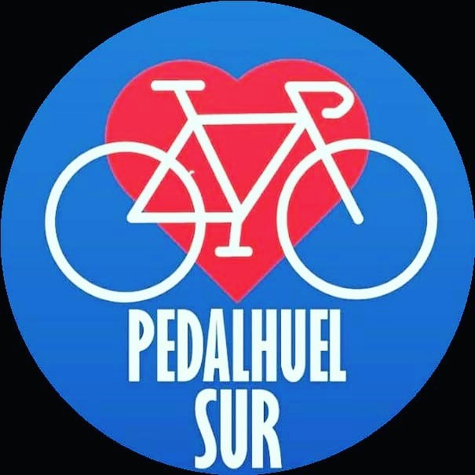

#### FOLIO: PDU9
# Pedalhuel

[instagram](https://www.instagram.com/pedalhuel/
)
[facebook](https://www.facebook.com/pedalhuel)

---

### Representantes
#### (Nombres o emails de voceros o representantes).

---
### Interacciones frecuentes
#### Asamblea Popular de Pudahuel, Asamblea territorial Pudahuel Sur, Pudahuel, Movimiento Comuna Popular, Plaza Pitágoras, Pedal Lo Prado, Pudahuel fem, Maipú pedalea.

### Redes sociales
#### ¿Para qué se utiliza la red social?
| Instagram | Facebook | Twitter | Otra 
|---|---|---|---|
|Difusión de información y actividades. Mural de fotografías de acciones concretadas.|Difusión de información y actividades. Mural de fotografías de acciones concretadas.
|0| 0|

### **Instagram**
| seguidores | seguidos | publicaciones | hashtag 
|---|---|---|---|
|7729|	762|	266
| 0

---

* **Actividad:** Continua

* Primera Publicación IG 23 DE NOVIEMBRE DE 2019

---
### Frecuencia de publicación.

Publicaciones: Semanales (de 3 a 4)

Actividades:

---
### Ubicación
* Sector de la comununa/ciudad: Las Torres/ Laguna Azul

---
### Describir temas de interés y/o trabajo
Apropiación del espacio publico. Ciclismo urbano, organización y articulación territorial, apoyo mutuo

---
### Describir la imagen ideal por la cual se trabaja.
#### "Evadir, pedalear otra forma de luchar" "Solo el pueblo ayuda al pueblo"

---
### ¿Que se hace?
#### Asambleas abiertas de ciclista. Protestas cicletadas, pega de lienzos y actos conmemorativos. Ayuda solidaria como recolección de dinero, alimentos y útiles de aseo.

---
### Describir y distinguir demandas más reivindicativas de espacios sin relación con lo contencioso o con lo político mas prefigurativo
#### Vecinos y vecinas ciclistas de Pudahuel. /Transformación cotidiana en el uso del espacio publico

---
### Tipo de organización interna.
#### Horizontalidad. No se disntingue una estructura organizativa clara.

---
### Describir los temas / imágenes- iconos / conceptos mas habitualmente presentes en sus publicaciones. Describir cambios/ transformaciones en los contenidos desde Octubre.

**Iconos:** 

**Banderas:** 

**Diseño estético:**

> Párrafo tipo cita 

---
### Percepciones que se tiene del Estado
#### (Aparato burocrático)
> resumen de lo encontrado

| Declaraciones | infografía | 
|---|---|
|Anotar los comunicados |  |

---
### Percepciones que se tiene de las Fuerzas de Orden
#### (Aparato represivo)
> resumen de lo encontrado

| Declaraciones | infografía | 
|---|---|

|La corrupción policial es un tipo de mala praxis en las policías, frecuentemente constitutiva de delito, consistente en el uso indebido de sus atribuciones, recursos o información con el objeto de obtener provecho económico o de otro tipo, así como avances en la carrera profesional e incluso fines políticos. Wikipedia. Carabineros de Chile: Fueron creados por Carlos Ibañez del Campo, sujeto que fue DOS veces golpista, DOS veces dictador, DOS veces traidor (Quizás más), fue presidente electo “democráticamente” debido a que eliminó a su competencia directa, admirador de Mussolini y se llaman carabineros como el organismo de seguridad del fascismo italiano.

#27AbrilNadaQueCelebrar |  |

---
### 

