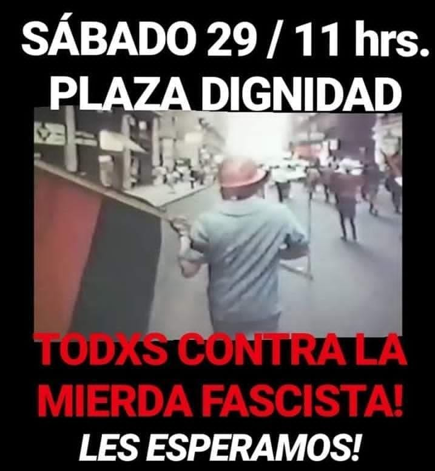

#### FOLIO: PDU3
# Pudahuel Antifascista

[instagram](https://www.instagram.com/p/CFw8mShhE_c/
)

---

### Representantes
#### No se identifican. 

---
### Interacciones frecuentes
#### Acción furtar, colectivo Loyuyo

### Redes sociales
#### ¿Para qué se utiliza la red social?
| Instagram | Facebook | Twitter | Otra 
|---|---|---|---|
|Difusión de información y actividades. Mural de fotografías de acciones concretadas.
|0|0| 0|

### **Instagram**
| seguidores | seguidos | publicaciones | hashtag 
|---|---|---|---|
|284|	181|	108
| 0

---

* **Actividad:**  Continua desde 2020

* Primera Publicación IG

---
### Frecuencia de publicación.

Publicaciones: Mensual. Semanal (de 2 a 4) a partir de octubre.

Actividades: Mensual. Semanal (de 2 a 4) a partir de octubre.

---
### Ubicación
* Sector de la comununa/ciudad: Población Monseñor Manuel Larraín.

---
### Describir temas de interés y/o trabajo
Organización territorial, memoria popular y apropiación del espacio publico.

---
### Describir la imagen ideal por la cual se trabaja.
#### 
Fin al Estado mercantil. " Solo el pueblo ayuda al pueblo"

---
### ¿Que se hace?
#### Actos conmemorativos Jornadas de Muralismo , tocatas, feria de las pulgas.

---
### Describir y distinguir demandas más reivindicativas de espacios sin relación con lo contencioso o con lo político mas prefigurativo
#### Se dirige a Jóvenes antifascistas de Pudahuel. Reivindicación del vivir en comunidad.

---
### Tipo de organización interna.
#### Horizontalidad. No se distingue una estructura organizativa clara.

---
### Describir los temas / imágenes- iconos / conceptos mas habitualmente presentes en sus publicaciones. Describir cambios/ transformaciones en los contenidos desde Octubre.

**Iconos:**

**Banderas:**

**Diseño estético:**

> Párrafo tipo cita 

---
### Percepciones que se tiene del Estado
#### (Aparato burocrático)
> resumen de lo encontrado

| Declaraciones | infografía | 
|---|---|
|Anotar los comunicados |  |

---
### Percepciones que se tiene de las Fuerzas de Orden
#### (Aparato represivo)
> resumen de lo encontrado

| Declaraciones | infografía | 
|---|---|
|s |  |

---
### Incorporar aca notas, citas textuales, links, etc. extra a los ya incorporados, que sean de interés para comprender tanto la forma como los contenidos asociados a la organización.
