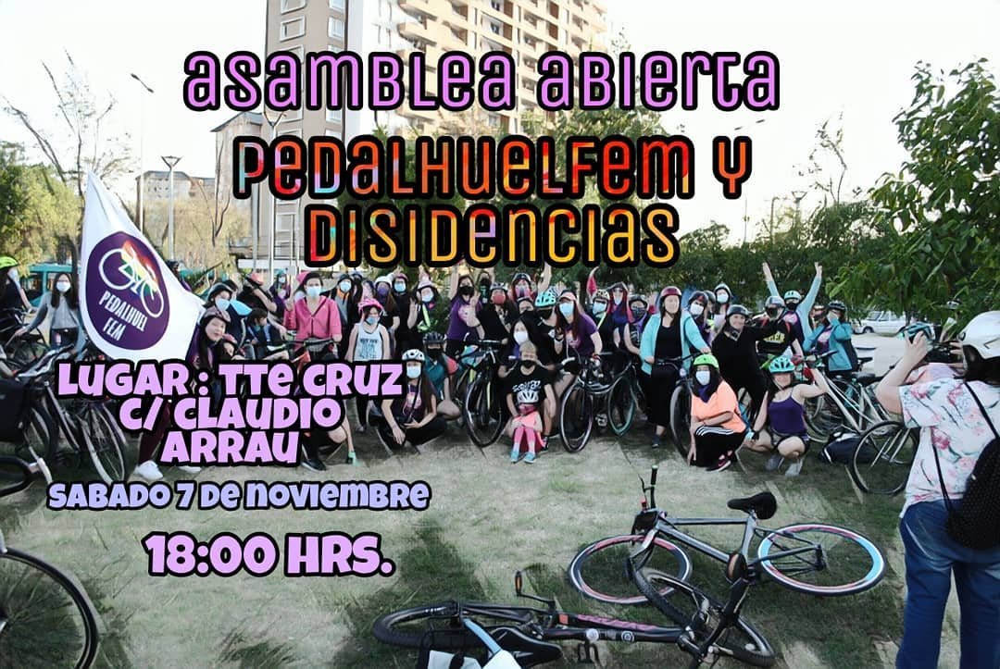

#### FOLIO: PDU8
# Pedahuel Fem

[instagram](https://www.instagram.com/pedalhuelfem/
)

---

### Representantes
#### (Nombres o emails de voceros o representantes).

---
### Interacciones frecuentes
#### Asamblea Popular de Pudahuel, Asamblea Mar de Drake, Pudahuel, Acción Furtar, Colectiva Perra Kiltra, Maipú pedalea, Ciclosororas, Plaza Pitágoras.

### Redes sociales
#### ¿Para qué se utiliza la red social?
| Instagram | Facebook | Twitter | Otra 
|---|---|---|---|
|Difusión de información y actividades. Mural de fotografías de acciones concretadas.
|0|0| 0|

### **Instagram**
| seguidores | seguidos | publicaciones | hashtag 
|---|---|---|---|
|1706|	553|	84
| 0

---

* **Actividad:**  Discontinua. Se activo en el mes de mes de octubre.

* Primera Publicación IG 11 DE ABRIL DE 2020

---
### Frecuencia de publicación.

Publicaciones: Semanales (de 3 a 4)

Actividades:

---
### Ubicación
* Sector de la comununa/ciudad: Parque Claudio arrau con tte cruz a pasos del metro barrancas

---
### Describir temas de interés y/o trabajo
Apropiación del espacio publico. Ciclismo urbano, organización y articulación territorial, apoyo mutuo

---
### Describir la imagen ideal por la cual se trabaja.
####  "Que muera Piñera y no mi compañera" "PORQUE SOLO EL PUEBLO AYUDA AL PUEBLO, NOSOTRAS NOS CUIDAMOS ENTRE NOSOTRAS"

---
### ¿Que se hace?
#### Asambleas abiertas de mujeres ciclista. Cicletadas. Ayuda solidaria como recolección de dinero, alimentos y útiles de aseo.

---
### Describir y distinguir demandas más reivindicativas de espacios sin relación con lo contencioso o con lo político mas prefigurativo
#### Mujeres ciclistas de Pudahuel. Transformación cotidiana en el uso del espacio publico. No mas ciclistas muertos/ Emplazan a la ministra de transporte

---
### Tipo de organización interna.
#### Horizontalidad. No se distingue una estructura organizativa clara.

---
### Describir los temas / imágenes- iconos / conceptos mas habitualmente presentes en sus publicaciones. Describir cambios/ transformaciones en los contenidos desde Octubre.

**Iconos:** 

)
**Banderas:**

**Diseño estético:**

> Párrafo tipo cita 

---
### Percepciones que se tiene del Estado
#### (Aparato burocrático)
> resumen de lo encontrado

| Declaraciones | infografía | 
|---|---|
|Anotar los comunicados |  |

---
### Percepciones que se tiene de las Fuerzas de Orden
#### (Aparato represivo)
> resumen de lo encontrado

| Declaraciones | infografía | 
|---|---|
||  |

---
### Incorporar aca notas, citas textuales, links, etc. extra a los ya incorporados, que sean de interés para comprender tanto la forma como los contenidos asociados a la organización.
