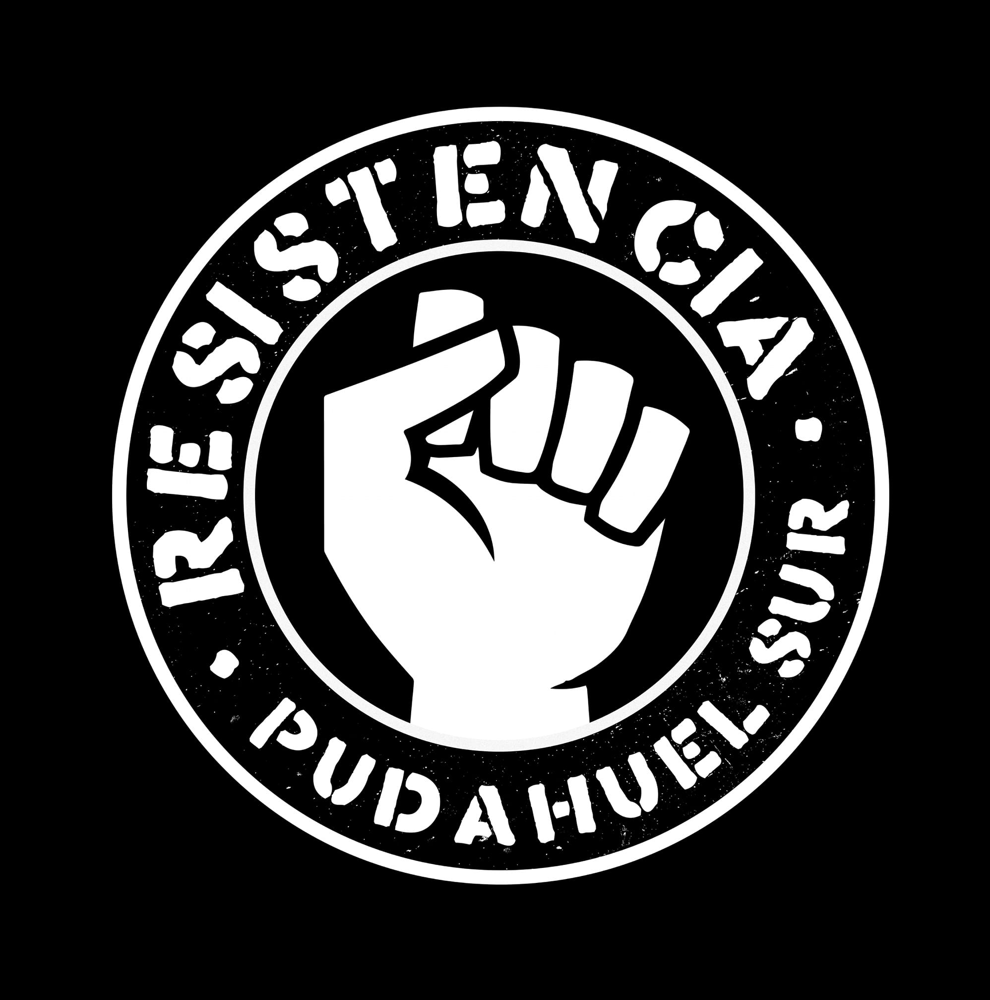
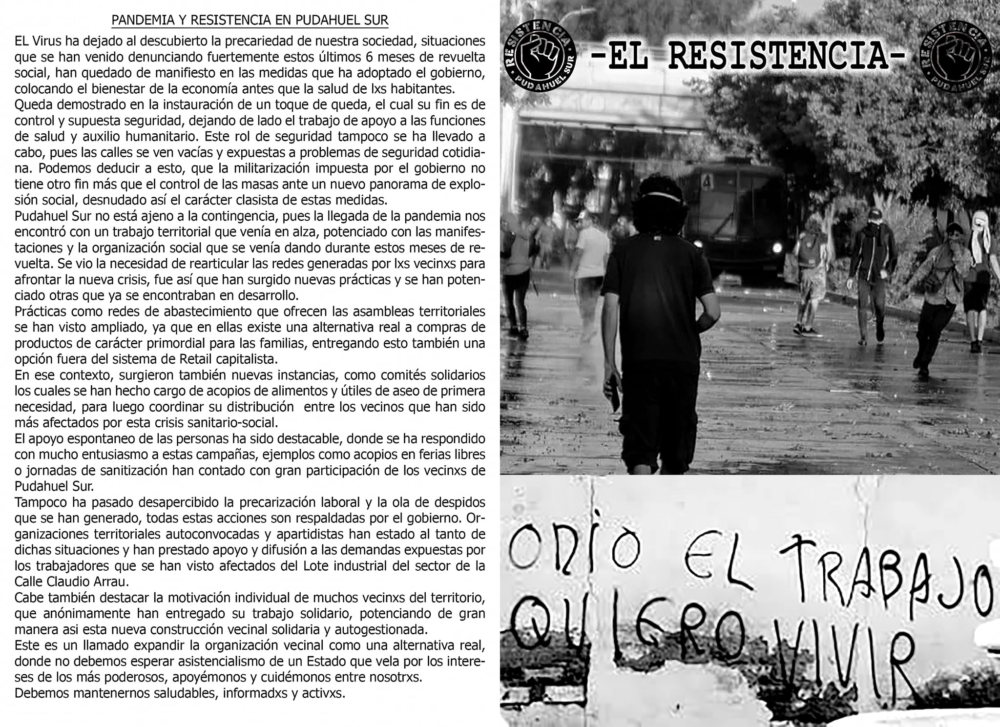

#### FOLIO: PUD2	

# Resistencia Pudahuel Sur

[instagram](https://www.instagram.com/resistencia.psur/)
[facebook](https://www.facebook.com/Resistencia-Pudahuel-Sur-114173253456524)
[twitter]()
<resistenciapudahuelsur@gmail.com
>
---

### Representantes
####

---
### Interacciones frecuentes
#### Plaza pitadora, Movimiento Comuna Popular, colectivo perra kiltra, Asamblea Mar de Drake, Pudahuel fem.

### Redes sociales
#### ¿Para qué se utiliza la red social?
| Instagram | Facebook | Twitter | Otra 
|---|---|---|---|
|Difusión de información y actividades. Mural de fotografías de acciones concretadas.|Difusión de información y actividades. Mural de fotografías de acciones concretadas.|0| 0|

### **Instagram**
| seguidores | seguidos | publicaciones | hashtag 
|---|---|---|---|
|1779|	1005|	130
| 0

---

* **Actividad:**  Continuas.

* Primera Publicación IG

---
### Frecuencia de publicación.

Publicaciones: Semanales (de 3 a 4) a partir de Marzo del 2020

Actividades:

---
### Ubicación
* Sector de la comununa/ciudad: Sector Pudahuel sur

---
### Describir temas de interés y/o trabajo
Organización territorial . Sus interese son la protesta en contra el sistema político, contra información y el apoyo mutuo para cubrir necesidades causadas por la crisis socio sanitaria.

---
### Describir la imagen ideal por la cual se trabaja.
#### Fin al Estado mercantil. " Solo el pueblo ayuda al pueblo"

---
### ¿Que se hace?
#### 
Actos políticos conmemorativos. Creación de Boletines informativos. Jornadas de protestas, cacerolazos, cortes calles, rayado de murales en la vía publica. Acciones solidarias como ollas comunes, campañas solidarias de recolección de dinero.
Acopio aliementos para perros

---
### Describir y distinguir demandas más reivindicativas de espacios sin relación con lo contencioso o con lo político mas prefigurativo
#### Emplaza medidas del gobierno en la crisis socio sanitaria.

---
### Tipo de organización interna.
#### Horizontalidad. No se distingue una estructura organizativa clara.

---
### Describir los temas / imágenes- iconos / conceptos mas habitualmente presentes en sus publicaciones. Describir cambios/ transformaciones en los contenidos desde Octubre.

**Iconos:**

**Banderas:**

**Diseño estético:**

> Párrafo tipo cita 

---
### Percepciones que se tiene del Estado
#### (Aparato burocrático)
> resumen de lo encontrado

| Declaraciones | infografía | 
|---|---|
|Anotar los comunicados |  |

---
### Percepciones que se tiene de las Fuerzas de Orden
#### (Aparato represivo)
> resumen de lo encontrado

| Declaraciones | infografía | 
|---|---|
| |  |

---
## VOLETINES

