#### FOLIO: REN2
# Aguante Renca Bike

[instagram](https://www.instagram.com/p/CKApfP5J3Mo/)
[facebook](https://www.facebook.com/ciclismourbano.rencarnk)

---

### Representantes
#### No se identifica.

---
### Interacciones frecuentes
#### Cordón poniente, ciclistas Maipú, pedaleros zona sur, Santiago norte pedalea, revolución ciclista Fem, Red Solidaria CVL Quilicura, Team Mapu - Ciclismo Pudahuel

### Redes sociales
#### ¿Para qué se utiliza la red social?
| Instagram | Facebook | Twitter | Otra 
|---|---|---|---|
|Difusión de información, actividades y mural de fotografía de actividades concretadas.|Difusión de información, actividades y mural de fotografías de actividades concretadas.|0| 0|

### **Instagram**
| seguidores | seguidos | publicaciones | hashtag 
|---|---|---|---|
|2958|472|369| 0

---

* **Actividad:**   continua

* Primera Publicación IG 

---
### Frecuencia de publicación.

Publicaciones:Semanales (2 a 3) 

Actividades:

---
### Ubicación
* Sector de la comununa/ciudad: Comuna de Renca

---
### Describir temas de interés y/o trabajo
Apropiación del espacio publico. Ciclismo urbano, organización y articulación territorial, apoyo mutuo.

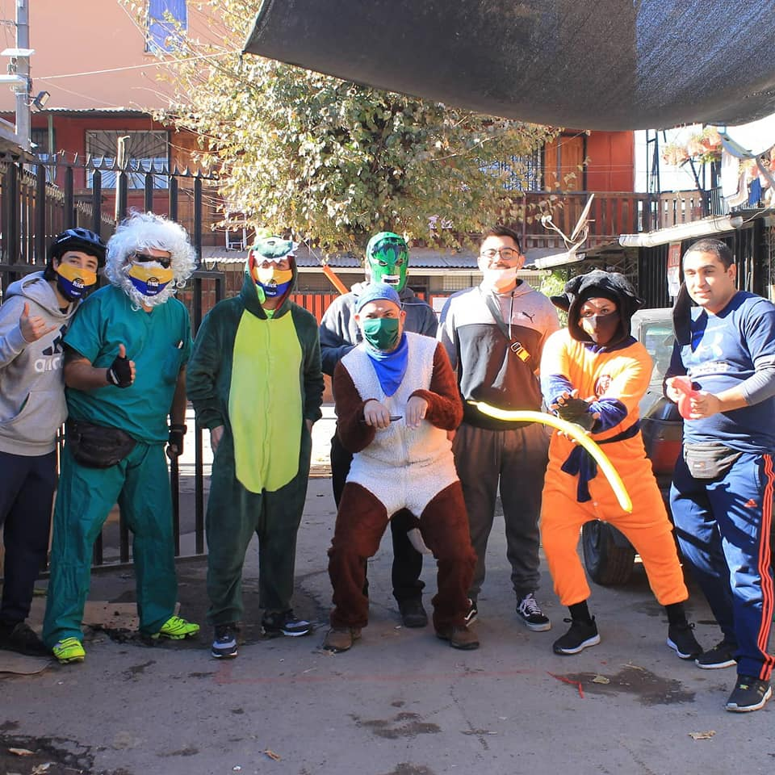

---
### Describir la imagen ideal por la cual se trabaja.
#### "EL PUEBLO CUIDA AL PUEBLO" "No mas ciclistas muertos" "Hasta que la dignidad se haga costumbre" 

### **Declaracion**: 
"Hoy es un dia clave y importante para nosotras , en la Cámara de Diputadxs empieza una nueva era la cual se nos fue quitada por un estado patriarcal el DERECHO a DECIDIR SOBRE NUESTROS CUERPOS .
Se iniciará la discusión sobre el proyecto de despenalización del aborto y modificar la ley N° 21.030 porque no nos basta solo con las 3 causales.
Como agrupación AgunteRencaFem, sabemos que el camino no será facil y es por esto que apoyamos el aborto libre, seguro, legal y gratuito.
Que sea un DERECHO Y NO UN PRIVILEGIO" 

---
### ¿Que se hace?
#### Cicletadas, acciones solidarias como olla común, entrega de cajas de mercadería y pasacalles infantiles.

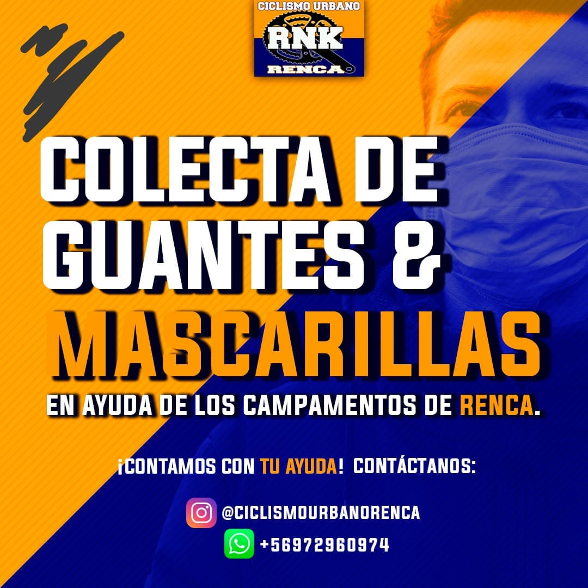

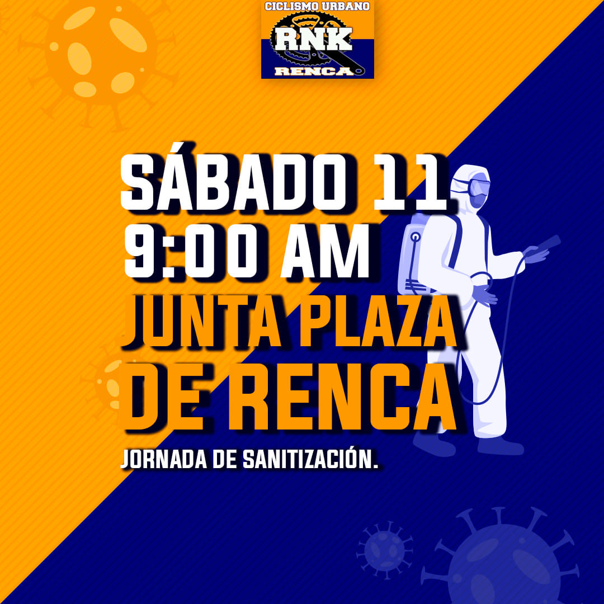
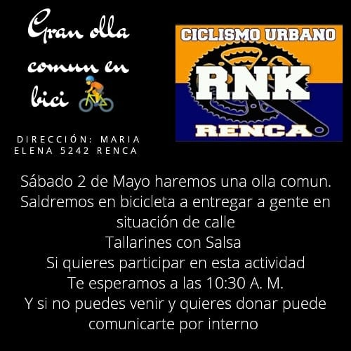
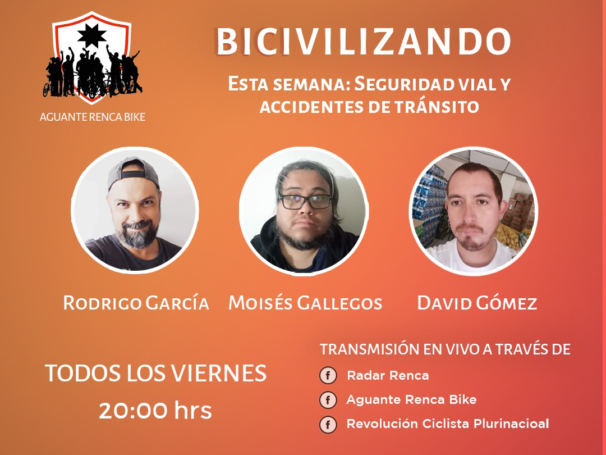

---
### Describir y distinguir demandas más reivindicativas de espacios sin relación con lo contencioso o con lo político mas prefigurativo
#### Se dirige a la población ciclista de Renca a unirse y participar de la organización. Emplaza a la ministra de transporte./  Transformación cotidiana en el uso del espacio publico 

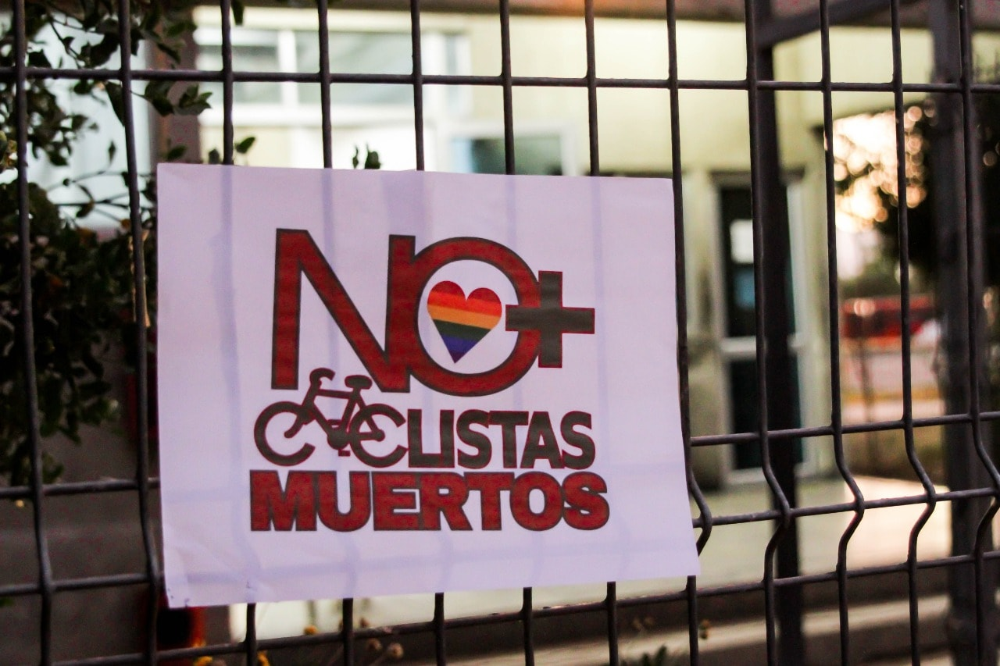
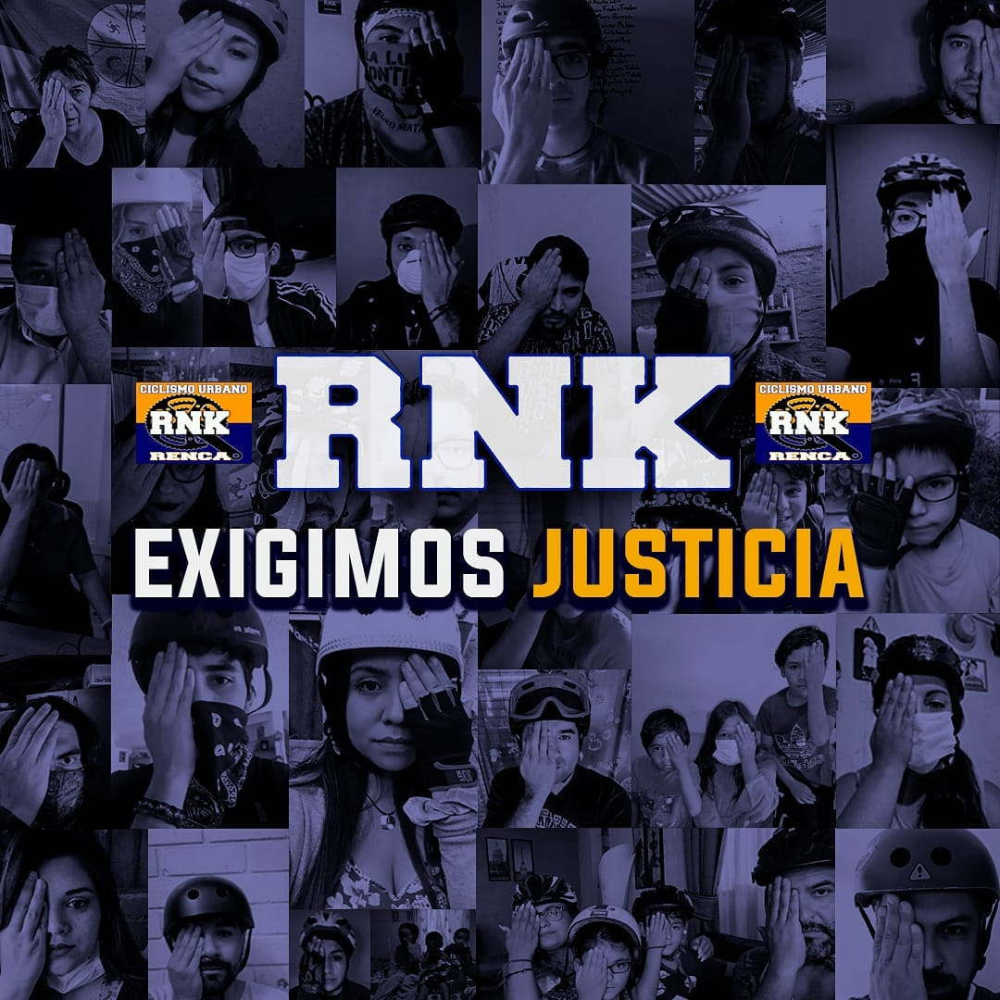

---
### Tipo de organización interna.
#### Asambleísmo y horizontalidad. No se logra identificar representantes.

---
### Describir los temas / imágenes- iconos / conceptos mas habitualmente presentes en sus publicaciones. Describir cambios/ transformaciones en los contenidos desde Octubre.

**Iconos:** 
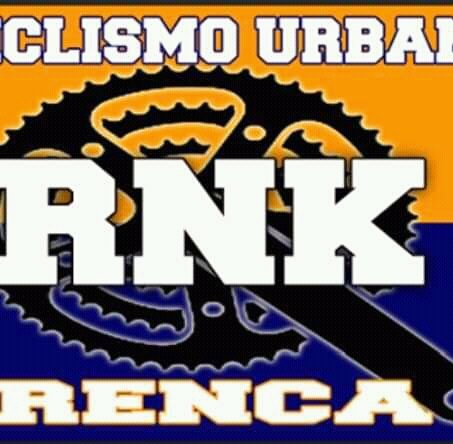
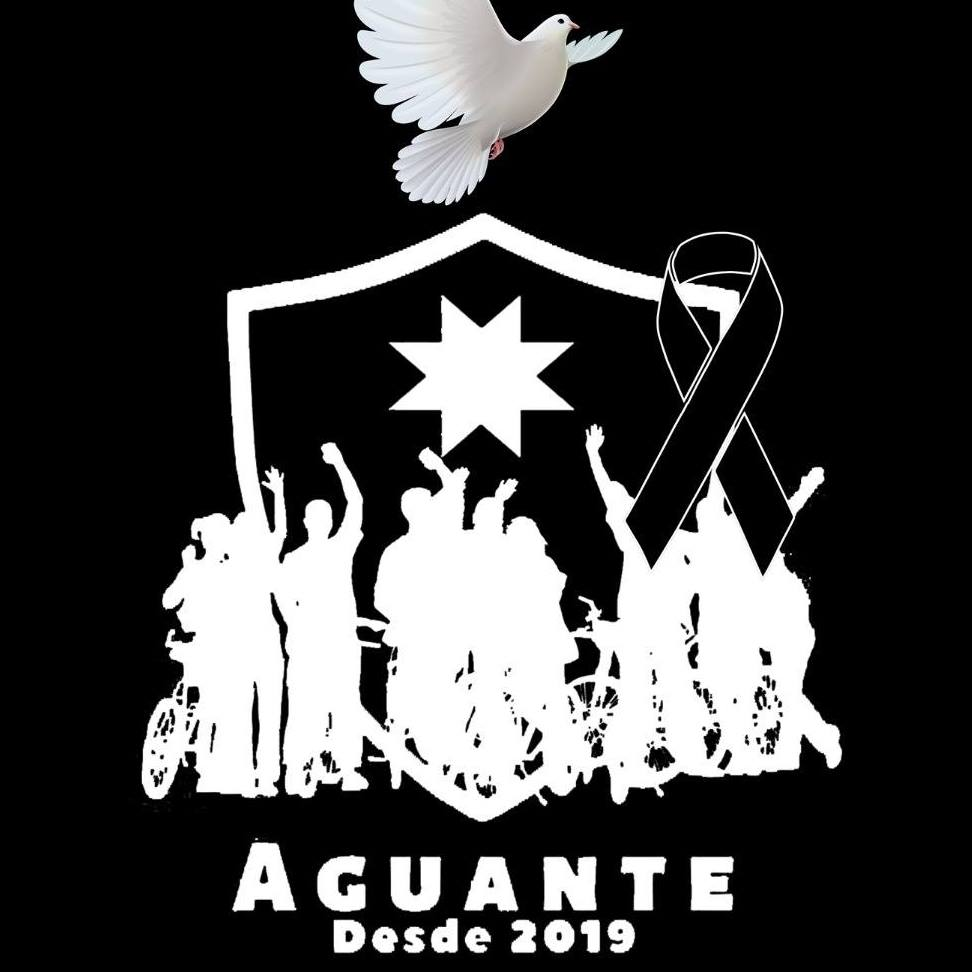

**Banderas:**

**Diseño estético:**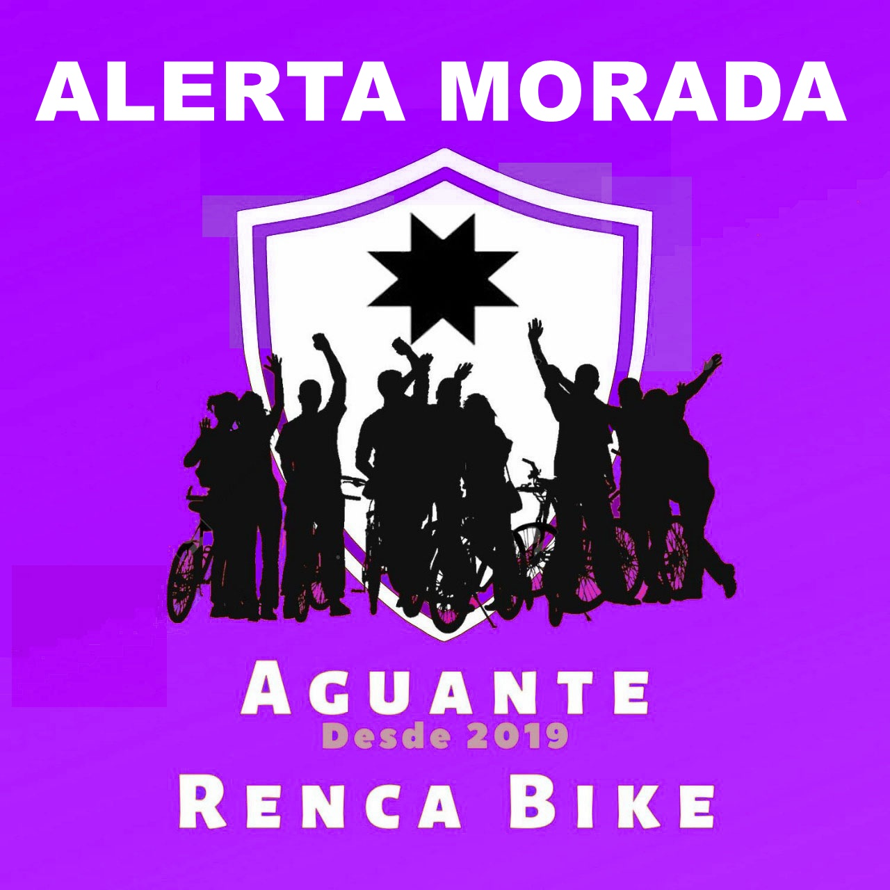
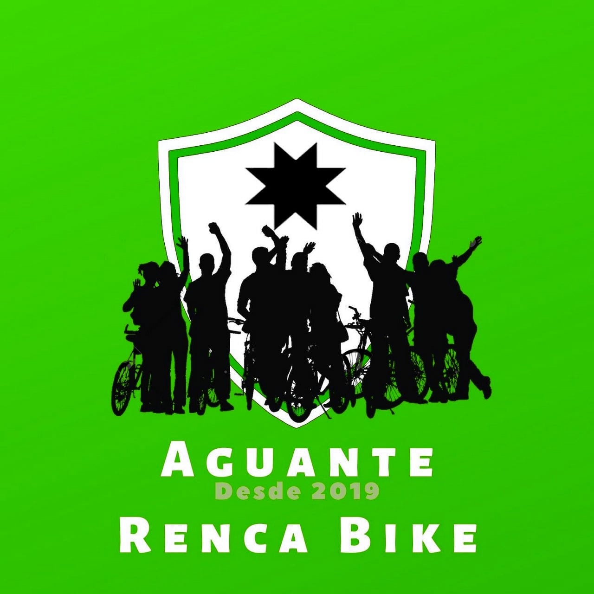

> Párrafo tipo cita 

---
### Percepciones que se tiene del Estado
#### (Aparato burocrático)
> resumen de lo encontrado

| Declaraciones | infografía | 
|---|---|
||  |

---
### Percepciones que se tiene de las Fuerzas de Orden
#### (Aparato represivo)
> resumen de lo encontrado

| Declaraciones | infografía | 
|---|---|
|Anotar los comunicados |  |

---
### Incorporar aca notas, citas textuales, links, etc. extra a los ya incorporados, que sean de interés para comprender tanto la forma como los contenidos asociados a la organización.
