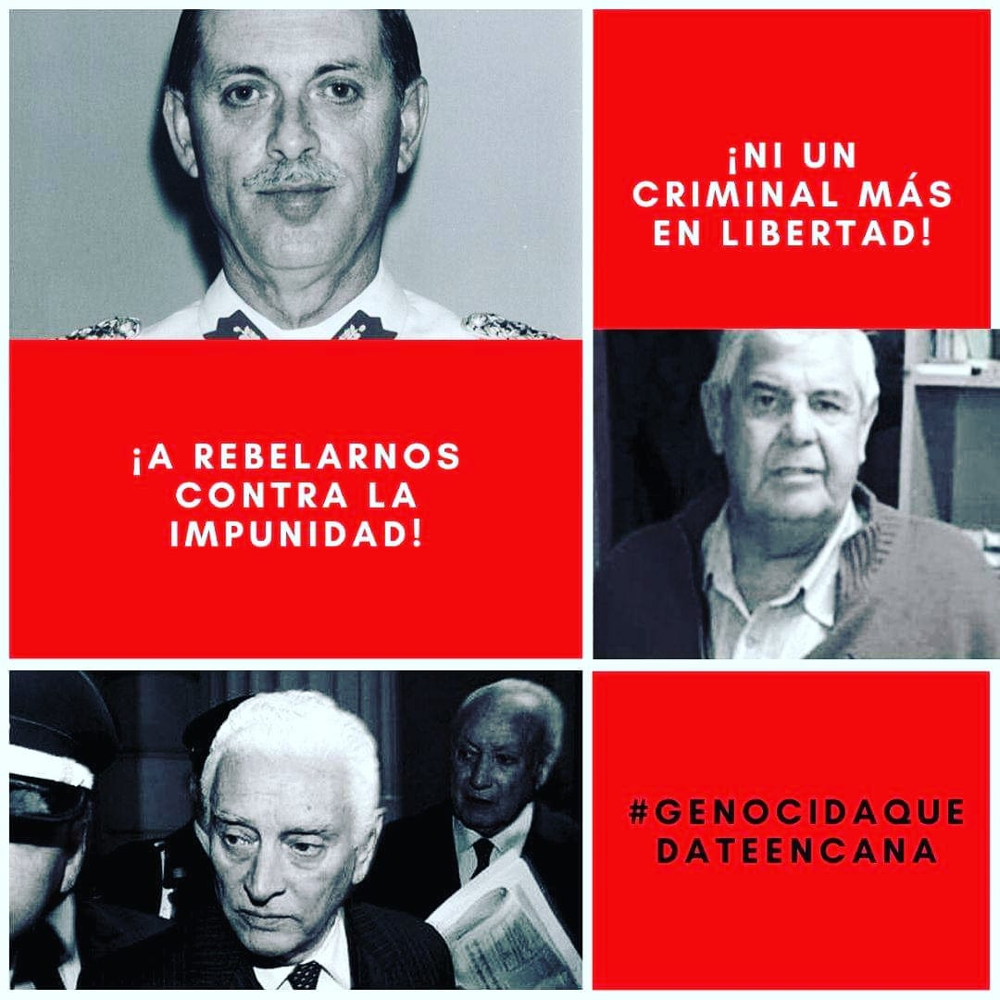

#### FOLIO: REN6
# Asamblea Pobladores huamachuco

[instagram](https://www.instagram.com/p/B97_MYapAn5/)
[facebook]()
[twitter]()
<correo@correo.cl>
---

### Representantes
#### (Nombres o emails de voceros o representantes).

---
### Interacciones frecuentes
#### Acción antifascista Renca, Estudiantes Inacap Renca, Juventud popular Renca, Comité de mujeres Renca, Huamacityclan.

### Redes sociales
#### ¿Para qué se utiliza la red social?
| Instagram | Facebook | Twitter | Otra 
|---|---|---|---|
|Difusión de información, actividades y mural de fotografías de actividades concretadas.|0|0| 0|

### **Instagram**
| seguidores | seguidos | publicaciones | hashtag 
|---|---|---|---|
|606|122|101| 0

---

* **Actividad:**   

* Primera Publicación IG

---
### Frecuencia de publicación.

Publicaciones: Semanales (de 3 a 4) activa.

Actividades:

---
### Ubicación
* Sector de la comununa/ciudad: Las Margaritas 2175 Renca

---
### Describir temas de interés y/o trabajo

#### Organización territorial , unión vecinal y solidaridad comunitaria. Se definen como una organización que busca recuperar s espacios, formar comunidad y trabajar de manera conjunta para el desarrollo social.
---
### Describir la imagen ideal por la cual se trabaja.
#### "Solo el pueblo ayuda al pueblo" "libertad al pueblo mapuche"

---
### ¿Que se hace?
#### Múltiples acciones comunitarias como talleres de batucada o Kung fu, pasacalle. Protestas como cacerolazos, velatones, actos conmemorativos. Accione solidarias como ollas comunes, campañas de recolección de alimentos y satinizacion.

---
### Describir y distinguir demandas más reivindicativas de espacios sin relación con lo contencioso o con lo político mas prefigurativo
#### Dirigido a los vecinos y vecinas pobladores del sector Huamachuco. Emplaza a autoridades centrales por los hechos de violencia en los territorios movilizados. 

---
### Tipo de organización interna.
#### Asambleísmo y horizontalidad.

---
### Describir los temas / imágenes- iconos / conceptos mas habitualmente presentes en sus publicaciones. Describir cambios/ transformaciones en los contenidos desde Octubre.

**Iconos:**

**Banderas:**

**Diseño estético:**

> Párrafo tipo cita 

---
### Percepciones que se tiene del Estado
#### (Aparato burocrático)
> resumen de lo encontrado

| Declaraciones | infografía | 
|---|---|
|Anotar los comunicados |  |

---
### Percepciones que se tiene de las Fuerzas de Orden
#### (Aparato represivo)
> resumen de lo encontrado

| Declaraciones | infografía | 
|---|---|
|Anotar los comunicados |  |

---
### Incorporar aca notas, citas textuales, links, etc. extra a los ya incorporados, que sean de interés para comprender tanto la forma como los contenidos asociados a la organización.
