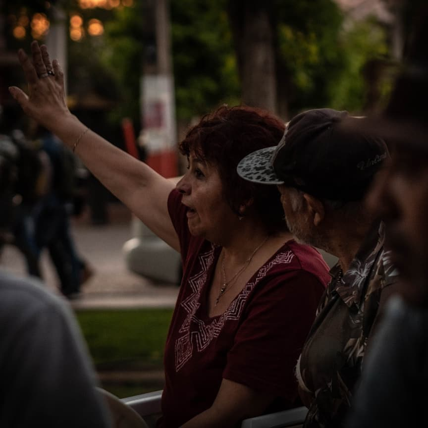
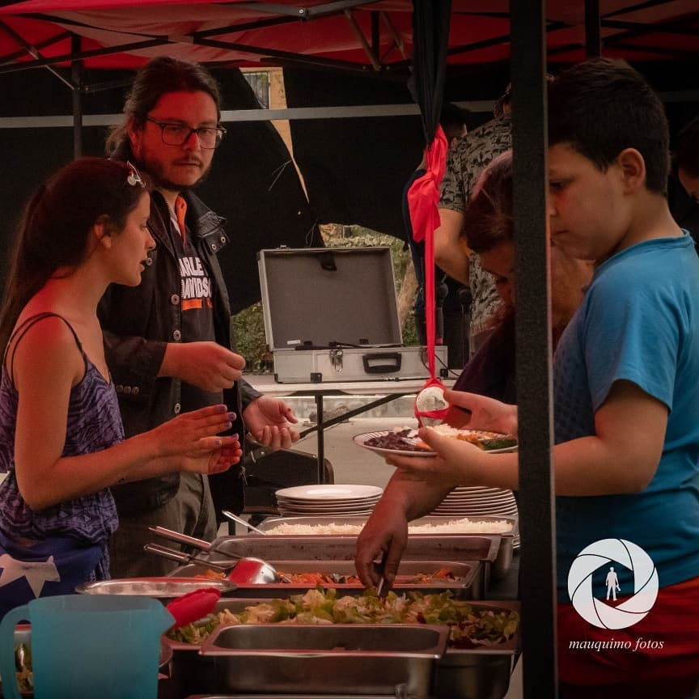
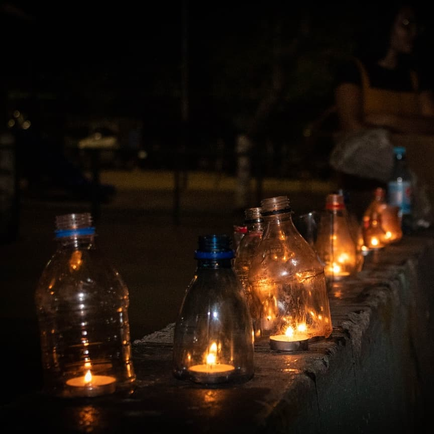
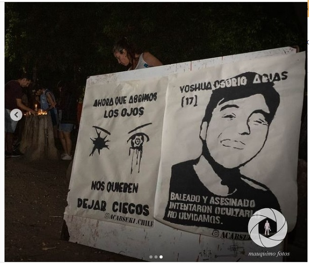

#### FOLIO: REN7
# Asamblea Territorial J.Cardinj

[instagram](https://www.instagram.com/p/B5-ptL_hejA/)
[facebook]()
[twitter]()
<correo@correo.cl>
---

### Representantes
#### (Nombres o emails de voceros o representantes).

---
### Interacciones frecuentes
#### Asamblea de pobladores de Humachuco.

### Redes sociales
#### ¿Para qué se utiliza la red social?
| Instagram | Facebook | Twitter | Otra 
|---|---|---|---|
|Difusión de actividades y mural de fotografía.|0|0| 0|

### **Instagram**
| seguidores | seguidos | publicaciones | hashtag 
|---|---|---|---|
|100	|40	|6| 0

---

* **Actividad:**   Inactiva. Se sospecha una unión con la Asamblea de pobladores de Huamachuco

* Primera Publicación IG

---
### Frecuencia de publicación.

Publicaciones:Dos semanales

Actividades:

---
### Ubicación
* Sector de la comununa/ciudad: Población Huamachuco

---
### Describir temas de interés y/o trabajo
Organizaciones territorio y unión vecinal.
---
### Describir la imagen ideal por la cual se trabaja.
#### Unidad comunitaria. 

---
### ¿Que se hace?
#### conversatorios vecinales y almuerzos comunitarios.

!
---
### Describir y distinguir demandas más reivindicativas de espacios sin relación con lo contencioso o con lo político mas prefigurativo
#### Vecinos y vecinas del sector Huamachuco interesado en competir opinión y unirse al debate nacional post estallido.

---
### Tipo de organización interna.
#### Asambleísmo y horizontalidad.
---
### Describir los temas / imágenes- iconos / conceptos mas habitualmente presentes en sus publicaciones. Describir cambios/ transformaciones en los contenidos desde Octubre.

**Iconos:**

**Banderas:** 

**Diseño estético:**

> Párrafo tipo cita 

---
### Percepciones que se tiene del Estado
#### (Aparato burocrático)
> resumen de lo encontrado

| Declaraciones | infografía | 
|---|---|
|Anotar los comunicados |  |

---
### Percepciones que se tiene de las Fuerzas de Orden
#### (Aparato represivo)
> resumen de lo encontrado

| Declaraciones | infografía | 
|---|---|
|Anotar los comunicados |  |

---
### Incorporar aca notas, citas textuales, links, etc. extra a los ya incorporados, que sean de interés para comprender tanto la forma como los contenidos asociados a la organización.
