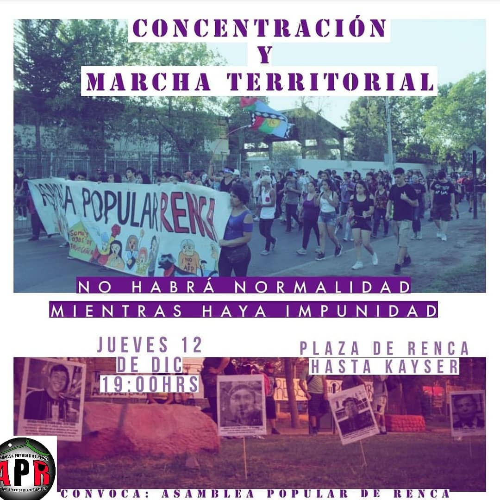

#### FOLIO: REN5
# Asamblea popular de Renca.

[instagram](https://www.instagram.com/asambleapopular.renca/)
[facebook](https://www.facebook.com/Asamblea-Popular-de-Renca-110042160430506)

---

### Representantes
#### (Nombres o emails de voceros o representantes).

---
### Interacciones frecuentes
#### Comité de la mujer Renca, Asamblea pobladores Huamachuco, revolución ciclista, Movimiento salud en resistencia, Santiago norte pedalea, Colectivo 119.

### Redes sociales
#### ¿Para qué se utiliza la red social?
| Instagram | Facebook | Twitter | Otra 
|---|---|---|---|
|Difusión de información y actividades.|0|0| 0|

### **Instagram**
| seguidores | seguidos | publicaciones | hashtag 
|---|---|---|---|
|815|171|28| 0

---

* **Actividad:**   Inactiva

* Primera Publicación IG

---
### Frecuencia de publicación.

Publicaciones: Semanales (de 3 a 4 ) desde febrero comenzó a decaer.

Actividades:

---
### Ubicación
* Sector de la comununa/ciudad: Plaza de Renca/Plaza don Genaro

---
### Describir temas de interés y/o trabajo
Organización territorial, unión vecinal y solidaridad comunitaria.
---
### Describir la imagen ideal por la cual se trabaja.
#### "A conquistar nuestros derechos luchando" "no habrá normalidad mientras haya impunidad"

---
### ¿Que se hace?
#### Asambleas populares abiertas y muralismos.

---
### Describir y distinguir demandas más reivindicativas de espacios sin relación con lo contencioso o con lo político mas prefigurativo
#### Vecinos y vecinas de la comuna de Renca. Emplaza a las autoridades de gobierno por la represión en los territorios movilizados.

---
### Tipo de organización interna.
#### Asambleas populares abiertas y muralismos.

---
### Describir los temas / imágenes- iconos / conceptos mas habitualmente presentes en sus publicaciones. Describir cambios/ transformaciones en los contenidos desde Octubre.

**Iconos:**

**Banderas:**

**Diseño estético:**

> Párrafo tipo cita 

---
### Percepciones que se tiene del Estado
#### (Aparato burocrático)
> resumen de lo encontrado

| Declaraciones | infografía | 
|---|---|
| 
|  |

---
### Percepciones que se tiene de las Fuerzas de Orden
#### (Aparato represivo)
> resumen de lo encontrado

| Declaraciones | infografía | 
|---|---|
|Anotar los comunicados |  |

---
### Incorporar aca notas, citas textuales, links, etc. extra a los ya incorporados, que sean de interés para comprender tanto la forma como los contenidos asociados a la organización.
