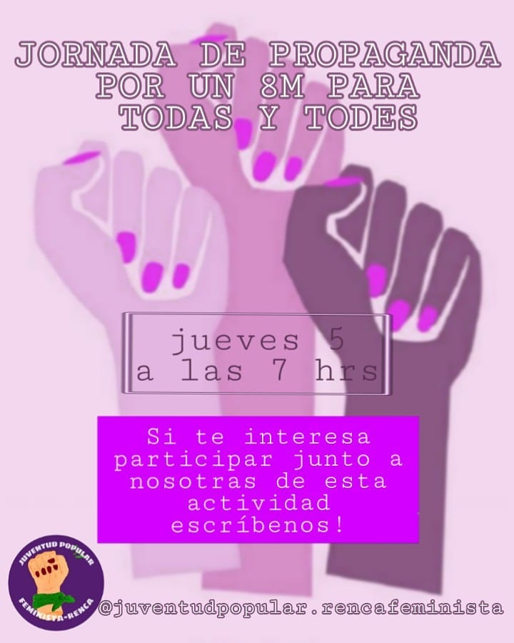

#### FOLIO: REN8
# Capucha Morada Renca

[instagram](https://www.instagram.com/p/B9IQwQZp5bX/)
[facebook]()
[twitter]()
<capuchamoradarenca@gmail.com>
---

### Representantes
#### No se distinguen

---
### Interacciones frecuentes
#### Juventud popular Renca, comité de mujeres Renca, comité fotográfico.

### Redes sociales
#### ¿Para qué se utiliza la red social?
| Instagram | Facebook | Twitter | Otra 
|---|---|---|---|
|Difusión de actividades y mural de fotografía.|0|0| 0|

### **Instagram**
| seguidores | seguidos | publicaciones | hashtag 
|---|---|---|---|
|629	|226	|13| 0

---

* **Actividad:**   Discontinua. Inactiva.

* Primera Publicación IG

---
### Frecuencia de publicación.

Publicaciones: Semanales

Actividades:

---
### Ubicación
* Sector de la comununa/ciudad: Centro de Renca

---
### Describir temas de interés y/o trabajo
#### Feminismo, apoyo mutuo entre mujeres y educación sexual.
---
### Describir la imagen ideal por la cual se trabaja.
#### 

 ¡ABAJO LA EDUCACIÓN DE MERCADO Y EL PATRIARCADO! Ven y súmate, POR LA LUCHA DE UNA EDUCACIÓN DIGNA, NO SEXISTA, DIVERSA Y NO HOMOFÓBICA, AHORA QUE ESTAMOS JUNTAS, AHORA QUE SÍ NOS VEN, ABAJO EL PATRIARCADO QUE VA A CAER, QUE VA A CAER

---
### ¿Que se hace?
#### Protestas como cacerolazos y velatones. Campaña virtual para prevenir ser victima de acoso. Difusión de información de seguridad publica.

---

### Describir y distinguir demandas más reivindicativas de espacios sin relación con lo contencioso o con lo político mas prefigurativo
#### Mujeres de Renca. Emplaza a autoridades que replican un sistema patriarcal. Emplaza al presidente por los hechos de violencia y muerte en los territorios movilizados.

---
### Tipo de organización interna.
#### Asambleísmo. No de distinguen representantes ni las acciones de trabajo.

---
### Describir los temas / imágenes- iconos / conceptos mas habitualmente presentes en sus publicaciones. Describir cambios/ transformaciones en los contenidos desde Octubre.

**Iconos:** 

**Banderas:**

**Diseño estético:**

> Párrafo tipo cita 

---
### Percepciones que se tiene del Estado
#### (Aparato burocrático)
> resumen de lo encontrado

| Declaraciones | infografía | 
|---|---|
|Anotar los comunicados |  |

---
### Percepciones que se tiene de las Fuerzas de Orden
#### (Aparato represivo)
> resumen de lo encontrado

| Declaraciones | infografía | 
|---|---|
|Anotar los comunicados |  |

---
### Incorporar aca notas, citas textuales, links, etc. extra a los ya incorporados, que sean de interés para comprender tanto la forma como los contenidos asociados a la organización.
