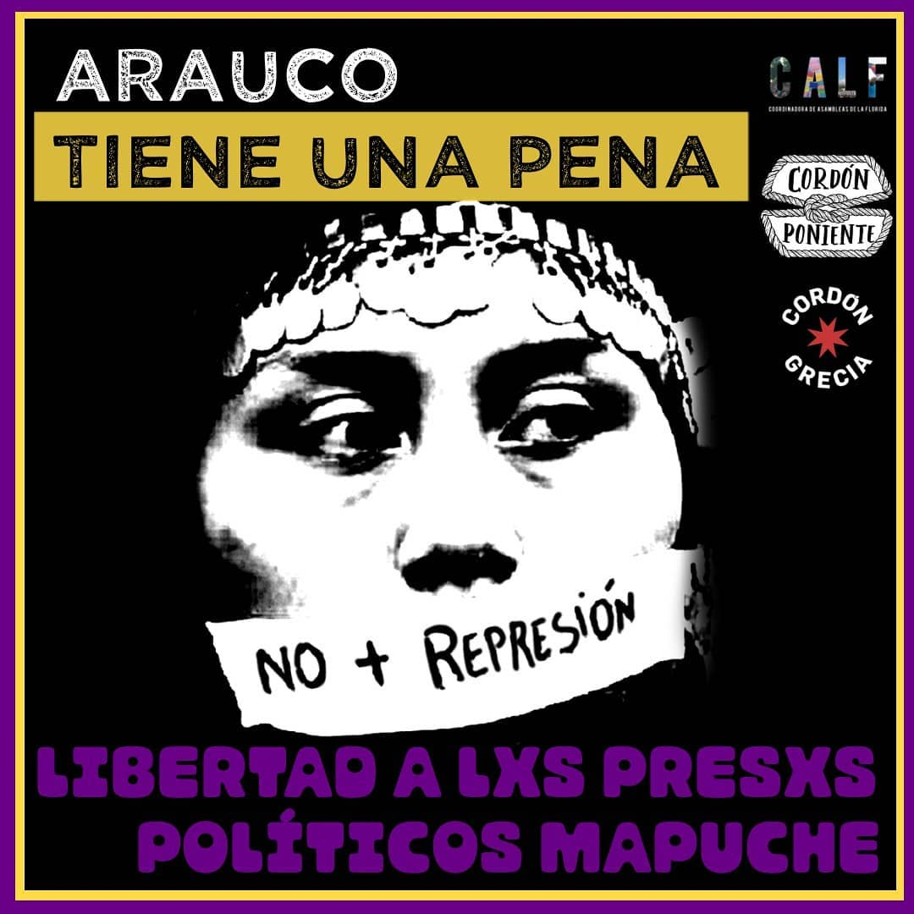

#### FOLIO: PDU12
# Cordon poniente. 

[instagram](https://www.instagram.com/p/CBwUkZ_pvpX/)
[facebook](https://www.facebook.com/Cord%C3%B3n-Poniente-102416444756237)
[twitter]()
<coordinacion.cordones@gmail.com>
---

### Representantes
#### (Nombres o emails de voceros o representantes).

---
### Interacciones frecuentes
#### Asamblea territorial Cerro Navia, Asamblea territorial Pudahuel Sur. Asamblea Las Parcelas, Asamblea Villa Francia, Asamblea Los portales, Asamblea Villa O´Higgins, Asamblea comunal Pudahuel, Asamblea Territorial Janequeo.

### Redes sociales
#### ¿Para qué se utiliza la red social?
| Instagram | Facebook | Twitter | Otra 
|---|---|---|---|
|Difusión de información y actividades.|Difusión de información y actividades.|0| 0|

### **Instagram**
| seguidores | seguidos | publicaciones | hashtag 
|---|---|---|---|
|3200	|371	|172| 0

---

* **Actividad:**   Activa

* Primera Publicación IG

---
### Frecuencia de publicación.

Publicaciones: Semanales (de 3 a 4)

Actividades:

---
### Ubicación
* Sector de la comununa/ciudad:Sector poniente de Santiago

---
### Describir temas de interés y/o trabajo
Organización territorial, comunicacional y de apoyo mutuo, interesada en la unión y creación de redes territoriales. Trabaja generando redes entre asambleas y/o organizaciones territoriales.

---
### Describir la imagen ideal por la cual se trabaja.
#### 
"El Estado es responsable, juicio y castigo para las asesinos del pueblo." " Libertad a los y las presos de la resuelta" "Fin a la militarización de WallMapu" "Una sociedad digna no libera violadores de los derechos humanos"
¡FIN A LA MILITARIZACIÓN DE NUESTROS TERRITORIOS!
¡FIN AL TOQUE DE QUEDA!
¡ESTADO CRIMINAL Y ASESINO, NUESTRAS VIDAS NO LES IMPORTAN!

---
### ¿Que se hace?
#### Llamados a protestas a todos los territorios, cacerolazos, entrega de boletines informativos. Convocatorias a redes solidarias en los territorios

---
### Describir y distinguir demandas más reivindicativas de espacios sin relación con lo contencioso o con lo político mas prefigurativo
#### Se dirige a asambleas territoriales del sector Norponiente de Santiago. No mas Teletón. /Transformación cotidiana de vivir en comunidad. Emplaza a autoridades de Estado por no gestionar de buena manera la crisis socio económica.

---
### Tipo de organización interna.
#### Asambleísmo y trabajo por comisiones.

---
### Describir los temas / imágenes- iconos / conceptos mas habitualmente presentes en sus publicaciones. Describir cambios/ transformaciones en los contenidos desde Octubre.

**Iconos:**

**Banderas:**

**Diseño estético:**

> Párrafo tipo cita 

---
### Percepciones que se tiene del Estado
#### (Aparato burocrático)
> resumen de lo encontrado

| Declaraciones | infografía | 
|---|---|
| |  |

---
### Percepciones que se tiene de las Fuerzas de Orden
#### (Aparato represivo)
> resumen de lo encontrado

| Declaraciones | infografía | 
|---|---|
|La militarización y el toque de queda han existido de manera sostenida en territorio mapuche. Con la mentira del terrorismo han justificado la intervención en el Wallmapu, en sus dinámicas y en su cosmovisión que escapa a las lógicas capitalistas y extractivistas de explotación, que van incluso dirigidas a cómo nos comprendemos en tanto sujetxs.

Hoy la militarización se extiende, avanza disfrazada de crisis sanitaria, pero sabemos que el trasfondo es político, sabemos que el sistema está siendo cuestionado, que ha entrado en crisis y que, en este contexto, sólo queda la represión. Los militares no nos protegen, sólo son la expresión del monopolio de la violencia en manos del Estado, sólo buscan producir terror para desarticular y desmovilizar al pueblo que se ha levantado ya hace casi un año en pos del mundo que queremos crear.

El toque de queda no encuentra justificación alguna en términos sanitarios, más bien es búsqueda desesperada de control social y de restablecer su manoseado y fetichizado orden público; protegen su modelo ya putrefacto que sigue devorando al pueblo, a la tierra y todo a su paso.

Conocemos su estrategia, y como oprimidxs y explotadxs no dejaremos de luchar. La organización sólo crecerá, tomará cara de mujer, pobre, mapuche, disidente, negrx, niñx, estudiante y todxs quienes comen violencia a diario. Desde aquí exigimos el fin del terrorismo de Estado; desde aquí avanzamos firmes contra todo lo que representan sus uniformes manchados con la sangre del pueblo.

¡FIN A LA MILITARIZACIÓN DE NUESTROS TERRITORIOS!
¡FIN AL TOQUE DE QUEDA!
¡ESTADO CRIMINAL Y ASESINO, NUESTRAS VIDAS NO LES IMPORTAN! |  

---
### Teletón y discapacidad. Una crítica política al concepto de discapacidad.”

Desde la unidad vecinal de Villa Portales, nos invitan a reflexionar y a criticar el concepto de discapacidad, el cual sigue presente en nuestra sociedad, y más aún, sigue siendo profundizada por algunas instituciones caritativas, entre ellas, la Teletón.
Link video: [Instagram](https://www.instagram.com/p/B-nr_MQp_OR/)

