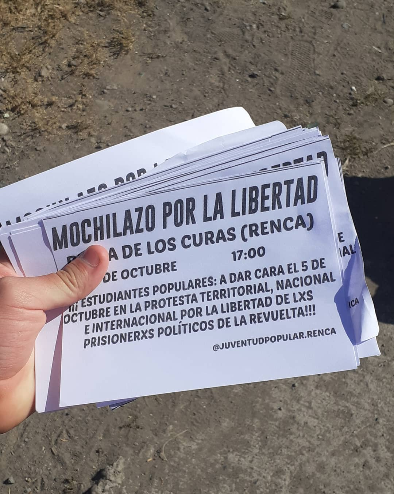

#### FOLIO: REN1
# Juventud Popular de Renca

[instagram](https://www.instagram.com/juventudpopular.renca/)
[facebook](https://www.facebook.com/Juventud-Popular-de-Renca-107260467529704)

---

### Representantes
#### .

---
### Interacciones frecuentes
#### Renca despertó, Partido Alternativa Feminista Renca, Revolución Ciclista, Comité de mujeres de Renca, Asamblea Popular de Renca, Asamblea General Cerrillos, comité de emergencia zona norte, STGO NORTE PEDALEA, COORDINADORA SECUNDARIA DE ARICA, Aces Concepción, Agrupación Estudiantil Chgte, Colectivo Norma Vergara

### Redes sociales
#### ¿Para qué se utiliza la red social?
| Instagram | Facebook | Twitter | Otra 
|---|---|---|---|
|Difusión de información y actividades. Mural de fotografías para registrar las actividades concretadas|Difusión de información, actividades y mural de fotografía de actividades concretadas.|0| 0|

### **Instagram**
| seguidores | seguidos | publicaciones | hashtag 
|---|---|---|---|
|3671	|955|	1100|0| #renunciapiñera #primeralimea #chile #chiledesperto #gustavogatica #traidores #derechoshumanos

---

* **Actividad:** Continua  

* Primera Publicación IG 23 de diciembre del 2019

---
### Frecuencia de publicación.

Publicaciones:Semanales (2 a 3) y de 1 a 2 en periodo de pandemia.

Actividades:

---
### Ubicación
* Sector de la comununa/ciudad: Distintas esquinas de la comuna

---
### Describir temas de interés y/o trabajo
#### Sus temática de interés son educacionales (no mas psu), protesta estudiantil y protesta social.
---

### Describir la imagen ideal por la cual se trabaja.
#### Lucha por un cambio en el sistema educacional Chileno¡¡ A LUCHAR POR VIDAS DIGNAS, PLENAS Y FELICES !! ! CONTRA EL ESTADO TERRORISTA, SU PRENSA FASCISTA Y EL SILENCIO CÓMPLICE DE LA MUNICIPALIDAD !!

---
### ¿Que se hace?
#### Protestas estudiantiles y ciudadanas. Generan corte de calles (barricadas), pega de lienzos y entrega de volantes informativos.

---
### Describir y distinguir demandas más reivindicativas de espacios sin relación con lo contencioso o con lo político mas prefigurativo
#### Se dirige a estudiantes de Renca a uniese en contra el sistema educacional. Emplaza a autoridades Estado y municipales en particular.

---
### Tipo de organización interna.
#### Asambleísmo y horizontalidad. No se logra identificar representantes.

---
### Describir los temas / imágenes- iconos / conceptos mas habitualmente presentes en sus publicaciones. Describir cambios/ transformaciones en los contenidos desde Octubre.

**Iconos:**

**Banderas:**

**Diseño estético:**

> Párrafo tipo cita 

---
### Percepciones que se tiene del Estado
#### (Aparato burocrático)
> resumen de lo encontrado

| Declaraciones | infografía | 
|---|---|
|

 |  |

---
### Percepciones que se tiene de las Fuerzas de Orden
#### (Aparato represivo)
> resumen de lo encontrado

| Declaraciones | infografía | 
|---|---|
| |  |

---
### Incorporar aca notas, citas textuales, links, etc. extra a los ya incorporados, que sean de interés para comprender tanto la forma como los contenidos asociados a la organización.
