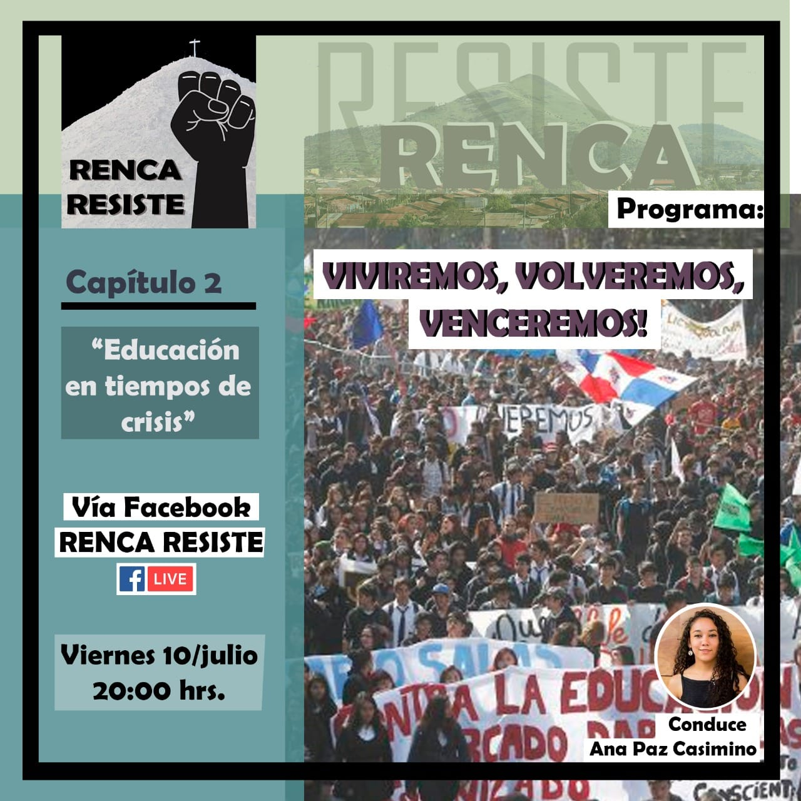
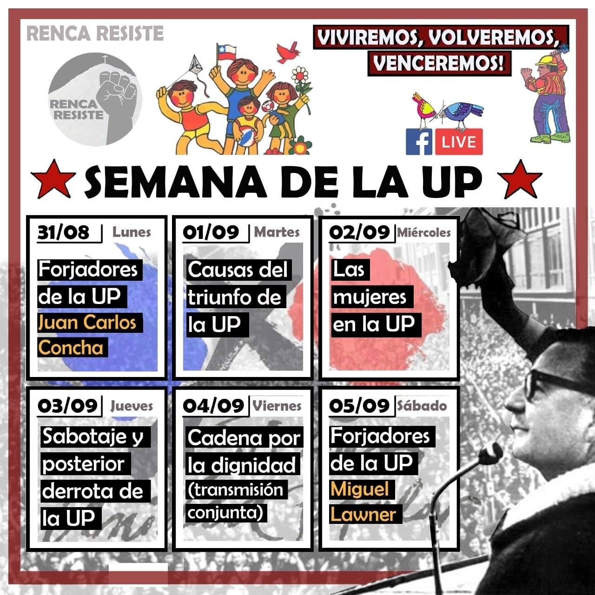
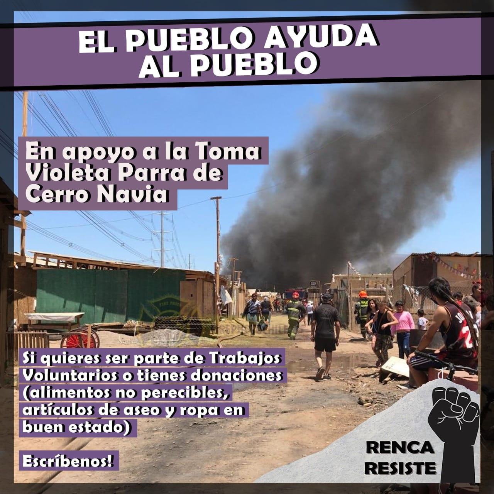
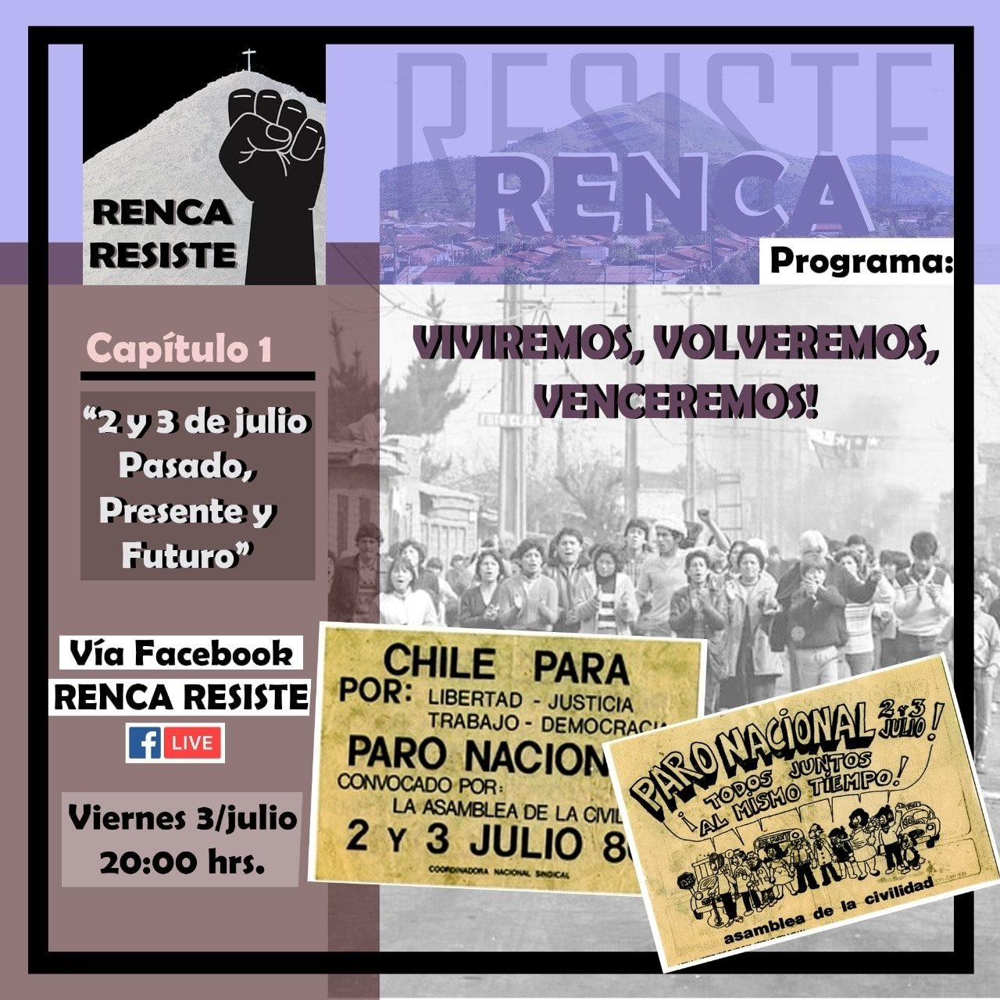
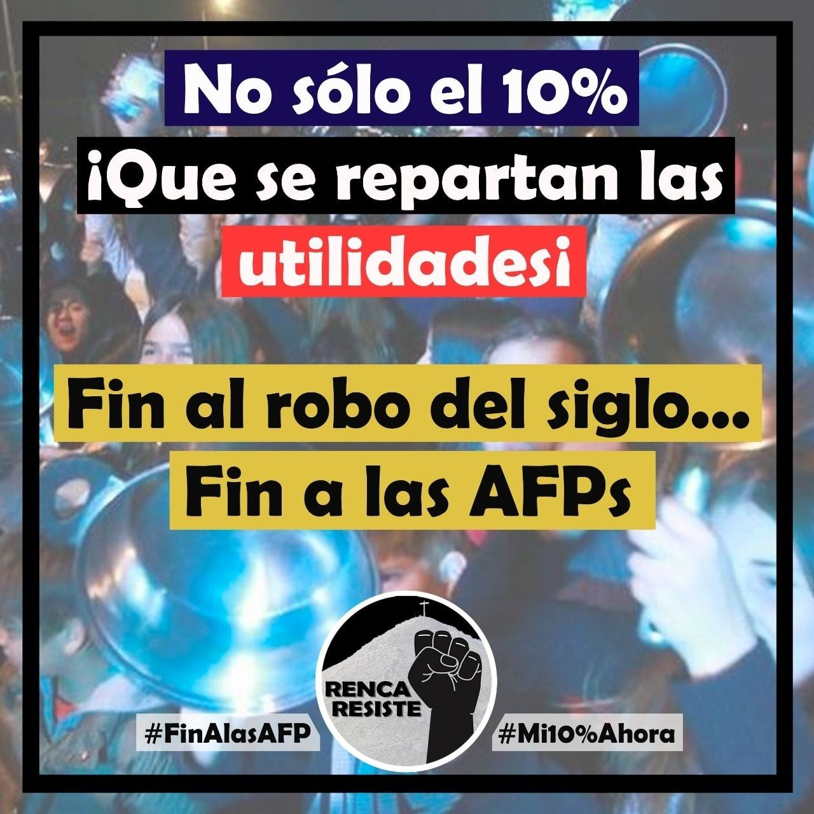
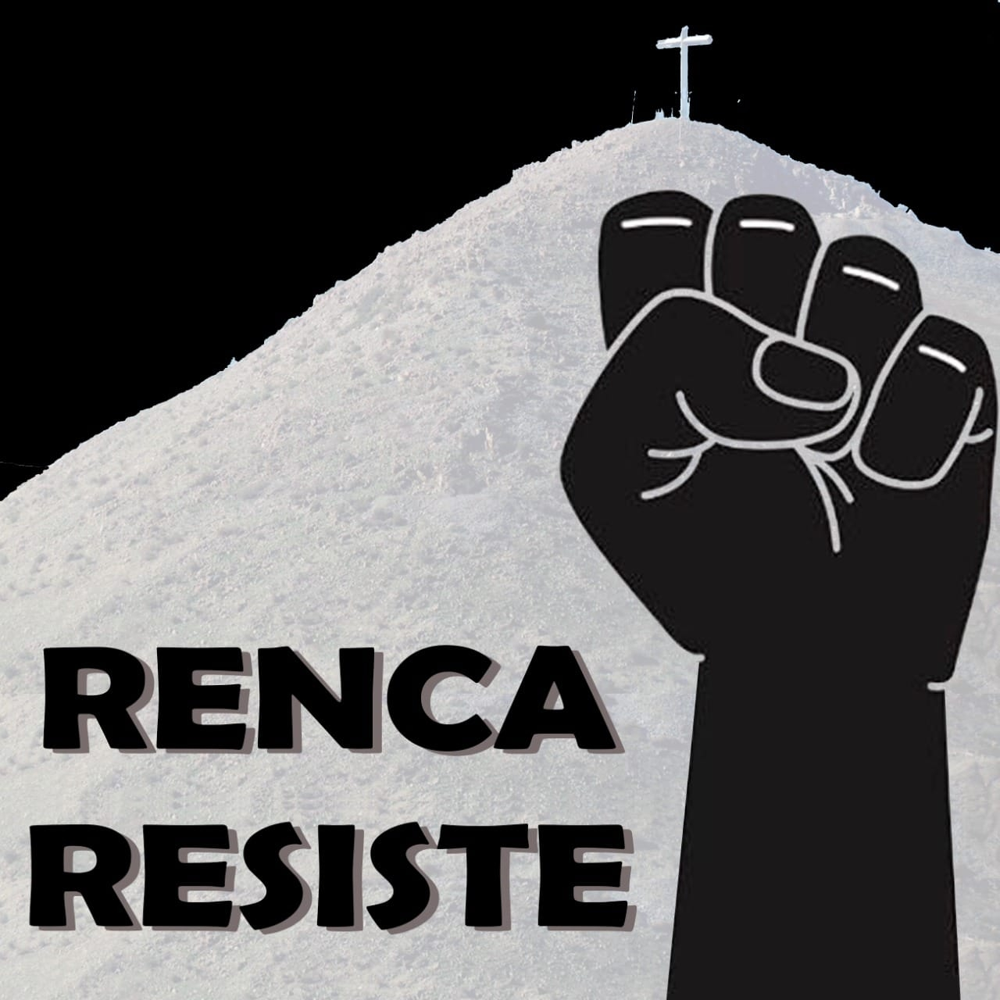
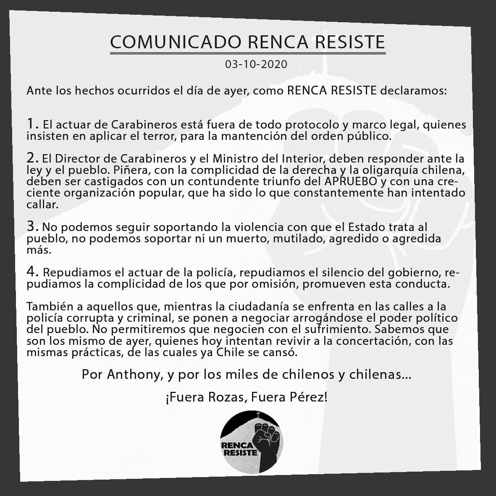

#### FOLIO: REN3
# Renca resiste

[instagram](https://www.instagram.com/rencaresiste/)
[facebook](https://www.facebook.com/ResisteRenca)
[twitter]()
<renca.resiste@gmail.com>
---

### Representantes
#### (Nombres o emails de voceros o representantes).

---
### Interacciones frecuentes
#### Partido Alternativa Feminista, Iniciativa Pasaje justo, Centro Cultural Trabun Amuley, Encuentro artesano rock, STGO NORTE PEDALEA, Brigada Ramona Parra BRP, Renca despertó.

### Redes sociales
#### ¿Para qué se utiliza la red social?
| Instagram | Facebook | Twitter | Otra 
|---|---|---|---|
|Difusión de información, actividades y mural de fotografía de actividades concretadas.0|Difusión de información, actividades y mural de fotografía de actividades concretadas.| 0|

### **Instagram**
| seguidores | seguidos | publicaciones | hashtag 
|---|---|---|---|
|601	|588|	60| 0

---

* **Actividad:**   Las actividades comienzan en julio del 2020. Discontinuas

* Primera Publicación IG 3 de julio del 2020 

---
### Frecuencia de publicación.

Publicaciones: Semanales (de 2 a 3) a partir de octubre mensuales.

Actividades:

---
### Ubicación
* Sector de la comununa/ciudad: No definida 

---
### Describir temas de interés y/o trabajo
#### Fortalecimiento de lazos comunitarios, conciencia política y problemáticas de contexto nacional e histórico izquierdista.
---
### Describir la imagen ideal por la cual se trabaja.
#### Vivimos, volvemos y venceremos "El pueblo ayuda al pueblo"

---
### ¿Que se hace?
#### Conversatorios virtuales e intercambio de saberes. Creación de contenido informativo como por ejemplo los pasos para el tramite del 10%.

---
### Describir y distinguir demandas más reivindicativas de espacios sin relación con lo contencioso o con lo político mas prefigurativo
#### Vecinos y vecinas de la comuna de Renca interesados en generar conversaciones virtuales comunitarias respecto al contexto nacional. "Somos vecinos/as de Renca, pobladores/as que nos sumamos a la resistencia!"

---
### Tipo de organización interna.
#### Horizontalidad. No se identifican representantes pero si la existencia de una vocería.

---
### Describir los temas / imágenes- iconos / conceptos mas habitualmente presentes en sus publicaciones. Describir cambios/ transformaciones en los contenidos desde Octubre.

**Iconos:**

**Banderas:**

**Diseño estético:**

> Párrafo tipo cita 

---
### Percepciones que se tiene del Estado
#### (Aparato burocrático)
> resumen de lo encontrado

| Declaraciones | infografía | 
|---|---|
|Anotar los comunicados |  |

---
### Percepciones que se tiene de las Fuerzas de Orden
#### (Aparato represivo)
> resumen de lo encontrado

| Declaraciones | infografía | 
|---|---|
| |  |

---
### Incorporar aca notas, citas textuales, links, etc. extra a los ya incorporados, que sean de interés para comprender tanto la forma como los contenidos asociados a la organización.
